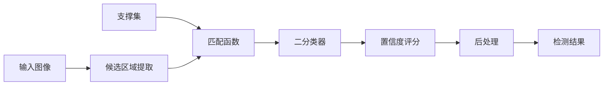

# 分类与检测的融合：OneShotDetector

关键词：单样本学习，分类与检测，深度学习，小样本学习，迁移学习

## 1. 背景介绍

### 1.1 问题的由来
在计算机视觉领域，图像分类和目标检测是两个基础且重要的任务。传统的深度学习方法在这两个任务上都取得了巨大的成功，但它们通常需要大量的标注样本来训练模型。然而，在很多现实场景中，我们往往只能获得非常有限的标注数据，甚至只有一个样本。如何利用极少量的标注样本来训练出一个鲁棒的分类器或检测器，是一个具有挑战性但意义重大的问题。

### 1.2 研究现状
针对小样本学习问题，研究者们已经提出了一些有效的方法，如元学习、迁移学习等。其中，单样本学习（One-Shot Learning）受到了广泛关注。单样本学习旨在通过单个标注样本来识别新的目标类别，代表工作有Siamese网络、Matching Networks、Prototypical Networks等。这些方法主要聚焦于分类任务。而在目标检测任务中，虽然也有一些单样本检测的尝试，但大多需要借助元学习或迁移学习，很少有工作直接面向单样本检测问题进行研究。

### 1.3 研究意义
单样本学习代表了机器学习的一个重要发展方向，对于缓解深度学习模型对大量标注数据的依赖具有重要意义。将单样本学习扩展到目标检测任务，有助于实现更加智能和高效的检测系统。这对于应对长尾分布问题、提升模型泛化能力、降低标注成本等都有重要价值。此外，探索分类与检测任务之间的内在联系，对于推动计算机视觉的发展也大有裨益。

### 1.4 本文结构 
本文提出了一种新颖的单样本目标检测方法OneShotDetector，它巧妙地将分类和检测任务融合在一个统一的框架中。第2部分介绍OneShotDetector的核心概念和关键思想。第3部分详细阐述其算法原理和实现步骤。第4部分从数学角度对模型进行了推导和分析。第5部分通过代码实例演示OneShotDetector的具体实现。第6部分讨论了其潜在的应用场景。第7部分推荐了一些学习资源和工具。第8部分对全文进行了总结，并展望了未来的研究方向。第9部分列出了一些常见问题解答。

## 2. 核心概念与联系

OneShotDetector的核心思想是将单样本分类和目标检测问题统一到一个匹配学习框架中。具体来说：

1. 首先，我们将待检测的目标类别表示为一个单样本支撑集（support set），里面包含该类别的一个标注样本。 

2. 然后，利用该支撑集构建一个二分类器，用于判断候选区域是否属于目标类别。这里的关键是设计一个匹配函数，用于度量候选区域与支撑样本之间的相似性。

3. 接着，我们在输入图像上提取一系列候选区域（如通过选择性搜索等方法），然后用上述二分类器对每个候选区域进行评分，得到它们属于目标类别的置信度。

4. 最后，我们选出置信度较高的候选区域作为检测结果，并对其进行后处理（如非极大值抑制）。

通过这种方式，OneShotDetector巧妙地将单样本分类问题转化为一个匹配学习问题，进而实现了单样本检测。这种思路很好地揭示了分类和检测任务之间的内在联系，即检测可以看作是对候选区域进行二分类。

下图是OneShotDetector的总体架构示意图：

## 3. 核心算法原理 & 具体操作步骤

### 3.1 算法原理概述
OneShotDetector的核心是匹配学习，即学习一个匹配函数，用于度量两个样本之间的相似性。具体来说，给定一个支撑集 $S=\{(x_i,y_i)\}_{i=1}^N$，其中 $x_i$ 表示样本，$y_i$ 表示类别标签。对于一个查询样本 $\hat{x}$，我们希望预测其类别标签 $\hat{y}$。这可以通过最近邻分类器实现：

$$
\hat{y} = y_{\arg\max_i f(x_i, \hat{x})}
$$

其中 $f(\cdot,\cdot)$ 表示匹配函数。一个理想的匹配函数应该能够准确地度量样本之间的语义相似性。

### 3.2 算法步骤详解
OneShotDetector的算法流程如下：

1. 特征提取：使用预训练的CNN（如ResNet）对支撑样本 $x_i$ 和查询样本 $\hat{x}$ 提取特征，得到特征向量 $\mathbf{z}_i$ 和 $\hat{\mathbf{z}}$。

2. 匹配函数构建：设计一个匹配函数 $f(\mathbf{z}_i, \hat{\mathbf{z}})$，用于度量两个特征向量之间的相似性。常见的选择包括余弦相似度、欧氏距离等。

3. 二分类器构建：基于匹配函数，构建一个二分类器 $g(\hat{\mathbf{z}})$，用于判断查询样本是否属于支撑集表示的类别：

$$
g(\hat{\mathbf{z}}) = \sigma(f(\mathbf{z}_i, \hat{\mathbf{z}}))
$$

其中 $\sigma(\cdot)$ 表示sigmoid函数。

4. 候选区域评分：在输入图像上提取一系列候选区域 $\{\hat{\mathbf{z}}_j\}_{j=1}^M$，然后用二分类器 $g(\cdot)$ 对每个候选区域进行评分，得到置信度向量 $\mathbf{p} \in \mathbb{R}^M$。

5. 后处理：对置信度向量 $\mathbf{p}$ 进行后处理，如非极大值抑制，得到最终的检测结果。

### 3.3 算法优缺点
OneShotDetector的优点在于：
- 可以通过单个样本来识别新的目标类别，大大降低了标注成本。
- 将分类和检测统一到匹配学习框架中，简洁且有效。
- 利用了预训练CNN的迁移能力，可以处理复杂的真实图像。

但它也存在一些局限性：
- 匹配函数的设计需要领域知识，对算法性能影响很大。  
- 候选区域的质量直接决定了检测精度，但提取高质量候选区域并非易事。
- 单个样本包含的信息有限，学习到的分类器鲁棒性不够。

### 3.4 算法应用领域
OneShotDetector适用于以下应用场景：
- 小样本目标检测：当标注样本很少时，可以利用OneShotDetector进行检测。
- 长尾目标检测：对于一些罕见的目标类别，OneShotDetector可以通过单个样本来实现检测。  
- 跨域目标检测：利用OneShotDetector，可以将一个域的样本迁移到另一个域，实现跨域检测。

## 4. 数学模型和公式 & 详细讲解 & 举例说明

### 4.1 数学模型构建
我们将OneShotDetector表示为一个条件概率模型。给定支撑集 $S=\{(\mathbf{z}_i,y_i)\}_{i=1}^N$ 和查询样本 $\hat{\mathbf{z}}$，OneShotDetector的目标是学习条件概率分布 $p(y|\hat{\mathbf{z}},S)$。根据贝叶斯公式，我们有：

$$
p(y|\hat{\mathbf{z}},S) = \frac{p(\hat{\mathbf{z}}|y,S)p(y|S)}{p(\hat{\mathbf{z}}|S)}
$$

其中，$p(\hat{\mathbf{z}}|y,S)$ 表示似然项，$p(y|S)$ 表示先验项，$p(\hat{\mathbf{z}}|S)$ 表示证据项。通常，我们假设先验服从均匀分布，证据项与类别无关，因此条件概率分布可以简化为：

$$
p(y|\hat{\mathbf{z}},S) \propto p(\hat{\mathbf{z}}|y,S)
$$

### 4.2 公式推导过程
接下来，我们推导出似然项 $p(\hat{\mathbf{z}}|y,S)$ 的计算公式。一个直观的想法是，如果查询样本 $\hat{\mathbf{z}}$ 与支撑集中的样本 $\mathbf{z}_i$ 语义相似，那么它们很可能属于同一个类别。因此，我们可以用匹配函数 $f(\mathbf{z}_i, \hat{\mathbf{z}})$ 来度量这种相似性。假设相似性越高，似然概率越大，我们可以定义似然项为：

$$
p(\hat{\mathbf{z}}|y,S) = \frac{\exp(f(\mathbf{z}_y, \hat{\mathbf{z}}))}{\sum_{i=1}^N \exp(f(\mathbf{z}_i, \hat{\mathbf{z}}))}
$$

其中，$\mathbf{z}_y$ 表示支撑集中类别为 $y$ 的样本。分母项用于归一化，确保似然概率之和为1。

将似然项代入条件概率公式，我们得到：

$$
p(y|\hat{\mathbf{z}},S) = \frac{\exp(f(\mathbf{z}_y, \hat{\mathbf{z}}))}{\sum_{i=1}^N \exp(f(\mathbf{z}_i, \hat{\mathbf{z}}))}
$$

这就是OneShotDetector的核心公式，它表示了查询样本属于每个类别的概率。

### 4.3 案例分析与讲解
我们用一个简单的例子来说明OneShotDetector的工作原理。假设支撑集 $S$ 包含两个类别：猫和狗，每个类别有一个样本。给定一个查询样本 $\hat{\mathbf{z}}$，我们要判断它是猫还是狗。

首先，我们计算查询样本与支撑集中每个样本的相似性：

$$
f(\mathbf{z}_{cat}, \hat{\mathbf{z}}) = 0.8 \\
f(\mathbf{z}_{dog}, \hat{\mathbf{z}}) = 0.3
$$

然后，我们根据相似性计算条件概率：

$$
p(y=cat|\hat{\mathbf{z}},S) = \frac{\exp(0.8)}{\exp(0.8) + \exp(0.3)} \approx 0.73 \\
p(y=dog|\hat{\mathbf{z}},S) = \frac{\exp(0.3)}{\exp(0.8) + \exp(0.3)} \approx 0.27
$$

可以看出，查询样本属于猫的概率更大，因此我们预测它是一只猫。

### 4.4 常见问题解答
问：OneShotDetector中的匹配函数 $f(\cdot,\cdot)$ 可以如何选择？

答：匹配函数的选择是OneShotDetector的关键。一般来说，我们希望匹配函数能够准确地度量两个样本之间的语义相似性。常见的选择包括：

- 余弦相似度：$f(\mathbf{z}_i, \hat{\mathbf{z}}) = \frac{\mathbf{z}_i^\top \hat{\mathbf{z}}}{\|\mathbf{z}_i\| \|\hat{\mathbf{z}}\|}$
- 欧氏距离：$f(\mathbf{z}_i, \hat{\mathbf{z}}) = -\|\mathbf{z}_i - \hat{\mathbf{z}}\|_2^2$
- 学习的度量函数：$f(\mathbf{z}_i, \hat{\mathbf{z}}) = g_\phi(\mathbf{z}_i, \hat{\mathbf{z}})$，其中 $g_\phi(\cdot,\cdot)$ 是一个神经网络，参数为 $\phi$。

问：OneShotDetector可以处理多个支撑样本吗？

答：可以。当支撑集包含多个样本时，我们可以对每个样本分别计算相似性，然后取平均值或最大值作为最终的相似性度量。例如，