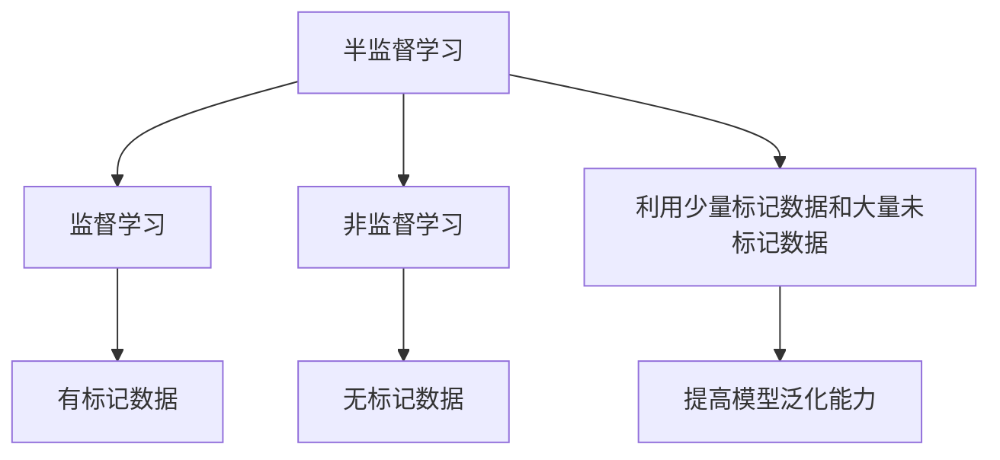
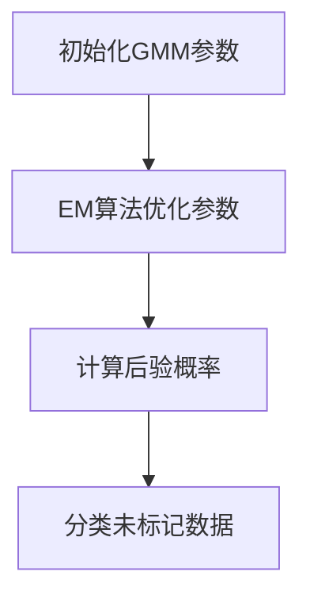
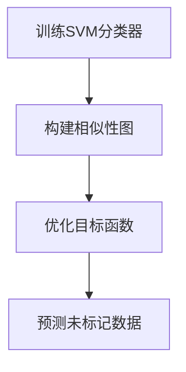
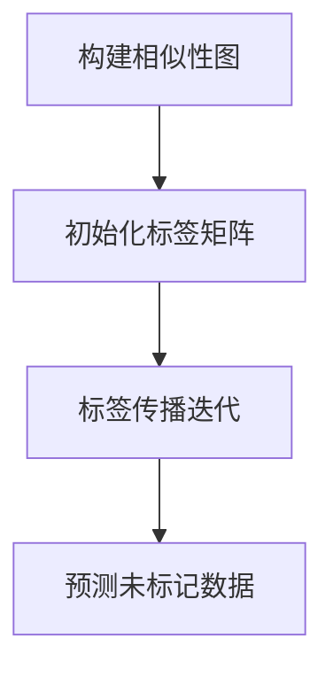

# 半监督学习 原理与代码实例讲解

## 1. 背景介绍

### 1.1 问题的由来

在现实世界中，获取大量高质量的标记数据通常是一个巨大的挑战。手动标记数据是一项耗时且昂贵的工作,尤其是在涉及复杂任务或大规模数据集的情况下。另一方面,未标记的数据则相对容易获取。这种数据不平衡的情况引发了一个问题:如何有效利用大量未标记的数据来提高机器学习模型的性能?

### 1.2 研究现状

半监督学习(Semi-Supervised Learning)作为一种有前景的机器学习范式,旨在解决上述问题。它结合了少量标记数据和大量未标记数据的优势,以期获得比纯监督学习或纯非监督学习更好的性能。近年来,半监督学习在多个领域取得了令人瞩目的成就,如图像分类、自然语言处理和异常检测等。

### 1.3 研究意义

半监督学习的研究意义主要体现在以下几个方面:

1. **降低标记成本**: 通过利用未标记数据,可以减少对昂贵的人工标记数据的依赖,从而降低成本。
2. **提高模型性能**: 适当利用未标记数据可以提供更多的信息,有助于模型捕捉数据的内在结构和模式,从而提高模型的泛化能力。
3. **应对数据不平衡**: 在许多现实场景中,标记数据和未标记数据的数量存在巨大差异,半监督学习可以有效应对这种数据不平衡问题。
4. **促进人工智能发展**: 半监督学习是人工智能领域的一个重要研究方向,其发展有助于推动人工智能技术的进步和应用。

### 1.4 本文结构

本文将全面介绍半监督学习的原理、算法和实践。首先,我们将探讨半监督学习的核心概念和与其他学习范式的联系。接下来,详细阐述几种主要的半监督学习算法原理和具体操作步骤。然后,我们将构建数学模型并推导相关公式,并通过案例分析加深理解。此外,还将提供代码实例和详细解释,帮助读者掌握实现细节。最后,我们将讨论半监督学习的实际应用场景、未来发展趋势和面临的挑战。

## 2. 核心概念与联系

半监督学习是介于监督学习和非监督学习之间的一种学习范式。它利用了少量标记数据和大量未标记数据的优势,旨在提高模型的泛化能力。

半监督学习的核心思想是通过对未标记数据进行建模,从而捕捉数据的内在结构和模式,进而改善模型在标记数据上的性能。这种思想基于一个假设:高密度区域更可能属于同一个类别,而低密度区域更可能跨越多个类别边界。

与监督学习相比,半监督学习可以利用更多的数据信息,从而获得更好的泛化能力。与非监督学习相比,半监督学习可以利用少量标记数据提供有监督的信号,从而获得更好的判别能力。

## 3. 核心算法原理 & 具体操作步骤

半监督学习算法可以分为以下几大类:生成模型、半监督支持向量机(Semi-Supervised Support Vector Machines, S3VM)、基于图的方法和深度半监督学习。下面我们将详细介绍其中几种代表性算法的原理和具体操作步骤。

### 3.1 算法原理概述

#### 3.1.1 生成模型

生成模型是半监督学习中一种经典的方法。它假设数据是由一个潜在的概率分布生成的,并试图估计这个概率分布。常见的生成模型包括高斯混合模型(Gaussian Mixture Models, GMM)和朴素贝叶斯(Naive Bayes)等。

#### 3.1.2 半监督支持向量机

半监督支持向量机(S3VM)是在传统支持向量机(SVM)的基础上发展而来的。它通过利用未标记数据对决策边界进行调整,从而获得更好的分类性能。常见的S3VM算法包括S3VM、拉普拉斯S3VM(Laplacian S3VM)和熵最小化(Entropy Minimization)等。

#### 3.1.3 基于图的方法

基于图的方法将数据表示为一个图,其中节点代表数据样本,边代表样本之间的相似性。然后,它们利用图上的标记和未标记数据来传播标签信息,从而对未标记数据进行分类或聚类。常见的基于图的算法包括标签传播(Label Propagation)和基于图的正则化(Graph-based Regularization)等。

#### 3.1.4 深度半监督学习

深度半监督学习是将深度学习技术应用于半监督学习的一种方法。它通过设计特殊的网络结构或损失函数,利用未标记数据提供的额外信息来改善模型性能。常见的深度半监督学习算法包括生成对抗网络(Generative Adversarial Networks, GANs)、自编码器(Autoencoders)和虚拟对抗训练(Virtual Adversarial Training, VAT)等。

### 3.2 算法步骤详解

#### 3.2.1 生成模型: 高斯混合模型

高斯混合模型(GMM)是一种常用的生成模型,它假设数据是由多个高斯分布的混合而成的。GMM在半监督学习中的应用步骤如下:

1. **初始化**: 使用标记数据对GMM进行初始化,估计每个高斯分布的参数(均值和协方差矩阵)。
2. **期望最大化(EM)算法**: 利用EM算法迭代地优化GMM的参数,包括标记数据和未标记数据。
3. **分类**: 对于新的未标记数据,计算它在每个高斯分布下的后验概率,并将其分配给概率最大的那个类别。

#### 3.2.2 半监督支持向量机: S3VM

S3VM算法的步骤如下:

1. **训练SVM分类器**: 使用标记数据训练一个标准的SVM分类器。
2. **构建相似性图**: 将所有数据(包括标记和未标记数据)表示为一个相似性图,其中边的权重反映了样本之间的相似程度。
3. **优化目标函数**: 优化一个目标函数,该函数同时考虑了SVM的经验风险和未标记数据的平滑项(即相似的样本应该具有相似的标签)。
4. **预测**: 使用优化后的分类器对新的未标记数据进行预测。

#### 3.2.3 基于图的方法: 标签传播

标签传播算法的步骤如下:

1. **构建相似性图**: 将所有数据(包括标记和未标记数据)表示为一个相似性图,其中边的权重反映了样本之间的相似程度。
2. **初始化标签矩阵**: 对于标记数据,将其对应的标签置为已知值;对于未标记数据,将其对应的标签初始化为0或随机值。
3. **标签传播**: 在相似性图上迭代地传播标签,直到收敛或达到最大迭代次数。每次迭代,未标记数据的标签是其邻居标签的加权平均值。
4. **预测**: 使用收敛后的标签矩阵对未标记数据进行预测。

### 3.3 算法优缺点

每种半监督学习算法都有其优缺点,需要根据具体的应用场景和数据特征进行选择。

- **生成模型**:
  - 优点: 理论基础扎实,易于理解和实现。
  - 缺点: 对数据分布的假设可能过于简单,无法很好地捕捉复杂数据的结构。

- **半监督支持向量机**:
  - 优点: 在小数据集上表现良好,具有较强的理论保证。
  - 缺点: 计算复杂度较高,难以扩展到大规模数据集。

- **基于图的方法**:
  - 优点: 直观且易于实现,可以很好地捕捉数据的局部结构。
  - 缺点: 对相似性图的构建很敏感,可能受到噪声和异常值的影响。

- **深度半监督学习**:
  - 优点: 具有强大的表示能力,可以自动学习数据的特征表示。
  - 缺点: 训练过程复杂,需要大量的计算资源,并且缺乏足够的理论解释。

### 3.4 算法应用领域

半监督学习算法已经在多个领域取得了成功的应用,包括但不限于:

- **图像分类**: 利用少量标记图像和大量未标记图像进行分类,如物体识别、场景分类等。
- **自然语言处理**: 利用少量标记文本和大量未标记文本进行文本分类、情感分析、机器翻译等任务。
- **异常检测**: 利用未标记数据捕捉正常模式,从而检测异常情况,如网络入侵检测、欺诈检测等。
- **推荐系统**: 利用少量用户反馈和大量未标记数据改善推荐质量。
- **生物信息学**: 利用少量标记基因数据和大量未标记基因数据进行基因表达分析和疾病诊断等。

## 4. 数学模型和公式 & 详细讲解 & 举例说明

在半监督学习中,我们通常需要构建数学模型来表示和优化目标函数。下面我们将介绍一些常见的数学模型和公式,并通过案例分析加深理解。

### 4.1 数学模型构建

#### 4.1.1 生成模型

在生成模型中,我们假设数据是由一个潜在的概率分布 $P(X, Y)$ 生成的,其中 $X$ 表示数据样本, $Y$ 表示对应的标签。我们的目标是估计这个概率分布,从而对新的数据进行预测。

对于高斯混合模型(GMM),我们假设数据是由 $K$ 个高斯分布的混合而成,即:

$$P(X) = \sum_{k=1}^{K} \pi_k \mathcal{N}(X|\mu_k, \Sigma_k)$$

其中 $\pi_k$ 是第 $k$ 个高斯分布的混合系数, $\mu_k$ 和 $\Sigma_k$ 分别是均值向量和协方差矩阵。我们的目标是估计这些参数,从而获得概率分布 $P(X)$。

#### 4.1.2 半监督支持向量机

在半监督支持向量机(S3VM)中,我们希望找到一个最优化的决策边界,同时最小化经验风险和结构风险。经验风险是指在标记数据上的损失,而结构风险是指在未标记数据上的平滑项,即相似的样本应该具有相似的标签。

具体地,我们可以构建以下目标函数:

$$\min_{f, y_u} \frac{1}{n_l} \sum_{i=1}^{n_l} V(y_i, f(x_i)) + \gamma_A \|f\|_K^2 + \gamma_I \sum_{i,j} W_{ij} V(y_i, y_j)$$

其中 $f$ 是决策函数, $y_u$ 是未标记数据的标签, $V(\cdot)$ 是损失函数(如铰链损失), $\|f\|_K$ 是函数的范数(用于正则化), $W_{ij}$ 是相似性图上边的权重, $\gamma_A$ 和 $\gamma_I$ 是超参数,控制经