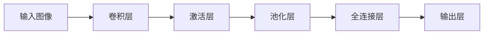

# 卷积神经网络(Convolutional Neural Networks) - 原理与代码实例讲解

## 1. 背景介绍
### 1.1 问题的由来
随着人工智能技术的飞速发展,计算机视觉领域取得了巨大的进步。而卷积神经网络(CNN)作为深度学习的重要模型之一,在图像分类、目标检测、语义分割等任务中表现出色,成为学术界和工业界研究的热点。CNN通过局部感知和权值共享,能够有效地提取图像的空间特征,大大提高了模型的性能。然而,对于初学者来说,理解CNN的原理和实现细节仍然存在一定的难度。

### 1.2 研究现状
自从2012年AlexNet在ImageNet图像分类竞赛中大放异彩以来,CNN迅速成为计算机视觉领域的研究热点。此后,各种CNN模型如VGGNet、GoogLeNet、ResNet等相继被提出,不断刷新图像分类的准确率。同时,CNN也被广泛应用于目标检测(如RCNN系列、YOLO系列)、语义分割(如FCN、UNet)、人脸识别等任务中,取得了显著的效果。目前,CNN已经成为计算机视觉领域的标准配置,在学术研究和工业应用中占据重要地位。

### 1.3 研究意义
深入理解CNN的原理和实现细节,对于从事计算机视觉研究和应用的人员来说至关重要。一方面,掌握CNN的基本概念和数学原理,有助于理解各种CNN模型的异同,为进一步改进和创新CNN模型提供理论基础。另一方面,熟悉CNN的代码实现,可以帮助快速构建CNN模型,加速算法迭代和优化的过程。此外,CNN作为深度学习的代表模型之一,其思想也为其他领域的研究提供了启发,如自然语言处理、语音识别等。

### 1.4 本文结构
本文将从以下几个方面对CNN进行详细讲解:

1. 介绍CNN的核心概念及其与传统神经网络的联系
2. 阐述CNN的核心算法原理,包括卷积、池化、激活函数等,并给出具体操作步骤  
3. 推导CNN涉及的数学模型和公式,并结合实例进行详细讲解
4. 给出CNN的代码实现,并对关键代码进行解释说明
5. 总结CNN的实际应用场景,展望其未来的发展趋势与面临的挑战
6. 推荐CNN相关的学习资源、开发工具和论文
7. 归纳全文的核心内容,并对CNN的研究做进一步展望
8. 列出CNN学习过程中的常见问题,并给出解答

## 2. 核心概念与联系
CNN是一种前馈神经网络,其核心思想是利用卷积和池化操作来提取图像的空间特征。与传统的全连接神经网络相比,CNN具有以下特点:

1. 局部连接:CNN中的神经元只与前一层的部分神经元相连,这种局部连接的方式称为感受野。局部连接大大减少了网络的参数量,降低了过拟合的风险。

2. 权值共享:在同一个卷积层中,所有神经元共享同一组权值(卷积核),这种权值共享的方式使得CNN能够学习到图像的平移不变性。

3. 下采样:通过池化操作对特征图进行下采样,不仅减少了参数量和计算量,还增强了模型的鲁棒性。

4. 层次化:CNN通过堆叠多个卷积层和池化层,逐步提取图像的高级语义特征,形成了一种层次化的特征表示。

下图展示了CNN的基本结构:

## 3. 核心算法原理 & 具体操作步骤
### 3.1 算法原理概述
CNN的核心算法包括卷积、池化和激活函数。

**卷积**是利用卷积核对输入特征图进行滑动窗口操作,得到输出特征图。设输入特征图为$X$,卷积核为$W$,偏置为$b$,则卷积操作可表示为:

$$Y = X * W + b$$

其中$*$表示卷积操作。卷积的目的是提取输入特征图的局部特征。

**池化**是对输入特征图进行下采样,常见的池化操作包括最大池化和平均池化。最大池化取池化窗口内的最大值作为输出,平均池化取池化窗口内的平均值作为输出。池化的目的是减少特征图的尺寸,提高模型的鲁棒性。

**激活函数**是对卷积或全连接层的输出进行非线性变换,常见的激活函数包括ReLU、Sigmoid、Tanh等。ReLU是目前使用最广泛的激活函数,其公式为:

$$f(x) = max(0, x)$$

激活函数的目的是增加网络的非线性表达能力。

### 3.2 算法步骤详解
以图像分类任务为例,CNN的具体操作步骤如下:

1. 输入图像数据,通过卷积层提取低级特征
2. 对卷积层的输出应用激活函数,增加非线性
3. 通过池化层对特征图进行下采样  
4. 重复步骤1-3,得到高级特征图
5. 将高级特征图展平,送入全连接层 
6. 通过Softmax层输出各类别的概率

在训练过程中,CNN通过反向传播算法和梯度下降法来学习网络参数。

### 3.3 算法优缺点
CNN的优点包括:

1. 能够自动学习图像的空间特征,无需人工设计特征
2. 具有平移不变性,对图像的平移具有鲁棒性
3. 参数共享,大大减少了网络参数量
4. 层次化的特征表示,能够提取图像的高级语义信息

CNN的缺点包括: 

1. 需要大量的训练数据和计算资源
2. 网络结构和超参数的选择需要经验和调试
3. 缺乏可解释性,难以理解网络的决策过程
4. 对旋转和尺度变化敏感,泛化能力有待提高

### 3.4 算法应用领域
CNN在计算机视觉的各个任务中都有广泛应用,如:

1. 图像分类:如ImageNet分类、场景识别等
2. 目标检测:如人脸检测、行人检测、车辆检测等  
3. 语义分割:如像素级别的图像理解
4. 人脸识别:如人脸验证、人脸聚类等
5. 行为识别:如动作识别、异常行为检测等

此外,CNN的思想也被用于自然语言处理、语音识别、推荐系统等领域。

## 4. 数学模型和公式 & 详细讲解 & 举例说明
### 4.1 数学模型构建
CNN涉及的主要数学模型包括:

1. 卷积运算:设输入特征图为$X\in R^{H\times W\times C}$,卷积核为$W\in R^{k\times k\times C}$,卷积步长为$s$,填充为$p$,则卷积后的输出特征图$Y$的尺寸为:

$$ H_{out} = \lfloor \frac{H+2p-k}{s} \rfloor + 1 $$
$$ W_{out} = \lfloor \frac{W+2p-k}{s} \rfloor + 1 $$

其中$\lfloor \cdot \rfloor$表示向下取整。

2. 池化运算:设输入特征图为$X\in R^{H\times W\times C}$,池化窗口大小为$k\times k$,池化步长为$s$,则池化后的输出特征图$Y$的尺寸为:

$$ H_{out} = \lfloor \frac{H-k}{s} \rfloor + 1 $$
$$ W_{out} = \lfloor \frac{W-k}{s} \rfloor + 1 $$

3. 损失函数:分类任务常用交叉熵损失函数,设真实标签为$y$,预测概率为$\hat{y}$,则交叉熵损失为:

$$ L = -\sum_{i=1}^{N} y_i \log \hat{y}_i $$

其中$N$为类别数。

### 4.2 公式推导过程
以卷积运算的公式推导为例:

设输入特征图的尺寸为$H\times W$,卷积核的尺寸为$k\times k$,卷积步长为$s$,填充为$p$。

在输入特征图的高度方向,卷积核可以滑动的次数为:

$$ \lfloor \frac{H+2p-k}{s} \rfloor + 1 $$

在输入特征图的宽度方向,卷积核可以滑动的次数为:

$$ \lfloor \frac{W+2p-k}{s} \rfloor + 1 $$

因此,卷积后的输出特征图的尺寸为:

$$ H_{out} = \lfloor \frac{H+2p-k}{s} \rfloor + 1 $$
$$ W_{out} = \lfloor \frac{W+2p-k}{s} \rfloor + 1 $$

### 4.3 案例分析与讲解
以一个具体的卷积运算为例进行说明:

设输入特征图$X$的尺寸为$4\times 4$,卷积核$W$的尺寸为$3\times 3$,卷积步长$s=1$,填充$p=0$。

则根据卷积运算的公式,输出特征图$Y$的尺寸为:

$$ H_{out} = \lfloor \frac{4+2\times 0-3}{1} \rfloor + 1 = 2 $$
$$ W_{out} = \lfloor \frac{4+2\times 0-3}{1} \rfloor + 1 = 2 $$

即输出特征图$Y$的尺寸为$2\times 2$。

假设输入特征图$X$和卷积核$W$的具体数值如下:

$$
X = \begin{bmatrix}
1 & 2 & 3 & 4\\
5 & 6 & 7 & 8\\
9 & 10 & 11 & 12\\
13 & 14 & 15 & 16
\end{bmatrix}
$$

$$
W = \begin{bmatrix}
1 & 0 & -1\\
2 & 0 & -2\\
1 & 0 & -1
\end{bmatrix}
$$

则输出特征图$Y$的计算过程如下:

$$
Y_{11} = \sum_{i=1}^{3}\sum_{j=1}^{3} X_{ij}W_{ij} = 1\times1 + 2\times0 + 3\times-1 + 5\times2 + 6\times0 + 7\times-2 + 9\times1 + 10\times0 + 11\times-1 = -5
$$

$$
Y_{12} = \sum_{i=1}^{3}\sum_{j=2}^{4} X_{ij}W_{(i-1)(j-1)} = 2\times1 + 3\times0 + 4\times-1 + 6\times2 + 7\times0 + 8\times-2 + 10\times1 + 11\times0 + 12\times-1 = -4
$$

$$
Y_{21} = \sum_{i=2}^{4}\sum_{j=1}^{3} X_{ij}W_{(i-1)(j)} = 5\times1 + 6\times0 + 7\times-1 + 9\times2 + 10\times0 + 11\times-2 + 13\times1 + 14\times0 + 15\times-1 = -4
$$

$$
Y_{22} = \sum_{i=2}^{4}\sum_{j=2}^{4} X_{ij}W_{(i-1)(j-1)} = 6\times1 + 7\times0 + 8\times-1 + 10\times2 + 11\times0 + 12\times-2 + 14\times1 + 15\times0 + 16\times-1 = -3
$$

因此,输出特征图$Y$的具体数值为:

$$
Y = \begin{bmatrix}
-5 & -4\\
-4 & -3
\end{bmatrix}
$$

### 4.4 常见问题解答
**Q:** 填充(padding)的作用是什么?

**A:** 填充是在输入特征图的边缘添加额外的行或列,常用的有两种填充方式:

1. Zero padding:在边缘添加全0行或列
2. Same padding:添加的行或列与边缘像素值相同

填充的主要作用是:

1. 保持输入输出特征图的尺寸