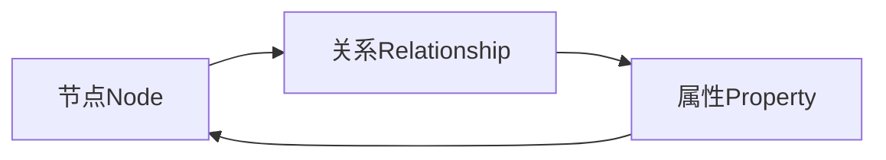
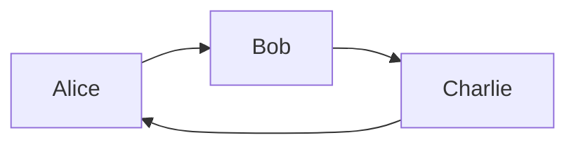

# 图数据库 原理与代码实例讲解

## 1. 背景介绍

### 1.1 问题的由来

在当今大数据时代,传统的关系型数据库在处理高度互连的数据时,面临着性能低下、查询效率差等诸多挑战。随着社交网络、物联网等应用的兴起,数据之间的关系变得越来越复杂,传统数据库难以高效地表示和查询这些复杂关系数据。这就催生了图数据库的诞生和发展。

图数据库是一种针对关系型数据进行优化的数据库管理系统,它使用图结构高效地存储实体之间的关联关系。与传统关系型数据库相比,图数据库具有更好的查询性能和更高的数据关联性。

### 1.2 研究现状

图数据库作为一种新兴的数据库技术,近年来受到了广泛关注和研究。目前,已有多种图数据库产品问世,如Neo4j、JanusGraph、Amazon Neptune等。这些图数据库产品在数据建模、查询语言、事务处理等方面都有自己的特色。

同时,图数据库的理论研究也在不断深入,涉及图存储、图查询优化、图分析算法等多个领域。研究人员致力于提高图数据库的性能、可扩展性和实用性。

### 1.3 研究意义

图数据库的研究对于解决复杂数据关系问题具有重要意义。它可以帮助我们更好地理解和管理社交网络、知识图谱、推荐系统等领域的数据。同时,图数据库也为解决一些传统数据库难以高效处理的问题提供了新的思路和方法。

此外,图数据库的研究也将推动图理论、图算法等相关学科的发展,为其他领域的研究提供新的工具和方法。

### 1.4 本文结构

本文将全面介绍图数据库的原理和实践。首先阐述图数据库的核心概念和数据模型;然后深入探讨图数据库的核心算法原理,包括图存储、图查询和图分析算法;接着通过数学模型和公式,对算法进行理论分析;再结合实际项目,提供代码实例并进行详细解释;最后介绍图数据库的应用场景,推荐相关工具和资源,并对未来发展趋势和挑战进行展望。

## 2. 核心概念与联系

图数据库的核心概念包括节点(Node)、关系(Relationship)和属性(Property)。

**节点(Node)** 用于表示实体,如人物、地点、事物等。每个节点都有唯一的标识符和一组属性。

**关系(Relationship)** 用于描述节点之间的联系,如亲属关系、交易关系等。关系具有方向性,可以是单向或双向。

**属性(Property)** 则用于存储节点或关系的额外信息,如姓名、年龄、价格等。

这三个核心概念紧密相连,共同构建了图数据库的数据模型。节点和关系通过边(Edge)相连,形成一个网状结构,能够高效地表示和查询复杂的数据关联关系。

上图展示了图数据库核心概念之间的关系。节点通过关系相连,节点和关系都可以具有属性。这种灵活的数据模型使得图数据库能够自然地表达现实世界中的各种实体及其复杂关联。

## 3. 核心算法原理 & 具体操作步骤

### 3.1 算法原理概述

图数据库的核心算法主要包括图存储、图查询和图分析三个方面。

**图存储算法** 负责将图数据高效地存储在磁盘或内存中,并支持快速读写操作。常见的图存储算法有邻接表、邻接矩阵、基于属性的索引等。

**图查询算法** 用于在图数据库中高效地检索符合条件的数据模式。主要算法包括深度/广度优先遍历、最短路径算法、子图匹配算法等。

**图分析算法** 则着眼于从图数据中挖掘有价值的信息,如发现社区结构、检测异常行为、预测链接等。典型算法有PageRank、标签传播、图神经网络等。

这三类算法相互依赖、环环相扣,共同构建了图数据库的核心功能。

### 3.2 算法步骤详解

#### 3.2.1 图存储算法

以邻接表作为代表的图存储算法,其核心思想是将图数据划分为节点文件和关系文件,分别存储节点信息和关系信息。

1. **节点文件**
   - 为每个节点分配一个唯一ID
   - 将节点ID及其属性信息存储在节点文件中

2. **关系文件**
   - 为每条关系分配一个唯一ID
   - 将关系ID、关系类型、起点节点ID、终点节点ID及关系属性存储在关系文件中

3. **索引**
   - 构建节点ID到节点属性的索引
   - 构建关系ID到关系属性的索引
   - 支持快速查找节点/关系信息

该算法的优点是存储高效、查询快速,缺点是插入/删除操作代价较高。

#### 3.2.2 图查询算法

以深度优先遍历算法为例,其步骤如下:

1. 确定起点节点
2. 将起点节点压入栈
3. 循环直到栈为空:
   - 弹出栈顶节点 $u$
   - 如果 $u$ 满足查询条件,则将其加入结果集
   - 遍历 $u$ 的所有邻居节点 $v$
     - 如果 $v$ 未被访问过且满足条件,则将 $v$ 压入栈
   - 标记 $u$ 为已访问
4. 返回结果集

该算法的时间复杂度为 $O(|V|+|E|)$,其中 $|V|$ 和 $|E|$ 分别表示节点数和边数。

#### 3.2.3 图分析算法

PageRank是一种著名的图分析算法,用于计算网页的重要性排名。其核心思想是通过网页之间的链接关系,模拟"随机游走"过程,计算每个网页被访问到的概率。

算法步骤如下:

1. 初始化每个网页的PR值,如 $\frac{1}{N}$,其中N为网页总数
2. 迭代直到收敛:
   - 对每个网页 $p_i$,计算其新的PR值:
     $$PR(p_i) = (1-d) + d \sum_{p_j \in M(p_i)} \frac{PR(p_j)}{L(p_j)}$$
     - $M(p_i)$ 是链接到 $p_i$ 的网页集合
     - $L(p_j)$ 是网页 $p_j$ 的出链接数
     - $d$ 是阻尼系数,通常取值0.85
3. 对所有网页的PR值进行归一化
4. 返回最终的PR值作为网页重要性排名

PageRank算法的思想也可应用于其他图分析任务,如社交网络影响力分析、异常检测等。

### 3.3 算法优缺点

#### 3.3.1 图存储算法

**优点**:
- 存储高效,无数据冗余
- 支持快速查找节点/关系信息
- 适合存储稀疏图

**缺点**:
- 插入/删除操作代价较高
- 不适合存储密集图(邻接矩阵更合适)

#### 3.3.2 图查询算法

**优点**:
- 算法简单,易于实现
- 时间复杂度可控
- 支持各种查询条件

**缺点**:
- 对于复杂查询,性能可能不佳
- 需要合理的查询优化策略

#### 3.3.3 图分析算法

**优点**:
- 能够挖掘图数据中的深层次信息
- 算法思路通用,可扩展到多种应用场景
- 部分算法具有不错的并行性能

**缺点**:
- 计算代价可能较高
- 参数设置对结果影响较大
- 需要合理的算法选择和组合

### 3.4 算法应用领域

图数据库的核心算法在多个领域都有广泛应用:

- **社交网络分析**: 通过图算法发现社区结构、传播路径、影响力等信息
- **知识图谱构建**: 利用图存储和查询算法高效管理知识库
- **推荐系统**: 基于图分析算法挖掘用户兴趣,提供个性化推荐
- **欺诈检测**: 应用图分析技术识别异常行为模式
- **路径规划**: 使用最短路径等算法计算最优路线
- **生物信息学**: 分析蛋白质互作网络、代谢网络等

总的来说,图数据库算法为高效处理复杂关系型数据提供了强有力的工具和方法。

## 4. 数学模型和公式 & 详细讲解 & 举例说明

### 4.1 数学模型构建

为了形式化地描述和分析图数据库中的问题,我们需要构建数学模型。一个常用的图数据库数学模型是:

$$G = (V, E, \phi, \psi)$$

其中:
- $V$ 是节点集合,表示图中所有节点
- $E \subseteq V \times V$ 是边集合,表示节点之间的关系
- $\phi: V \rightarrow \Sigma_V$ 是节点标签函数,将节点映射到节点标签集合 $\Sigma_V$
- $\psi: E \rightarrow \Sigma_E$ 是边标签函数,将边映射到边标签集合 $\Sigma_E$

基于该模型,我们可以定义多种图数据库问题和相应的算法。

### 4.2 公式推导过程

**子图匹配问题**

子图匹配是图数据库中一个核心问题,即在一个大图 $G$ 中查找与查询图 $Q$ 同构的子图。形式化地,我们需要找到一个双射 $f: V_Q \rightarrow V_G$,使得:

1. $\forall u \in V_Q: \phi_Q(u) = \phi_G(f(u))$
2. $\forall (u, v) \in E_Q: (f(u), f(v)) \in E_G \wedge \psi_Q(u, v) = \psi_G(f(u), f(v))$

其中 $\phi_Q, \phi_G$ 分别表示查询图和大图的节点标签函数, $\psi_Q, \psi_G$ 分别表示边标签函数。

我们可以将子图匹配问题建模为一个约束满足问题(CSP):

- 变量是查询图中的节点
- 每个变量的值域是大图中的节点
- 约束是节点标签和边标签的一致性条件

经过一系列推导,我们可以得到子图匹配的时间复杂度为 $O(N^{|V_Q|})$,其中 $N$ 是大图的节点数, $|V_Q|$ 是查询图的节点数。这说明了子图匹配是一个 NP 难问题。

### 4.3 案例分析与讲解

考虑一个简单的社交网络案例,其中节点表示用户,边表示关注关系。我们的目标是找到一个由3个用户组成的"朋友圈"子图,即这3个用户相互关注。

我们可以将其建模为一个查询图 $Q$,其中:

$$V_Q = \{A, B, C\}$$
$$E_Q = \{(A, B), (B, C), (C, A)\}$$
$$\phi_Q(A) = \phi_Q(B) = \phi_Q(C) = \text{User}$$
$$\psi_Q(A, B) = \psi_Q(B, C) = \psi_Q(C, A) = \text{Follow}$$

然后,我们可以在大图 $G$ 中执行子图匹配算法,查找与 $Q$ 同构的子图。假设算法返回的映射为:

$$f(A) = u_1, f(B) = u_2, f(C) = u_3$$

那么 $\{u_1, u_2, u_3\}$ 就是我们要找的"朋友圈"子图。

通过这个简单案例,我们可以看到图数据库模型和算法如何应用于实际问题。当然,真实场景中的问题往往更加复杂,需要更高级的模型和算法