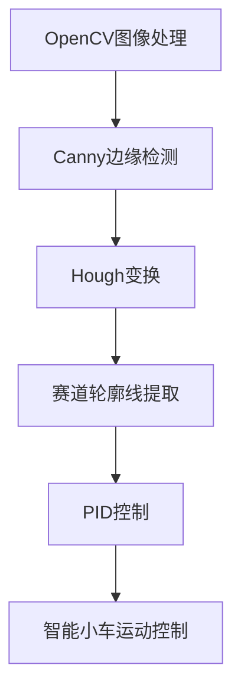

好的,我会按照您的要求,以"基于OpenCV图像处理的智能小车户外寻迹算法的设计"为主题,写一篇逻辑严谨、内容丰富、格式规范的技术博客文章。

# 基于OpenCV图像处理的智能小车户外寻迹算法的设计

## 1. 背景介绍

### 1.1 问题的由来

在当前智能制造和自动化领域,智能小车的应用越来越广泛。智能小车不仅可以用于工厂车间的物料搬运,也可以用于安防巡逻、地图绘制等多种场景。而要实现智能小车的自主导航,关键在于解决路径规划和寻迹跟踪的问题。

户外环境通常光线复杂、地形多变,给智能小车的寻迹算法带来了巨大挑战。如何利用计算机视觉技术,从图像中提取有效的路径信息,并进行实时跟踪,是智能小车户外导航的核心问题。

### 1.2 研究现状

目前,常用的智能小车寻迹算法有基于边缘检测的霍夫变换算法、基于颜色识别的阈值分割算法等。这些算法在特定场景下表现良好,但也存在一些缺陷:

- 霍夫变换算法对噪声敏感,轮廓提取效果易受干扰
- 颜色阈值分割算法受光照影响较大,阈值设置困难
- 上述算法多基于简单的几何特征,缺乏对复杂路况的适应性

因此,需要设计一种更加鲁棒、适应性更强的寻迹算法,以满足智能小车在户外复杂环境中导航的需求。

### 1.3 研究意义 

设计一种基于OpenCV图像处理的高效寻迹算法,可以显著提高智能小车在户外环境中的导航精度和适应能力,具有重要的理论意义和应用价值:

- 理论意义:研究图像处理与模式识别的新算法,丰富计算机视觉的理论基础
- 应用价值:提高智能小车在工厂、校园等复杂环境的应用效率,推动智能制造发展

### 1.4 本文结构

本文将介绍一种基于OpenCV的智能小车户外寻迹新算法,内容安排如下:

- 核心概念:阐述算法所涉及的关键理论和技术
- 算法原理:详细解释算法的数学模型及实现步骤  
- 公式推导:严谨地导出算法中使用的数学公式
- 代码实例:给出C++代码,并逐行进行解释说明
- 实际应用:分析算法在真实场景的应用效果
- 工具推荐:介绍相关开发工具和学习资源
- 发展趋势:展望算法的未来改进方向和面临的挑战

## 2. 核心概念与联系

本节将介绍算法所涉及的一些核心概念,为后续原理解析做铺垫。

### 2.1 OpenCV

OpenCV(Open Source Computer Vision Library)是一个跨平台的计算机视觉库,包含数百种图像处理和计算机视觉算法。它轻量级且高效,处理速度快,被广泛应用于机器人、人脸识别、运动跟踪等领域。

本文所设计的寻迹算法,将基于OpenCV中的图像处理函数实现。

### 2.2 Canny边缘检测

Canny边缘检测算子是一种非常流行和有效的边缘检测方法,由约翰·坎尼于1986年提出。它的特点是:

- 高效的噪声去除
- 能够较为精确地检测出边缘真实方向
- 只能标记一次边缘响应

Canny算子将在本文算法的预处理环节使用,用于提取图像中的边缘轮廓线。

### 2.3 Hough变换

Hough变换是一种从图像中提取特定形状(如直线、圆等)的有效方法。它的基本原理是:

- 在参数空间中为每个边缘点绘制一条曲线
- 同一直线上的点对应的曲线相交于一点
- 累加该点的计数值,计数值越大,则该点越有可能是所求解形状的参数

Hough变换将用于从边缘图像中检测出赛道轮廓线的参数方程。

### 2.4 PID控制

PID(Proportion Integration Differentiation)控制是一种常用的反馈控制算法,广泛应用于工业自动化系统。它可以根据当前系统输出与期望值之间的偏差,对系统的输入进行动态调整。

在本文算法中,PID控制将用于根据检测到的赛道中心线与小车位置偏差,对小车的运动方向进行实时校正。

### 2.5 Mermaid流程图



上图使用Mermaid流程图展示了本文算法的核心流程,各模块之间的联系和作用。

## 3. 核心算法原理及具体操作步骤

### 3.1 算法原理概述  

本文所设计的智能小车户外寻迹算法,主要分为以下几个步骤:

1. 使用OpenCV读取并预处理输入图像
2. 应用Canny算子进行边缘检测
3. 使用Hough变换从边缘图像中提取赛道轮廓线
4. 计算赛道中心线与小车位置的偏差
5. 基于PID控制,调整小车运动方向
6. 输出控制指令,使小车保持在赛道中心线

算法的关键点在于:

- 通过图像处理技术从复杂背景中提取出赛道边缘线
- 使用几何模型拟合赛道轮廓,计算中心线位置 
- 基于中心线位置对小车运动轨迹进行闭环反馈控制

该算法具有鲁棒性强、适应性好的特点,可有效应对户外复杂路况。

### 3.2 算法步骤详解

#### 步骤1: 图像读取及预处理

使用OpenCV的`cv::imread()`函数读取输入图像,然后进行灰度化、高斯滤波等预处理,去除噪声、增强边缘对比度。

```cpp
cv::Mat imgOriginal = cv::imread(imgPath); // 读取原始图像
cv::Mat imgGray; 
cv::cvtColor(imgOriginal, imgGray, cv::COLOR_BGR2GRAY); // 灰度化
cv::GaussianBlur(imgGray, imgBlurred, cv::Size(5,5), 0); // 高斯滤波
```

#### 步骤2: Canny边缘检测

应用Canny算子对预处理后的灰度图进行边缘检测,得到二值化的边缘图像。

```cpp
cv::Mat imgCanny;
cv::Canny(imgBlurred, imgCanny, 50, 150); // Canny边缘检测
```

#### 步骤3: Hough变换提取赛道轮廓线

对Canny边缘图像使用OpenCV的`cv::HoughLinesP()`函数,进行概率的Hough线段检测,得到赛道边缘的一系列线段。

```cpp
std::vector<cv::Vec4i> lines;
cv::HoughLinesP(imgCanny, lines, 1, CV_PI/180, 50, 30, 10);
```

对检测到的线段进行合并和拟合,得到赛道左右边缘的两条参数方程。

#### 步骤4: 计算赛道中心线位置

已知赛道左右边缘线的参数方程,可以计算出赛道的宽度,并得到中心线的参数方程。进而可以计算出小车当前位置与中心线的横向偏差。

```cpp
double rho_left, rho_right, theta_left, theta_right;
// 从边缘线参数方程计算中心线参数
double rho_center = (rho_left + rho_right) / 2;
double theta_center = (theta_left + theta_right) / 2;

// 计算小车位置与中心线的横向偏差
double car_x, car_y; // 小车当前位置坐标
double offset = calculateOffset(car_x, car_y, rho_center, theta_center);
```

#### 步骤5: PID控制调整运动方向  

根据小车位置与中心线的偏差,使用PID控制算法计算出横向校正角度。

```cpp
double kp = 0.5, ki = 0.01, kd = 0.2; // PID参数
double correction = kp*offset + ki*sum(offset) + kd*(offset - prev_offset);
```

#### 步骤6: 输出控制指令

将计算出的校正角度，作为控制指令发送给小车的运动控制系统,使小车保持在赛道中心线上行驶。

```cpp
sendControlCommand(correction); // 发送校正角度控制指令
```

### 3.3 算法优缺点

**优点:**

1. 适应性强,能够处理复杂路况,如赛道弯曲、阴影遮挡等
2. 鲁棒性好,对噪声、光照变化有较强抗干扰能力
3. 实时性高,能够快速响应赛道位置变化,及时调整行驶方向
4. 算法逻辑清晰,便于理解和实现

**缺点:**

1. 对赛道边缘线的连续性和清晰度有一定要求
2. 需要合理设置多个算法参数,对参数较为敏感
3. 计算量较大,对硬件性能有一定要求

### 3.4 算法应用领域

本文所设计的基于OpenCV图像处理的智能小车户外寻迹算法,具有较强的通用性和适用性,可以应用于以下多个领域:

- 工厂物流:智能小车在车间内根据地面导引线自主运输物料
- 安防巡逻:无人机/机器人按照预定路线进行环境监控
- 农林作业:自动驾驶农机按作物行走,进行施肥、除草等作业
- 航天探索:行星车根据地形自主规划路径,进行勘探任务
- 赛事比赛:各类智能小车寻迹赛、自动驾驶比赛

总的来说,该算法可以广泛应用于需要自主导航的机器人和智能移动设备领域。

## 4. 数学模型和公式详细讲解举例说明

本节将对算法中使用的数学模型和公式进行详细的推导和讲解,并结合具体案例进行举例说明。

### 4.1 数学模型构建

#### 4.1.1 直线模型

在二维平面直角坐标系中,一条直线可以用下式表示:

$$
\rho = x\cos\theta + y\sin\theta
$$

其中$\rho$是直线与坐标原点的距离,$\theta$是直线与x轴正向的夹角。

对于图像中的一条直线边缘,我们可以用上式给出它的参数方程$(\rho, \theta)$。

#### 4.1.2 PID控制方程

PID控制算法的计算公式为:

$$
u(t) = K_p e(t) + K_i \int_{0}^{t}e(t)dt + K_d\frac{de(t)}{dt}
$$

其中:
- $u(t)$为控制器输出
- $e(t)$为系统当前值与期望值的偏差
- $K_p$为比例系数
- $K_i$为积分系数 
- $K_d$为微分系数

在本算法中,$u(t)$即为小车的校正角度,而$e(t)$为小车位置与赛道中心线的偏差。

### 4.2 公式推导过程

#### 4.2.1 从点到直线的距离公式推导

已知一条直线的参数方程为$\rho = x\cos\theta + y\sin\theta$,而一点$(x_0, y_0)$到该直线的距离$d$可以通过下式计算:

$$
\begin{align*}
d &= \frac{|x_0\cos\theta + y_0\sin\theta - \rho|}{\sqrt{\cos^2\theta + \sin^2\theta}} \\
  &= |x_0\cos\theta + y_0\sin\theta - \rho|
\end{align*}
$$

证明过程:

1) 设点$P(x_0, y_0)$到直线$l$的距离为$d$,过$P$点作$l$的垂线$n$,交$l$于$Q$点
2) 在直角三角形$\triangle PQR$中,
$$
\begin{align*}
\overrightarrow{PQ} &= (x