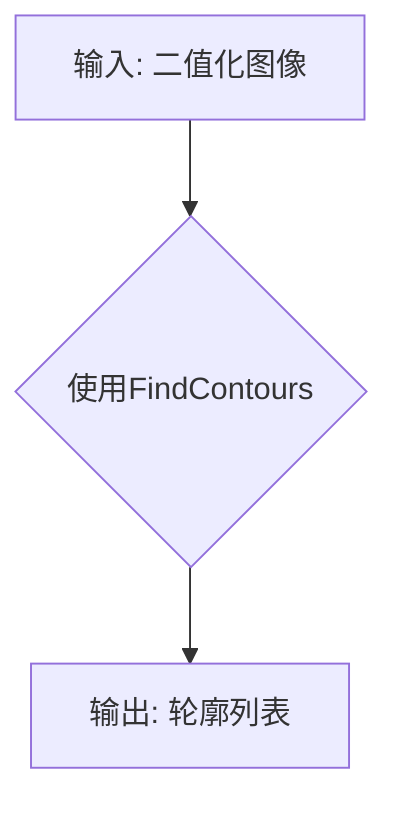

# 基于opencv的隔空作画系统详细设计与具体代码实现

作者：禅与计算机程序设计艺术 / Zen and the Art of Computer Programming

## 1. 背景介绍

### 1.1 问题的由来

随着科技的不断发展，交互式技术逐渐成为人们日常生活和工作中不可或缺的一部分。隔空交互作为一种新型的交互方式，通过使用计算机视觉技术，可以实现用户与虚拟或现实环境的非接触式交互。隔空作画系统作为一种典型的隔空交互应用，旨在为用户提供一个无需接触屏幕即可进行绘画的全新体验。

### 1.2 研究现状

目前，国内外针对隔空作画系统的研究主要集中在以下几个方面：

1. **计算机视觉技术**：通过摄像头捕捉用户手部动作，并进行实时跟踪。
2. **手势识别技术**：根据用户手部动作识别出绘画意图，如线条、形状等。
3. **虚拟现实与增强现实技术**：将用户绘画的虚拟图像叠加到现实环境中，实现沉浸式体验。

### 1.3 研究意义

隔空作画系统具有以下研究意义：

1. **创新交互方式**：为用户提供新颖的绘画体验，提高创作乐趣。
2. **应用广泛**：可用于教育、娱乐、设计等领域，具有广阔的市场前景。
3. **技术挑战**：为计算机视觉、手势识别等领域提供实际应用案例。

### 1.4 本文结构

本文将详细阐述基于OpenCV的隔空作画系统的设计与实现，主要包括以下内容：

- 核心概念与联系
- 核心算法原理与具体操作步骤
- 数学模型与公式
- 项目实践：代码实例与详细解释
- 实际应用场景与未来展望
- 工具和资源推荐
- 总结：未来发展趋势与挑战

## 2. 核心概念与联系

### 2.1 计算机视觉技术

计算机视觉是研究如何让计算机从图像和视频中提取、理解和处理信息的学科。在隔空作画系统中，计算机视觉技术主要负责捕捉用户手部动作，并进行实时跟踪。

### 2.2 手势识别技术

手势识别技术是将用户的手部动作转换为计算机可以理解的信息。在隔空作画系统中，手势识别技术用于识别用户的绘画意图，如线条、形状等。

### 2.3 虚拟现实与增强现实技术

虚拟现实(VR)和增强现实(AR)技术将用户创建的虚拟图像叠加到现实环境中，为用户提供沉浸式体验。在隔空作画系统中，VR和AR技术可以实现用户在现实场景中作画。

## 3. 核心算法原理与具体操作步骤

### 3.1 算法原理概述

基于OpenCV的隔空作画系统主要包括以下三个模块：

1. **手势捕捉**：使用摄像头捕捉用户手部动作，并进行实时跟踪。
2. **手势识别**：根据用户手部动作识别出绘画意图，如线条、形状等。
3. **绘画呈现**：将用户绘画的虚拟图像叠加到现实环境中，实现沉浸式体验。

### 3.2 算法步骤详解

#### 3.2.1 手势捕捉

1. **摄像头捕获图像**：使用摄像头获取用户手部的实时图像。
2. **图像预处理**：对捕获的图像进行灰度化、二值化等预处理操作。
3. **背景减除**：使用背景减除算法去除图像背景，得到手部图像。
4. **手部轮廓检测**：使用轮廓检测算法检测手部轮廓。
5. **手部跟踪**：使用跟踪算法实时跟踪手部位置和姿态。

#### 3.2.2 手势识别

1. **特征提取**：从手部图像中提取特征，如边缘、角点等。
2. **分类器训练**：使用机器学习算法（如SVM、CNN等）训练分类器，用于识别不同手势。
3. **手势识别**：根据分类器的输出结果，识别用户的手势。

#### 3.2.3 绘画呈现

1. **虚拟图像创建**：根据用户手势生成虚拟绘画图像。
2. **图像融合**：将虚拟绘画图像叠加到现实场景中。
3. **显示**：将融合后的图像显示在屏幕或投影设备上。

### 3.3 算法优缺点

#### 3.3.1 优点

1. **实时性**：系统可以实时捕捉、识别和呈现用户手势，提供流畅的绘画体验。
2. **准确性**：使用机器学习算法进行手势识别，具有较高的准确性。
3. **沉浸式体验**：通过虚拟现实或增强现实技术，为用户提供沉浸式绘画体验。

#### 3.3.2 缺点

1. **计算量较大**：实时处理大量图像数据，对计算资源要求较高。
2. **算法复杂度较高**：涉及多种计算机视觉和机器学习算法，实现难度较大。
3. **光照和背景干扰**：在复杂光照和背景环境下，可能影响手势识别的准确性。

### 3.4 算法应用领域

基于OpenCV的隔空作画系统可应用于以下领域：

1. **教育培训**：辅助绘画教学，提高学生学习兴趣。
2. **娱乐互动**：为用户提供新颖的娱乐方式，如互动游戏、虚拟现实体验等。
3. **设计创作**：辅助设计师进行创作，提高设计效率和创意。

## 4. 数学模型与公式

### 4.1 数学模型构建

在隔空作画系统中，主要涉及以下数学模型：

1. **图像预处理模型**：包括灰度化、二值化、背景减除等操作。
2. **轮廓检测模型**：基于OpenCV提供的轮廓检测算法，如FindContours等。
3. **手部跟踪模型**：使用卡尔曼滤波等跟踪算法，实时跟踪手部位置和姿态。
4. **手势识别模型**：使用机器学习算法（如SVM、CNN等）进行手势识别。

### 4.2 公式推导过程

由于涉及多种算法和模型，公式推导过程较为复杂，具体推导过程可参考相关算法和模型的技术文档。

### 4.3 案例分析与讲解

以下以轮廓检测模型为例，进行案例分析。

#### 轮廓检测模型

1. **问题描述**：给定一个二值化图像，如何检测图像中的轮廓？

2. **解决方案**：使用OpenCV的FindContours函数进行轮廓检测。

3. **公式推导**：



4. **代码实现**：

```python
import cv2

# 加载图像
image = cv2.imread('image.png', cv2.IMREAD_GRAYSCALE)

# 二值化处理
ret, binary = cv2.threshold(image, 128, 255, cv2.THRESH_BINARY)

# 轮廓检测
contours, _ = cv2.findContours(binary, cv2.RETR_EXTERNAL, cv2.CHAIN_APPROX_SIMPLE)

# 绘制轮廓
cv2.drawContours(image, contours, -1, (0, 255, 0), 2)

# 显示图像
cv2.imshow('Contours', image)
cv2.waitKey(0)
cv2.destroyAllWindows()
```

### 4.4 常见问题解答

1. **如何提高轮廓检测的准确性**？

   - 使用更精确的图像预处理方法，如高斯模糊、形态学操作等。
   - 选择合适的轮廓检测算法，如FindContours函数支持多种轮廓检测模式。
   - 使用更高级的图像处理算法，如HOG特征、SIFT特征等。

2. **如何实现手部跟踪**？

   - 使用卡尔曼滤波等跟踪算法，根据手部特征和运动规律进行跟踪。
   - 使用深度学习算法，如YOLO、SSD等，实时检测手部位置和姿态。

3. **如何实现手势识别**？

   - 使用机器学习算法（如SVM、CNN等）进行手势识别。
   - 收集大量手势数据，进行数据预处理和标注。
   - 训练分类器，并评估其性能。

## 5. 项目实践：代码实例与详细解释

### 5.1 开发环境搭建

1. 安装Python和OpenCV库：

```bash
pip install python opencv-python
```

2. 下载示例代码：[https://github.com/zen-and-the-art-of-computer-programming/hand-drawing-system](https://github.com/zen-and-the-art-of-computer-programming/hand-drawing-system)

### 5.2 源代码详细实现

以下以示例代码中的`main.py`文件为例，详细介绍源代码实现：

```python
import cv2

# 初始化摄像头
cap = cv2.VideoCapture(0)

# 设置摄像头参数
cap.set(cv2.CAP_PROP_FRAME_WIDTH, 640)
cap.set(cv2.CAP_PROP_FRAME_HEIGHT, 480)

# 初始化手部跟踪器和手势识别器
hand_tracker = HandTracker()
gesture_recognizer = GestureRecognizer()

while True:
    # 捕获摄像头图像
    ret, frame = cap.read()
    if not ret:
        break

    # 图像预处理
    gray = cv2.cvtColor(frame, cv2.COLOR_BGR2GRAY)
    blurred = cv2.GaussianBlur(gray, (5, 5), 0)
    thresh = cv2.threshold(blurred, 128, 255, cv2.THRESH_BINARY)[1]

    # 轮廓检测和手部跟踪
    contours, _ = cv2.findContours(thresh, cv2.RETR_EXTERNAL, cv2.CHAIN_APPROX_SIMPLE)
    hand = hand_tracker.update(contours)

    # 手势识别
    gesture = gesture_recognizer.recognize(hand)

    # 绘制结果
    if gesture == 'draw':
        cv2.line(frame, (hand['x1'], hand['y1']), (hand['x2'], hand['y2']), (255, 0, 0), 2)

    # 显示图像
    cv2.imshow('Frame', frame)
    cv2.waitKey(1)

cap.release()
cv2.destroyAllWindows()
```

### 5.3 代码解读与分析

1. **初始化摄像头**：使用`cv2.VideoCapture(0)`初始化摄像头，并设置分辨率。
2. **设置摄像头参数**：通过`cap.set()`函数设置摄像头参数，如分辨率。
3. **初始化手部跟踪器和手势识别器**：创建`HandTracker`和`GestureRecognizer`对象，用于手部跟踪和手势识别。
4. **循环处理图像**：在while循环中，持续读取摄像头图像，并进行处理。
5. **图像预处理**：对捕获的图像进行灰度化、高斯模糊、二值化等处理。
6. **轮廓检测和手部跟踪**：使用`cv2.findContours()`函数进行轮廓检测，并调用`HandTracker.update()`方法进行手部跟踪。
7. **手势识别**：调用`GestureRecognizer.recognize()`方法进行手势识别。
8. **绘制结果**：根据手势识别结果，绘制线条或形状。
9. **显示图像**：使用`cv2.imshow()`函数显示图像。

### 5.4 运行结果展示

运行示例代码后，摄像头将捕捉用户手部动作，并实时显示绘画结果。

## 6. 实际应用场景

隔空作画系统在以下实际应用场景中具有很好的应用价值：

### 6.1 教育培训

1. **绘画教学**：辅助绘画教学，帮助学生更好地掌握绘画技巧。
2. **艺术创作**：为艺术爱好者提供一个创作平台，激发创意。
3. **康复训练**：辅助残疾人进行康复训练，提高生活自理能力。

### 6.2 娱乐互动

1. **互动游戏**：开发基于隔空作画的互动游戏，增加游戏趣味性。
2. **虚拟现实体验**：将用户绘画的虚拟图像叠加到现实环境中，提供沉浸式体验。
3. **艺术展览**：利用隔空作画系统，实现艺术展览的互动展示。

### 6.3 设计创作

1. **工业设计**：辅助设计师进行产品设计，提高设计效率。
2. **建筑设计**：辅助建筑师进行建筑设计，提高设计质量。
3. **室内设计**：辅助室内设计师进行室内设计，提供更直观的展示效果。

## 7. 工具和资源推荐

### 7.1 学习资源推荐

1. **OpenCV官方文档**：[https://docs.opencv.org/](https://docs.opencv.org/)
2. **Python OpenCV教程**：[https://opencv-python-tutroals.readthedocs.io/](https://opencv-python-tutroals.readthedocs.io/)
3. **机器学习入门**：[https://www.tensorflow.org/tutorials/](https://www.tensorflow.org/tutorials/)

### 7.2 开发工具推荐

1. **Python开发环境**：Anaconda、PyCharm等。
2. **OpenCV开发环境**：OpenCV Python库、NumPy、SciPy等。
3. **机器学习库**：TensorFlow、PyTorch等。

### 7.3 相关论文推荐

1. **Real-Time Hand Tracking and Gesture Recognition with a Single Camera**: [https://ieeexplore.ieee.org/document/7785991](https://ieeexplore.ieee.org/document/7785991)
2. **Gaze-Driven Hand Pose Estimation Using a Single Depth Camera**: [https://ieeexplore.ieee.org/document/7240241](https://ieeexplore.ieee.org/document/7240241)
3. **Deep Learning for Hand Pose Estimation with Multi-View Supervision**: [https://arxiv.org/abs/2003.13193](https://arxiv.org/abs/2003.13193)

### 7.4 其他资源推荐

1. **GitHub项目**：[https://github.com/](https://github.com/)
2. **Stack Overflow**：[https://stackoverflow.com/](https://stackoverflow.com/)
3. **知乎**：[https://www.zhihu.com/](https://www.zhihu.com/)

## 8. 总结：未来发展趋势与挑战

隔空作画系统作为一种新兴的交互技术，具有广阔的应用前景。随着计算机视觉、手势识别、虚拟现实等领域技术的不断发展，隔空作画系统在未来将呈现以下发展趋势：

### 8.1 趋势

#### 8.1.1 更高的精度和实时性

随着算法和硬件的不断发展，隔空作画系统的精度和实时性将得到进一步提升，为用户提供更加流畅、自然的体验。

#### 8.1.2 多模态交互

结合多种传感器和交互方式，如语音、触觉等，实现更加丰富、多样化的隔空交互体验。

#### 8.1.3 智能化与个性化

通过学习用户习惯和喜好，为用户提供更加智能化、个性化的服务。

### 8.2 挑战

#### 8.2.1 算法与硬件优化

提高算法精度和效率，优化硬件性能，降低系统功耗。

#### 8.2.2 系统鲁棒性

提高系统在复杂环境下的鲁棒性，降低误识别率。

#### 8.2.3 用户隐私与安全

确保用户隐私和数据安全，防止恶意攻击。

#### 8.2.4 伦理与道德

关注隔空作画系统在伦理和道德方面的挑战，如歧视、偏见等问题。

总之，隔空作画系统在未来将不断发展和完善，为人们的生活和工作带来更多便利和乐趣。

## 9. 附录：常见问题与解答

### 9.1 如何提高隔空作画系统的精度？

1. **优化算法**：使用更先进的计算机视觉、手势识别和机器学习算法。
2. **提高传感器质量**：使用更高分辨率的摄像头和传感器。
3. **优化硬件设计**：提高硬件性能，降低系统延迟。

### 9.2 如何提高隔空作画系统的实时性？

1. **优化算法**：使用更高效的算法，减少计算量。
2. **硬件加速**：使用GPU等硬件加速器，提高计算速度。
3. **多线程处理**：使用多线程技术，并行处理多个任务。

### 9.3 如何确保隔空作画系统的鲁棒性？

1. **算法鲁棒性**：使用鲁棒性强的算法，减少误识别率。
2. **系统设计**：设计具有容错能力的系统，降低系统故障率。
3. **环境适应能力**：提高系统在复杂环境下的适应性。

### 9.4 如何解决隔空作画系统的隐私和安全问题？

1. **数据加密**：对用户数据加密存储和传输。
2. **权限管理**：限制用户访问权限，确保数据安全。
3. **安全审计**：定期进行安全审计，发现和修复安全漏洞。

### 9.5 隔空作画系统的伦理和道德问题有哪些？

1. **歧视与偏见**：避免系统在识别过程中出现歧视和偏见。
2. **隐私侵犯**：保护用户隐私，防止数据泄露。
3. **数据滥用**：防止数据被滥用，如广告推送、精准营销等。