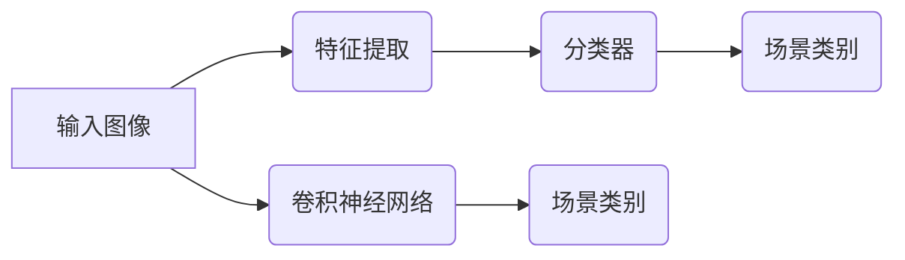

# 基于深度学习的机器人室内场景识别

关键词：深度学习、机器人、场景识别、卷积神经网络、迁移学习、目标检测、语义分割

## 1. 背景介绍
### 1.1 问题的由来
随着人工智能技术的飞速发展,机器人在我们的日常生活中扮演着越来越重要的角色。无论是在工业生产、家庭服务,还是医疗救援等领域,智能机器人都大显身手。然而,要让机器人在复杂多变的室内环境中自主导航和执行任务,首先需要解决的关键问题之一就是室内场景识别。
### 1.2 研究现状
传统的机器人室内场景识别主要依赖于手工设计的特征和分类器,如 SIFT、SURF、HOG 等特征描述子,以及 SVM、随机森林等分类算法。这些方法在特定场景下取得了不错的效果,但泛化能力较差,难以适应室内环境的多样性和复杂性。近年来,以卷积神经网络(CNN)为代表的深度学习方法在计算机视觉领域取得了突破性进展,也为机器人室内场景识别提供了新的思路和方法。
### 1.3 研究意义
深度学习能够从大规模数据中自动学习多层次、高度抽象的特征表示,克服了传统方法依赖人工特征的局限性。将深度学习应用于机器人室内场景识别,有望显著提升识别的精度和鲁棒性,使机器人能够更好地理解和适应室内环境,为后续的导航、交互、操作等任务奠定基础。同时,这一研究也将推动人工智能在机器人领域的应用和发展。
### 1.4 本文结构
本文将系统地探讨如何利用深度学习技术实现机器人室内场景识别。第2部分介绍场景识别的核心概念和深度学习与场景识别的关系;第3部分重点阐述几种主流的深度学习算法在场景识别中的原理和应用;第4部分从数学角度对相关模型进行推导和分析;第5部分给出具体的代码实现示例;第6部分讨论场景识别在机器人领域的实际应用场景;第7部分推荐相关的学习资源和开发工具;第8部分总结全文,展望未来的研究方向和挑战;第9部分列出常见问题解答。

## 2. 核心概念与联系
场景识别是指识别和理解图像或视频中的场景类别,如客厅、厨房、办公室等。它是计算机视觉的一个重要研究问题,在机器人、自动驾驶、图像检索等领域有广泛应用。场景识别的目标是对整个场景进行分类,而不是识别场景中的具体物体。尽管如此,场景与物体之间存在着密切的语义联系,因为某些物体的出现可以为场景提供重要线索,比如沙发、电视常出现在客厅场景中。

传统的场景识别方法主要采用浅层学习模型,先提取手工设计的特征(如 GIST、CENTRIST 等),再使用分类器进行分类。而深度学习则是利用多层神经网络自动学习层次化的特征表示,并同时优化特征提取和分类任务,端到端地完成场景识别。深度学习模型能够学习到更加抽象和鲁棒的特征,从而显著提升场景识别的性能。此外,深度学习还能够方便地融合不同模态的信息(如 RGB、深度等),以及利用迁移学习来缓解标注数据不足的问题。

下图展示了传统机器学习与深度学习在场景识别中的主要区别:

可以看出,传统机器学习需要分别完成特征提取和分类两个步骤,而深度学习可以一步到位,学习端到端的映射。因此,深度学习是一种更加强大和有潜力的场景识别方法。

## 3. 核心算法原理 & 具体操作步骤
### 3.1 算法原理概述
目前,卷积神经网络(CNN)是深度学习中最主流和成功的模型架构之一。CNN 通过局部连接和权重共享,能够高效地提取图像中的空间特征。一个典型的 CNN 由多个卷积层、池化层和全连接层组成,交替堆叠形成层次化的特征表示。随着网络加深,CNN 能够学习到越来越抽象和语义化的特征。

除了 CNN,一些其他的深度学习模型也被用于场景识别任务,如循环神经网络(RNN)、生成对抗网络(GAN)等。RNN 善于处理序列数据,可以建模场景中物体的空间关系。GAN 通过生成器和判别器的对抗学习,可以生成逼真的场景图像,增强训练数据。

在实际应用中,往往采用迁移学习的方式,利用在大规模数据集(如 Places、ImageNet)上预训练的 CNN 模型,并在目标场景数据上进行微调。这种方法可以显著减少所需的训练数据和计算资源,加速模型的开发和部署。

### 3.2 算法步骤详解
下面以经典的 CNN 模型 AlexNet 为例,详细介绍场景识别的算法步骤。

输入:一张 RGB 图像,尺寸为 227x227x3。

1. 卷积层 1:96 个 11x11x3 的卷积核,步长为 4,ReLU 激活函数。输出尺寸为 55x55x96。
2. 池化层 1:3x3 最大池化,步长为 2。输出尺寸为 27x27x96。  
3. 卷积层 2:256 个 5x5x96 的卷积核,ReLU 激活函数。输出尺寸为 27x27x256。
4. 池化层 2:3x3 最大池化,步长为 2。输出尺寸为 13x13x256。
5. 卷积层 3:384 个 3x3x256 的卷积核,ReLU 激活函数。输出尺寸为 13x13x384。
6. 卷积层 4:384 个 3x3x384 的卷积核,ReLU 激活函数。输出尺寸为 13x13x384。
7. 卷积层 5:256 个 3x3x384 的卷积核,ReLU 激活函数。输出尺寸为 13x13x256。
8. 池化层 5:3x3 最大池化,步长为 2。输出尺寸为 6x6x256。
9. 全连接层 1:4096 个神经元,ReLU 激活函数。
10. 全连接层 2:4096 个神经元,ReLU 激活函数。 
11. 全连接层 3:N 个神经元,Softmax 激活函数。N 为场景类别数。

输出:对输入图像的场景类别预测。

以上是 AlexNet 的前向传播过程,在训练阶段还需要计算损失函数(如交叉熵损失)并通过反向传播算法更新网络权重。AlexNet 共有 6000 万个参数和 6.5 亿个连接,是一个非常深和宽的网络。

### 3.3 算法优缺点
CNN 用于场景识别的优点:
1. 自动学习层次化的特征表示,无需手工设计特征。
2. 端到端训练,同时优化特征提取和分类性能。
3. 具有强大的表示能力,能够处理复杂的场景图像。
4. 可以方便地融合多模态信息,如 RGB-D 数据。
5. 利用迁移学习可以缓解标注数据不足的问题。

CNN 用于场景识别的缺点:
1. 需要大量的有标注数据进行训练,标注成本高。
2. 训练时间长,计算资源消耗大。  
3. 模型复杂度高,存储和推理开销大。
4. 泛化能力有待提高,容易过拟合。
5. 缺乏可解释性,难以分析失败案例。

### 3.4 算法应用领域
CNN 是目前机器人室内场景识别的主流算法,在家庭服务机器人、自动驾驶、辅助导航等领域得到了广泛应用。此外,CNN 还被用于室内三维重建、物体检测、语义分割等与场景理解相关的任务中。未来,CNN 有望与其他传感器信息(如激光雷达)相结合,实现更加全面和精准的室内场景感知。

## 4. 数学模型和公式 & 详细讲解 & 举例说明
### 4.1 数学模型构建
CNN 的数学模型可以用一系列张量运算来表示。假设输入图像为 $X \in \mathbb{R}^{H \times W \times C}$,其中 $H$、$W$、$C$ 分别为图像的高、宽、通道数。卷积层的参数为卷积核 $K \in \mathbb{R}^{k \times k \times C \times M}$ 和偏置 $b \in \mathbb{R}^M$,其中 $k$ 为卷积核尺寸,$M$ 为卷积核数量。卷积层的输出 $Y \in \mathbb{R}^{H' \times W' \times M}$ 可以表示为:

$$Y_{i,j,m} = \sum_{c=1}^C \sum_{p=1}^k \sum_{q=1}^k X_{i+p-1,j+q-1,c} K_{p,q,c,m} + b_m$$

其中 $i=1,\dots,H'$,$j=1,\dots,W'$,$m=1,\dots,M$。卷积操作可以看作是对图像的局部区域进行加权求和,提取局部特征。

池化层对输入特征图进行下采样,减小特征图尺寸。以最大池化为例,假设池化核尺寸为 $s \times s$,池化层的输出 $Y \in \mathbb{R}^{H'' \times W'' \times M}$ 可以表示为:

$$Y_{i,j,m} = \max_{p=1,\dots,s} \max_{q=1,\dots,s} X_{(i-1)s+p,(j-1)s+q,m}$$

其中 $i=1,\dots,H''$,$j=1,\dots,W''$。池化操作可以提取局部区域的最显著特征,同时具有平移不变性。

全连接层对输入特征进行线性变换和非线性激活。假设全连接层的参数为权重矩阵 $W \in \mathbb{R}^{N \times D}$ 和偏置 $b \in \mathbb{R}^N$,其中 $D$ 为输入特征维度,$N$ 为输出特征维度。全连接层的输出 $y \in \mathbb{R}^N$ 可以表示为:

$$y = f(Wx + b)$$

其中 $f$ 为激活函数,如 ReLU: $f(x)=\max(0,x)$。全连接层可以对高层特征进行组合,生成更加抽象和语义化的表示。

最后一个全连接层的输出通过 Softmax 函数归一化为概率分布:

$$p_i = \frac{\exp(y_i)}{\sum_{j=1}^N \exp(y_j)}$$

其中 $p_i$ 为第 $i$ 个类别的预测概率。

### 4.2 公式推导过程
以上是 CNN 前向传播的主要公式,下面对反向传播公式进行推导。反向传播是指计算损失函数对每一层参数的梯度,并用梯度下降法更新参数,使损失函数最小化。

假设损失函数为交叉熵损失:

$$L = -\sum_{i=1}^N y_i \log p_i$$

其中 $y$ 为真实标签的 one-hot 向量。根据链式法则,损失函数对最后一个全连接层输出的梯度为:

$$\frac{\partial L}{\partial y_i} = p_i - y_i$$

对全连接层权重和偏置的梯度为:

$$\frac{\partial L}{\partial W} = \frac{\partial L}{\partial y} \frac{\partial y}{\partial W} = (p-y)x^T$$

$$\frac{\partial L}{\partial b} = \frac{\partial L}{\partial y} \frac{\partial y}{\partial b} = p-y$$

类似地,可以递归地计算前面各层的梯度,直至输入层。卷积层和池化层的反向传播需要用到张量运算的链式法则,这里不