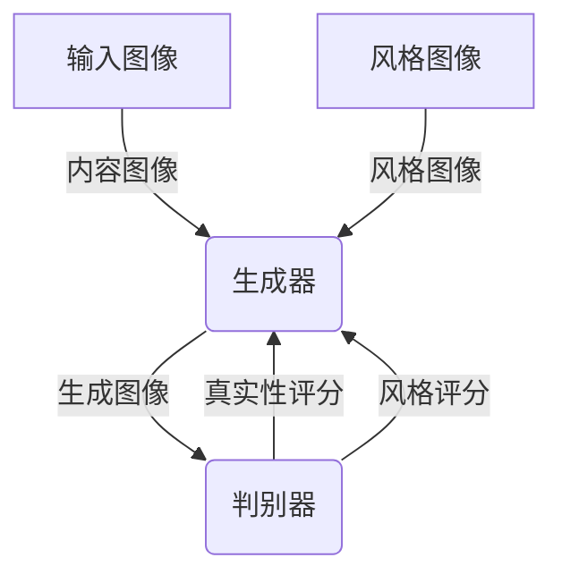

以下是基于您的要求撰写的技术博客文章《基于生成对抗网络的图像风格迁移与文化差异研究》:

# 基于生成对抗网络的图像风格迁移与文化差异研究

## 1. 背景介绍

### 1.1 问题的由来

在当今多元文化的世界中,跨文化交流和理解变得越来越重要。然而,由于文化差异,人们对同一图像的理解和感知往往存在差异。例如,一些图像可能在某些文化中被视为美丽或吉祥,而在另一些文化中则可能被视为冒犯或不雅。这种文化差异不仅影响着人们对图像的理解,也可能导致跨文化交流中的误解和冲突。

### 1.2 研究现状

为了解决这一问题,研究人员一直在探索如何实现图像风格迁移,即将一种文化风格迁移到另一种文化风格。传统的图像风格迁移方法通常依赖于手工特征提取和样式转换规则,效果有限且缺乏灵活性。近年来,随着深度学习技术的快速发展,基于生成对抗网络(Generative Adversarial Networks,GAN)的图像风格迁移方法逐渐受到关注。

### 1.3 研究意义

基于GAN的图像风格迁移技术可以自动学习不同文化风格之间的映射关系,实现更加自然和流畅的风格转换。这不仅有助于促进跨文化理解和交流,还可以在艺术创作、虚拟现实、视觉增强等领域发挥重要作用。此外,研究不同文化风格之间的差异,有助于我们更好地理解文化的本质,促进文化多样性的保护和传承。

### 1.4 本文结构

本文首先介绍生成对抗网络及其在图像风格迁移中的应用,然后详细阐述核心算法原理和数学模型。接下来,我们将通过代码实例和实际案例,展示基于GAN的图像风格迁移在不同文化背景下的应用。最后,我们总结该技术的发展趋势和面临的挑战,并提供相关资源推荐。

## 2. 核心概念与联系

生成对抗网络(GAN)是一种由两个神经网络组成的框架,包括生成器(Generator)和判别器(Discriminator)。生成器的目标是生成逼真的数据样本(如图像),而判别器的目标是区分生成的样本和真实数据。通过生成器和判别器之间的对抗训练,GAN可以学习数据的真实分布,并生成新的逼真数据。

在图像风格迁移任务中,我们希望将一种图像风格(如油画风格)迁移到另一种图像风格(如素描风格)。为此,我们可以设计一种条件GAN(Conditional GAN),其中生成器接收两个输入:内容图像和风格图像。生成器的目标是生成一个新图像,该图像保留了内容图像的内容,同时具有风格图像的风格特征。

判别器则需要判断生成的图像是否真实,以及是否具有期望的风格。通过对抗训练,生成器和判别器相互竞争,最终达到生成器可以生成具有期望风格的逼真图像的目标。

上图展示了基于GAN的图像风格迁移的基本流程。输入图像分为内容图像和风格图像,生成器将两者结合生成新图像,判别器则评估生成图像的真实性和风格一致性,并将评分反馈给生成器进行优化。

## 3. 核心算法原理与具体操作步骤

### 3.1 算法原理概述

基于GAN的图像风格迁移算法的核心思想是,通过对抗训练使生成器学习到内容图像和风格图像之间的映射关系,从而生成兼具两者特征的新图像。具体来说,算法包括以下几个关键步骤:

1. **特征提取**:使用预训练的卷积神经网络(如VGG)提取内容图像和风格图像的特征。
2. **损失函数构建**:构建损失函数,包括内容损失(保持内容特征)、风格损失(匹配风格特征)和对抗损失(生成逼真图像)。
3. **生成器训练**:使用反向传播算法,根据损失函数优化生成器的参数。
4. **判别器训练**:使用反向传播算法,根据对抗损失优化判别器的参数。
5. **迭代训练**:重复步骤3和4,直到生成器和判别器达到平衡。

### 3.2 算法步骤详解

1. **特征提取**

我们使用预训练的卷积神经网络(如VGG19)提取内容图像和风格图像的特征。对于内容图像,我们提取高层特征,用于保留图像的内容信息。对于风格图像,我们提取多层特征,用于捕获不同尺度的风格信息。

2. **损失函数构建**

损失函数是算法的关键部分,它包括以下三个部分:

(1) 内容损失:用于保持生成图像的内容特征与内容图像相似。我们计算生成图像和内容图像在高层特征上的均方差,作为内容损失。

$$L_{content}(G) = \frac{1}{N}\sum_{i,j}(F_{ij}^{content} - F_{ij}^{gen})^2$$

其中,$F^{content}$和$F^{gen}$分别表示内容图像和生成图像的高层特征,N是特征的维度。

(2) 风格损失:用于匹配生成图像和风格图像的风格特征。我们计算生成图像和风格图像在多层特征的格拉姆矩阵(Gram Matrix)之间的均方差,作为风格损失。

$$L_{style}(G) = \sum_{l=1}^L\frac{1}{N_l^2M_l^2}\sum_{i,j}(G_{ij}^{style_l} - G_{ij}^{gen_l})^2$$

其中,$G^{style_l}$和$G^{gen_l}$分别表示风格图像和生成图像在第l层的格拉姆矩阵,L是特征层数,$N_l$和$M_l$分别是第l层特征的高度和宽度。

(3) 对抗损失:用于生成逼真的图像。我们使用标准的对抗损失函数,即最小化判别器对生成图像的负对数似然。

$$L_{adv}(G,D) = \mathbb{E}_{x\sim p_{data}}[\log D(x)] + \mathbb{E}_{z\sim p_z}[\log(1-D(G(z)))]$$

其中,x是真实图像,z是随机噪声,G和D分别表示生成器和判别器。

最终的损失函数是上述三个损失的加权和:

$$L(G,D) = \alpha L_{content}(G) + \beta L_{style}(G) + \gamma L_{adv}(G,D)$$

其中,$\alpha$,$\beta$和$\gamma$是权重系数,用于平衡不同损失项的贡献。

3. **生成器训练**

我们使用反向传播算法,根据最终损失函数优化生成器的参数。具体地,我们最小化生成器的损失函数:

$$G^* = \arg\min_G \alpha L_{content}(G) + \beta L_{style}(G) + \gamma L_{adv}(G,D)$$

4. **判别器训练**

我们使用反向传播算法,根据对抗损失优化判别器的参数。具体地,我们最大化判别器的对抗损失:

$$D^* = \arg\max_D L_{adv}(G,D)$$

5. **迭代训练**

我们交替地训练生成器和判别器,重复步骤3和4,直到生成器和判别器达到平衡。在训练过程中,我们还可以采用一些策略(如渐进式增加损失权重)来提高训练稳定性和效果。

### 3.3 算法优缺点

**优点**:

- 能够自动学习不同风格之间的映射关系,实现自然流畅的风格转换。
- 具有很强的泛化能力,可以应用于多种风格迁移任务。
- 生成的图像质量高,细节保真度好。

**缺点**:

- 训练过程复杂,需要大量的计算资源和时间。
- 对训练数据的质量和多样性要求较高。
- 存在模式崩溃(mode collapse)和不稳定性等问题。
- 难以保证生成图像的语义一致性。

### 3.4 算法应用领域

基于GAN的图像风格迁移算法可以应用于多个领域:

- **艺术创作**:将不同艺术风格迁移到图像上,为艺术家提供创作灵感和辅助工具。
- **虚拟现实**:在虚拟现实场景中,实现不同风格的实时渲染。
- **视觉增强**:将图像转换为更加清晰、艺术化的风格,提升视觉体验。
- **图像编辑**:对图像进行风格化编辑,实现个性化定制。
- **文化传承**:将传统文化艺术风格迁移到现代图像上,促进文化传承。

## 4. 数学模型和公式详细讲解与举例说明

### 4.1 数学模型构建

在基于GAN的图像风格迁移算法中,我们需要构建一个生成模型G和一个判别模型D。生成模型G的目标是生成具有目标风格的图像,而判别模型D的目标是判断生成的图像是否真实,以及是否具有期望的风格。

生成模型G通常是一个编码器-解码器(encoder-decoder)结构的卷积神经网络,它将内容图像和风格图像作为输入,并生成风格化的图像。判别模型D也是一个卷积神经网络,它接收真实图像或生成图像作为输入,并输出一个标量值,表示图像是真实的还是生成的,以及是否具有期望的风格。

在训练过程中,生成模型G和判别模型D通过对抗训练相互竞争,直到达到一种平衡状态。具体来说,生成模型G试图生成足够逼真的图像来欺骗判别模型D,而判别模型D则试图准确地区分真实图像和生成图像。

### 4.2 公式推导过程

为了量化生成模型G和判别模型D的性能,我们需要定义一个损失函数。在基于GAN的图像风格迁移算法中,损失函数通常包括三个部分:内容损失、风格损失和对抗损失。

1. **内容损失**

内容损失用于保持生成图像的内容特征与输入内容图像相似。我们可以使用预训练的卷积神经网络(如VGG19)提取图像的内容特征,并计算生成图像和内容图像在特定层的特征图之间的均方差作为内容损失:

$$L_{content}(G) = \frac{1}{N}\sum_{i,j}(F_{ij}^{content} - F_{ij}^{gen})^2$$

其中,$F^{content}$和$F^{gen}$分别表示内容图像和生成图像的特征图,N是特征图的维度。

2. **风格损失**

风格损失用于匹配生成图像和风格图像的风格特征。我们可以使用格拉姆矩阵(Gram Matrix)来表示图像的风格特征,并计算生成图像和风格图像在多层特征的格拉姆矩阵之间的均方差作为风格损失:

$$L_{style}(G) = \sum_{l=1}^L\frac{1}{N_l^2M_l^2}\sum_{i,j}(G_{ij}^{style_l} - G_{ij}^{gen_l})^2$$

其中,$G^{style_l}$和$G^{gen_l}$分别表示风格图像和生成图像在第l层的格拉姆矩阵,L是特征层数,$N_l$和$M_l$分别是第l层特征的高度和宽度。

3. **对抗损失**

对抗损失用于生成逼真的图像,并确保生成图像具有期望的风格。我们使用标准的对抗损失函数,即最小化判别器对生成图像的负对数似然:

$$L_{adv}(G,D) = \mathbb{E}_{x\sim p_{data}}[\log D(x)] + \mathbb{E}_{z\