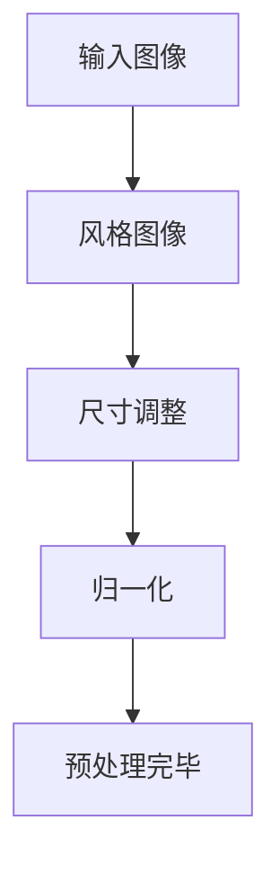
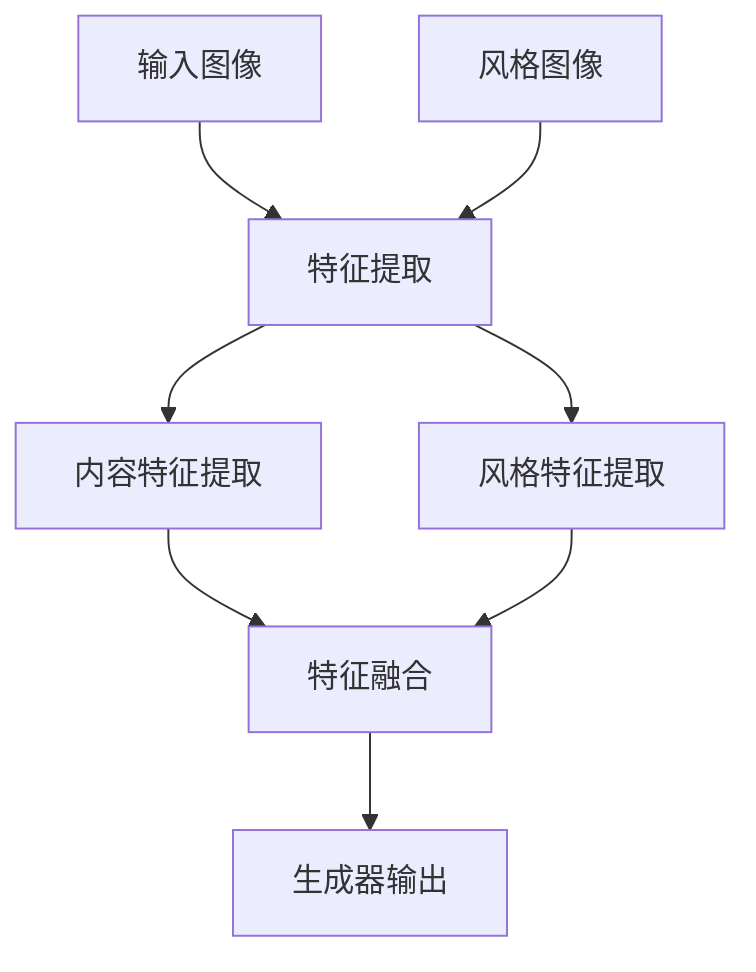
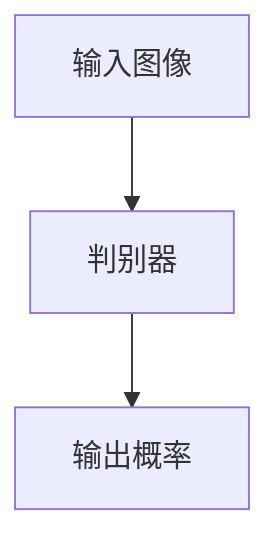
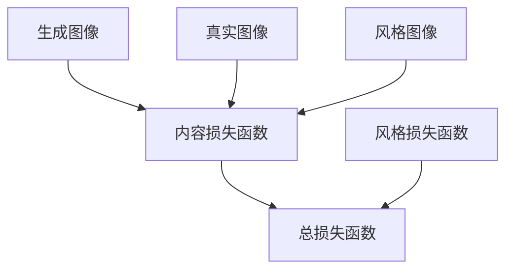
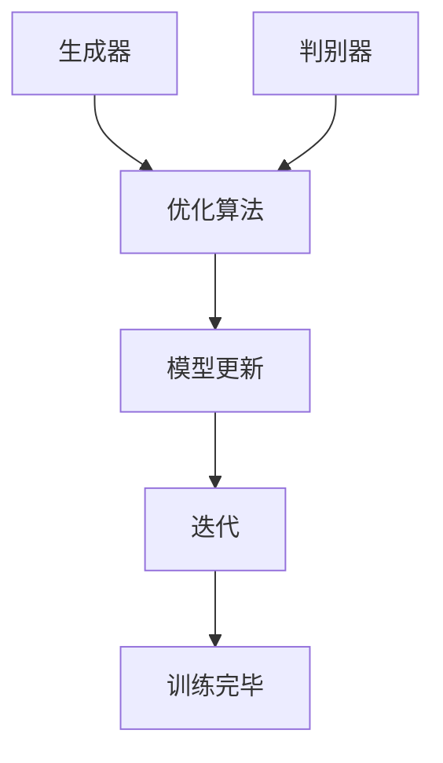

# 基于生成对抗网络的风景照片转换为油画风格的研究

作者：禅与计算机程序设计艺术 / Zen and the Art of Computer Programming

## 关键词：

生成对抗网络，风景照片，油画风格转换，图像风格迁移，深度学习

---

## 1. 背景介绍

### 1.1 问题的由来

随着深度学习技术的飞速发展，图像处理领域取得了显著的进展。图像风格迁移作为其中的一项重要任务，旨在将输入图像转换为特定的风格，如油画、水彩、素描等。风景照片转换为油画风格的研究源于人们对美好视觉效果的追求，以及计算机视觉技术在艺术创作中的应用探索。

### 1.2 研究现状

近年来，基于深度学习的图像风格迁移方法得到了广泛关注。其中，生成对抗网络（Generative Adversarial Networks，GAN）因其独特的机制，在图像风格迁移任务中表现出色。现有研究主要集中在以下几个方面：

- **GAN架构的改进**：通过设计不同的GAN架构，提高风格迁移的保真度和稳定性。
- **损失函数的优化**：设计新的损失函数，平衡图像内容与风格特征的保留。
- **训练策略的改进**：探索新的训练技巧，加快收敛速度，提高风格转换的效率。

### 1.3 研究意义

风景照片转换为油画风格的研究具有以下意义：

- **艺术创作**：为艺术家和设计师提供新的艺术创作工具，拓展艺术创作领域。
- **技术应用**：推动计算机视觉技术在图像处理、娱乐、教育等领域的应用。
- **理论研究**：为深度学习、计算机视觉等领域提供新的研究思路和方法。

### 1.4 本文结构

本文将首先介绍生成对抗网络的基本原理，然后详细阐述基于GAN的风景照片转换为油画风格的方法，接着分析算法的优缺点和适用场景，最后展望未来研究方向。

---

## 2. 核心概念与联系

### 2.1 生成对抗网络（GAN）

生成对抗网络是由两部分组成：生成器（Generator）和判别器（Discriminator）。生成器负责生成与真实数据分布相近的假数据，判别器负责判断输入数据是真实数据还是生成器生成的假数据。二者在对抗训练过程中相互竞争，最终生成器学会生成逼真的数据，判别器能够准确区分真实和假数据。

### 2.2 图像风格迁移

图像风格迁移是指将输入图像转换为特定风格的过程。这需要保留图像的内容信息，同时融入目标风格的特征。常见的风格特征包括颜色分布、纹理、线条等。

### 2.3 关联分析

生成对抗网络与图像风格迁移的联系在于，GAN可以用于生成具有特定风格特征的图像。通过设计合适的生成器和判别器，可以实现在风格迁移任务中的内容与风格的平衡。

---

## 3. 核心算法原理 & 具体操作步骤

### 3.1 算法原理概述

基于GAN的图像风格迁移算法主要包括以下几个步骤：

1. **数据预处理**：将输入图像和风格图像进行预处理，如尺寸调整、归一化等。
2. **生成器设计**：设计生成器，将内容图像和风格图像作为输入，生成具有特定风格的图像。
3. **判别器设计**：设计判别器，用于判断输入图像是真实图像还是生成器生成的假图像。
4. **损失函数设计**：设计损失函数，用于衡量生成图像与真实图像、生成图像与风格图像之间的差异。
5. **模型训练**：利用优化算法训练生成器和判别器，使得生成器生成的图像越来越逼真。

### 3.2 算法步骤详解

#### 3.2.1 数据预处理



#### 3.2.2 生成器设计



#### 3.2.3 判别器设计



#### 3.2.4 损失函数设计



#### 3.2.5 模型训练



### 3.3 算法优缺点

#### 3.3.1 优点

- **性能优异**：GAN在图像风格迁移任务中表现出色，能够生成高质量的图像。
- **灵活性**：通过调整网络结构和损失函数，可以生成不同风格的图像。
- **可解释性**：GAN的生成过程较为直观，易于理解。

#### 3.3.2 缺点

- **训练难度**：GAN的训练过程复杂，容易出现模式崩溃等问题。
- **收敛速度**：GAN的收敛速度较慢，需要大量的训练时间和计算资源。
- **模型稳定性**：在某些情况下，GAN的生成器可能会陷入局部最优，导致生成的图像质量下降。

### 3.4 算法应用领域

基于GAN的图像风格迁移算法在以下领域具有广泛的应用：

- **艺术创作**：为艺术家和设计师提供新的创作工具，拓展艺术创作领域。
- **娱乐产业**：应用于电影、游戏等娱乐产业，提高视觉效果。
- **教育领域**：应用于图像识别、图像处理等课程的教学，提高学生学习兴趣。
- **医学领域**：应用于医学图像处理，提高图像质量和诊断准确性。

---

## 4. 数学模型和公式 & 详细讲解 & 举例说明

### 4.1 数学模型构建

基于GAN的图像风格迁移算法的数学模型可以表示为：

$$\min_{G} \max_{D} V(G, D) = \mathbb{E}_{z \sim p(z)}[D(G(z)) - D(x)] + \lambda \mathbb{E}_{x, y \sim p(x, y)}[L_{content}(x, G(x, y)) + L_{style}(y, G(x, y))]$$

其中：

- $G(z)$：生成器生成的图像。
- $D(x)$：判别器判断输入图像$x$为真实图像的概率。
- $z$：生成器的噪声向量。
- $x$：输入图像。
- $y$：风格图像。
- $p(x, y)$：输入图像和风格图像的联合分布。
- $L_{content}(x, G(x, y))$：内容损失函数，用于衡量生成图像和输入图像在内容上的相似度。
- $L_{style}(y, G(x, y))$：风格损失函数，用于衡量生成图像和风格图像在风格特征上的相似度。
- $\lambda$：平衡内容损失和风格损失的权重。

### 4.2 公式推导过程

本节将简要介绍内容损失函数和风格损失函数的推导过程。

#### 4.2.1 内容损失函数

内容损失函数采用L1范数表示：

$$L_{content}(x, G(x, y)) = \frac{1}{N} \sum_{i=1}^{N} |F_x(x) - F_G(x, y)|$$

其中：

- $F_x(x)$：内容特征提取网络提取的内容特征。
- $F_G(x, y)$：生成器提取的内容特征。
- $N$：内容特征的维度。

#### 4.2.2 风格损失函数

风格损失函数采用L2范数表示：

$$L_{style}(y, G(x, y)) = \frac{1}{M} \sum_{i=1}^{M} ||F_y(y) - F_G(x, y)||^2$$

其中：

- $F_y(y)$：风格特征提取网络提取的风格特征。
- $F_G(x, y)$：生成器提取的风格特征。
- $M$：风格特征的维度。

### 4.3 案例分析与讲解

以风景照片转换为油画风格为例，说明基于GAN的图像风格迁移算法的实践过程。

#### 4.3.1 数据准备

- 输入图像：选择一幅风景照片作为输入图像。
- 风格图像：选择一幅具有油画风格的图片作为风格图像。

#### 4.3.2 模型训练

- 使用预训练的卷积神经网络（CNN）提取输入图像和风格图像的特征。
- 设计生成器和判别器，并使用上述公式训练模型。
- 在训练过程中，监控损失函数的变化，调整模型参数。

#### 4.3.3 风格迁移

使用训练好的模型将输入图像转换为油画风格。

### 4.4 常见问题解答

**问题1**：GAN的训练过程为什么容易出现模式崩溃？

**解答**：GAN的训练过程容易出现模式崩溃，原因包括：

- 判别器参数更新过快，导致生成器难以生成逼真的图像。
- 生成器和判别器的学习速率不一致，导致训练不稳定。
- 特征提取网络无法准确提取图像内容或风格特征。

**问题2**：如何提高GAN的生成图像质量？

**解答**：提高GAN生成图像质量的方法包括：

- 使用更复杂的网络结构，如增加网络层数或使用残差网络。
- 优化损失函数，平衡内容损失和风格损失。
- 使用更有效的优化算法，如Adam优化器。
- 增加训练数据量，提高模型泛化能力。

---

## 5. 项目实践：代码实例和详细解释说明

### 5.1 开发环境搭建

- 安装TensorFlow或PyTorch等深度学习框架。
- 安装必要的库，如NumPy、PIL等。

### 5.2 源代码详细实现

以下是一个基于PyTorch的简单GAN模型代码示例：

```python
import torch
import torch.nn as nn
import torch.optim as optim

# 定义生成器
class Generator(nn.Module):
    def __init__(self):
        super(Generator, self).__init__()
        # ...（网络结构定义）

    def forward(self, x):
        # ...（前向传播过程）

# 定义判别器
class Discriminator(nn.Module):
    def __init__(self):
        super(Discriminator, self).__init__()
        # ...（网络结构定义）

    def forward(self, x):
        # ...（前向传播过程）

# 训练模型
def train_model():
    # ...（数据加载、模型定义、损失函数定义、优化器定义等）

# 主程序
if __name__ == '__main__':
    train_model()
```

### 5.3 代码解读与分析

- **Generator和Discriminator类**：定义了生成器和判别器的网络结构。
- **train_model函数**：加载数据、定义模型、损失函数和优化器，然后进行模型训练。
- **主程序**：执行模型训练过程。

### 5.4 运行结果展示

训练完成后，可以使用以下代码生成具有特定风格的图像：

```python
def generate_image():
    # ...（加载模型、生成噪声、生成图像等）

if __name__ == '__main__':
    generate_image()
```

运行该程序，将生成一幅具有油画风格的风景照片。

---

## 6. 实际应用场景

### 6.1 艺术创作

基于GAN的图像风格迁移技术可以用于艺术创作领域，如绘画、设计等。艺术家可以利用该技术将真实场景转换为具有艺术效果的图像，拓展艺术创作空间。

### 6.2 娱乐产业

图像风格迁移技术在娱乐产业中具有广泛的应用，如电影、游戏、动画等。通过将场景转换为不同风格，可以丰富视觉效果，提升用户体验。

### 6.3 教育领域

图像风格迁移技术可以应用于图像识别、图像处理等课程的教学，帮助学生更好地理解和掌握相关知识。

### 6.4 医学领域

在医学领域，图像风格迁移技术可以用于图像处理，提高医学图像质量，有助于医生进行诊断和治疗。

---

## 7. 工具和资源推荐

### 7.1 学习资源推荐

- **《深度学习》**: 作者：Ian Goodfellow, Yoshua Bengio, Aaron Courville
  - 这本书详细介绍了深度学习的基础知识和实践，包括GAN的原理和实现。
- **《生成对抗网络与变分自编码器》**: 作者：Ian Goodfellow
  - 这本书详细介绍了GAN和变分自编码器（VAE）等生成模型，包括其在图像处理中的应用。

### 7.2 开发工具推荐

- **TensorFlow**: [https://www.tensorflow.org/](https://www.tensorflow.org/)
  - 一个开源的深度学习框架，支持各种深度学习模型的开发。
- **PyTorch**: [https://pytorch.org/](https://pytorch.org/)
  - 一个开源的深度学习框架，具有灵活的网络结构设计和易于使用的API。

### 7.3 相关论文推荐

- **Unpaired Image-to-Image Translation using Cycle-Consistent Adversarial Networks**: 作者：Alec Radford, Luke Metz, Soumith Chintala
- **Generative Adversarial Text to Image Synthesis**: 作者：Alec Radford, Luke Metz, Soumith Chintala
- **Unsupervised Representation Learning with Deep Convolutional Generative Adversarial Networks**: 作者：Alec Radford, Luke Metz, Soumith Chintala

### 7.4 其他资源推荐

- **GitHub**: [https://github.com/](https://github.com/)
  - 一个开源代码托管平台，可以找到许多基于GAN的图像风格迁移项目。
- **Kaggle**: [https://www.kaggle.com/](https://www.kaggle.com/)
  - 一个数据科学竞赛平台，提供了许多图像风格迁移相关的比赛和数据集。

---

## 8. 总结：未来发展趋势与挑战

基于生成对抗网络的风景照片转换为油画风格的研究在图像处理领域具有广泛的应用前景。未来发展趋势如下：

- **模型性能提升**：通过改进网络结构和训练策略，进一步提高图像风格迁移的保真度和稳定性。
- **多模态学习**：将图像风格迁移技术扩展到其他模态，如视频、音频等。
- **边缘计算**：将图像风格迁移算法部署到边缘设备，实现实时图像风格转换。

然而，该研究也面临着一些挑战：

- **计算资源**：GAN的训练过程需要大量的计算资源，如何在有限的计算资源下进行高效训练是一个重要问题。
- **模型解释性**：GAN的内部机制较为复杂，如何提高模型的可解释性是一个挑战。
- **数据隐私**：在图像风格迁移过程中，如何保护用户隐私是一个重要问题。

总之，基于生成对抗网络的风景照片转换为油画风格的研究具有很大的研究价值和应用前景。随着技术的不断发展，相信该领域将会取得更多的突破。

---

## 9. 附录：常见问题与解答

### 9.1 什么是生成对抗网络（GAN）？

生成对抗网络是一种深度学习模型，由生成器和判别器两部分组成。生成器负责生成假数据，判别器负责判断输入数据是真实数据还是假数据。二者在对抗训练过程中相互竞争，最终生成器学会生成逼真的数据，判别器能够准确区分真实和假数据。

### 9.2 如何解决GAN训练过程中的模式崩溃问题？

解决GAN训练过程中的模式崩溃问题可以从以下几个方面入手：

- **调整学习率**：适当调整生成器和判别器的学习率，避免学习率过大导致生成器生成过于简单的图像。
- **增加数据量**：增加训练数据量，提高模型的泛化能力。
- **使用预训练模型**：使用预训练模型初始化生成器和判别器，提高模型性能。

### 9.3 如何提高图像风格迁移的保真度？

提高图像风格迁移的保真度可以从以下几个方面入手：

- **优化网络结构**：使用更复杂的网络结构，如残差网络，提高特征提取能力。
- **优化损失函数**：设计合适的损失函数，平衡内容损失和风格损失。
- **使用预训练模型**：使用预训练模型初始化生成器和判别器，提高模型性能。

### 9.4 如何将图像风格迁移技术应用于其他领域？

将图像风格迁移技术应用于其他领域的方法如下：

- **改进网络结构**：根据不同领域的需求，设计合适的网络结构。
- **优化损失函数**：根据不同领域的特点，设计合适的损失函数。
- **数据预处理**：根据不同领域的特点，对输入数据进行预处理。

通过以上方法，可以将图像风格迁移技术应用于其他领域，如图像去噪、图像修复、图像超分辨率等。