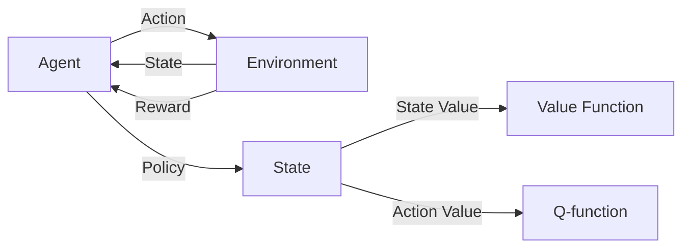

# 增强学习 原理与代码实例讲解

作者：禅与计算机程序设计艺术 / Zen and the Art of Computer Programming

## 1. 背景介绍

### 1.1 问题的由来

在人工智能领域,如何让机器具备自主学习和决策的能力一直是一个核心问题。传统的监督学习和非监督学习方法在解决许多实际问题时都面临着一定的局限性。而增强学习(Reinforcement Learning, RL)作为一种全新的机器学习范式,为这一难题提供了突破口。

增强学习源于心理学中的"强化"概念,即通过奖励和惩罚来影响主体的行为。这一思想在上世纪80年代被引入到机器学习中,并逐渐发展成为一个热门的研究方向。尤其是近年来,随着深度学习的兴起,深度增强学习(Deep Reinforcement Learning, DRL)取得了一系列令人瞩目的成果,如AlphaGo击败人类围棋冠军,OpenAI Five战胜人类DOTA2选手等,展现了增强学习在复杂决策问题上的巨大潜力。

### 1.2 研究现状

目前,增强学习已经成为人工智能领域最活跃的研究方向之一。学术界和工业界都在积极探索增强学习的理论基础和应用前景。一方面,研究人员不断改进和创新增强学习算法,提出了一系列经典算法如Q-learning、Sarsa、DQN、A3C、PPO、DDPG等,极大地推动了增强学习的发展。另一方面,增强学习在机器人控制、自动驾驶、推荐系统、自然语言处理等诸多领域得到了广泛应用,取得了可喜的成果。

尽管如此,增强学习仍然面临着不少挑战。如何提高样本效率、克服稀疏奖励问题、实现多智能体协作、保证算法的稳定性和可解释性等,都是亟待攻克的难题。此外,将增强学习与其他学科如因果推理、迁移学习、元学习等结合起来,也是一个值得探索的方向。

### 1.3 研究意义

增强学习之所以受到如此多的关注,是因为它为人工智能的发展开辟了一条全新的道路。传统的机器学习主要依赖于大量的标注数据,而增强学习则允许智能体通过自主探索和试错来学习最优策略。这种学习方式更接近人类和动物的认知过程,有望帮助我们构建出真正意义上的通用人工智能。

此外,增强学习在现实世界中有着广阔的应用前景。许多复杂系统如工业控制、金融投资、智慧城市等,都可以用马尔可夫决策过程(MDP)来建模,而增强学习恰好提供了一种求解MDP的通用框架。深度增强学习更是将深度学习的强大感知能力与增强学习的决策能力结合起来,使得我们可以处理更加复杂和高维的问题。

总的来说,增强学习代表了人工智能的一个重要发展方向,对于认知科学、控制论、运筹学等多个领域都具有重要的理论和实践意义。深入研究增强学习,不仅可以促进人工智能的进步,也将为解决现实世界中的诸多挑战提供新的思路和方法。

### 1.4 本文结构

本文将全面介绍增强学习的原理和代码实现。内容安排如下:

第2部分介绍增强学习的核心概念,包括智能体、环境、状态、动作、奖励、策略、价值函数等,阐述它们之间的相互关系。

第3部分重点讲解几种经典的增强学习算法,包括Q-learning、Sarsa、DQN等,分析它们的原理、优缺点和适用场景。

第4部分介绍增强学习中的数学模型和公式,主要包括马尔可夫决策过程、贝尔曼方程、策略梯度定理等,并给出详细的推导过程和案例分析。

第5部分通过代码实例来演示如何用Python实现几种主要的增强学习算法,并详细解释关键代码的作用。

第6部分讨论增强学习的实际应用场景,包括机器人控制、游戏AI、推荐系统等,展望增强学习的未来发展方向。

第7部分推荐一些增强学习的学习资源,包括教程、书籍、论文、开发工具等。

第8部分总结全文,归纳增强学习的研究现状、发展趋势和面临的挑战,并对未来的研究方向提出展望。

第9部分列出一些常见问题,并给出详细的解答,帮助读者进一步理解增强学习的相关概念。

## 2. 核心概念与联系

增强学习涉及以下几个核心概念:

- 智能体(Agent):增强学习中的决策主体,根据观察到的环境状态采取动作,并从环境获得奖励反馈。
- 环境(Environment):智能体所处的环境,接收智能体的动作,并反馈新的状态和奖励。
- 状态(State):对环境的观察,通常用一个状态向量表示。马尔可夫性是指下一状态只取决于当前状态和动作。 
- 动作(Action):智能体在某状态下可采取的行为,影响环境的转移。
- 奖励(Reward):环境对智能体动作的即时反馈,引导智能体学习最优策略。
- 策略(Policy):将状态映射为动作的函数,决定智能体在每个状态下应该采取的动作。分为确定性策略和随机性策略。
- 状态价值函数(State Value Function):评估每个状态的长期累积奖励,反映该状态的好坏。
- 动作价值函数(Action Value Function):评估在某状态下采取某动作的长期累积奖励。

下图展示了增强学习中各个核心概念之间的相互关系:

智能体与环境不断交互,智能体根据当前状态选择动作,环境接收动作后反馈新的状态和奖励。智能体的目标是学习一个最优策略,使得长期累积奖励最大化。价值函数则用于评估每个状态或动作的长期回报,引导策略的优化。整个过程可以看作一个闭环系统,通过不断的探索和利用,智能体逐步提升自己的决策能力。

增强学习的核心就是如何权衡探索(exploration)和利用(exploitation)。探索是指尝试新的动作以发现潜在的高回报,而利用则是执行已知的最优动作以获得稳定回报。二者存在矛盾,需要合理平衡。常见的探索策略有ε-贪婪(ε-greedy)、上置信区间(UCB)等。

总的来说,增强学习通过智能体与环境的交互,以试错的方式来寻找最优决策。环境反馈的奖励信号引导智能体不断改进策略,最终实现长期回报最大化的目标。

## 3. 核心算法原理 & 具体操作步骤

### 3.1 算法原理概述

增强学习有多种经典算法,它们在原理和实现上各有特点。总的来说,可以分为以下三大类:

1. 基于价值(Value-based)的方法:通过学习价值函数来间接得到最优策略,代表算法有Q-learning、Sarsa等。

2. 基于策略(Policy-based)的方法:直接学习最优策略函数,代表算法有策略梯度(PG)、近端策略优化(PPO)等。

3. 结合价值和策略(Actor-Critic)的方法:同时学习价值函数和策略函数,互相促进,代表算法有A3C、DDPG等。

下面重点介绍几种常用的增强学习算法:

- Q-learning:一种异策略的时间差分学习算法,通过迭代更新动作价值函数Q来逼近最优Q函数,进而得到最优策略。

- Sarsa:一种同策略的时间差分学习算法,与Q-learning的区别在于动作价值函数Q的更新使用的是实际采取的下一步动作,而不是最优动作。

- DQN(Deep Q-Network):将深度神经网络引入Q-learning,用于估计高维状态空间下的Q函数,并引入了经验回放和目标网络等技巧来提高稳定性。

- Policy Gradient:基于梯度上升的策略优化方法,通过最大化目标函数(通常是期望累积奖励)来直接更新策略函数的参数。

- A3C(Asynchronous Advantage Actor-Critic):一种基于Actor-Critic框架的异步并行算法,通过多个并行的智能体同时与环境交互,实现了样本效率和训练速度的提升。

这些算法在原理上既有联系也有区别。基于价值的方法侧重于学习价值函数,然后根据价值函数来选择动作;基于策略的方法则直接学习策略函数,通过梯度上升等优化算法来更新策略参数;Actor-Critic方法则将二者结合,互相促进。从算法的角度看,又可以分为基于表格(tabular)的方法和基于函数逼近(function approximation)的方法。前者适用于状态和动作空间较小的问题,后者则通过价值网络或策略网络来处理大规模甚至连续的状态动作空间。

### 3.2 算法步骤详解

下面以Q-learning为例,详细介绍其算法步骤:

1. 初始化Q表格Q(s,a),对于所有状态动作对,令初始值为0。

2. 重复以下步骤,直到收敛: 
   
   a. 根据ε-贪婪策略,以ε的概率随机选择动作,否则选择Q值最大的动作: 
   
      $a=\begin{cases}
      random\underline{~}action()& \text{with probability} ~~\varepsilon\\ 
      \arg\max_{a}Q(s,a) & \text{otherwise}
      \end{cases}$
   
   b. 执行动作a,观察奖励r和下一状态s'。
   
   c. 根据观察到的信息,更新Q表格:
      
      $Q(s,a) \leftarrow Q(s,a)+\alpha[r+\gamma \max_{a'}Q(s',a')-Q(s,a)]$
      
      其中α是学习率,γ是折扣因子。
   
   d. 令s←s',开始下一轮迭代。

3. 输出最优策略π*:对于每个状态s,选择Q(s,a)最大的动作a作为最优动作。

可以看出,Q-learning的核心是通过不断更新Q表格来逼近最优动作价值函数Q*。Q值的更新公式可以解释为:新的Q值是老的Q值加上一个校正项,校正项由即时奖励和下一状态的最大Q值来估计。学习率α控制着更新的步长,折扣因子γ决定了未来奖励的重要程度。ε-贪婪策略在探索和利用之间进行权衡,以ε的概率随机探索,否则选择当前最优动作。

Sarsa算法与Q-learning非常类似,区别在于Q值更新时使用的是实际采取的下一步动作,而不是最优动作:

$Q(s,a) \leftarrow Q(s,a)+\alpha[r+\gamma Q(s',a')-Q(s,a)]$

其中a'是根据当前策略在s'状态实际选择的动作。

对于连续状态动作空间,Q表格难以存储,需要引入函数逼近。DQN算法就是使用深度神经网络来逼近Q函数,将状态作为网络输入,每个动作对应一个输出。网络参数通过最小化时序差分(TD)误差来更新:

$L(\theta)=\mathbb{E}[(r+\gamma \max_{a'}Q(s',a';\theta^{-})-Q(s,a;\theta))^2]$

其中θ是网络参数,θ-是目标网络参数,用于计算TD目标值以稳定训练。DQN还引入了经验回放(experience replay)机制,将历史转移数据(s,a,r,s')存入回放缓冲区,每次从中随机抽取一个批次的数据来更新网络,打破了数据的相关性。

Policy Gradient算法直接参数化策略函数π(a|s;θ),其中θ为策略参数。目标是最大化期望累积