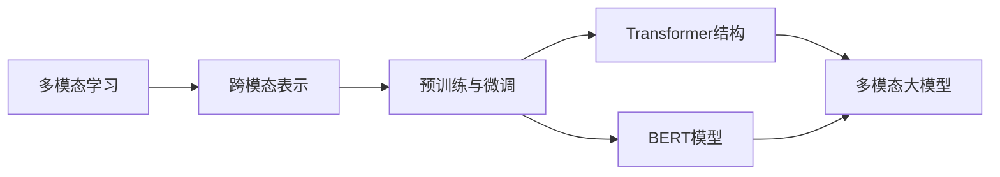

# 多模态大模型：技术原理与实战 BERT模型诞生之后行业持续摸索

关键词：多模态大模型、BERT、跨模态融合、预训练、微调、视觉语言预训练模型、跨模态对比学习、多模态Transformer

## 1. 背景介绍

### 1.1 问题的由来

随着深度学习的发展，人工智能在自然语言处理、计算机视觉等领域取得了巨大进步。然而，现实世界中的信息往往是多模态的，包括文本、图像、视频、音频等不同形式。如何有效地处理和融合这些异构数据，构建能够同时理解多种模态信息的智能系统，成为了一个亟待解决的问题。

### 1.2 研究现状

近年来，多模态学习受到了学术界和工业界的广泛关注。从早期的多模态特征融合，到后来的跨模态表示学习，再到最近的多模态预训练大模型，多模态智能技术不断取得突破。尤其是BERT等大规模语言预训练模型的出现，为多模态大模型的发展奠定了基础。

### 1.3 研究意义

多模态大模型能够同时处理和理解不同模态的信息，具有广阔的应用前景。它可以用于图像描述、视频问答、跨模态检索等任务，为构建更加智能、全面的人工智能系统提供了可能。同时，多模态大模型的研究也有助于推动人工智能在认知、推理等方面的进步，加深我们对人类智能的理解。

### 1.4 本文结构

本文将围绕多模态大模型的技术原理与实战展开讨论。首先，我们将介绍多模态大模型的核心概念与关键技术。然后，重点阐述多模态大模型的核心算法原理和具体操作步骤。接下来，我们将通过数学模型和公式，详细讲解多模态大模型的理论基础。在项目实践部分，我们将给出多模态大模型的代码实例和详细解释说明。此外，我们还将探讨多模态大模型的实际应用场景，并推荐相关的工具和资源。最后，对多模态大模型的未来发展趋势与挑战进行总结和展望。

## 2. 核心概念与联系

多模态大模型涉及了多个核心概念，包括：

1. 多模态学习：旨在处理和融合来自不同模态（如文本、图像、音频等）的信息，利用它们之间的互补性和关联性，提高模型的理解和生成能力。

2. 跨模态表示：将不同模态的数据映射到一个共享的语义空间，使它们能够以统一的方式进行表示和处理。

3. 预训练与微调：先在大规模多模态数据上进行无监督的预训练，学习通用的跨模态表示；然后针对特定任务进行微调，以提高模型的适应性和性能。

4. Transformer结构：一种基于自注意力机制的神经网络结构，能够有效地处理序列数据，并建模不同位置之间的长距离依赖关系。

5. BERT：基于Transformer的大规模语言预训练模型，通过掩码语言模型和句子关系预测任务，学习文本的上下文表示。

这些概念之间紧密相关，共同构成了多模态大模型的技术基础。多模态学习为处理不同模态信息提供了框架，跨模态表示使得不同模态数据能够在同一空间中进行交互。预训练与微调范式允许模型先学习通用知识，再适应具体任务。Transformer结构和BERT模型则为构建多模态大模型提供了强大的神经网络架构和预训练技术。

## 3. 核心算法原理 & 具体操作步骤

### 3.1 算法原理概述

多模态大模型的核心算法主要包括两个部分：跨模态表示学习和多模态融合。跨模态表示学习旨在将不同模态的数据映射到一个共享的语义空间，使它们能够以统一的方式进行表示和处理。多模态融合则利用不同模态之间的互补性和关联性，综合利用多模态信息，提高模型的理解和生成能力。

### 3.2 算法步骤详解

1. 跨模态表示学习：
   - 对每个模态的数据进行特征提取，得到初始的模态特征表示。
   - 使用Transformer编码器或其他神经网络结构，将模态特征映射到共享的语义空间。
   - 引入跨模态对比学习目标，最大化不同模态之间的互信息，使得相关的跨模态样本在共享空间中的表示更加接近。

2. 多模态融合：
   - 将不同模态的表示进行拼接、注意力融合等操作，得到多模态的联合表示。
   - 使用Transformer解码器或其他生成式模型，根据多模态联合表示生成目标输出（如文本描述、问题答案等）。
   - 引入多模态对齐损失，鼓励生成的输出与不同模态的输入在语义上保持一致性。

3. 预训练与微调：
   - 在大规模多模态数据集上进行无监督的预训练，优化跨模态表示学习和多模态融合的目标函数。
   - 针对特定任务，使用预训练得到的多模态大模型作为初始化，在任务特定的数据集上进行微调。
   - 微调过程中，根据任务的需求，可以选择冻结部分模型参数，或者对整个模型进行端到端的微调。

### 3.3 算法优缺点

优点：
- 能够有效地处理和融合不同模态的信息，提高模型的理解和生成能力。
- 通过预训练学习通用的跨模态表示，可以减少对任务特定数据的依赖，提高模型的泛化能力。
- 基于Transformer结构，能够建模不同位置之间的长距离依赖关系，捕捉跨模态信息之间的关联性。

缺点：
- 模型参数量大，训练和推理的计算开销较高，对硬件资源要求较高。
- 需要大规模的多模态数据进行预训练，数据的质量和多样性对模型性能有重要影响。
- 不同模态之间的语义对齐和互补性建模仍然具有挑战性，需要更多的研究探索。

### 3.4 算法应用领域

多模态大模型可以应用于多个领域，包括：
- 图像描述：根据图像生成自然语言描述。
- 视频问答：根据视频内容回答自然语言问题。
- 跨模态检索：根据一种模态的查询（如文本），检索相关的另一种模态的数据（如图像）。
- 多模态对话：根据多模态信息（如文本、图像、语音等）进行对话交互。
- 多模态内容生成：根据多模态输入，生成新的多模态内容（如图文生成、音乐生成等）。

## 4. 数学模型和公式 & 详细讲解 & 举例说明

### 4.1 数学模型构建

多模态大模型的数学模型可以用以下公式来表示：

$$\mathbf{z}_i = f_i(\mathbf{x}_i; \theta_i), i \in \{1, 2, ..., M\}$$

$$\mathbf{h} = g(\mathbf{z}_1, \mathbf{z}_2, ..., \mathbf{z}_M; \phi)$$

$$\mathbf{y} = d(\mathbf{h}; \psi)$$

其中，$\mathbf{x}_i$表示第$i$种模态的输入数据，$f_i$表示第$i$种模态的特征提取器，$\theta_i$为其参数。$\mathbf{z}_i$表示第$i$种模态提取得到的特征表示。$g$表示多模态融合器，$\phi$为其参数，将不同模态的特征表示$\mathbf{z}_i$融合为联合表示$\mathbf{h}$。$d$表示解码器，$\psi$为其参数，根据联合表示$\mathbf{h}$生成最终的输出$\mathbf{y}$。$M$表示模态的数量。

### 4.2 公式推导过程

1. 跨模态表示学习的目标函数可以表示为：

$$\mathcal{L}_{repr} = \sum_{i=1}^M \sum_{j=1, j \neq i}^M \mathbb{E}_{(\mathbf{x}_i, \mathbf{x}_j) \sim \mathcal{D}} [\log \frac{\exp(\text{sim}(\mathbf{z}_i, \mathbf{z}_j) / \tau)}{\sum_{(\mathbf{x}_i', \mathbf{x}_j') \sim \mathcal{D}'} \exp(\text{sim}(\mathbf{z}_i, \mathbf{z}_j') / \tau)}]$$

其中，$\mathcal{D}$表示多模态数据集，$\mathcal{D}'$表示负样本对，$\text{sim}$表示相似度函数（如点积），$\tau$为温度超参数。该目标函数鼓励相关的跨模态样本在共享空间中的表示更加接近。

2. 多模态融合的生成目标函数可以表示为：

$$\mathcal{L}_{gen} = \mathbb{E}_{(\mathbf{x}_1, \mathbf{x}_2, ..., \mathbf{x}_M, \mathbf{y}) \sim \mathcal{D}} [-\log p(\mathbf{y} | \mathbf{x}_1, \mathbf{x}_2, ..., \mathbf{x}_M)]$$

其中，$p(\mathbf{y} | \mathbf{x}_1, \mathbf{x}_2, ..., \mathbf{x}_M)$表示根据多模态输入生成目标输出的条件概率分布。该目标函数鼓励模型根据多模态输入生成与真实输出相似的结果。

3. 多模态对齐的目标函数可以表示为：

$$\mathcal{L}_{align} = \sum_{i=1}^M \mathbb{E}_{(\mathbf{x}_1, \mathbf{x}_2, ..., \mathbf{x}_M, \mathbf{y}) \sim \mathcal{D}} [\text{dist}(\mathbf{z}_i, \mathbf{y})]$$

其中，$\text{dist}$表示距离函数（如L2距离），用于度量生成的输出与不同模态输入在语义空间中的距离。该目标函数鼓励生成的输出与不同模态的输入在语义上保持一致性。

最终的训练目标函数可以表示为上述三个目标函数的加权和：

$$\mathcal{L} = \lambda_1 \mathcal{L}_{repr} + \lambda_2 \mathcal{L}_{gen} + \lambda_3 \mathcal{L}_{align}$$

其中，$\lambda_1$、$\lambda_2$、$\lambda_3$为平衡不同目标函数的权重超参数。

### 4.3 案例分析与讲解

以图像描述任务为例，假设我们有一张图像$\mathbf{x}_{img}$和对应的文本描述$\mathbf{y}_{text}$。我们的目标是训练一个多模态大模型，能够根据图像生成相应的文本描述。

首先，我们使用卷积神经网络（如ResNet）对图像进行特征提取，得到图像特征表示$\mathbf{z}_{img}$。然后，我们使用Transformer编码器将图像特征映射到共享的语义空间，得到跨模态表示$\mathbf{h}_{img}$。

接下来，我们使用Transformer解码器根据跨模态表示$\mathbf{h}_{img}$生成文本描述。在训练过程中，我们优化跨模态表示学习的目标函数$\mathcal{L}_{repr}$，鼓励图像特征与对应的文本描述在共享空间中的表示接近。同时，我们优化多模态融合的生成目标函数$\mathcal{L}_{gen}$，使得生成的文本描述与真实描述相似。此外，我们还优化多模态对齐的目标函数$\mathcal{L}_{align}$，确保生成的文本描述与图像在语义上保持一致性。

通过联合优化这些目标函数，多模态大模型能够学习到图像和文本之间的跨模态对应关系，并根据图像生成相应的文本描述。

### 4.4 常见问题解答

1. 问：