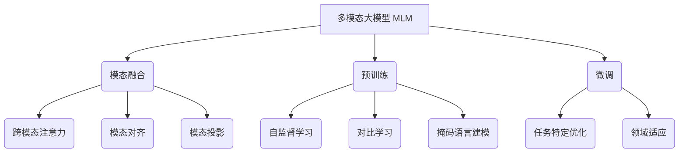
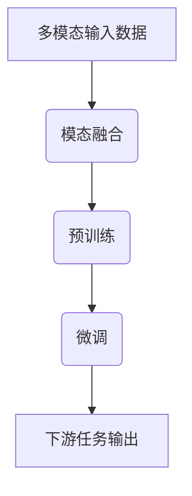

这是一个非常有趣和前沿的主题!我会尽力为您撰写一篇内容丰富、见解深刻的技术博客文章。让我们开始吧!

# 多模态大模型:技术原理与实战 中小公司的大模型构建之路

## 1. 背景介绍

### 1.1 问题的由来

在过去几年中,大型语言模型(LLM)在自然语言处理(NLP)任务中取得了令人瞩目的成就。然而,这些模型主要关注单一模态(文本)的处理,而现实世界中的数据通常包含多种模态,如图像、视频和音频等。为了更好地理解和处理这种多模态数据,研究人员提出了多模态大模型(Multimodal Large Model,MLM)的概念。

MLM旨在整合不同模态的信息,构建统一的表示和理解,从而支持更广泛的下游任务,如视觉问答、多模态对话和多模态summarization等。然而,训练这种大规模的MLM模型需要大量的计算资源、高质量的多模态数据集,以及复杂的模型架构设计,这对于中小型公司而言是一个巨大的挑战。

### 1.2 研究现状  

目前,一些科技巨头如谷歌、Meta和OpenAI等已经投入大量资源研究MLM。他们提出了一些里程碑式的模型,如谷歌的Flamingo、Meta的Data2Vec和Salesforce的CoCa等。这些模型展示了MLM在各种下游任务中的卓越表现。

然而,训练这些大型MLM模型需要大量的计算资源、高质量的多模态数据集,以及复杂的模型架构设计,这使得中小型公司难以参与其中。因此,如何在有限的资源下构建MLM,并将其应用于实际场景,成为一个亟待解决的问题。

### 1.3 研究意义

MLM的研究对于推进人工智能的发展具有重要意义:

1. **更好地理解现实世界**: 现实世界中的数据通常包含多种模态,MLM能够更好地捕捉和表示这种多模态信息,从而更好地理解现实世界。

2. **支持更广泛的下游任务**: MLM可以支持诸如视觉问答、多模态对话、多模态summarization等广泛的下游任务,扩展了AI的应用范围。

3. **推动AI民主化**: 如果中小型公司也能构建MLM,将有助于推动AI的民主化,使更多企业能够从AI中获益。

4. **促进多模态数据的利用**: MLM的发展将促进多模态数据的收集、标注和利用,推动数据基础设施的建设。

### 1.4 本文结构

本文将首先介绍MLM的核心概念和技术原理,包括模态融合、预训练和微调等关键技术。接下来,我们将详细阐述MLM的核心算法原理和数学模型,并通过案例分析加深理解。

然后,我们将分享在中小型公司环境下构建MLM的实践经验,包括开发环境搭建、代码实现、模型训练和优化等方面的技术细节。

此外,我们还将探讨MLM在各种实际应用场景中的潜力,并推荐相关的学习资源、开发工具和论文等。

最后,我们将总结MLM的研究成果,展望其未来发展趋势和面临的挑战,为读者提供全面的视角。

## 2. 核心概念与联系

在深入探讨MLM的技术细节之前,让我们先了解一些核心概念及它们之间的联系。

1. **多模态大模型(MLM)**: MLM是一种统一的模型架构,旨在同时处理多种模态数据,如文本、图像、视频和音频等。它通过模态融合、预训练和微调等技术来实现这一目标。

2. **模态融合**: 模态融合是MLM的核心技术之一,它将不同模态的数据融合到统一的表示空间中。常见的模态融合技术包括跨模态注意力、模态对齐和模态投影等。

3. **预训练**: MLM通常采用自监督学习、对比学习和掩码语言建模等预训练策略,在大规模多模态数据集上进行预训练,获得通用的多模态表示。

4. **微调**: 在预训练的基础上,MLM可以通过微调的方式,将模型适应特定的下游任务和领域,提高任务性能。微调过程包括任务特定优化和领域适应等技术。

这些核心概念相互关联、环环相扣,共同构建了MLM的技术体系。接下来,我们将详细探讨MLM的核心算法原理和数学模型。

## 3. 核心算法原理与具体操作步骤

### 3.1 算法原理概述

MLM的核心算法原理可以概括为三个关键步骤:模态融合、预训练和微调。

1. **模态融合**: MLM首先将不同模态的输入数据(如文本、图像、视频等)融合到统一的表示空间中。这一步骤通常采用跨模态注意力机制、模态对齐或模态投影等技术实现。

2. **预训练**: 在融合后的表示空间中,MLM通过自监督学习、对比学习或掩码语言建模等预训练策略,学习通用的多模态表示。预训练过程利用大规模的多模态数据集,使模型获得广泛的知识。

3. **微调**: 最后,MLM根据特定的下游任务(如视觉问答、多模态对话等),通过微调的方式对预训练模型进行进一步优化,提高任务性能。微调过程可能包括任务特定优化和领域适应等技术。

接下来,我们将详细介绍这三个步骤的具体算法和操作步骤。

### 3.2 算法步骤详解

#### 3.2.1 模态融合

模态融合是MLM的关键步骤之一,它将不同模态的输入数据融合到统一的表示空间中。常见的模态融合技术包括:

1. **跨模态注意力**

跨模态注意力机制允许不同模态之间的信息交互,从而实现模态融合。它通过计算不同模态之间的注意力权重,捕捉模态间的相关性,并生成融合后的表示。

2. **模态对齐**

模态对齐旨在将不同模态的表示映射到同一个潜在空间中。常见的方法包括对齐损失函数、对齐网络等。通过对齐,不同模态的表示变得可比较和可融合。

3. **模态投影**

模态投影将不同模态的表示投影到一个公共的子空间中,从而实现融合。投影可以通过线性映射或非线性映射实现,并通过特定的损失函数进行优化。

这些技术可以单独使用,也可以相互组合,以实现更有效的模态融合。

#### 3.2.2 预训练

在模态融合之后,MLM需要通过预训练来学习通用的多模态表示。常见的预训练策略包括:

1. **自监督学习**

自监督学习利用大规模的多模态数据集,设计特定的预测任务,如重建、对比等,从而学习通用的多模态表示。常见的自监督学习技术包括掩码语言建模、对比学习等。

2. **对比学习**

对比学习旨在将相似的样本映射到相近的表示空间,而将不相似的样本映射到远离的空间。它通过设计对比损失函数,最大化正样本对之间的相似性,最小化正负样本对之间的相似性,从而学习discriminative的表示。

3. **掩码语言建模**

掩码语言建模是自然语言处理中常用的预训练技术,它通过掩码部分输入,并要求模型预测被掩码的部分。在MLM中,这种技术可以扩展到不同的模态,如掩码图像区域、掩码视频帧等,从而学习多模态表示。

这些预训练策略可以单独使用,也可以相互组合,以充分利用大规模多模态数据,学习通用的表示。

#### 3.2.3 微调

经过预训练后,MLM需要针对特定的下游任务进行微调,以提高任务性能。常见的微调技术包括:

1. **任务特定优化**

任务特定优化旨在调整模型参数,使其更好地适应特定的下游任务。这可以通过添加任务特定的头部(head)、调整损失函数、优化超参数等方式实现。

2. **领域适应**

由于预训练数据与下游任务数据之间可能存在分布偏移,因此需要进行领域适应,使模型更好地适应目标领域的数据分布。常见的领域适应技术包括数据增强、特征对齐、模型蒸馏等。

3. **多任务学习**

在某些情况下,MLM需要同时处理多个相关的下游任务。这时可以采用多任务学习的策略,通过共享模型参数和联合优化,提高模型的泛化能力和效率。

4. **知识蒸馏**

知识蒸馏是一种模型压缩技术,它将大型教师模型的知识转移到小型学生模型中。在MLM中,可以利用知识蒸馏来压缩大型预训练模型,使其更易于部署和推理。

通过这些微调技术,MLM可以更好地适应特定的下游任务和领域,提高任务性能和泛化能力。

### 3.3 算法优缺点

MLM作为一种新兴的模型架构,具有以下优缺点:

**优点**:

1. **统一表示**: MLM能够在统一的表示空间中融合多种模态的信息,捕捉模态间的相关性,提供了更全面的理解能力。

2. **泛化能力强**: 通过在大规模多模态数据上预训练,MLM可以获得广泛的知识,具有强大的泛化能力,适用于各种下游任务。

3. **效率提升**: MLM可以在预训练的基础上进行微调,避免了从头开始训练的计算开销,提高了模型训练和推理的效率。

4. **支持多任务**: MLM的架构天然支持多任务学习,可以同时处理多个相关的下游任务,提高了模型的灵活性和效率。

**缺点**:

1. **计算资源需求高**: 训练大型MLM模型需要大量的计算资源,包括GPU、内存和存储空间,对于中小型公司而言是一个挑战。

2. **数据需求量大**: MLM需要大规模的高质量多模态数据集进行预训练,而获取和标注这些数据集是一项艰巨的任务。

3. **模型复杂度高**: MLM涉及多种模态融合、预训练和微调技术,模型架构和训练过程相对复杂,需要专业的知识和经验。

4. **可解释性差**: 由于MLM是一种端到端的黑盒模型,其内部表示和决策过程缺乏可解释性,可能会带来一定的风险和不确定性。

5. **模态偏差**: 不同模态之间可能存在数据分布和质量的差异,导致模型在某些模态上表现不佳,需要进行适当的平衡和调整。

总的来说,MLM是一种前景广阔但也充满挑战的模型架构。在实际应用中,需要权衡其优缺点,并采取适当的策略来缓解潜在的风险和限制。

### 3.4 算法应用领域

由于MLM能够同时处理多种模态的数据,因此它在以下领域具有广泛的应用前景:

1. **视觉问答(VQA)**: MLM可以融合图像和文本信息,回答与图像相关的自然语言问题,在视觉问答任务中表现出色。

2. **多模态对话系统**: MLM能够理解和生成多模态对话,如图像辅助对话、视频对话等,为人机交互提供了