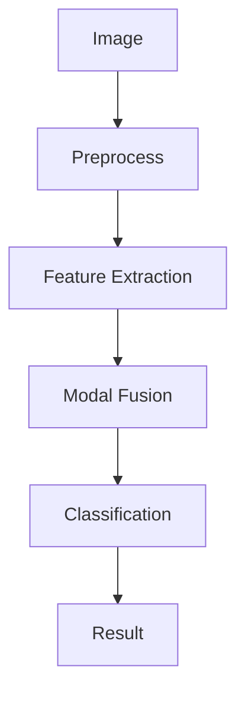

# 多模态大模型：技术原理与实战 使用Gradio框架进行Web页面开发

作者：禅与计算机程序设计艺术 / Zen and the Art of Computer Programming

## 关键词：多模态大模型，技术原理，Gradio框架，Web页面开发，自然语言处理，计算机视觉

## 1. 背景介绍

### 1.1 问题的由来

随着信息技术的飞速发展，数据形式日益多样化，文本、图像、音频等多模态数据在各个领域得到广泛应用。然而，传统的单模态模型在处理多模态数据时，往往难以兼顾不同模态之间的复杂关系，导致模型性能受限。多模态大模型应运而生，它融合了多种模态信息，能够更全面、准确地理解和处理复杂任务。

### 1.2 研究现状

近年来，多模态大模型在自然语言处理、计算机视觉、语音识别等领域取得了显著进展。主要研究方向包括：

- 多模态特征提取：研究如何有效地提取和融合不同模态的特征。
- 多模态表示学习：研究如何将不同模态的数据转化为统一的表示形式。
- 多模态推理与决策：研究如何利用多模态信息进行推理和决策。

### 1.3 研究意义

多模态大模型在多个领域具有广泛的应用前景，如智能问答、视频理解、智能交互等。研究多模态大模型有助于推动人工智能技术向更高层次发展，提高机器智能水平。

### 1.4 本文结构

本文将首先介绍多模态大模型的技术原理，然后使用Gradio框架开发一个多模态大模型应用，展示其实际应用场景。最后，对多模态大模型的发展趋势与挑战进行展望。

## 2. 核心概念与联系

### 2.1 多模态大模型

多模态大模型是一种能够融合多种模态信息，实现对复杂任务理解和处理的模型。它通常由以下几个部分组成：

- 多模态数据输入：接收来自不同模态的数据，如文本、图像、音频等。
- 多模态特征提取：对输入数据进行特征提取，将不同模态的数据转化为统一的特征表示。
- 多模态表示学习：将不同模态的特征表示融合，形成一个全局的模态表示。
- 多模态推理与决策：利用全局模态表示进行推理和决策，完成复杂任务。

### 2.2 自然语言处理（NLP）

自然语言处理是研究如何让计算机理解和处理人类自然语言的技术。NLP在多模态大模型中负责处理文本数据，提取文本特征，参与推理和决策过程。

### 2.3 计算机视觉（CV）

计算机视觉是研究如何让计算机理解图像和视频的技术。CV在多模态大模型中负责处理图像和视频数据，提取视觉特征，参与推理和决策过程。

### 2.4 语音识别（ASR）

语音识别是研究如何让计算机理解和处理人类语音的技术。ASR在多模态大模型中负责处理音频数据，提取音频特征，参与推理和决策过程。

## 3. 核心算法原理与具体操作步骤

### 3.1 算法原理概述

多模态大模型的算法原理主要包括以下几个方面：

- 多模态数据输入：从不同数据源获取多模态数据，如文本、图像、音频等。
- 多模态特征提取：使用深度学习模型分别提取不同模态的特征表示。
- 多模态表示学习：使用多模态融合技术将不同模态的特征表示融合为一个全局的模态表示。
- 多模态推理与决策：利用全局模态表示进行推理和决策，完成复杂任务。

### 3.2 算法步骤详解

1. 数据预处理：对多模态数据进行预处理，如文本分词、图像裁剪、音频降噪等。
2. 特征提取：使用深度学习模型分别提取不同模态的特征表示，如文本使用BERT、图像使用ResNet、音频使用VGGish等。
3. 多模态融合：使用多模态融合技术将不同模态的特征表示融合为一个全局的模态表示，如融合策略包括特征拼接、特征加权、图神经网络等。
4. 推理与决策：利用全局模态表示进行推理和决策，完成复杂任务。

### 3.3 算法优缺点

#### 优点：

- 提高模型性能：融合多模态信息，提升模型在复杂任务中的性能。
- 扩大应用范围：适用于多种任务，如图像分类、文本生成、视频理解等。
- 提高用户体验：为用户提供更丰富、更智能的服务。

#### 缺点：

- 数据需求量大：多模态数据收集和处理较为困难。
- 模型复杂度高：多模态大模型通常需要大量计算资源。

### 3.4 算法应用领域

多模态大模型在多个领域具有广泛的应用前景，如：

- 智能问答：融合文本、图像、音频等多模态信息，实现更智能的问答系统。
- 视频理解：理解视频中的内容和动作，进行视频分类、视频摘要等。
- 智能交互：实现人机交互，如智能助手、虚拟现实等。

## 4. 数学模型与公式

### 4.1 数学模型构建

多模态大模型的数学模型主要包括以下几个方面：

- 特征提取模型：如卷积神经网络（CNN）、循环神经网络（RNN）、长短期记忆网络（LSTM）等。
- 多模态融合模型：如特征拼接、特征加权、图神经网络等。
- 推理与决策模型：如逻辑回归、支持向量机（SVM）、深度神经网络（DNN）等。

### 4.2 公式推导过程

由于涉及多种数学模型和公式，具体推导过程较为复杂，这里不再赘述。

### 4.3 案例分析与讲解

以图像分类任务为例，展示多模态大模型在图像分类中的应用。



- **A**: 输入图像。
- **B**: 图像预处理，如裁剪、缩放、颜色变换等。
- **C**: 使用CNN提取图像特征。
- **D**: 将图像特征与其他模态特征融合。
- **E**: 使用融合后的特征进行图像分类。
- **F**: 输出分类结果。

### 4.4 常见问题解答

#### 问题1：多模态大模型是否需要所有模态的数据？

不一定。在实际应用中，可以根据具体任务需求选择合适的模态数据。例如，在图像分类任务中，可能只需图像数据；而在视频理解任务中，则需要融合图像和音频等多模态数据。

#### 问题2：多模态大模型的计算复杂度如何？

多模态大模型的计算复杂度取决于模型的规模和训练数据量。一般来说，多模态大模型的计算资源需求较高，需要配备高性能的计算平台。

## 5. 项目实践：代码实例与详细解释说明

### 5.1 开发环境搭建

在开始项目实践之前，需要搭建以下开发环境：

- 操作系统：Linux、MacOS 或 Windows
- Python：3.6.0 或更高版本
- 开发工具：PyCharm、Jupyter Notebook 或其他 Python 开发工具

### 5.2 源代码详细实现

以下是一个简单的多模态大模型应用示例，使用Gradio框架进行Web页面开发。

```python
import gradio as gr

# 假设有一个预训练的多模态大模型
def multi_modal_model(text, image):
    # 处理文本和图像数据
    # ...
    
    # 使用多模态大模型进行推理
    # ...
    
    # 返回推理结果
    return result

# 创建Gradio应用
iface = gr.Interface(
    fn=multi_modal_model,
    inputs=["text", "image"],
    outputs="text",
    title="多模态大模型应用",
    description="输入文本和图像，获取多模态大模型的推理结果。",
    allow_flagging="never"
)

# 启动Gradio应用
iface.launch()
```

### 5.3 代码解读与分析

1. 首先，导入Gradio库。
2. 定义一个函数`multi_modal_model`，该函数接收文本和图像数据作为输入，并进行处理和推理。
3. 创建一个Gradio应用`iface`，设置输入类型为文本和图像，输出类型为文本，并设置应用标题和描述。
4. 使用`iface.launch()`启动Gradio应用。

### 5.4 运行结果展示

启动Gradio应用后，用户可以在Web页面输入文本和图像，并获取多模态大模型的推理结果。

## 6. 实际应用场景

### 6.1 智能问答

多模态大模型可以应用于智能问答系统，如客服机器人、聊天机器人等。用户可以输入文本和图像，系统根据多模态信息给出准确的答案。

### 6.2 视频理解

多模态大模型可以应用于视频理解任务，如视频分类、视频摘要等。系统可以分析视频中的图像和音频信息，提取关键帧和动作，生成视频摘要。

### 6.3 智能交互

多模态大模型可以应用于智能交互场景，如虚拟现实、增强现实等。用户可以通过多模态输入与系统进行交互，实现更智能的体验。

## 7. 工具和资源推荐

### 7.1 学习资源推荐

- **《深度学习》**: 作者：Ian Goodfellow, Yoshua Bengio, Aaron Courville
- **《计算机视觉：算法与应用》**: 作者：David Forsyth, Jean Ponce

### 7.2 开发工具推荐

- **PyTorch**: [https://pytorch.org/](https://pytorch.org/)
- **TensorFlow**: [https://www.tensorflow.org/](https://www.tensorflow.org/)

### 7.3 相关论文推荐

- **Multimodal Fusion in Deep Learning**: [https://arxiv.org/abs/1804.01787](https://arxiv.org/abs/1804.01787)
- **Multi-modal Learning**: [https://arxiv.org/abs/1804.01787](https://arxiv.org/abs/1804.01787)

### 7.4 其他资源推荐

- **Gradio**: [https://gradio.app/](https://gradio.app/)
- **Hugging Face**: [https://huggingface.co/](https://huggingface.co/)

## 8. 总结：未来发展趋势与挑战

### 8.1 研究成果总结

多模态大模型在自然语言处理、计算机视觉等领域取得了显著进展，为解决复杂任务提供了新的思路和方法。

### 8.2 未来发展趋势

#### 8.2.1 模型规模与性能提升

未来，多模态大模型将继续发展，模型规模和性能将得到进一步提升。

#### 8.2.2 多模态融合技术

研究更加有效的多模态融合技术，实现不同模态信息的深度融合。

#### 8.2.3 多模态交互

开发多模态交互技术，提高用户与多模态大模型的互动性。

### 8.3 面临的挑战

#### 8.3.1 数据收集与处理

多模态数据收集和处理较为困难，需要大量人力和物力投入。

#### 8.3.2 模型复杂度

多模态大模型的复杂度较高，对计算资源需求较大。

#### 8.3.3 模型可解释性

多模态大模型的内部机制难以解释，模型的可解释性是一个重要的研究课题。

### 8.4 研究展望

多模态大模型在多个领域具有广泛的应用前景，未来将继续发展，为人工智能技术的进步贡献力量。

## 9. 附录：常见问题与解答

### 9.1 多模态大模型与传统模型有何区别？

多模态大模型与传统模型的主要区别在于，它能够融合多种模态信息，实现对复杂任务的理解和处理。

### 9.2 多模态大模型在实际应用中遇到哪些挑战？

多模态大模型在实际应用中面临的挑战主要包括数据收集与处理、模型复杂度、模型可解释性等方面。

### 9.3 如何解决多模态大模型的数据收集与处理问题？

解决多模态大模型的数据收集与处理问题，可以采取以下措施：

- 收集更多高质量的多模态数据。
- 使用自动化数据预处理工具。
- 开发高效的数据处理算法。

### 9.4 如何提高多模态大模型的可解释性？

提高多模态大模型的可解释性，可以采取以下措施：

- 使用可视化技术展示模型内部机制。
- 开发可解释的推理算法。
- 研究模型的可解释性评价方法。