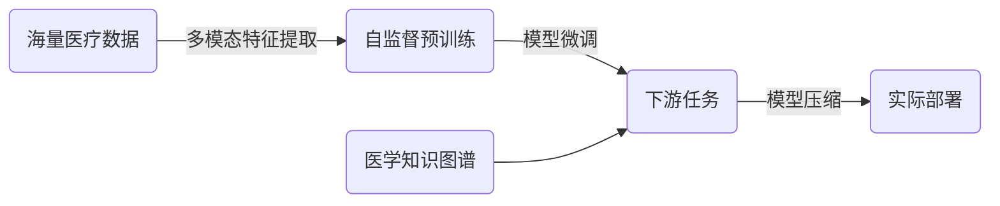

# 多模态大模型：技术原理与实战 多模态大模型在医疗健康领域中的应用

关键词：多模态大模型, 医疗健康, 自然语言处理, 计算机视觉, 深度学习, 迁移学习, 知识图谱, 医学影像分析, 电子病历分析, 智能诊断

## 1. 背景介绍
### 1.1  问题的由来
随着人工智能技术的飞速发展,特别是深度学习的兴起,多模态大模型在各个领域得到了广泛应用。医疗健康作为与人类生活息息相关的重要领域,如何利用多模态大模型的强大能力来辅助医生诊断、优化治疗方案、提高医疗服务质量,成为了亟待解决的问题。

### 1.2  研究现状
目前,国内外已有不少团队开始将多模态大模型应用到医疗健康领域。比如,谷歌的 MedPaLM 模型可以根据患者的病历、检查报告等多模态医疗数据,生成诊断报告。OpenAI 的 GPT-4 也展示了在医学问答、病例分析等任务上的出色表现。国内的腾讯觅影、百度医疗等也都推出了自己的医疗大模型。

### 1.3  研究意义
将多模态大模型应用到医疗健康领域,有望显著提高医疗诊断的效率和准确性,节省医生的时间,让医生能够专注于更需要人工干预的复杂病例。同时,这些模型还可以挖掘海量医疗数据中隐藏的关联信息,辅助药物研发、疾病预防等。提高医疗服务的可及性,让优质医疗资源惠及更多基层民众。

### 1.4  本文结构
本文将首先介绍多模态大模型的核心概念和技术原理,然后重点讲解其在医疗健康领域的典型应用,包括医学影像分析、电子病历分析、医患对话系统等。并通过实际项目案例和代码,展示如何一步步构建多模态医疗大模型。最后,探讨多模态大模型在医疗健康领域的发展趋势和面临的挑战。

## 2. 核心概念与联系
多模态大模型是指能够同时处理文本、图像、语音等不同模态数据,并在海量数据上进行预训练的大规模神经网络模型。它融合了自然语言处理(NLP)和计算机视觉(CV)等多个领域的前沿技术。以下是多模态大模型的一些核心概念:  

- 多模态学习:能够学习不同模态数据之间的联系,实现跨模态的信息交互和知识迁移。常见的多模态学习任务有图像描述、视频问答等。

- 自监督学习:不需要人工标注大量数据,而是让模型通过自己构建的 pretext 任务来自主学习,挖掘数据中的内在联系。使得模型能在海量无标注数据上进行预训练。

- 对比学习:通过最小化相似样本对的距离,最大化不同样本对的距离,来学习数据的语义表征。强化了模型的泛化和鲁棒性。

- Transformer 架构:基于自注意力机制的神经网络架构,能够高效地建模长距离依赖。被广泛用于大规模预训练模型如 BERT、GPT 等。

- 知识蒸馏:将大模型学到的知识迁移到小模型中,在保持性能的同时大幅减小模型尺寸,方便实际部署。

在医疗健康领域,多模态大模型需要处理如病历文本、医学影像、生理信号等多种模态的数据。通过自监督预训练,使模型学会医学知识;再通过迁移学习应用到下游任务。同时,引入医学知识图谱,赋予模型可解释性,提高可信度。

## 3. 核心算法原理 & 具体操作步骤
### 3.1  算法原理概述
多模态大模型的核心是自监督预训练和多模态融合。自监督预训练让模型在无监督数据上自主学习,掌握医学知识;多模态融合则融合不同模态数据的语义信息,实现协同推理。下面以 CLIP 模型为例,介绍其核心算法原理。

CLIP 由图像编码器和文本编码器组成,分别将图像和文本映射到同一语义空间,并通过对比学习最大化匹配图文对的相似度,最小化不匹配图文对的相似度。损失函数定义为:

$$
L = -\frac{1}{N} \sum_{i=1}^N \log \frac{\exp(s_{i,i}/\tau)}{\sum_{j=1}^N \exp(s_{i,j}/\tau)}
$$

其中 $s_{i,j}$ 表示第 $i$ 个图像和第 $j$ 个文本的相似度分数,$\tau$ 为温度超参数。通过这种方式,CLIP 学习到了跨模态的语义对齐表征。

### 3.2  算法步骤详解
1. 数据准备:收集大规模图文对数据,包括医学影像和对应的报告、说明等。进行必要的清洗和预处理。  

2. 图像编码器:使用 Vision Transformer 作为图像编码器,将图片分块并线性映射到 token,加上位置编码后输入到 Transformer 块中,提取图像特征。

3. 文本编码器:使用 Transformer 作为文本编码器,将文本 token 化后输入,提取文本语义特征。

4. 对比学习:将图像特征和文本特征映射到相同的维度,计算成对的图文相似度,并以此作为监督信号,通过对比学习让匹配的图文对相似度尽可能高,不匹配的尽可能低。

5. 模型微调:在下游任务数据集上微调模型,将预训练的图文表征迁移到医疗场景。可以利用少量标注数据进行监督微调,也可以继续进行自监督微调。

6. 模型评估:在医疗数据集上评估模型性能,如分类、检索、生成等任务的指标。不断迭代优化模型。

7. 部署应用:将训练好的模型部署到实际的医疗系统中,为医生诊断、患者咨询等提供辅助。

### 3.3  算法优缺点
优点:
- 通过自监督学习,减少了对大量标注数据的依赖,节省时间成本。
- 多模态融合能够从医学影像、病历等多个信息源获取线索,全面理解患者病情。
- Transformer 架构建模长距离依赖,挖掘医学数据中的深层关联。
- 对比学习获得了具有泛化性的特征表征,可以应用到不同医疗任务中。

缺点:  
- 模型参数量巨大,训练和推理成本高,给实际部署带来挑战。  
- 由于医疗数据的隐私性和专业性,高质量的医疗数据获取困难。
- 模型判断缺乏可解释性,容易产生偏差,需要引入医学知识来指导和约束。
- 不同医院的数据格式、标准不一致,影响模型的泛化和鲁棒性。

### 3.4  算法应用领域
多模态大模型可以应用到医疗健康领域的方方面面,典型应用包括:

- 医学影像分析:如 X 光、CT、核磁共振等医学图像的分类、分割、异常检测等,辅助放射科医生诊断。

- 电子病历分析:提取患者的症状、体征、检查结果等信息,自动生成诊断报告,结构化病历数据。

- 医患对话:基于医学知识和患者病历,与患者进行智能对话,提供就医指导、心理疏导等。

- 药物发现:从分子结构、药物相互作用网络等多模态数据中发现新药线索,加速药物研发进程。

- 疾病预测:整合患者多方面医疗数据,构建疾病预测模型,进行风险评估和早期预警。

此外,手术规划、健康管理、智能问诊等也都是多模态医疗大模型的潜在应用方向。

## 4. 数学模型和公式 & 详细讲解 & 举例说明
### 4.1  数学模型构建
以医学影像分类任务为例,假设有 $N$ 个训练样本 $\{(x_i, y_i)\}_{i=1}^N$,其中 $x_i$ 表示第 $i$ 个医学图像,如 X 光片,$y_i$ 表示其对应的疾病类别标签。我们希望训练一个多模态分类模型 $f_\theta(x)$,最小化样本的预测标签与真实标签间的交叉熵损失:

$$
\mathcal{L}(\theta) = -\frac{1}{N} \sum_{i=1}^N \sum_{c=1}^C y_{i,c} \log f_\theta(x_i)_c
$$

其中 $C$ 为疾病类别数,$y_{i,c}$ 为样本 $i$ 在类别 $c$ 上的真实标签(0或1),$f_\theta(x_i)_c$ 为模型在类别 $c$ 上的预测概率。

模型 $f_\theta$ 由图像编码器 $g_\phi$ 和文本编码器 $h_\psi$ 组成。图像编码器将图像 $x$ 映射为特征向量 $g_\phi(x)$,文本编码器将医学报告等文本信息 $t$ 映射为特征向量 $h_\psi(t)$。两个特征向量拼接后经过全连接层映射到疾病类别:

$$
f_\theta(x, t) = \mathrm{softmax}(W[g_\phi(x); h_\psi(t)] + b)
$$

其中 $W, b$ 为可学习参数。softmax 函数将输出转化为概率分布。

### 4.2  公式推导过程
对损失函数 $\mathcal{L}(\theta)$ 求梯度,并用梯度下降法更新参数 $\theta=\{\phi, \psi, W, b\}$:

$$
\nabla_\theta \mathcal{L}(\theta) = -\frac{1}{N} \sum_{i=1}^N \sum_{c=1}^C y_{i,c} \nabla_\theta \log f_\theta(x_i, t_i)_c
$$

将 $f_\theta$ 展开可得:

$$
\begin{aligned}
\nabla_\theta \log f_\theta(x_i, t_i)_c &= \nabla_\theta \log \mathrm{softmax}(W[g_\phi(x_i); h_\psi(t_i)] + b)_c \\
&= \nabla_\theta \log \frac{\exp(w_c^T[g_\phi(x_i); h_\psi(t_i)] + b_c)}{\sum_{j=1}^C \exp(w_j^T[g_\phi(x_i); h_\psi(t_i)] + b_j)} \\
&= [g_\phi(x_i); h_\psi(t_i)] - \sum_{j=1}^C f_\theta(x_i, t_i)_j [g_\phi(x_i); h_\psi(t_i)] \\
&= [g_\phi(x_i); h_\psi(t_i)] (1 - \sum_{j=1}^C f_\theta(x_i, t_i)_j) \\
&= [g_\phi(x_i); h_\psi(t_i)] (1 - 1) = 0
\end{aligned}
$$

可见 $W,b$ 的梯度为 $f_\theta(x_i, t_i) - y_i$。而 $\phi,\psi$ 的梯度需要进一步通过链式法则求解,这里不再展开。

### 4.3  案例分析与讲解
以肺炎 X 光片分类为例。假设我们收集了大量肺部 X 光片,以及对应的诊断报告。先在这些数据上预训练多模态模型,学习 X 光片与诊断报告间的对应关系。然后在肺炎分类数据集上微调模型。

前向传播时,将 X 光片输入到图像编码器,提取视觉特征;将诊断报告输入到文本编码器,提取文本语义特征。两个特征拼接后经过全连接层,输出肺炎的概率。反向传播时,根据预测