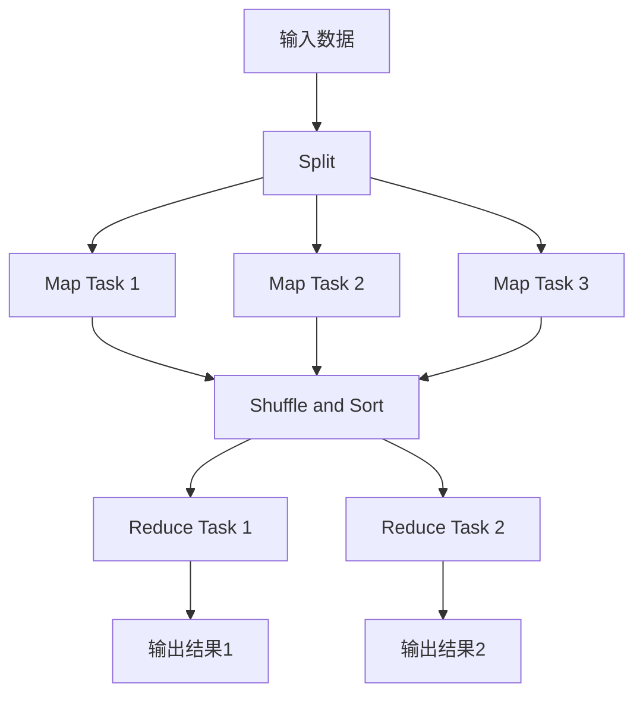
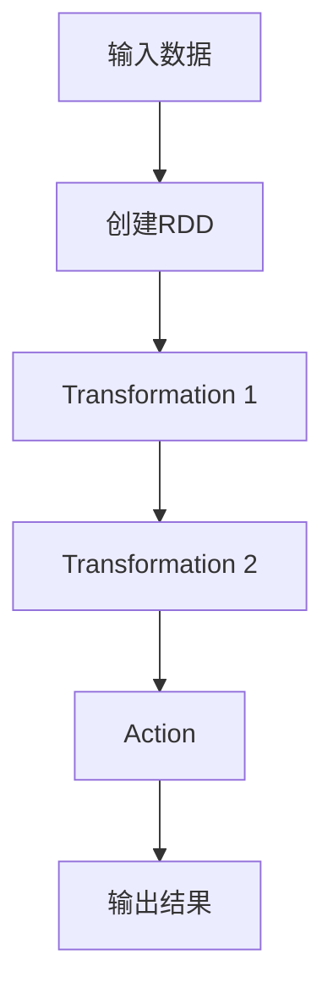
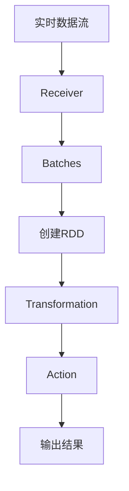
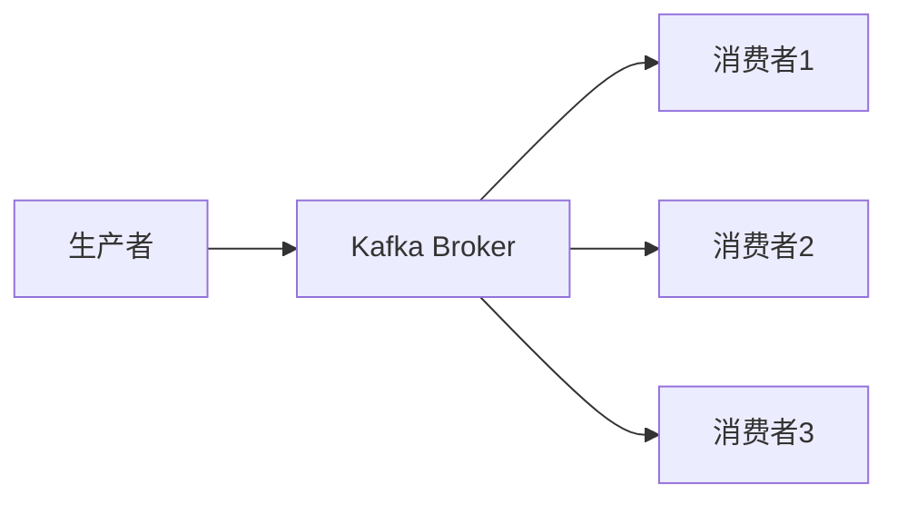

# 大数据架构原理与代码实例讲解

## 1. 背景介绍

### 1.1 问题的由来

在当今时代，数据正以前所未有的规模和速度产生。从社交媒体平台到物联网设备,再到企业内部系统,海量的结构化和非结构化数据不断涌现。这种大规模的数据爆炸给传统数据处理系统带来了巨大挑战,迫使我们重新思考如何高效地存储、处理和分析这些大数据。

### 1.2 研究现状

为了应对大数据挑战,近年来出现了一系列新兴的大数据技术和架构,如Hadoop、Spark、Kafka等。这些技术旨在提供可扩展、高性能和容错的数据处理能力。然而,构建一个高效的大数据架构并非易事,需要深入理解底层原理,并结合实际场景进行优化和调整。

### 1.3 研究意义

掌握大数据架构原理对于企业和组织来说意义重大。一个优秀的大数据架构不仅能够处理海量数据,还能够从中提取有价值的洞见,为业务决策提供支持。同时,通过代码实例的讲解,可以帮助开发人员更好地理解和实现大数据架构。

### 1.4 本文结构

本文将从以下几个方面深入探讨大数据架构原理与代码实例:

1. 核心概念与联系
2. 核心算法原理与具体操作步骤
3. 数学模型和公式详细讲解与举例说明
4. 项目实践:代码实例和详细解释说明
5. 实际应用场景
6. 工具和资源推荐
7. 总结:未来发展趋势与挑战
8. 附录:常见问题与解答

## 2. 核心概念与联系

在深入探讨大数据架构之前,我们需要了解一些核心概念及它们之间的联系。

### 2.1 大数据的3V特征

大数据通常被描述为具有3V特征:

1. **Volume(大量)**: 指数据量巨大,远远超出传统数据库系统的处理能力。
2. **Velocity(高速)**: 指数据产生和需要处理的速度非常快,需要实时或近实时的处理能力。
3. **Variety(多样)**: 指数据种类繁多,包括结构化数据(如数据库中的表格数据)和非结构化数据(如文本、图像、视频等)。

后来,又增加了另外两个V:

4. **Veracity(真实性)**: 指数据的质量和可信度,需要对数据进行清洗和验证。
5. **Value(价值)**: 指从海量数据中提取出有价值的信息和知识。

### 2.2 大数据处理的核心挑战

面对大数据,传统的数据处理系统面临着以下核心挑战:

1. **数据存储**: 如何高效地存储海量数据,并提供快速访问?
2. **数据处理**: 如何并行处理大规模数据,提高计算效率?
3. **容错性**: 如何确保系统在硬件故障或软件错误时仍能可靠运行?
4. **可扩展性**: 如何轻松扩展系统,以满足不断增长的数据和计算需求?

### 2.3 大数据架构的核心组件

为了解决上述挑战,大数据架构通常包括以下核心组件:

1. **分布式文件系统(Distributed File System, DFS)**: 用于存储和管理海量数据,如Hadoop分布式文件系统(HDFS)。
2. **资源管理和调度(Resource Management and Scheduling)**: 用于管理和调度计算资源,如Hadoop的YARN。
3. **数据处理框架(Data Processing Frameworks)**: 用于并行处理大规模数据,如MapReduce、Spark等。
4. **数据存储(Data Storage)**: 用于存储和管理结构化和非结构化数据,如HBase、Cassandra等。
5. **数据集成(Data Integration)**: 用于从各种数据源收集和整合数据,如Kafka、Flume等。
6. **数据分析(Data Analytics)**: 用于对数据进行分析和挖掘,如Hive、Spark SQL等。

这些组件通常协同工作,构建出一个完整的大数据架构。

### 2.4 大数据架构的关键原则

设计和实现大数据架构时,需要遵循以下几个关键原则:

1. **水平可扩展性(Horizontal Scalability)**: 通过添加更多计算节点来扩展系统的计算能力,而不是依赖于单台高性能机器。
2. **容错性(Fault Tolerance)**: 系统应该能够自动检测和容忍硬件或软件故障,确保数据的可靠性和可用性。
3. **数据locality(Data Locality)**: 尽量将计算任务调度到存储数据的节点上,以减少数据传输开销。
4. **批处理与流处理(Batch Processing and Stream Processing)**: 支持批量处理历史数据和实时处理流数据。

## 3. 核心算法原理与具体操作步骤

### 3.1 算法原理概述

大数据架构中的核心算法主要包括以下几种:

1. **MapReduce**: 一种并行处理大规模数据的编程模型,由Map和Reduce两个阶段组成。
2. **Spark RDD**: Spark中的弹性分布式数据集(Resilient Distributed Dataset, RDD),是一种分布式内存数据结构,支持并行操作。
3. **Spark Streaming**: Spark的流处理引擎,可以实时处理来自各种数据源的数据流。
4. **Kafka消费者-生产者模型**: Kafka采用消费者-生产者模型,用于实时数据流的收集和分发。

这些算法和模型为大数据架构提供了高效的数据处理和流处理能力。

### 3.2 算法步骤详解

#### 3.2.1 MapReduce算法

MapReduce算法由两个主要阶段组成:

1. **Map阶段**:
   - 输入数据被切分成多个数据块,并分发到不同的Map任务上。
   - 每个Map任务对分配的数据块进行处理,产生键值对形式的中间结果。

2. **Reduce阶段**:
   - 将Map阶段产生的中间结果按键进行分组和合并。
   - 每个Reduce任务处理一组键及其对应的值列表,执行用户自定义的Reduce函数。
   - 最终输出结果被写入分布式文件系统。

MapReduce算法的核心思想是将大规模数据处理任务分解成多个小任务,并行执行,最后合并结果。它具有高度的容错性和可扩展性。

#### 3.2.2 Spark RDD

Spark RDD是一种分布式内存数据结构,支持并行操作。RDD的核心操作包括:

1. **Transformation**: 对RDD进行转换操作,如map、filter、join等,产生新的RDD。
2. **Action**: 对RDD进行计算操作,如count、collect、reduce等,触发实际的计算。

Spark采用了延迟计算(Lazy Evaluation)的策略,只有在Action操作被调用时,才会真正执行计算。这种策略可以优化计算流程,提高效率。

#### 3.2.3 Spark Streaming

Spark Streaming是Spark的流处理引擎,它将实时数据流划分为一系列小批次(micro-batches),并使用Spark RDD进行处理。主要步骤如下:

1. 从数据源(如Kafka)接收实时数据流。
2. 将数据流切分成小批次,每个批次包含一定时间段内的数据。
3. 对每个批次创建RDD,并使用Spark RDD的转换和操作进行处理。
4. 输出处理结果。

Spark Streaming可以与Spark的其他组件(如Spark SQL、MLlib等)无缝集成,提供了强大的流处理能力。

#### 3.2.4 Kafka消费者-生产者模型

Kafka采用消费者-生产者模型,用于实时数据流的收集和分发。主要步骤如下:

1. **生产者(Producer)**: 向Kafka集群发送数据流。
2. **Kafka Broker**: 接收生产者发送的数据,并将其持久化到磁盘。
3. **消费者(Consumer)**: 从Kafka集群订阅和消费感兴趣的数据流。

Kafka具有高吞吐量、可扩展性强、容错性好等特点,广泛应用于大数据架构中的数据收集和分发环节。

### 3.3 算法优缺点

#### 3.3.1 MapReduce

**优点**:

- 简单易懂,易于编程和部署。
- 具有高度的容错性和可扩展性。
- 适合处理大规模批量数据。

**缺点**:

- 对于迭代计算和交互式数据分析不太适合。
- 中间结果需要写入磁盘,导致IO开销较大。
- 延迟较高,不适合低延迟的实时计算场景。

#### 3.3.2 Spark RDD

**优点**:

- 基于内存计算,性能优于MapReduce。
- 支持迭代计算和交互式数据分析。
- 提供了丰富的高级API,简化了编程。
- 支持多种数据源和多种语言。

**缺点**:

- 对于小规模数据,内存开销可能较大。
- 容错机制相对复杂,需要进行checkpoint等操作。
- 对于流式计算,需要结合Spark Streaming使用。

#### 3.3.3 Spark Streaming

**优点**:

- 低延迟,能够近实时处理数据流。
- 与Spark核心引擎无缝集成,可以复用RDD的API和功能。
- 支持容错和状态管理,确保数据可靠性。
- 支持多种数据源和多种语言。

**缺点**:

- 对于低延迟的场景,微批处理可能还不够实时。
- 需要合理设置批次间隔,以平衡延迟和吞吐量。
- 对于有状态的流式计算,编程模型相对复杂。

#### 3.3.4 Kafka消费者-生产者模型

**优点**:

- 高吞吐量,能够处理大规模的数据流。
- 容错性好,消费者可以从任意位置继续消费数据。
- 支持水平扩展,可以通过添加更多Broker来扩展。
- 支持多种编程语言和数据格式。

**缺点**:

- 不提供数据处理能力,需要与其他大数据框架(如Spark Streaming)结合使用。
- 配置和管理相对复杂,需要合理设置分区、副本等参数。
- 对于低延迟的场景,可能不太适合。

### 3.4 算法应用领域

上述算法和模型在大数据架构中有广泛的应用场景,包括但不限于:

- **数据处理和分析**: MapReduce和Spark RDD可用于处理和分析大规模数据集,如网络日志分析、用户行为分析等。
- **实时数据处理**: Spark Streaming和Kafka可用于实时处理数据流,如实时监控、实时推荐系统等。
- **数据集成和ETL**: Kafka可用于从各种数据源收集和整合数据,并将其传输到下游系统进行进一步处理。
- **机器学习和人工智能**: Spark MLlib和其他机器学习框架可以与Spark RDD和Spark Streaming集成,用于构建大规模机器学习和人工智能应用程序。

## 4. 数学模型和公式详细讲解与举例说明

在大数据架构中,数学模型和公式扮演着重要的角色,用于描述和优化各种