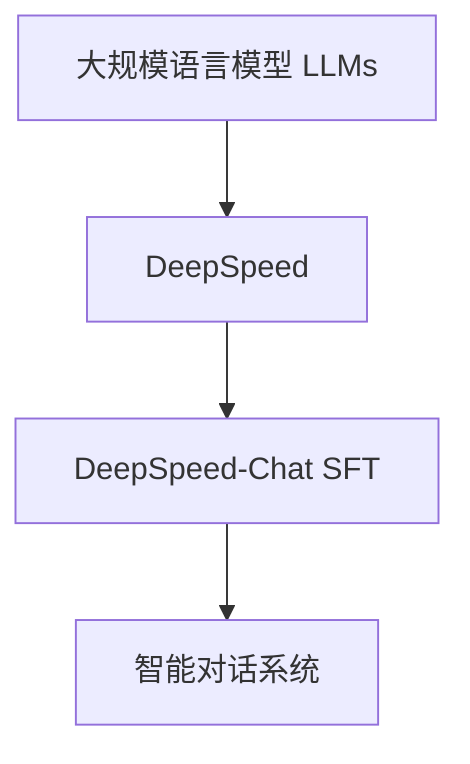
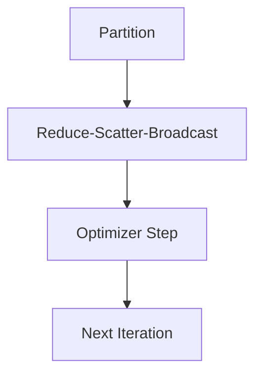
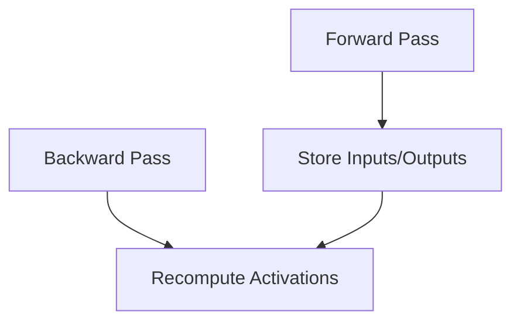

# 大规模语言模型从理论到实践 DeepSpeed-Chat SFT实践

## 1. 背景介绍

### 1.1 问题的由来

在过去几年中,大规模语言模型(Large Language Models, LLMs)取得了令人瞩目的进展,展现出惊人的自然语言处理能力。这些模型通过在海量文本数据上进行预训练,学习到了丰富的语言知识和上下文相关性,从而能够生成高质量、连贯的文本输出。

然而,训练这种规模的模型需要消耗大量的计算资源,对硬件和基础设施提出了极高的要求。传统的训练方式很难满足如此庞大的计算需求,这就催生了高效分布式训练系统的需求。DeepSpeed是由微软推出的一款用于训练大规模模型的系统,它通过优化内存利用、加速计算和提高通信效率,大幅提升了模型训练的效率和可扩展性。

### 1.2 研究现状

目前,DeepSpeed已被广泛应用于各种大规模语言模型的训练,包括GPT-3、Megatron-LM、OPT等知名模型。通过DeepSpeed的优化,研究人员能够在相对有限的硬件资源上训练出具有数十亿甚至上百亿参数的巨型模型。

除了提升训练效率,DeepSpeed还支持多种并行化策略,如数据并行、管道并行和张量并行等,使得训练任务能够在多个GPU或TPU设备之间高效分布。此外,DeepSpeed还集成了多种优化技术,如梯度压缩、激活重计算和缓存等,进一步提高了内存利用率和计算效率。

### 1.3 研究意义

虽然DeepSpeed已取得了卓越的成就,但随着模型规模的不断扩大,以及新硬件和新应用场景的出现,DeepSpeed仍然面临着一些挑战和发展机遇。例如,如何更好地利用异构硬件加速训练?如何在保证精度的同时进一步压缩模型?如何将训练好的大规模模型应用到更多的下游任务中?这些都是值得深入探讨的重要课题。

本文将全面介绍DeepSpeed在大规模语言模型训练中的应用实践,包括其核心概念、算法原理、数学模型、代码实现等内容。通过理论和实践相结合的方式,读者能够深入理解DeepSpeed的工作机制,掌握其使用方法,并了解相关的前沿研究进展。

### 1.4 本文结构

本文共分为9个部分:

1. 背景介绍:阐述研究的背景和意义。
2. 核心概念与联系:介绍DeepSpeed的核心概念及其相互关系。
3. 核心算法原理与具体操作步骤:深入探讨DeepSpeed的算法原理和实现细节。
4. 数学模型和公式详细讲解与举例说明:对DeepSpeed使用的数学模型进行严格推导和案例分析。
5. 项目实践:代码实例和详细解释说明:提供DeepSpeed的代码实现示例及解读。
6. 实际应用场景:介绍DeepSpeed在实际场景中的应用。
7. 工具和资源推荐:推荐DeepSpeed相关的学习资源、开发工具和论文等。
8. 总结:未来发展趋势与挑战:总结DeepSpeed的研究成果,并展望其未来发展方向和面临的挑战。
9. 附录:常见问题与解答:解答DeepSpeed使用过程中的常见问题。

## 2. 核心概念与联系

在深入探讨DeepSpeed的算法原理和实现细节之前,我们先介绍一些核心概念,为后续内容的理解打下基础。

### 2.1 大规模语言模型(Large Language Models, LLMs)

大规模语言模型是一种利用自然语言处理(NLP)技术训练出的巨型神经网络模型。这些模型通常包含数十亿甚至上百亿个参数,能够从海量文本数据中学习丰富的语言知识和上下文关联性。

典型的大规模语言模型架构包括Transformer、BERT、GPT等。这些模型展现出了惊人的自然语言理解和生成能力,可以应用于诸如机器翻译、文本摘要、问答系统、内容创作等多种场景。

然而,训练如此庞大的模型对计算资源的需求极为巨大,这就催生了高效分布式训练系统的需求,DeepSpeed便是为解决这一问题而诞生的。

### 2.2 DeepSpeed

DeepSpeed是微软推出的一个用于训练大规模深度学习模型的系统,它的主要目标是提高训练效率、降低内存占用,并支持分布式训练。DeepSpeed通过多种优化策略和并行化技术,使得训练任务能够高效地在多个GPU或TPU设备上进行。

DeepSpeed的核心组件包括:

- **ZeRO Optimizer**:一种内存优化技术,通过重新分配和压缩模型参数,大幅降低内存占用。
- **Distributed Training**:支持数据并行、管道并行和张量并行等多种并行化策略,实现高效的分布式训练。
- **Activation Checkpointing**:通过重新计算激活值而不是存储,进一步节省内存。
- **Gradient Compression**:压缩梯度通信,减少通信开销。

DeepSpeed已被广泛应用于训练诸如GPT-3、Megatron-LM等大规模语言模型,展现出了卓越的性能和可扩展性。

### 2.3 DeepSpeed-Chat

DeepSpeed-Chat是DeepSpeed的一个重要应用案例,它利用DeepSpeed训练出了一个支持多轮对话的大规模语言模型,用于构建智能对话系统。

DeepSpeed-Chat的核心是一种叫做Sequence Function Transfer(SFT)的训练范式。SFT通过设计特殊的提示(Prompt)和反馈(Feedback),引导语言模型学习到执行特定任务所需的功能,从而实现了从大规模预训练模型到特定任务的高效转移。

在DeepSpeed-Chat中,SFT被用于训练模型进行多轮对话,模型能够根据对话历史和上下文生成自然、连贯的回复。这种基于SFT的训练方式大幅降低了数据标注的成本,同时保持了模型的泛化能力。

DeepSpeed-Chat展示了DeepSpeed在实际应用中的强大潜力,为构建更智能、更自然的对话系统提供了有力支持。

### 2.4 核心概念关系

上述三个核心概念相互关联、环环相扣:

- 大规模语言模型是DeepSpeed所要高效训练的目标模型。
- DeepSpeed提供了一系列优化技术和并行化策略,使得训练大规模模型成为可能。
- DeepSpeed-Chat则是DeepSpeed在实际应用中的一个重要案例,它利用DeepSpeed训练出支持多轮对话的大规模模型。

三者的关系如下所示:

总的来说,DeepSpeed为高效训练大规模语言模型提供了强有力的支持,而DeepSpeed-Chat则展示了DeepSpeed在实际应用中的巨大潜力。接下来,我们将深入探讨DeepSpeed的核心算法原理和实现细节。

## 3. 核心算法原理与具体操作步骤

### 3.1 算法原理概述

DeepSpeed的核心算法原理可以概括为三个方面:内存优化、计算加速和通信优化。

1. **内存优化**

DeepSpeed通过ZeRO Optimizer和Activation Checkpointing等技术,极大地降低了模型训练所需的内存占用。这使得我们能够在有限的硬件资源上训练出大规模的模型。

2. **计算加速**

DeepSpeed支持多种并行化策略,如数据并行、管道并行和张量并行等,将训练任务分布到多个GPU或TPU设备上,从而加速计算。

3. **通信优化**

DeepSpeed采用了梯度压缩等技术,降低了分布式训练中的通信开销,提高了通信效率。

接下来,我们将详细介绍DeepSpeed在这三个方面的具体算法实现。

### 3.2 算法步骤详解

#### 3.2.1 ZeRO Optimizer

ZeRO(Zero Redundancy Optimizer)是DeepSpeed的核心内存优化技术。它的基本思想是将模型参数和优化器状态分散到多个GPU上,从而降低每个GPU所需的内存占用。

ZeRO分为三个阶段:

1. **Partition**:将模型参数和优化器状态划分到不同的GPU上。
2. **Reduce-Scatter-Broadcast**:在前向传播时,将参数广播到所有GPU;在反向传播时,将梯度在GPU之间进行归约(Reduce)和分散(Scatter)。
3. **Optimizer Step**:在每个GPU上更新相应的参数分区。

ZeRO的工作流程如下所示:

通过这种分布式的方式,ZeRO能够将模型参数和优化器状态均匀地分散到多个GPU上,从而降低每个GPU的内存需求。

#### 3.2.2 Activation Checkpointing

Activation Checkpointing是另一种节省内存的技术。在深度神经网络的前向传播过程中,中间层的激活值(Activations)需要被存储,以便在反向传播时重构计算图。但是,对于大型模型,这些激活值会占用大量内存。

Activation Checkpointing的思路是:在反向传播时,不存储激活值,而是重新计算它们。这样虽然增加了计算量,但能够极大地节省内存开销。

Activation Checkpointing的步骤如下:

1. 将模型分成多个段(Segment)。
2. 在前向传播时,只存储每个段的输入和输出。
3. 在反向传播时,根据存储的输入和输出,重新计算每个段的激活值。

Activation Checkpointing的工作流程图:

通过重新计算而不是存储激活值,Activation Checkpointing能够在牺牲一定计算量的情况下,极大地节省内存开销。

#### 3.2.3 并行化策略

为了进一步提高计算效率,DeepSpeed支持多种并行化策略,将训练任务分布到多个GPU或TPU设备上。主要包括以下三种:

1. **数据并行(Data Parallelism)**

将输入数据分批(Batch)分发到不同的设备上进行并行计算。这是最常见的并行化方式。

2. **管道并行(Pipeline Parallelism)**

将模型分成多个阶段,每个阶段由不同的设备执行。输入数据通过"管道"的方式在不同阶段之间传递。这种方式适用于内存占用较大的模型。

3. **张量并行(Tensor Parallelism)**

将模型的张量(如权重矩阵)分割到不同的设备上。每个设备只需要处理一部分张量,从而降低了内存需求。

DeepSpeed能够自动化地实现上述并行化策略,并支持它们的组合使用,从而最大化利用硬件资源,提高训练效率。

#### 3.2.4 梯度压缩

在分布式训练中,不同设备之间需要频繁地交换梯度信息,这会产生大量的通信开销。为了减少通信量,DeepSpeed采用了梯度压缩(Gradient Compression)技术。

常见的梯度压缩方法包括:

1. **FP16压缩**:将32位浮点数压缩为16位浮点数进行传输。
2. **梯度稀疏化**:只传输非零梯度,忽略零梯度。
3. **梯度量化**:将梯度值映射到有限的离散值上,从而降低表示所需的位数。

通过梯度压缩,DeepSpeed能够显著减少通信量,提高通信效率。

### 3.3 算法优缺点

DeepSpeed的优点主要包括:

1. **高效内存利用**:通过ZeRO Optimizer和Activation Checkpointing等技术,DeepSpeed能够在有限的内存资源上训练大规模模型。
2. **高度可扩展性**:支持多种并行化策略,能够充分利用多GPU和多TPU等硬件资源,实现高效的分