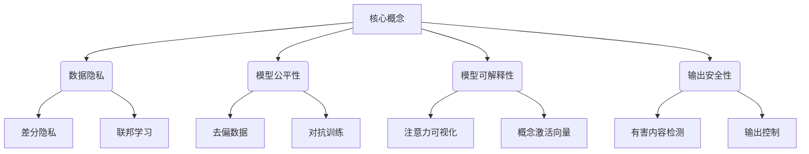

以下是标题为《大规模语言模型从理论到实践 伦理与安全》的技术博客文章正文内容：

# 大规模语言模型从理论到实践 伦理与安全

## 1. 背景介绍

### 1.1 问题的由来

近年来,大规模语言模型在自然语言处理(NLP)领域取得了令人瞩目的进展。这些模型通过在大量文本数据上进行预训练,能够捕捉语言的丰富语义和语法结构,从而在下游任务中表现出惊人的性能。然而,伴随着规模和性能的提升,大规模语言模型也带来了一些潜在的风险和挑战,尤其是在伦理和安全方面。

### 1.2 研究现状 

目前,大规模语言模型在自然语言生成、机器翻译、问答系统等领域得到了广泛应用。但同时,也存在一些值得关注的问题,如模型可能产生有偏见、不当或有害的输出内容;模型训练过程中可能存在隐私泄露风险;模型的黑箱特性导致其决策缺乏透明度和可解释性等。研究人员正在努力探索解决这些问题的方法。

### 1.3 研究意义

大规模语言模型的伦理和安全问题关乎其在实际应用中的可靠性和可信度。解决这些问题,不仅有助于提高模型的鲁棒性和可控性,还能促进人工智能技术的负责任发展,维护社会公平正义,保护个人隐私和数字安全。因此,这一领域的研究对于语言模型的健康发展至关重要。

### 1.4 本文结构

本文将从理论和实践两个层面,系统地探讨大规模语言模型在伦理和安全方面的挑战及应对策略。首先介绍相关核心概念,阐述算法原理和数学模型;接着通过实例分析和代码实现,展示具体的项目实践;最后总结未来发展趋势,并对常见问题进行解答。

## 2. 核心概念与联系

大规模语言模型在伦理和安全方面涉及以下几个核心概念:

1. **数据隐私**: 指在模型训练过程中,避免泄露个人隐私或敏感信息。常用的技术包括差分隐私和联邦学习等。
2. **模型公平性**: 指模型在处理不同人群的数据时,应保持公平公正,不产生系统性偏见。可采取去偏数据和对抗训练等方法。
3. **模型可解释性**: 指能够解释模型内部的决策过程,提高透明度和可控性。主要方法有注意力可视化和概念激活向量等。  
4. **输出安全性**: 指防止模型输出有害、不当或违法的内容,确保输出的安全性。可通过有害内容检测和输出控制等技术实现。

以上概念相互关联、环环相扣,需要在模型开发的整个生命周期中予以考虑和解决。

## 3. 核心算法原理 & 具体操作步骤

### 3.1 算法原理概述

大规模语言模型通常采用自注意力机制和Transformer架构,能够有效捕捉长距离依赖关系。其核心思想是将输入序列映射为一系列向量表示,然后通过自注意力层对这些向量进行加权组合,生成新的序列表示。经过多层堆叠后,模型可以学习到丰富的上下文信息。

此外,大规模语言模型还采用了掩码语言模型(Masked Language Model)的预训练目标,通过随机掩蔽部分词元,并让模型预测被掩蔽的词元,从而获得通用的语言表示能力。

### 3.2 算法步骤详解

大规模语言模型的训练过程可分为两个阶段:预训练和微调。

**预训练阶段**:

1. **数据预处理**: 对大规模文本语料进行标记化、词元化等预处理,构建训练数据集。
2. **掩码语言模型**: 随机选择部分词元,用特殊的[MASK]标记替换,目标是预测被掩码的词元。
3. **下一句预测**: 判断两个句子是否为连续句子,增强模型对上下文的理解能力。
4. **模型训练**: 使用上述两个预训练目标,在大规模语料上对Transformer编码器进行训练。

**微调阶段**:

5. **添加任务特定层**: 在预训练模型的基础上,根据下游任务添加特定的输出层。
6. **微调训练**: 在相应的任务数据集上对整个模型进行微调,使其适应特定的任务。

### 3.3 算法优缺点

**优点**:

- 通过预训练捕捉丰富的语言知识,能够快速适应各种下游任务。
- 自注意力机制有效捕捉长距离依赖关系,提高了语义理解能力。
- 模型规模大,参数量多,能够学习到更复杂的语言表示。

**缺点**:

- 训练和推理计算开销大,需要大量算力和内存资源。
- 由于黑箱特性,模型内部决策过程缺乏透明度和可解释性。
- 存在潜在的隐私和安全风险,如数据泄露、有害输出等。

### 3.4 算法应用领域

大规模语言模型广泛应用于自然语言处理的各个领域,主要包括:

- 文本生成: 如新闻、故事、诗歌、对话等自动生成。
- 机器翻译: 实现高质量的多语种翻译。
- 问答系统: 能够回答各种复杂问题。
- 文本摘要: 自动生成文本摘要。
- 情感分析: 识别文本中的情感倾向。
- 等等

## 4. 数学模型和公式 & 详细讲解 & 举例说明

### 4.1 数学模型构建

大规模语言模型通常采用自注意力机制对输入序列进行建模。给定输入序列 $X = (x_1, x_2, ..., x_n)$,我们首先将其映射为一系列向量表示 $\boldsymbol{h}_i = \boldsymbol{W}_e x_i + \boldsymbol{b}_e$,其中 $\boldsymbol{W}_e$ 和 $\boldsymbol{b}_e$ 分别为嵌入矩阵和偏置项。

然后,自注意力层通过计算查询(Query)、键(Key)和值(Value)之间的相似性,对这些向量进行加权组合,生成新的序列表示:

$$\text{Attention}(Q, K, V) = \text{softmax}\left(\frac{QK^T}{\sqrt{d_k}}\right)V$$

其中, $Q$、$K$、$V$ 分别为查询、键和值的线性投影,通过不同的权重矩阵 $\boldsymbol{W}_q$、$\boldsymbol{W}_k$、$\boldsymbol{W}_v$ 获得:

$$\begin{aligned}
Q &= \boldsymbol{h}_i\boldsymbol{W}_q \\
K &= \boldsymbol{h}_i\boldsymbol{W}_k \\
V &= \boldsymbol{h}_i\boldsymbol{W}_v
\end{aligned}$$

$d_k$ 为缩放因子,用于防止点积的值过大导致梯度消失。通过多头注意力机制,模型可以从不同的子空间捕捉不同的依赖关系。

最后,将注意力输出与输入向量相加,并通过前馈神经网络进行非线性变换,得到新的序列表示。通过堆叠多个这样的编码器层,模型可以学习到更高层次的语义表示。

### 4.2 公式推导过程

我们来推导自注意力层的数学表达式。首先定义查询 $Q$、键 $K$ 和值 $V$ 的线性投影:

$$\begin{aligned}
Q &= \boldsymbol{h}\boldsymbol{W}_q \\
K &= \boldsymbol{h}\boldsymbol{W}_k \\
V &= \boldsymbol{h}\boldsymbol{W}_v
\end{aligned}$$

其中, $\boldsymbol{h}$ 为输入序列的向量表示, $\boldsymbol{W}_q$、$\boldsymbol{W}_k$、$\boldsymbol{W}_v$ 为可学习的权重矩阵。

接下来,计算查询 $Q$ 与所有键 $K$ 的点积,得到一个注意力分数矩阵 $S$:

$$S = QK^T$$

为了避免点积的值过大导致梯度消失,我们对注意力分数矩阵进行缩放:

$$\tilde{S} = \frac{S}{\sqrt{d_k}}$$

其中, $d_k$ 为键向量的维度。

然后,对缩放后的注意力分数矩阵应用 softmax 函数,得到注意力权重矩阵 $A$:

$$A = \text{softmax}(\tilde{S})$$

最后,将注意力权重矩阵与值矩阵 $V$ 相乘,得到注意力输出:

$$\text{Attention}(Q, K, V) = AV$$

将上述步骤合并,我们可以得到自注意力层的完整数学表达式:

$$\text{Attention}(Q, K, V) = \text{softmax}\left(\frac{QK^T}{\sqrt{d_k}}\right)V$$

通过多头注意力机制,模型可以从不同的子空间捕捉不同的依赖关系,进一步提高表示能力。

### 4.3 案例分析与讲解

假设我们有一个输入序列 "The large language model has achieved remarkable progress in natural language processing.",让我们来分析自注意力层是如何捕捉这句话中的依赖关系的。

首先,我们将输入序列映射为一系列向量表示,例如 $\boldsymbol{h}_1$、$\boldsymbol{h}_2$、...、$\boldsymbol{h}_n$。然后,对于每个位置 $i$,我们计算其查询向量 $\boldsymbol{q}_i = \boldsymbol{h}_i\boldsymbol{W}_q$,以及所有位置的键向量 $\boldsymbol{k}_j = \boldsymbol{h}_j\boldsymbol{W}_k$ 和值向量 $\boldsymbol{v}_j = \boldsymbol{h}_j\boldsymbol{W}_v$。

接下来,计算查询向量 $\boldsymbol{q}_i$ 与所有键向量 $\boldsymbol{k}_j$ 的点积,得到注意力分数向量 $\boldsymbol{s}_i$:

$$\boldsymbol{s}_i = \boldsymbol{q}_i\boldsymbol{K}^T = [\boldsymbol{q}_i\cdot\boldsymbol{k}_1, \boldsymbol{q}_i\cdot\boldsymbol{k}_2, ..., \boldsymbol{q}_i\cdot\boldsymbol{k}_n]$$

注意力分数 $\boldsymbol{s}_{i,j} = \boldsymbol{q}_i\cdot\boldsymbol{k}_j$ 反映了位置 $i$ 对位置 $j$ 的关注程度。通过对注意力分数应用 softmax 函数,我们可以得到注意力权重向量 $\boldsymbol{a}_i$:

$$\boldsymbol{a}_i = \text{softmax}(\boldsymbol{s}_i) = [\alpha_{i,1}, \alpha_{i,2}, ..., \alpha_{i,n}]$$

其中, $\alpha_{i,j}$ 表示位置 $i$ 对位置 $j$ 的注意力权重。

最后,将注意力权重向量与值向量相乘,得到位置 $i$ 的注意力输出 $\boldsymbol{o}_i$:

$$\boldsymbol{o}_i = \sum_{j=1}^n \alpha_{i,j}\boldsymbol{v}_j$$

注意力输出 $\boldsymbol{o}_i$ 是所有位置的值向量的加权和,权重由注意力权重 $\alpha_{i,j}$ 决定。通过这种方式,自注意力层能够自适应地捕捉输入序列中的长距离依赖关系。

例如,在上述句子