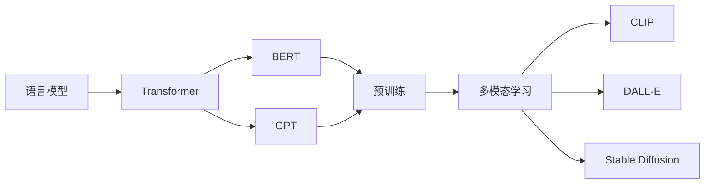

# 大规模语言模型从理论到实践 多模态大语言模型

关键词：大规模语言模型、多模态、自然语言处理、深度学习、Transformer、BERT、GPT、CLIP、Stable Diffusion、DALL-E

## 1. 背景介绍
### 1.1 问题的由来
随着人工智能技术的飞速发展,自然语言处理(NLP)领域取得了突破性的进展。其中,大规模语言模型的出现掀起了一场革命。从2018年Google推出BERT模型,到OpenAI发布GPT系列模型,再到最近火爆全网的ChatGPT,大规模语言模型展现出了惊人的自然语言理解和生成能力。而随着多模态技术的兴起,大规模语言模型也开始向多模态方向发展,实现了跨模态的信息理解和生成。这为人机交互、知识图谱构建、智能问答等应用带来了新的机遇和挑战。

### 1.2 研究现状
目前,学术界和工业界都在大规模语言模型和多模态技术上投入了大量的研究。从理论到实践,从算法到应用,涌现出许多优秀的成果。以下是一些代表性的研究工作:

- BERT[1]:由Google于2018年提出,是一种基于Transformer的双向语言表示模型。通过预训练和微调,BERT在多个NLP任务上取得了最先进的性能。

- GPT系列[2-4]:由OpenAI开发,是一种基于Transformer的自回归语言模型。从GPT到GPT-3,模型规模不断扩大,语言生成能力不断增强。GPT-3甚至展现出了令人惊叹的few-shot学习能力。

- CLIP[5]:由OpenAI提出,是一种将图像和文本对齐到同一特征空间的多模态模型。CLIP在图像-文本检索、图像分类等任务上表现出色。

- DALL-E[6]:同样由OpenAI开发,是一种文本到图像生成模型。给定文本描述,DALL-E可以生成与之匹配的高质量图像。

- Stable Diffusion[7]:由Stability AI等机构联合开发,是一种文本引导的图像生成模型。Stable Diffusion以更开放的许可发布,使得开发者和艺术家可以基于它进行二次创作。

### 1.3 研究意义
大规模语言模型和多模态技术的研究具有重要的理论和实践意义:

1. 推动人工智能基础理论研究。大规模语言模型揭示了语言的内在规律和表示方法,多模态技术探索了不同模态信息的融合机制。这些研究拓展了我们对人工智能的认知边界。

2. 促进自然语言处理技术进步。基于大规模语言模型的预训练范式极大地提升了各类NLP任务的性能,如机器翻译、情感分析、命名实体识别等。多模态技术则实现了跨模态的信息理解和生成。

3. 赋能实际应用场景。大规模语言模型和多模态技术可以应用于智能客服、知识图谱构建、虚拟助手、内容创作等领域,提高生产力,创造商业价值。

4. 引领人机交互新范式。多模态大语言模型使得人与机器可以通过更自然、更丰富的方式进行交互,如文本、语音、图像等。这将极大地改善用户体验,拓展人机协作的想象空间。

### 1.4 本文结构
本文将从理论到实践,系统地探讨大规模语言模型和多模态技术。全文分为以下几个部分:

第2部分介绍大规模语言模型和多模态技术的核心概念与联系。

第3部分详细阐述大规模语言模型的核心算法原理,包括Transformer、预训练和微调等。

第4部分建立大规模语言模型的数学模型,推导相关公式,并给出案例分析。

第5部分通过代码实例,演示如何实现和训练大规模语言模型。

第6部分讨论大规模语言模型和多模态技术的实际应用场景。

第7部分推荐相关的学习资源、开发工具和研究论文。

第8部分总结全文,展望未来发展趋势与挑战。

第9部分列出常见问题与解答。

## 2. 核心概念与联系
大规模语言模型和多模态技术涉及一系列核心概念,它们相互关联,共同构建起这一领域的理论和方法体系。

**语言模型**是一种对语言规律进行建模的方法。给定一段文本,语言模型可以计算该文本的概率分布。早期的语言模型以统计方法为主,如N-gram模型。而基于深度学习的神经语言模型,则可以学习到更加抽象和高效的语言表示。
 
**Transformer**[8]是一种基于自注意力机制的神经网络架构。不同于传统的循环神经网络(RNN)和卷积神经网络(CNN),Transformer完全依靠注意力机制来建模序列数据之间的依赖关系。Transformer包含编码器和解码器两部分,广泛应用于机器翻译、语言建模等任务。

**预训练**是一种重要的迁移学习范式。通过在大规模无标注语料上训练通用的语言表示模型,再在特定任务上进行微调,可以显著提升模型性能,减少对标注数据的依赖。BERT和GPT系列模型都采用了预训练范式。

**多模态学习**旨在处理和融合多种模态的信息,如文本、图像、语音等。多模态模型可以学习不同模态数据之间的对齐和映射关系,实现跨模态的理解和生成。多模态技术大大拓展了人工智能的应用边界。

下图展示了大规模语言模型和多模态技术的主要概念及其联系:

## 3. 核心算法原理 & 具体操作步骤
### 3.1 算法原理概述
大规模语言模型的核心算法主要基于Transformer架构和预训练范式。Transformer利用自注意力机制来建模序列数据之间的依赖关系,相比RNN和CNN,具有更强的建模能力和并行效率。预训练则在大规模无标注语料上学习通用的语言表示,再在下游任务上进行微调,可以显著提升模型性能。

### 3.2 算法步骤详解
以BERT为例,其训练过程可以分为以下步骤:

1. 语料预处理:对大规模无标注语料进行清洗、分词、编码等预处理操作,转换为模型可以接受的输入格式。

2. Masked Language Modeling(MLM):随机掩盖部分输入tokens,让模型预测被掩盖的tokens。这可以帮助模型学习到上下文信息和词汇之间的关系。

3. Next Sentence Prediction(NSP):给定两个句子,让模型预测它们是否前后相邻。这可以帮助模型学习到句子之间的逻辑关系。

4. 模型训练:使用Transformer编码器对输入进行编码,然后通过MLM和NSP两个任务的损失函数来优化模型参数。

5. 微调:在下游任务的标注数据上,通过增加特定的输出层,并微调整个模型,使其适应具体任务。

6. 推理:使用微调后的模型对新的输入进行预测和生成。

### 3.3 算法优缺点
大规模语言模型的优点包括:

1. 强大的语言理解和生成能力。通过在海量语料上的预训练,模型可以学习到丰富的语言知识和常识。

2. 减少对标注数据的依赖。预训练使得模型可以通过少量的标注数据快速适应新任务。

3. 通用性强。同一个预训练模型可以应用于多种不同的NLP任务。

但大规模语言模型也存在一些局限性:

1. 计算和存储开销大。模型训练需要大量的计算资源和时间,推理也需要较大的内存。

2. 对数据质量敏感。模型可能会放大数据中的偏见,产生不恰当的输出。

3. 可解释性差。模型的决策过程是一个黑盒,难以解释其内部机制。

### 3.4 算法应用领域
大规模语言模型可以应用于多个自然语言处理任务,如:

- 机器翻译:将一种语言的文本翻译成另一种语言。
- 文本分类:将文本划分到预定义的类别中。
- 命名实体识别:从文本中识别出人名、地名、机构名等命名实体。
- 情感分析:判断文本的情感倾向,如积极、消极、中性等。
- 问答系统:根据给定的问题,从文本中找出相应的答案。
- 文本摘要:从长文本中提取关键信息,生成简洁的摘要。

此外,大规模语言模型还可以与其他技术相结合,如知识图谱、推荐系统等,以实现更加智能化的应用。

## 4. 数学模型和公式 & 详细讲解 & 举例说明
### 4.1 数学模型构建
大规模语言模型可以用概率图模型来形式化描述。给定一个文本序列 $X=(x_1,x_2,...,x_T)$,语言模型的目标是计算该序列的概率分布 $P(X)$。根据概率链式法则,可以将联合概率分解为一系列条件概率的乘积:

$$
P(X) = P(x_1)P(x_2|x_1)P(x_3|x_1,x_2)...P(x_T|x_1,x_2,...,x_{T-1})
$$

在Transformer中,序列建模问题被转化为一系列的自注意力操作和前馈神经网络计算。

### 4.2 公式推导过程
Transformer的核心是自注意力机制,它可以计算序列中任意两个位置之间的依赖关系。对于输入序列的某个位置 $i$,自注意力的计算过程如下:

1. 将输入 $x_i$ 通过三个线性变换得到查询向量 $q_i$、键向量 $k_i$ 和值向量 $v_i$:

$$
q_i = W_q x_i, k_i = W_k x_i, v_i = W_v x_i
$$

2. 计算查询向量 $q_i$ 与所有键向量 $k_j$ 的相似度,并通过 softmax 函数归一化:

$$
\alpha_{ij} = \frac{\exp(q_i k_j^T / \sqrt{d_k})}{\sum_{j=1}^T \exp(q_i k_j^T / \sqrt{d_k})}
$$

3. 将值向量 $v_j$ 加权求和,得到位置 $i$ 的自注意力输出:

$$
z_i = \sum_{j=1}^T \alpha_{ij} v_j
$$

多头自注意力机制将上述过程独立执行多次,再将结果拼接起来,经过一个线性变换得到最终的输出。

前馈神经网络则对自注意力的输出进行非线性变换:

$$
FFN(z_i) = max(0, z_i W_1 + b_1) W_2 + b_2
$$

通过堆叠多个自注意力层和前馈神经网络层,Transformer 可以建模复杂的序列依赖关系。

### 4.3 案例分析与讲解
以情感分析任务为例,假设我们要判断一个电影评论的情感倾向。输入序列为:"This movie is amazing. The acting is superb and the plot is engaging. I highly recommend it!"

首先,将输入序列转换为向量表示,然后通过 Transformer 的编码器对其进行编码。在编码过程中,自注意力机制可以捕捉到 "amazing"、"superb"、"highly recommend" 等积极情感词汇之间的依赖关系,并将其聚合到序列表示中。

接下来,通过一个分类器(如softmax层)将序列表示映射到情感标签上。由于 Transformer 编码器已经提取了丰富的情感特征,分类器可以准确地将该评论划分为积极情感。

### 4.4 常见问题解答
Q: Transformer 相比传统的 RNN 和 CNN 有什么优势?

A: Transformer 通过自注意力机制直接建模任意两个位置之间的依赖关系,无需像