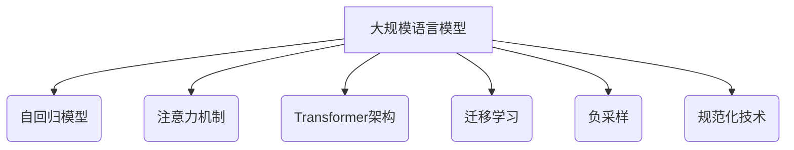
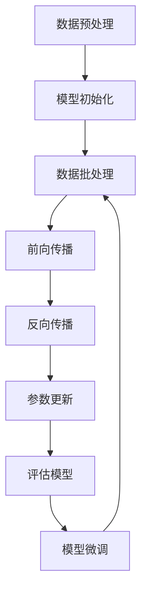

# 大规模语言模型从理论到实践：大语言模型的基本概念

## 1. 背景介绍

### 1.1 问题的由来

在过去的几年中，自然语言处理(NLP)领域取得了令人瞩目的进展,其中大规模语言模型扮演着关键角色。传统的NLP系统通常依赖于手工设计的特征和规则,这些特征和规则需要大量的人工劳动来构建。相比之下,大规模语言模型可以从大量的文本数据中自动学习语言的统计规律,从而减轻了特征工程的负担。

随着计算能力和数据可用性的不断提高,研究人员能够训练出更大更强大的语言模型。这些大规模语言模型展现出令人惊讶的性能,在广泛的自然语言处理任务中表现出色,包括机器翻译、文本生成、问答系统等。然而,大规模语言模型的内部机理仍然是一个黑盒子,我们对它们的理解仍然很有限。

### 1.2 研究现状

目前,一些顶尖的科技公司和研究机构已经开发出了一系列大规模语言模型,如OpenAI的GPT系列、Google的BERT和PaLM、DeepMind的Chinchilla等。这些模型通过在海量文本数据上进行预训练,学习到了丰富的语言知识。

虽然这些语言模型取得了令人瞩目的成就,但它们也存在一些缺陷和局限性。例如,它们可能会生成不合逻辑或有偏差的输出、缺乏一致性、存在安全隐患等。此外,训练这些大型模型需要消耗大量的计算资源,导致了高昂的能源和碳排放成本。

### 1.3 研究意义

深入理解大规模语言模型的内在机理和工作原理,对于进一步提高它们的性能、可解释性和可靠性至关重要。通过揭示模型的内部表示和决策过程,我们可以更好地诊断和缓解它们的缺陷,并为设计更加高效、鲁棒和可控的语言模型提供指导。

此外,探索大规模语言模型的理论基础也有助于推动自然语言处理领域的发展。通过建立坚实的理论框架,我们可以更好地理解语言的本质,并为开发新的NLP算法和应用提供启发。

### 1.4 本文结构

本文将从理论和实践两个角度,全面深入地探讨大规模语言模型的基本概念。我们将首先介绍语言模型的核心思想和基本原理,包括自回归模型、注意力机制等。接下来,我们将详细解释一些流行的大规模语言模型架构,如Transformer、BERT、GPT等,并分析它们的优缺点和适用场景。

此外,我们还将探讨大规模语言模型训练的关键技术,如预训练、微调、负采样等。我们将介绍一些常用的数学模型和优化算法,并通过实例和案例研究来加深理解。

最后,我们将讨论大规模语言模型在实际应用中的挑战和未来发展趋势,包括模型压缩、知识注入、可解释性等热点话题。

## 2. 核心概念与联系

大规模语言模型是一种基于深度学习的自然语言处理技术,旨在从海量文本数据中自动学习语言的统计规律和语义表示。它们通常采用自回归(Autoregressive)模型的形式,即根据前面的文本来预测下一个单词或标记的概率分布。

这种自回归模型的核心思想可以追溯到经典的n-gram语言模型,但大规模语言模型通过利用深度神经网络的强大表示能力,显著提高了模型的性能和泛化能力。

大规模语言模型的另一个关键组成部分是注意力机制(Attention Mechanism)。注意力机制允许模型在生成每个单词时,selectively关注输入序列的不同部分,从而捕捉长距离依赖关系。这使得模型能够更好地理解和生成长篇和复杂的文本。

除了自回归模型和注意力机制之外,大规模语言模型还借鉴了一些其他的核心概念和技术,如:

- **Transformer架构**: Transformer是一种全注意力的序列到序列模型,它完全摒弃了传统的RNN和CNN结构,依赖于自注意力机制来捕捉输入和输出之间的长程依赖关系。许多流行的大规模语言模型(如BERT、GPT等)都是基于Transformer架构构建的。

- **迁移学习**: 大规模语言模型通常采用两阶段训练策略。首先在大量无监督文本数据上进行预训练,学习通用的语言表示;然后在特定的下游任务上进行微调(fine-tuning),将预训练的知识迁移到目标任务。

- **负采样**: 为了提高训练效率,大规模语言模型通常采用负采样(Negative Sampling)技术,只需要预测一小部分"负样本"单词的概率,而不是计算整个词汇表上的概率分布。

- **规范化技术**: 为了提高模型的稳定性和泛化能力,大规模语言模型通常采用了一些规范化技术,如层归一化(Layer Normalization)、权重衰减(Weight Decay)等。

这些核心概念和技术相互关联、相辅相成,共同推动了大规模语言模型的发展和应用。

## 3. 核心算法原理 & 具体操作步骤

### 3.1 算法原理概述

大规模语言模型的核心算法原理是基于自回归(Autoregressive)模型,旨在学习条件概率分布$P(x_t|x_1, x_2, ..., x_{t-1})$,即给定前面的单词序列,预测下一个单词的概率。

具体来说,给定一个长度为T的文本序列$X=(x_1, x_2, ..., x_T)$,自回归模型将其概率分解为一个条件概率的乘积:

$$P(X) = \prod_{t=1}^{T}P(x_t|x_1, x_2, ..., x_{t-1})$$

通过最大化上述条件概率的对数似然函数,我们可以训练出一个能够很好地拟合数据分布的语言模型。

在实践中,我们通常使用神经网络来参数化条件概率分布$P(x_t|x_1, x_2, ..., x_{t-1})$。输入序列$x_1, x_2, ..., x_{t-1}$被编码为一个向量表示$h_t$,然后通过一个分类器(如Softmax层)得到下一个单词$x_t$的概率分布:

$$P(x_t|x_1, x_2, ..., x_{t-1}) = \text{Softmax}(W h_t + b)$$

其中$W$和$b$是需要学习的参数。

在训练过程中,我们将最大化训练数据的对数似然函数,即最小化交叉熵损失:

$$\mathcal{L} = -\sum_{i=1}^{N}\sum_{t=1}^{T_i}\log P(x_t^{(i)}|x_1^{(i)}, x_2^{(i)}, ..., x_{t-1}^{(i)})$$

这里$N$是训练样本的数量,$T_i$是第$i$个样本的长度。

### 3.2 算法步骤详解

大规模语言模型的训练过程可以概括为以下几个关键步骤:

1. **数据预处理**: 首先需要对原始文本数据进行预处理,包括分词、标记化、构建词汇表等。

2. **模型初始化**: 初始化神经网络模型的参数,通常采用随机初始化或预训练的方式。

3. **数据批处理**: 将预处理后的数据分成小批量(mini-batch),以提高训练效率。

4. **前向传播**: 对于每个批次中的每个序列,计算其条件概率分布$P(x_t|x_1, x_2, ..., x_{t-1})$。这通常包括以下几个步骤:
   a. 将输入序列$x_1, x_2, ..., x_{t-1}$编码为向量表示$h_t$
   b. 通过分类器(如Softmax层)得到下一个单词$x_t$的概率分布
   c. 计算交叉熵损失

5. **反向传播**: 计算损失函数相对于模型参数的梯度。

6. **参数更新**: 使用优化算法(如Adam、SGD等)根据梯度更新模型参数。

7. **评估模型**: 在验证集或测试集上评估模型的性能,如困惑度(Perplexity)等指标。

8. **模型微调(可选)**: 对于迁移学习场景,可以在特定的下游任务上进一步微调预训练的语言模型。

上述步骤在训练过程中不断迭代,直到模型收敛或达到预期的性能。

### 3.3 算法优缺点

大规模语言模型的自回归算法具有以下优点:

- **强大的表示能力**: 通过深度神经网络,可以学习到丰富的语言表示,捕捉复杂的语义和语法信息。

- **端到端训练**: 整个模型可以端到端地训练,无需手工设计特征或规则。

- **泛化能力强**: 预训练的语言模型可以在广泛的下游任务上进行微调,展现出良好的泛化性能。

- **多任务能力**: 同一个语言模型可以应用于多种自然语言处理任务,如机器翻译、文本生成、问答系统等。

然而,这种算法也存在一些缺点和局限性:

- **训练成本高**: 训练大规模语言模型需要消耗大量的计算资源和能源。

- **解释性差**: 语言模型的内部机理通常是一个黑盒,缺乏可解释性。

- **一致性问题**: 生成的文本可能存在矛盾或不一致的地方。

- **偏差和安全隐患**: 语言模型可能会继承训练数据中存在的偏见和不当内容。

- **长距离依赖捕捉能力有限**: 虽然注意力机制有所改善,但捕捉超长距离的依赖关系仍然是一个挑战。

### 3.4 算法应用领域

自回归语言模型广泛应用于各种自然语言处理任务,包括但不限于:

- **机器翻译**: 将源语言文本翻译成目标语言。

- **文本生成**: 根据给定的提示或上下文,自动生成连贯的文本,如新闻报道、小说、诗歌等。

- **对话系统**: 基于上下文生成自然的回复,用于构建聊天机器人等对话系统。

- **文本摘要**: 自动生成文本的摘要或概括。

- **问答系统**: 根据问题和上下文信息,生成对应的答案。

- **代码生成**: 根据自然语言描述或代码片段,自动生成对应的计算机程序代码。

- **语音识别**: 将语音信号转录为文本。

除了上述任务之外,自回归语言模型还可以用于一些新兴的应用领域,如蛋白质结构预测、分子设计等。总的来说,它是自然语言处理领域中最通用和最有影响力的技术之一。

## 4. 数学模型和公式 & 详细讲解 & 举例说明

### 4.1 数学模型构建

在构建大规模语言模型的数学模型时,我们通常采用基于神经网络的条件概率模型。给定一个长度为$T$的文本序列$X=(x_1, x_2, ..., x_T)$,我们的目标是学习条件概率分布$P(x_t|x_1, x_2, ..., x_{t-1})$,即给定前面的单词序列,预测下一个单词的概率。

具体来说,我们使用一个编码器(Encoder)将输入序列$x_1, x_2, ..., x_{t-1}$编码为一