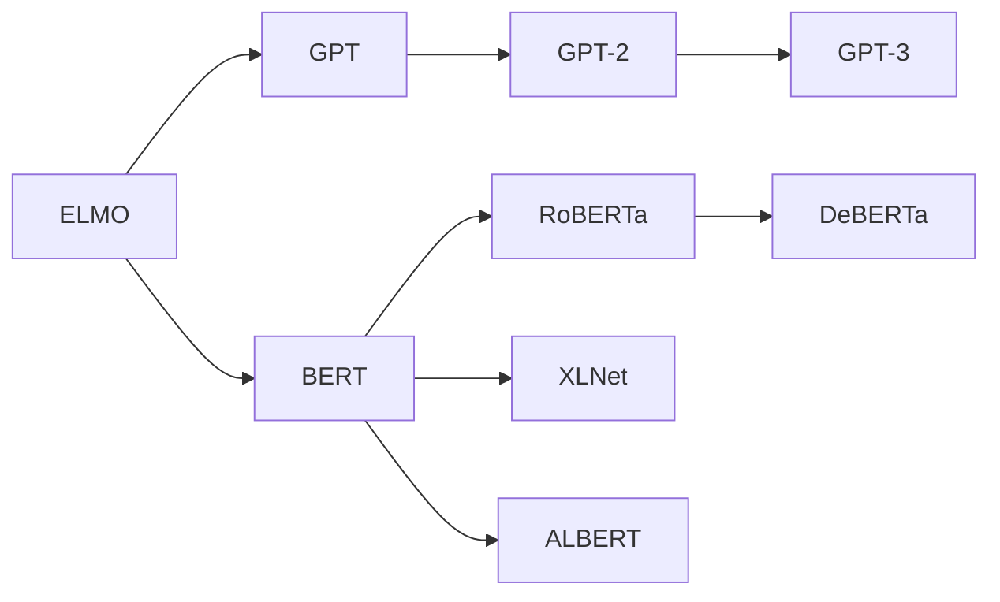

# 大规模语言模型从理论到实践 大语言模型的结构

关键词：大规模语言模型, Transformer, 注意力机制, 预训练, 微调, 知识蒸馏, 多任务学习, 跨语言建模, 可解释性, 鲁棒性

## 1. 背景介绍
### 1.1  问题的由来
近年来,随着深度学习技术的飞速发展,以及海量文本数据的积累,大规模语言模型(Large-scale Language Models)在自然语言处理(NLP)领域取得了突破性的进展。这些模型能够从大规模无标注文本语料中学习到丰富的语言知识和常识,在机器翻译、对话系统、文本摘要、问答系统等任务上展现出了接近甚至超越人类的性能。然而,训练和部署大规模语言模型仍面临着诸多理论和实践上的挑战。

### 1.2  研究现状
目前主流的大规模语言模型大多基于 Transformer 架构[1],通过自监督预训练和特定任务微调的范式,在下游任务上取得了 state-of-the-art 的表现。代表性的模型包括 BERT[2]、GPT 系列[3,4]、XLNet[5]、RoBERTa[6]等。这些模型参数量动辄上亿,需要消耗大量算力和存储资源。为了提高训练效率和推理速度,研究者们提出了模型压缩[7]、知识蒸馏[8]、模型量化[9]等优化技术。此外,为了拓展模型的泛化能力,多任务学习[10]、跨语言建模[11]、零样本学习[12]等范式也得到了广泛关注。

### 1.3  研究意义
大规模语言模型蕴含着丰富的语言知识,有望成为通用人工智能的基石。深入研究其内在机制和行为特性,对于理解人类语言认知、开发实用的 NLP 系统具有重要意义。此外,优化大模型的训练和推理效率,降低部署门槛,将使更多用户和场景受益于先进的语言智能技术。探索语言模型的可解释性、可控性和鲁棒性,有助于提升其可靠性和适用性。

### 1.4  本文结构
本文将系统梳理大规模语言模型的发展脉络,深入剖析其核心架构和算法,并总结当前面临的机遇与挑战。第2部分介绍语言模型的核心概念与发展历程。第3部分重点讲解 Transformer 的网络结构和自注意力机制。第4部分阐述语言模型预训练的数学原理和目标函数设计。第5部分通过实践案例演示如何开发和部署语言模型。第6部分展望语言模型的应用前景。第7部分推荐相关学习资源。第8部分总结全文并展望未来研究方向。

## 2. 核心概念与联系

语言模型的本质是对语言符号序列的概率分布进行建模。给定前 $n-1$ 个词 $w_1,\ldots,w_{n-1}$,语言模型的目标是预测第 $n$ 个词 $w_n$ 的条件概率 $P(w_n|w_1,\ldots,w_{n-1})$。传统的 N-gram 语言模型[13]基于马尔可夫假设,认为一个词的出现只与前 $n-1$ 个词相关。神经网络语言模型[14]用神经网络拟合词序列到下一个词的映射函数,一定程度上缓解了数据稀疏问题。

近年兴起的大规模语言模型普遍采用 Transformer 架构,抛弃了循环神经网络(RNN)架构中的状态传递,转而依赖自注意力机制建模任意长距离的词间依赖。大规模语言模型通常分两个阶段训练:无监督预训练和特定任务微调。预训练阶段在超大规模无标注语料上训练模型,使其掌握通用语言知识。微调阶段在特定任务的小规模标注数据上训练模型,使其适应具体任务。

下图展示了几种主流语言模型的发展脉络和关键创新点:

## 3. 核心算法原理 & 具体操作步骤
### 3.1  算法原理概述
Transformer 是大规模语言模型的核心组件,其本质是一个 Seq2Seq 模型,由编码器(Encoder)和解码器(Decoder)组成。编码器将输入序列 $X=(x_1,\ldots,x_n)$ 映射为隐藏表示 $H=(h_1,\ldots,h_n)$,解码器根据 $H$ 生成输出序列 $Y=(y_1,\ldots,y_m)$。Transformer 的核心创新是自注意力机制(Self-Attention),它能捕捉词之间的长距离依赖,且计算复杂度与序列长度呈线性关系。

### 3.2  算法步骤详解
以编码器的计算过程为例,详细解释 Transformer 的内部机制。编码器由若干相同的 Layer 堆叠而成,每个 Layer 包含两个子层:Multi-Head Self-Attention 和 Position-wise Feed-Forward Network。

**Multi-Head Self-Attention**

对于序列中的每个位置 $i$,Self-Attention 首先计算其与所有位置的注意力分数(Attention Scores):

$$ \alpha_{ij} = \frac{(x_iW^Q)(x_jW^K)^T}{\sqrt{d_k}} $$

其中 $W^Q, W^K \in \mathbb{R}^{d_{model} \times d_k}$ 是可学习的投影矩阵。然后对注意力分数应用 Softmax 函数,得到注意力权重(Attention Weights):

$$ \hat{\alpha}_{ij} = \frac{\exp(\alpha_{ij})}{\sum_{k=1}^n \exp(\alpha_{ik})} $$

最后,将注意力权重与值向量 $v_j=x_jW^V$ 加权求和,得到位置 $i$ 的注意力输出(Attention Output):

$$ z_i = \sum_{j=1}^n \hat{\alpha}_{ij}v_j $$

Multi-Head Attention 将上述过程独立执行 $h$ 次,然后拼接各头的输出并线性变换,以增强模型的表达能力:

$$ \text{MultiHead}(X) = \text{Concat}(\text{head}_1,\ldots,\text{head}_h)W^O $$

其中 $\text{head}_k = \text{Attention}(XW_k^Q, XW_k^K, XW_k^V)$。

**Position-wise Feed-Forward Network**

除了 Self-Attention 子层,编码器的每一层还包含一个前馈神经网络。它对序列的每个位置单独应用两个线性变换和一个非线性激活函数:

$$ \text{FFN}(z_i) = \max(0, z_iW_1 + b_1)W_2 + b_2 $$

其中 $W_1 \in \mathbb{R}^{d_{model} \times d_{ff}}, W_2 \in \mathbb{R}^{d_{ff} \times d_{model}}, b_1 \in \mathbb{R}^{d_{ff}}, b_2 \in \mathbb{R}^{d_{model}}$ 是可学习的参数。

此外,Transformer 还设计了残差连接(Residual Connection)和层归一化(Layer Normalization)来促进训练的收敛。

### 3.3  算法优缺点
Transformer 相比 RNN 具有以下优点:
1. 并行计算能力强,训练和推理速度快。
2. 能够建模长距离依赖,捕捉全局信息。
3. 模型容量大,有更强的表达能力。

但 Transformer 也存在一些局限:
1. 计算和存储开销大,难以处理超长序列。
2. 缺乏位置信息,需要引入位置编码。
3. 解释性差,内部工作机制仍是黑盒。

### 3.4  算法应用领域
Transformer 已成为 NLP 主流模型的标配,广泛应用于机器翻译、文本摘要、语义匹配、阅读理解、信息抽取等任务。近年来,研究者们还尝试将 Transformer 扩展到多模态学习、时间序列分析、图网络等领域。

## 4. 数学模型和公式 & 详细讲解 & 举例说明
### 4.1  数学模型构建
大规模语言模型的训练通常采用最大似然估计(MLE),目标是最大化语言模型在训练语料 $\mathcal{D}$ 上的对数似然概率:

$$ \mathcal{L}(\theta) = \sum_{X \in \mathcal{D}} \log P_{\theta}(X) $$

其中 $\theta$ 为模型参数。对于 Transformer 语言模型,给定上文 $x_{<t}$,第 $t$ 个词 $x_t$ 的条件概率为:

$$ P_{\theta}(x_t|x_{<t}) = \text{softmax}(W_e h_t + b_e) $$

其中 $h_t$ 是 Transformer 最后一层在 $t$ 位置的隐藏状态,$W_e \in \mathbb{R}^{d_{model} \times |\mathcal{V}|}, b_e \in \mathbb{R}^{|\mathcal{V}|}$ 是词嵌入矩阵和偏置项,$\mathcal{V}$ 是词表。

为了缓解语言模型的曝光偏差(Exposure Bias)问题,研究者们提出了自回归语言模型(Autoregressive LM)的预训练目标,如 GPT 采用的 Language Modeling:

$$ \mathcal{L}_{\text{LM}}(\theta) = \sum_{t=1}^n \log P_{\theta}(x_t|x_{<t}) $$

和 XLNet 采用的 Permutation Language Modeling:

$$ \mathcal{L}_{\text{PLM}}(\theta) = \mathbb{E}_{z \sim \mathcal{Z}_n} \left[ \sum_{t=1}^n \log P_{\theta}(x_{z_t}|x_{z_{<t}}) \right] $$

其中 $\mathcal{Z}_n$ 是长度为 $n$ 的序列的所有排列的集合。

为了增强语言模型对下游任务的适应能力,BERT 等双向语言模型引入了 Masked Language Modeling (MLM) 预训练任务:

$$ \mathcal{L}_{\text{MLM}}(\theta) = -\mathbb{E}_{x \sim \mathcal{D}} \left[ \sum_{t=1}^n m_t \cdot \log P_{\theta}(x_t|x_{\backslash t}) \right] $$

其中 $m_t \in \{0,1\}$ 表示 $t$ 位置的词是否被屏蔽,$x_{\backslash t}$ 表示 $x$ 去掉 $t$ 位置词的序列。MLM 能够学习到深层的上下文表示,在许多 NLP 任务上取得了优异的迁移性能。

### 4.2  公式推导过程
下面我们详细推导 MLM 目标的公式。对于语料中的句子 $x=(x_1,\ldots,x_n)$,定义掩码向量 $m=(m_1,\ldots,m_n)$,其中:

$$
m_t = 
\begin{cases}
1 & \text{如果 } x_t \text{ 被屏蔽} \\
0 & \text{如果 } x_t \text{ 未被屏蔽}
\end{cases}
$$

令 $\tilde{x}$ 表示屏蔽后的输入序列,即:

$$
\tilde{x}_t = 
\begin{cases}
\text{[MASK]} & \text{如果 } m_t=1 \\
x_t & \text{如果 } m_t=0
\end{cases}
$$

MLM 的目标是最大化被屏蔽位置的词的对数似然概率:

$$ \mathcal{L}_{\text{MLM}}(\theta) = \mathbb{E}_{x \sim \mathcal{D}} \left[ \sum_{t=1}^n m_t \log P_{\theta}(x_t|\tilde{x}) \right] $$

将掩码向量 $m$ 显式地乘在求和项中:

$$ \mathcal{L}_{\text{MLM}}(\theta) = \mathbb{E}_{x \sim \mathcal{D}} \left[ \sum_{t=1}^n m_t \cdot \log P_{\theta}(x_t|\tilde{x}) \right] $$

最后,将目标函数改写为最小化负对数似然:

$