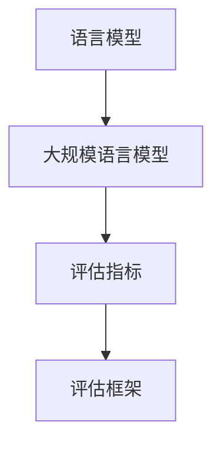

# 大规模语言模型从理论到实践：大语言模型评估实践

## 1. 背景介绍

### 1.1 问题的由来

随着人工智能和自然语言处理技术的快速发展，大规模语言模型已经成为当前研究的热点领域之一。这些模型通过在海量文本数据上进行训练,能够捕捉到丰富的语言知识和上下文信息,从而在自然语言理解、生成、翻译等任务中表现出色。然而,评估这些大型语言模型的性能和能力仍然是一个巨大的挑战。

传统的评估方法,如困惑度(Perplexity)和BLEU分数,往往只关注模型在特定任务上的表现,而忽视了模型在更广泛的语言理解和推理能力方面的评估。此外,随着模型规模的不断扩大,人工评估变得越来越昂贵和低效。因此,我们亟需一种全面、高效且可解释的评估框架,以深入了解这些大规模语言模型的真正能力和局限性。

### 1.2 研究现状

目前,研究人员已经提出了多种评估大型语言模型的新方法,包括:

1. **基准测试集(Benchmark Datasets)**: 设计包含各种任务和挑战的标准化测试集,如SuperGLUE、BIG-bench等,以全面评估模型在不同领域的表现。

2. **探索性评估(Probing)**: 通过设计特定的探测任务,来检查模型是否真正掌握了某些语言现象或推理能力。

3. **可解释性分析(Interpretability Analysis)**: 采用各种可视化和解释技术,如注意力可视化、概念激活向量等,来揭示模型内部的决策过程。

4. **对抗性评估(Adversarial Evaluation)**: 构造对抗性样本,以检测模型在面临微小扰动时的鲁棒性。

5. **人机对比评估(Human Evaluation)**: 邀请人类评估者对模型输出进行评分和对比,以更全面地评价模型的性能。

尽管取得了一些进展,但现有的评估方法仍然存在诸多不足,如评估成本高、缺乏统一标准、难以解释模型行为等。因此,发展更加全面、高效和可解释的评估框架,对于充分发挥大规模语言模型的潜力至关重要。

### 1.3 研究意义

全面、高效和可解释的大型语言模型评估框架,对于以下几个方面具有重要意义:

1. **模型优化和迭代**: 通过深入评估,我们可以发现模型的薄弱环节,从而优化模型架构、训练策略等,不断提高模型性能。

2. **应用场景匹配**: 评估框架能够帮助我们更好地理解模型的能力边界,从而将模型部署到最合适的应用场景中。

3. **安全性和可靠性**: 全面评估有助于识别模型的潜在风险,如偏见、不当输出等,从而提高模型的安全性和可靠性。

4. **理论突破**: 通过解释模型内部机制,我们可以获得对语言理解和推理的新见解,推动自然语言处理理论的发展。

5. **公众信任**: 透明、可解释的评估有助于提高公众对大型语言模型的信任度,促进其在各个领域的应用和发展。

综上所述,发展全面、高效和可解释的大型语言模型评估框架,对于推动人工智能技术的进步和应用至关重要。

### 1.4 本文结构

本文将全面介绍大规模语言模型评估的理论和实践。首先,我们将回顾评估的核心概念和方法,并分析现有方法的优缺点。接下来,我们将详细阐述一种新颖的评估框架,包括其核心算法原理、数学模型以及具体实现细节。然后,我们将通过实际案例和代码示例,展示该框架在实践中的应用。最后,我们将总结该框架的优势,并展望未来的发展方向和挑战。

## 2. 核心概念与联系

在深入探讨大规模语言模型评估框架之前,我们需要先回顾一些核心概念和它们之间的联系。

### 2.1 语言模型

语言模型(Language Model)是自然语言处理领域的基础模型,旨在捕捉语言的统计规律。形式上,语言模型是一个条件概率分布 $P(w_t|w_1,w_2,...,w_{t-1})$,用于预测下一个词 $w_t$ 在给定前文 $w_1,w_2,...,w_{t-1}$ 的条件下出现的概率。

传统的统计语言模型通常基于 N-gram 计数和平滑技术。近年来,基于神经网络的语言模型(如 LSTM、Transformer 等)凭借其强大的表示能力,在各种任务中取得了卓越的表现。

### 2.2 大规模语言模型

大规模语言模型(Large Language Model,LLM)是指通过在大量文本数据上进行预训练,获得通用语言表示能力的巨大神经网络模型。这些模型通常包含数十亿甚至上千亿个参数,能够捕捉丰富的语义和上下文信息。

典型的大规模语言模型包括 GPT、BERT、XLNet、T5 等,它们在自然语言理解、生成、翻译等任务中表现出色,推动了自然语言处理技术的飞速发展。

### 2.3 评估指标

评估指标(Evaluation Metrics)是衡量模型性能的重要工具。常见的评估指标包括:

- **困惑度(Perplexity)**: 反映语言模型在预测下一个词时的不确定性。
- **BLEU分数**: 通过计算 N-gram 重叠程度,评估机器翻译输出与参考译文的相似性。
- **精确率(Precision)、召回率(Recall)、F1分数**: 常用于评估分类和识别任务的性能。
- **ROUGE分数**: 基于 N-gram 重叠,评估文本摘要与参考摘要的相似性。

这些传统指标虽然在特定任务上有一定参考价值,但难以全面评估大规模语言模型的整体能力。

### 2.4 评估框架

评估框架(Evaluation Framework)是一种系统的方法,旨在全面、客观地评估模型的各个方面,包括性能、能力边界、可解释性等。一个好的评估框架应该具备以下特点:

1. **全面性**: 能够评估模型在各种任务和场景下的表现。
2. **高效性**: 评估过程自动化、低成本,不需要大量人工干预。
3. **可解释性**: 能够解释模型内部的决策过程,揭示其优缺点。
4. **可扩展性**: 能够适应不断增长的模型规模和新的评估需求。
5. **标准化**: 遵循统一的评估标准,方便不同模型之间的比较。

发展一个满足上述特点的评估框架,是全面认识和利用大规模语言模型能力的关键。

### 2.5 核心概念关系

上述核心概念之间存在紧密的联系,如下图所示:

语言模型是大规模语言模型的基础,而评估指标是衡量模型性能的工具。基于这些,我们需要发展一个全面、高效和可解释的评估框架,以充分认识和利用大规模语言模型的能力。

接下来,我们将深入探讨一种新颖的大规模语言模型评估框架及其核心算法原理。

## 3. 核心算法原理 & 具体操作步骤  

### 3.1 算法原理概述

我们提出的大规模语言模型评估框架,旨在通过多维度、多层次的评估方法,全面、高效地评价模型的各个方面。该框架的核心算法思想是:

1. **构建多任务评估集(Multi-task Evaluation Set)**: 设计包含各种语言理解和生成任务的综合评估集,全面考察模型的不同能力。

2. **层次化评估(Hierarchical Evaluation)**: 从字符、词语、句子、篇章等多个语言层次,对模型的表现进行分析和评估。

3. **行为分析(Behavior Analysis)**: 通过注意力可视化、概念激活向量等技术,解释模型内部的决策过程和行为模式。

4. **对抗性评估(Adversarial Evaluation)**: 构造对抗性样本,评估模型在面临微扰动时的鲁棒性和泛化能力。

5. **人机对比(Human Evaluation)**: 在特定任务上,将模型输出与人类评估者的判断进行对比,发现模型的优缺点。

6. **自适应评估(Adaptive Evaluation)**: 根据模型在初步评估中的表现,自适应地调整后续评估的侧重点和策略。

7. **能力分级(Capability Grading)**: 基于上述多维度评估结果,对模型的不同能力进行综合打分和分级,形成全面的能力图谱。

该框架的优势在于,通过多种评估方式的融合,能够全面、高效地评价大规模语言模型的各个方面,同时提供可解释性分析,为模型优化和应用提供指导。

### 3.2 算法步骤详解

我们的评估框架由以下几个主要步骤组成:

#### 步骤1: 构建多任务评估集

首先,我们需要构建一个包含各种语言理解和生成任务的综合评估集。这些任务应当覆盖自然语言处理的多个领域,如阅读理解、对话、推理、文本生成、文本摘要等。

每个任务都应当具有明确的输入、输出格式,以及对应的评估指标(如准确率、F1分数、ROUGE分数等)。此外,每个任务还需要提供一定数量的训练数据和测试数据,用于模型的微调和评估。

#### 步骤2: 层次化评估

对于每个任务,我们将从字符、词语、句子、篇章等多个语言层次,对模型的表现进行分析和评估。

例如,在文本生成任务中,我们可以评估模型在字符级别上的拼写和语法正确性、在词语级别上的词汇丰富度、在句子级别上的流畅性和连贯性、在篇章级别上的主题一致性和逻辑性等。

通过层次化评估,我们可以全面了解模型在不同语言层面的优缺点,为后续的模型优化提供依据。

#### 步骤3: 行为分析

为了解释模型内部的决策过程和行为模式,我们将采用多种可解释性技术,如注意力可视化、概念激活向量等。

例如,在阅读理解任务中,我们可以通过注意力可视化,观察模型在回答问题时,是否真正关注到了与问题相关的上下文信息。在文本生成任务中,我们可以使用概念激活向量,分析模型在生成某些词语时,激活了哪些语义概念。

这些行为分析有助于我们深入理解模型的内在机制,从而优化模型架构和训练策略。

#### 步骤4: 对抗性评估

为了评估模型在面临微扰动时的鲁棒性和泛化能力,我们将构造一系列对抗性样本,并观察模型在这些样本上的表现。

对抗性样本可以通过多种方式生成,如添加噪声、字词替换、语义扰动等。我们将分析模型在这些对抗样本上的准确性下降情况,并将其作为评估模型鲁棒性的重要指标之一。

此外,我们还将探索提高模型对抗性鲁棒性的方法,如对抗训练、数据增强等,以提升模型的泛化能力。

#### 步骤5: 人机对比

在特定任务上,我们将邀请人类评估者对模型输出进行评分和对比,以发现模型的优缺点。

例如,在对话系统中,我们可以让人类评估者与模型进行多轮对话,并对模型的回复进行评分,评估其回复的相关性、流畅性和信息量等。同时,我们也将分析模型输出与人类回复之间的差异,以发现模型的不足之处。

人机对比评估不仅能够提供更加全面和客观的评价,还能为模型优化提供宝贵的参考