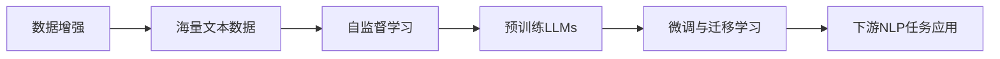

# 大规模语言模型从理论到实践 数据来源

## 1. 背景介绍
### 1.1 问题的由来
近年来,随着深度学习技术的快速发展,大规模语言模型(Large Language Models, LLMs)在自然语言处理(Natural Language Processing, NLP)领域取得了突破性进展。LLMs 能够从海量文本数据中学习语言知识,并应用于各种 NLP 任务,如机器翻译、文本摘要、问答系统等。然而,训练高质量的 LLMs 需要大量高质量的文本数据,数据来源问题成为制约 LLMs 发展的关键瓶颈之一。

### 1.2 研究现状 
目前,业界主要通过以下途径获取 LLMs 训练数据:

(1)开源数据集:如 Wikipedia、BookCorpus 等,优点是数据量大、领域广泛,但质量参差不齐,需要进行大量清洗。

(2)自建数据集:由企业/机构自行采集整理,优点是数据质量可控,缺点是成本高、周期长。

(3)数据合成:通过规则或模型自动生成训练数据,如回译、数据增强等方法,优点是成本低,缺点是质量难以保证。

(4)众包数据:利用众包平台发布任务,由众包工人人工标注数据,优点是灵活性高,缺点是成本较高。

总的来说,高质量的 LLMs 训练数据获取仍面临诸多挑战,亟需从数据源头着手,探索更加高效、经济的数据来源解决方案。

### 1.3 研究意义
研究 LLMs 数据来源问题具有重要意义:

(1)提升模型性能:高质量的训练数据是 LLMs 性能的基石,数据质量的提升直接影响模型效果。

(2)降低训练成本:数据获取成本往往占据 LLMs 训练总成本的很大比重,优化数据来源有助于控制成本。

(3)保障数据安全:规范数据来源渠道,有助于保护数据隐私安全,防范数据滥用风险。

(4)推动技术创新:围绕数据高效获取展开的技术创新,将极大拓展 LLMs 的应用场景和发展空间。

### 1.4 本文结构
本文将围绕 LLMs 数据来源问题展开系统探讨,内容安排如下:第2部分介绍相关核心概念;第3部分重点阐述数据获取的核心算法原理和操作步骤;第4部分建立数据质量评估的数学模型并给出详细推导;第5部分通过代码实例演示数据获取的具体实现;第6部分分析 LLMs 数据来源在实际应用中的典型场景;第7部分推荐数据获取相关的工具和学习资源;第8部分总结全文并展望未来研究方向;第9部分列举常见问题解答。

## 2. 核心概念与联系

在探讨 LLMs 数据来源问题之前,有必要先明确几个核心概念:

- 大规模语言模型(LLMs):以 Transformer 为代表的大规模神经网络模型,通过海量文本数据训练,可用于 NLP 下游任务。代表模型有 BERT、GPT、T5 等。

- 预训练(Pre-training):在大规模无标注语料上进行自监督学习,使模型习得通用语言知识的过程。预训练是 LLMs 的核心环节。

- 微调(Fine-tuning):在特定任务数据上对预训练模型进行监督学习,使其适配具体任务的过程。通过微调可将LLMs应用到下游任务。

- 自监督学习(Self-supervised Learning):无需人工标注,利用数据本身的信息进行监督的机器学习范式,是 LLMs 预训练的理论基础。

- 迁移学习(Transfer Learning):将源领域学到的知识迁移应用到目标领域任务中的机器学习方法,LLMs 正是通过迁移学习实现知识的复用。

- 数据增强(Data Augmentation):通过变换、组合等方式扩充数据规模和多样性的技术,可有效缓解 LLMs 训练数据不足问题。

这些概念环环相扣,共同构成了 LLMs 的技术框架:海量文本数据是基础,自监督学习是理论支撑,预训练使模型习得语言知识,微调和迁移学习实现知识的应用,数据增强则为数据获取提供了新思路。数据的规模和质量始终是 LLMs 的核心驱动力。

## 3. 核心算法原理 & 具体操作步骤
### 3.1 算法原理概述
LLMs 数据获取通常采用爬虫技术,即通过程序自动访问互联网上的网页并提取所需信息的过程。核心步骤包括:

(1)确定种子 URL,作为爬虫起点
(2)解析 URL,爬取网页内容  
(3)提取网页中的目标数据
(4)过滤、清洗、去重获取的数据
(5)将数据存储为结构化形式备用

算法本质是深度优先搜索。此外,还需要考虑爬虫策略、数据解析、反爬机制、分布式等问题。

### 3.2 算法步骤详解
(1)确定种子 URL。可从高质量网站域名列表、搜索引擎等获取。  

(2)解析 URL。使用 HTTP 库发送请求,获取 HTML 内容。需处理重定向、Cookie、代理、异常等。

(3)提取数据。通过正则表达式、XPath、CSS选择器等定位、抽取目标数据。如正文、标题、作者等。

(4)数据清洗。过滤掉广告、导航、脚本等无用信息,去除 HTML 标签、特殊字符。识别语言、去重。  

(5)数据存储。结构化保存数据,如写入关系数据库、JSON文件等。记录 URL、抓取时间等元数据。

算法还需考虑调度策略、递归深度、并发请求等,平衡数据质量、抓取效率和服务器负载。

### 3.3 算法优缺点
优点:
- 数据量大,覆盖领域广
- 实时性强,数据更新快
- 成本低,自动化程度高

缺点:
- 数据质量不可控,噪音多
- 受限于反爬措施,爬取难度大
- 存在法律风险,如侵犯版权

### 3.4 算法应用领域
爬虫广泛应用于搜索引擎、推荐系统、舆情监测、竞争情报分析等领域。典型应用有:
- 谷歌、百度等搜索引擎数据抓取
- 新闻聚合网站数据源获取
- 电商、招聘网站信息采集
- 社交媒体数据挖掘分析

随着 LLMs 的发展,爬虫在其数据获取中的作用日益凸显,成为NLP数据准备必不可少的利器。

## 4. 数学模型和公式 & 详细讲解 & 举例说明
### 4.1 数学模型构建
为评估爬虫获取数据的质量,构建数据质量评估模型。考虑以下指标:

- 相关性(Relevance):数据与目标领域的相关程度,用 $Rel(D)$ 表示。
- 噪音率(Noise Ratio):数据中噪音所占比例,用 $Noise(D)$ 表示。
- 时效性(Timeliness):数据的实时更新频率,用 $Time(D)$ 表示。
- 丰富度(Richness):数据覆盖主题的广度,用 $Rich(D)$ 表示。

定义数据集 $D$ 的质量评分 $Q(D)$ 为:

$$
Q(D) = \alpha \cdot Rel(D) - \beta \cdot Noise(D) + \gamma \cdot Time(D) + \delta \cdot Rich(D)
$$

其中 $\alpha, \beta, \gamma, \delta$ 为权重系数,满足:

$$
\alpha + \beta + \gamma + \delta = 1, \quad \alpha,\beta,\gamma,\delta \geq 0
$$

### 4.2 公式推导过程
各指标定义如下:

(1) 相关性 $Rel(D)$。设 $D$ 包含 $n$ 个网页,第 $i$ 个网页与目标领域相关的概率为 $p_i$,则:

$$
Rel(D) = \frac{1}{n}\sum_{i=1}^n p_i
$$

其中 $p_i$ 可通过文本分类模型预测得到。

(2) 噪音率 $Noise(D)$。设 $D$ 包含 $m$ 个词,其中噪音词(如广告、脚本)占比 $q$,则:

$$
Noise(D) = q = \frac{m_{noise}}{m}
$$

$m_{noise}$ 为噪音词数量,可通过词表匹配等方式识别。

(3) 时效性 $Time(D)$。设 $D$ 包含 $n$ 个网页,第 $i$ 个网页的时间戳为 $t_i$,当前时间为 $t_{now}$,则:

$$
Time(D) = \frac{1}{n}\sum_{i=1}^n e^{-\lambda(t_{now}-t_i)}
$$

其中 $\lambda$ 为时间衰减因子,控制时效性随时间衰减的速率。

(4) 丰富度 $Rich(D)$。设 $D$ 覆盖 $k$ 个主题,第 $j$ 个主题出现频次为 $f_j$,则:

$$
Rich(D) = -\sum_{j=1}^k \frac{f_j}{\sum_{l=1}^k f_l} \log \frac{f_j}{\sum_{l=1}^k f_l}
$$

即主题分布的信息熵,反映了数据的主题多样性。

### 4.3 案例分析与讲解
以新闻数据爬取为例,设某新闻网站共1000个网页,目标领域为"科技",当前时间为2023年6月。

经计算:
- 800个网页与"科技"相关,平均相关概率为0.8,则 $Rel(D)=0.8$。
- 平均每个网页含5%噪音词,则 $Noise(D)=0.05$。
- 各网页时间戳平均距今1天,取 $\lambda=0.1$,则 $Time(D)=e^{-0.1}=0.905$。
- 1000个网页覆盖5个主题,频次分别为300,300,200,100,100,则:

$$
\begin{aligned}
Rich(D) &= -(\frac{3}{10}\log\frac{3}{10} + \frac{3}{10}\log\frac{3}{10} + \frac{1}{5}\log\frac{1}{5} + \frac{1}{10}\log\frac{1}{10} + \frac{1}{10}\log\frac{1}{10}) \\
&= 1.485
\end{aligned}
$$

取权重 $\alpha=0.5, \beta=0.2, \gamma=\delta=0.15$,代入模型:

$$
\begin{aligned}
Q(D) &= 0.5 \times 0.8 - 0.2 \times 0.05 + 0.15 \times 0.905 + 0.15 \times 1.485 \\
&= 0.949
\end{aligned}
$$

该数据集的质量评分为0.949,整体质量较高,可用于后续LLMs训练。

### 4.4 常见问题解答
Q: 各指标权重 $\alpha, \beta, \gamma, \delta$ 如何取值?

A: 权重反映了各指标的重要程度,可根据具体任务需求进行调整。通常相关性权重最高,其次是噪音率,时效性和丰富度次之。权重可通过经验设置,也可通过机器学习方法自动学习。

Q: 如何预测网页与目标领域的相关概率 $p_i$? 

A: 可将网页相关性预测看作二分类问题,训练文本分类器预测。常用方法有朴素贝叶斯、逻辑回归、支持向量机等。需构建领域相关的标注数据集用于训练。  

Q: 噪音词如何识别?

A: 可基于领域构建噪音词表,包括广告、导航、脚本等常见无关内容的关键词。然后对网页内容进行匹配,计算噪音词所占比例。也可通过规则、模型等方法自动识别噪音