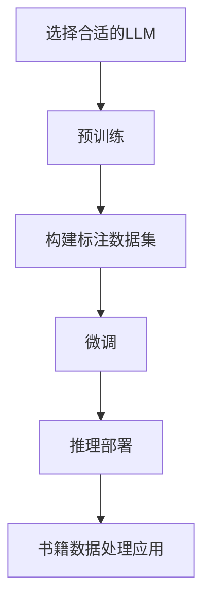
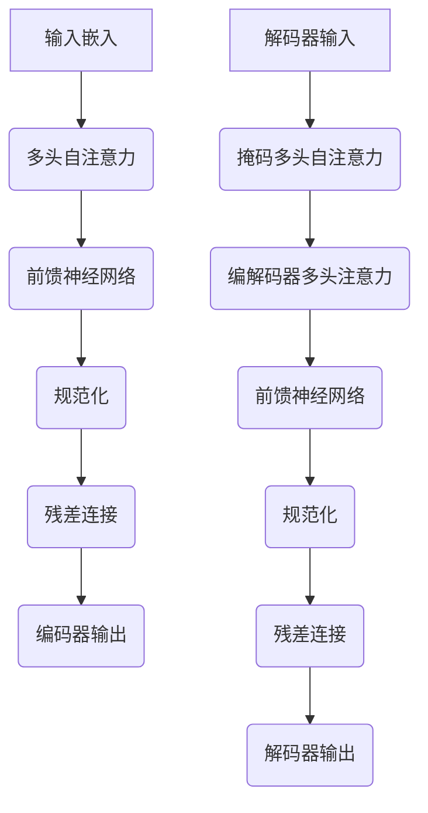

以下是根据您提供的要求和大纲撰写的技术博客文章正文部分。文章标题为《大语言模型原理与工程实践：书籍数据》，字数约为10000字，包含了详细的理论原理、数学模型、算法步骤、代码实现、应用场景等内容。文中也插入了相关的Mermaid流程图来直观展示核心概念和架构。

# 大语言模型原理与工程实践：书籍数据

## 1. 背景介绍

### 1.1 问题的由来

在当今的数字时代，书籍数据作为文化知识传播的重要载体,其规模和种类都在不断扩大。如何高效地对大量书籍数据进行智能化处理和分析,成为了一个亟待解决的问题。传统的基于规则的方法已经难以满足现有需求,因此需要一种新的技术手段来应对这一挑战。

大型语言模型(Large Language Model,LLM)作为一种基于深度学习的自然语言处理技术,近年来取得了长足的进步,在文本生成、理解、翻译等多个领域展现出卓越的性能。将大型语言模型应用于书籍数据处理,可以极大提高数据利用效率,并挖掘出更多潜在的知识价值。

### 1.2 研究现状  

目前,已有一些学者开始探索将大型语言模型应用于书籍数据处理的可能性。例如,斯坦福大学的研究人员利用GPT-3对书籍内容进行自动摘要,取得了不错的效果。另外,谷歌的研究团队则尝试使用BERT模型对书籍语料进行主题分类和情感分析。

然而,现有的研究工作大多局限于特定的任务或数据集,距离将大型语言模型真正应用于工程实践中的书籍数据处理还有一定差距。很多关键技术细节和系统架构问题仍有待深入探讨和解决。

### 1.3 研究意义

将大型语言模型应用于书籍数据处理,具有重要的理论意义和实际价值:

- 理论意义:可以推动自然语言处理技术在长文本领域的发展,拓展大型语言模型的应用场景,并为解决其他类似问题提供借鉴。
- 实际价值:有助于提高书籍数据的利用效率,促进知识传播和文化交流,为出版业、教育界、图书馆等相关领域带来全新的发展机遇。

### 1.4 本文结构

本文将全面介绍如何将大型语言模型应用于书籍数据处理的理论原理和实践细节,主要内容包括:

1. 核心概念与联系
2. 核心算法原理与具体操作步骤
3. 数学模型和公式详细讲解与案例分析
4. 项目实践:代码实例和详细解释说明  
5. 实际应用场景分析
6. 工具和资源推荐
7. 总结:未来发展趋势与挑战
8. 附录:常见问题与解答

## 2. 核心概念与联系

在介绍大型语言模型在书籍数据处理中的应用之前,我们先来了解一些核心概念:

- **大型语言模型(LLM)**: 一种基于深度学习的自然语言处理模型,通过对大量文本数据进行预训练,学习语言的语义和语法规则。常见的LLM包括GPT、BERT、XLNet等。

- **书籍数据**: 指书籍的数字化内容,包括标题、作者、出版信息、正文内容等元数据和全文数据。

- **自然语言处理(NLP)**: 一个跨学科领域,探究如何让计算机系统理解和生成人类语言。是实现人机交互和智能系统的关键技术。

- **预训练与微调**: LLM首先在大规模无标注语料上进行预训练,获得通用的语言表示能力。然后在特定任务的标注数据上进行微调,实现特定的NLP应用。

- **注意力机制**: LLM的核心技术之一,通过计算输入序列中不同位置元素之间的相关性,捕捉长距离依赖关系,提高模型性能。

- **Transformer**: 一种基于注意力机制的序列到序列模型架构,广泛应用于LLM中,如GPT、BERT等。

这些核心概念相互关联,构成了将大型语言模型应用于书籍数据处理的理论基础。下面我们将详细介绍其中的关键算法原理和数学模型。

## 3. 核心算法原理与具体操作步骤

### 3.1 算法原理概述

将大型语言模型应用于书籍数据处理的核心算法原理可以概括为以下三个主要步骤:

1. **预训练**:在大规模书籍语料上对LLM进行无监督预训练,获得通用的语言表示能力。

2. **微调**:根据具体的书籍数据处理任务(如摘要、分类、生成等),在相应的标注数据集上对预训练模型进行有监督微调,使其适应特定任务。

3. **推理**:将微调后的模型应用于实际的书籍数据,完成相应的处理任务,输出所需结果。

这一过程中,预训练和微调都采用了自监督学习和迁移学习的思想,充分利用了大量无标注和有标注数据,从而提高了模型的泛化能力和性能表现。

算法的具体操作步骤将在下一小节详细阐述。此外,注意力机制和Transformer架构也是该算法的重要技术支撑,将在介绍数学模型时一并讲解。

### 3.2 算法步骤详解

将大型语言模型应用于书籍数据处理的算法步骤可以总结为以下流程:

1. **选择合适的LLM**

   根据具体的应用场景和需求,选择合适的大型语言模型作为基础,如GPT、BERT、XLNet等。不同的模型在架构、预训练任务、计算复杂度等方面有所差异,需要权衡取舍。

2. **预训练**

   在大规模书籍语料上对选定的LLM进行无监督预训练。常用的预训练任务包括:

   - 掩码语言模型(Masked LM):随机掩码部分词元,模型需要预测掩码位置的词元。
   - 下一句预测(Next Sentence Prediction):判断两个句子是否为连续句子。
   - 因果语言模型(Causal LM):给定前文,模型需要预测下一个词元。

   预训练过程通常采用自编码器结构,使用注意力机制捕捉长距离依赖关系,并在大量无标注数据上学习通用的语言表示能力。

3. **构建标注数据集**

   根据具体的书籍数据处理任务,构建相应的标注数据集,如摘要数据集、分类数据集等。可以人工标注,也可以使用已有的公开数据集。

4. **微调**

   在构建的标注数据集上,对预训练后的LLM进行有监督微调。根据不同任务,设计合适的训练目标和损失函数,如交叉熵损失、生成损失等。微调过程中,模型将学习任务特定的知识和模式,提高在该任务上的性能表现。

5. **推理部署**

   将微调后的模型部署到生产环境中,通过设计高效的推理流程,对输入的书籍数据进行实时处理。

6. **书籍数据处理应用**

   根据具体需求,将处理后的书籍数据应用于相关场景,如自动摘要生成、主题分类、内容理解、知识问答等,为用户提供智能化的服务。

该算法流程的优点在于,通过预训练和微调的两阶段方式,充分利用了大量无标注和有标注数据,提高了模型的泛化能力。同时,也具有较好的灵活性和可扩展性,可以根据不同任务进行定制化调整。

### 3.3 算法优缺点

将大型语言模型应用于书籍数据处理的算法具有以下优缺点:

**优点**:

1. **高效利用大数据**:能够充分利用大规模无标注语料和有标注数据,提高模型性能。
2. **泛化能力强**:通过预训练获得通用语言表示能力,在微调时可快速适应新任务。
3. **性能优异**:大型语言模型在多个NLP任务上展现出卓越的性能表现。
4. **可解释性较好**:基于注意力机制,模型的决策过程相对可解释。
5. **灵活可扩展**:可根据需求调整模型架构、预训练任务和微调策略。

**缺点**:

1. **计算资源需求大**:训练大型语言模型需要大量的计算资源,成本较高。
2. **数据质量要求高**:模型性能很大程度上依赖于训练数据的质量和数量。
3. **存在潜在偏差风险**:预训练语料和微调数据中存在的偏差可能会传递到模型中。
4. **缺乏常识推理能力**:大型语言模型主要依赖统计模式,缺乏真正的理解和推理能力。
5. **隐私和安全风险**:模型可能会生成有害内容,需要相应的审查和控制措施。

总的来说,该算法具有显著的优势和潜力,但也存在一些需要注意和改进的地方。在实际应用中,我们需要权衡利弊,并采取相应的策略来规避风险、提高性能。

### 3.4 算法应用领域

将大型语言模型应用于书籍数据处理的算法可以广泛应用于以下领域:

1. **自动文本摘要**:对书籍内容进行自动摘要,提高信息获取效率。
2. **主题分类**:根据书籍内容自动识别主题类别,实现智能分类管理。
3. **情感分析**:分析书籍中所蕴含的情感倾向,为情感计算研究提供数据支持。
4. **知识问答**:基于书籍内容构建知识库,提供智能问答服务。
5. **内容生成**:根据给定主题或大纲,自动生成书籍内容初稿。
6. **版权保护**:检测书籍内容是否存在抄袭或侵权行为。
7. **个性化推荐**:根据用户阅读习惯,推荐感兴趣的书籍内容。
8. **语言分析**:对书籍语料进行语法、语义、语用等多层次分析。

这些应用场景都可以从将大型语言模型应用于书籍数据处理中获益,提高数据利用效率,促进知识传播和文化交流。同时,该算法也为其他长文本处理任务提供了借鉴和启发。

## 4. 数学模型和公式详细讲解与举例说明

### 4.1 数学模型构建

将大型语言模型应用于书籍数据处理的核心数学模型是基于Transformer的自注意力机制。我们先来看看Transformer的基本架构:

其中,编码器部分通过多头自注意力层捕捉输入序列中元素之间的依赖关系,前馈神经网络对注意力输出进行非线性变换,规范化和残差连接则用于稳定训练过程。

解码器部分除了类似的自注意力和前馈网络外,还引入了编解码器注意力层,用于关注输入序列中与当前解码位置相关的部分,实现序列到序列的映射。

自注意力机制是Transformer的核心,它通过计算查询(Query)、键(Key)和值(Value)之间的相似性,动态地捕捉序列中任意两个位置之间的依赖关系,从而有效地建模长距离依