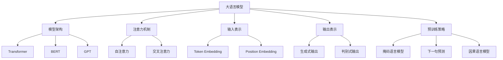

# 大语言模型原理与工程实践：大语言模型的核心模块

## 1. 背景介绍

### 1.1 问题的由来

在过去几年中，自然语言处理(NLP)领域取得了令人瞩目的进展,其中大语言模型(Large Language Model,LLM)无疑是最耀眼的明星。作为一种基于大规模语料库训练的深度神经网络模型,LLM展现出了惊人的语言理解和生成能力,在机器翻译、问答系统、文本摘要等众多任务中表现出色。

然而,训练一个高质量的大语言模型并非易事。它需要海量的计算资源、大规模的训练数据,以及复杂的模型结构和训练策略。因此,深入理解大语言模型的核心模块及其工作原理,对于提高模型性能、降低训练成本、实现高效部署至关重要。

### 1.2 研究现状

目前,学术界和工业界都在积极探索大语言模型的前沿技术,以期突破现有瓶颈。一些知名的大语言模型,如GPT-3、PanGu-Alpha、BLOOM等,都采用了创新的模型架构和训练策略,展现出了强大的语言能力。

然而,现有的大语言模型仍然存在一些挑战,例如:

1. **可解释性不足**:大语言模型的内部机理往往是一个黑箱,难以解释其决策过程。
2. **数据质量问题**:训练数据中可能存在噪声、偏差,影响模型的泛化能力。
3. **效率和可扩展性**:训练大型模型需要巨大的计算资源,部署也面临挑战。
4. **安全和隐私风险**:模型可能会生成有害内容或泄露隐私信息。

因此,深入研究大语言模型的核心模块,有助于解决上述问题,推动该领域的发展。

### 1.3 研究意义

深入探讨大语言模型的核心模块,对于以下几个方面具有重要意义:

1. **提高模型性能**:透彻理解模型内部机制,有助于优化模型结构和训练策略,提升模型的语言理解和生成能力。

2. **降低训练成本**:通过优化关键模块,可以减少计算资源的消耗,降低训练和推理的成本。

3. **增强可解释性**:揭示模型内部的决策过程,有助于提高模型的透明度和可解释性。

4. **促进安全部署**:深入了解模型的工作原理,有助于识别和缓解潜在的安全隐患,确保模型在实际应用中的安全性。

5. **推动技术创新**:对核心模块的深入研究,有望催生新的模型架构、训练策略和应用场景,推动整个NLP领域的创新发展。

### 1.4 本文结构

本文将系统地介绍大语言模型的核心模块,包括模型架构、注意力机制、输入表示、输出表示、预训练策略等关键组件。我们将深入探讨每个模块的工作原理、优缺点,以及在实际应用中的考量。此外,本文还将分享一些工程实践经验,帮助读者更好地理解和应用大语言模型技术。

## 2. 核心概念与联系

在深入探讨大语言模型的核心模块之前,我们首先需要了解一些基本概念和它们之间的联系。

上图展示了大语言模型的核心概念及其相互关系。我们可以看到,大语言模型由多个关键模块组成,包括模型架构、注意力机制、输入表示、输出表示和预训练策略等。每个模块又包含了多个具体的技术实现,如Transformer、BERT、GPT等模型架构,自注意力和交叉注意力机制,Token Embedding和Position Embedding等输入表示方式,生成式和判别式输出,以及掩码语言模型、下一句预测和因果语言模型等预训练策略。

这些核心概念和模块相互关联、相互影响,共同构建了一个强大的大语言模型。理解它们的工作原理和相互关系,对于掌握大语言模型技术至关重要。

## 3. 核心算法原理 & 具体操作步骤

### 3.1 算法原理概述

大语言模型的核心算法是基于自注意力(Self-Attention)机制的Transformer架构。Transformer是一种全新的序列到序列(Seq2Seq)模型,它完全放弃了传统的循环神经网络(RNN)和卷积神经网络(CNN)结构,而是采用了全新的自注意力机制来捕捉输入序列中的长程依赖关系。

自注意力机制的核心思想是,对于序列中的每个位置,计算其与序列中其他所有位置的关联程度,从而捕捉全局的上下文信息。这种机制不仅能够有效地解决长期依赖问题,而且还具有并行计算的优势,大大提高了模型的计算效率。

Transformer的编码器(Encoder)和解码器(Decoder)都是由多个相同的层组成,每层包含多头自注意力(Multi-Head Self-Attention)和前馈神经网络(Feed-Forward Neural Network)两个子层。编码器的输出作为解码器的输入,解码器在生成目标序列时还会通过另一个注意力机制(Encoder-Decoder Attention)关注编码器的输出,从而捕捉源序列和目标序列之间的依赖关系。

大语言模型通常采用Transformer的解码器部分,将其应用于单个序列的生成任务,如机器翻译、文本摘要、对话系统等。通过预训练策略(如掩码语言模型、因果语言模型等)在大规模语料库上训练模型参数,再结合微调(Fine-tuning)或提示学习(Prompt Learning)等技术,大语言模型可以展现出惊人的语言理解和生成能力。

### 3.2 算法步骤详解

下面我们详细介绍Transformer模型中自注意力机制的计算过程:

1. **输入表示**

   给定一个长度为 $n$ 的输入序列 $X = (x_1, x_2, \dots, x_n)$,首先将每个输入token $x_i$ 映射为一个维度为 $d_{model}$ 的向量表示 $\boldsymbol{x}_i \in \mathbb{R}^{d_{model}}$。这通常是通过查询一个可训练的嵌入矩阵(Embedding Matrix)来实现的。

2. **位置编码**

   为了捕捉序列中token的位置信息,需要为每个token添加一个位置编码(Position Encoding) $\boldsymbol{p}_i \in \mathbb{R}^{d_{model}}$。位置编码可以通过一些固定的函数(如三角函数)生成,也可以作为可训练的向量参数。最终的输入表示为 $\boldsymbol{x}_i + \boldsymbol{p}_i$。

3. **多头自注意力**

   自注意力机制的核心是计算每个输入token与其他所有token之间的注意力权重,从而捕捉全局上下文信息。具体计算过程如下:

   - 将输入序列 $X$ 线性映射为查询(Query)、键(Key)和值(Value)向量:

     $$\begin{aligned}
     \boldsymbol{Q} &= \boldsymbol{X} \boldsymbol{W}^Q \\
     \boldsymbol{K} &= \boldsymbol{X} \boldsymbol{W}^K \\
     \boldsymbol{V} &= \boldsymbol{X} \boldsymbol{W}^V
     \end{aligned}$$

     其中 $\boldsymbol{W}^Q \in \mathbb{R}^{d_{model} \times d_k}$, $\boldsymbol{W}^K \in \mathbb{R}^{d_{model} \times d_k}$, $\boldsymbol{W}^V \in \mathbb{R}^{d_{model} \times d_v}$ 是可训练的权重矩阵。

   - 计算查询和键之间的点积,得到注意力分数矩阵 $\boldsymbol{A}$:

     $$\boldsymbol{A} = \text{softmax}\left(\frac{\boldsymbol{Q}\boldsymbol{K}^\top}{\sqrt{d_k}}\right)$$

     其中 $\sqrt{d_k}$ 是一个缩放因子,用于防止点积过大导致梯度消失或爆炸。

   - 将注意力分数矩阵 $\boldsymbol{A}$ 与值向量 $\boldsymbol{V}$ 相乘,得到上下文向量表示 $\boldsymbol{Z}$:

     $$\boldsymbol{Z} = \boldsymbol{A}\boldsymbol{V}$$

   - 多头注意力机制是将多个注意力头的输出拼接在一起,然后再经过一个线性变换,得到最终的输出表示:

     $$\text{MultiHead}(\boldsymbol{X}) = \text{Concat}(\boldsymbol{Z}_1, \boldsymbol{Z}_2, \dots, \boldsymbol{Z}_h)\boldsymbol{W}^O$$

     其中 $h$ 是注意力头的数量,每个 $\boldsymbol{Z}_i$ 是一个注意力头的输出,$\boldsymbol{W}^O \in \mathbb{R}^{hd_v \times d_{model}}$ 是可训练的权重矩阵。

4. **前馈神经网络**

   自注意力子层的输出将作为前馈神经网络(FFN)的输入,FFN包含两个线性变换和一个激活函数(通常是ReLU):

   $$\text{FFN}(\boldsymbol{x}) = \max(0, \boldsymbol{x}\boldsymbol{W}_1 + \boldsymbol{b}_1)\boldsymbol{W}_2 + \boldsymbol{b}_2$$

   其中 $\boldsymbol{W}_1 \in \mathbb{R}^{d_{model} \times d_{ff}}$, $\boldsymbol{W}_2 \in \mathbb{R}^{d_{ff} \times d_{model}}$, $\boldsymbol{b}_1 \in \mathbb{R}^{d_{ff}}$, $\boldsymbol{b}_2 \in \mathbb{R}^{d_{model}}$ 是可训练的权重和偏置参数。

5. **残差连接和层归一化**

   为了提高模型的稳定性和收敛速度,Transformer在每个子层之后都应用了残差连接(Residual Connection)和层归一化(Layer Normalization)操作。

通过上述步骤,Transformer模型可以有效地捕捉输入序列中的长程依赖关系,并生成高质量的输出序列。在大语言模型中,Transformer解码器的输出将作为生成的token序列。

### 3.3 算法优缺点

Transformer架构及其自注意力机制具有以下优缺点:

**优点**:

1. **并行计算能力强**:与RNN不同,自注意力机制可以高效地并行计算,大大提高了模型的计算效率。
2. **长期依赖建模能力强**:自注意力机制可以直接捕捉序列中任意两个位置之间的依赖关系,有效解决了RNN中的长期依赖问题。
3. **灵活的序列建模能力**:Transformer可以处理不同长度的输入和输出序列,适用于各种序列到序列的任务。
4. **可解释性较好**:通过可视化注意力权重矩阵,可以更好地理解模型的决策过程。

**缺点**:

1. **计算复杂度高**:自注意力机制需要计算输入序列中所有位置对之间的注意力分数,计算复杂度为 $\mathcal{O}(n^2 \cdot d_{model})$,对于长序列会带来较大的计算开销。
2. **缺乏位置信息**:Transformer本身没有位置信息,需要额外的位置编码来提供位置信息。
3. **序列长度限制**:由于计算复杂度的限制,Transformer通常只能处理长度较短的序列,对于超长序列可能会出现性能下降或内存溢出的问题。
4.