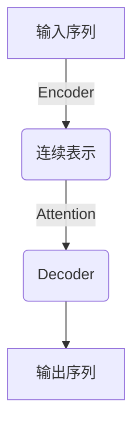
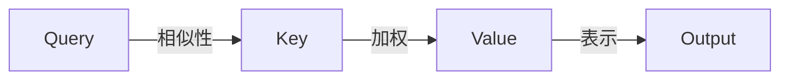
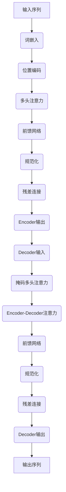

# 大语言模型原理与工程实践：经典结构 Transformer

## 1. 背景介绍

### 1.1 问题的由来

在自然语言处理(NLP)领域,传统的序列模型(如RNN、LSTM等)由于存在梯度消失/爆炸等问题,难以有效捕捉长距离依赖关系,因此在处理长序列任务时表现不佳。为了解决这一挑战,Transformer模型应运而生,它完全基于注意力机制,摒弃了循环和卷积结构,从而有效克服了长期依赖问题。

### 1.2 研究现状

自2017年Transformer被提出以来,它在机器翻译、文本生成、语音识别等多个NLP任务中取得了卓越表现,成为大型语言模型的主流架构。随后,BERT、GPT、XLNet等基于Transformer的预训练语言模型相继问世,在各种下游任务中展现出强大的泛化能力。

### 1.3 研究意义

深入理解Transformer的原理及其工程实践,对于掌握大型语言模型的核心技术、提高NLP系统的性能至关重要。本文将全面剖析Transformer的架构设计、注意力机制、位置编码等核心概念,并通过数学模型和代码实例,帮助读者彻底掌握其本质。

### 1.4 本文结构

本文首先介绍Transformer的背景和核心概念,然后深入探讨其注意力机制、位置编码等关键技术,并通过数学模型和公式推导进行详细说明。接下来,我们将通过实际项目实践,展示如何利用主流框架构建Transformer模型。最后,我们将总结Transformer在实际应用中的场景,并对其未来发展趋势和挑战进行展望。

## 2. 核心概念与联系

Transformer是一种全新的基于注意力机制的序列到序列(Seq2Seq)模型,它完全摒弃了RNN和CNN等传统结构,整个模型架构由编码器(Encoder)和解码器(Decoder)两个子模块组成。

Encoder的作用是将输入序列映射为一系列连续的表示,而Decoder则负责根据这些表示生成目标序列。两者之间通过注意力机制建立联系,使得Decoder在生成每个目标token时,都可以关注输入序列中的不同位置,从而捕捉长距离依赖关系。



Transformer的核心创新在于完全依赖注意力机制来捕捉输入和输出之间的长程依赖关系,而不需要序列严格的递归计算。这种全注意力的结构使得模型可以高度并行化,从而在训练和推理时获得更高的计算效率。

## 3. 核心算法原理 & 具体操作步骤

### 3.1 算法原理概述

Transformer的核心思想是利用Self-Attention(自注意力)机制,让序列的每个位置都可以关注其他位置,从而捕捉长距离依赖关系。具体来说,对于给定的查询(Query)序列,Self-Attention通过计算查询和键(Key)序列之间的相似性,生成对值(Value)序列的加权求和,作为查询的新表示。



### 3.2 算法步骤详解

1. **线性投影**：将输入序列分别线性映射为查询(Q)、键(K)和值(V)向量。
2. **计算注意力分数**：通过点积运算计算查询(Q)与所有键(K)之间的注意力分数。
3. **软最大化**：对注意力分数进行软最大化(SoftMax)操作,得到注意力权重。
4. **加权求和**：将注意力权重与值(V)向量进行加权求和,得到新的查询表示。
5. **残差连接**：将新的查询表示与原始查询进行残差连接,保留原始信息。
6. **层归一化**：对残差连接的结果进行层归一化,以加速收敛。

$$\begin{aligned}
Q &= X \cdot W_q \\
K &= X \cdot W_k \\
V &= X \cdot W_v \\
\text{Attention}(Q, K, V) &= \text{softmax}\left(\frac{Q \cdot K^T}{\sqrt{d_k}}\right) \cdot V
\end{aligned}$$

其中$X$为输入序列,$W_q, W_k, W_v$为可训练的权重矩阵,$d_k$为缩放因子。

### 3.3 算法优缺点

**优点**：
- 高度并行化,计算效率高
- 有效捕捉长距离依赖关系
- 无递归计算,避免梯度消失/爆炸

**缺点**：
- 计算复杂度较高,需要大量计算资源
- 对长序列不太友好,注意力分数计算开销大
- 缺乏序列的位置信息,需要额外的位置编码

### 3.4 算法应用领域

Transformer由于其卓越的性能,已被广泛应用于多个NLP任务:

- **机器翻译**：谷歌、微软等公司的在线翻译系统
- **文本生成**：GPT、BART等大型语言模型
- **对话系统**：基于Transformer的对话模型
- **文本摘要**：新闻文本自动摘要
- **关系抽取**：从文本中抽取实体关系知识
- **情感分析**：判断文本的情感倾向性

## 4. 数学模型和公式 & 详细讲解 & 举例说明

### 4.1 数学模型构建

Transformer的数学模型主要包括以下几个部分:

1. **嵌入层**:将输入token映射为连续向量表示
2. **位置编码**:引入序列位置信息
3. **多头注意力**:并行计算多个注意力表示
4. **前馈网络**:对注意力输出进行非线性变换
5. **编码器/解码器堆叠**:多层编码器和解码器



### 4.2 公式推导过程

**1. 嵌入层**

对于输入序列$X = (x_1, x_2, ..., x_n)$,我们将每个token $x_i$映射为$d$维向量表示:

$$\text{Embedding}(x_i) = W_e \cdot \text{one\_hot}(x_i)$$

其中$W_e \in \mathbb{R}^{d \times V}$为可训练的嵌入矩阵,$V$为词表大小。

**2. 位置编码**

为了引入序列位置信息,我们为每个位置$i$添加一个位置编码向量$P_i$:

$$P_{i,2j} = \sin\left(i / 10000^{2j/d}\right)$$
$$P_{i,2j+1} = \cos\left(i / 10000^{2j/d}\right)$$

其中$j$为位置,$d$为向量维度。最终输入为词嵌入和位置编码之和。

**3. 多头注意力**

多头注意力将注意力机制并行运行$h$次,每次使用不同的线性投影,最后将所有头的结果拼接:

$$\begin{aligned}
\text{MultiHead}(Q, K, V) &= \text{Concat}(\text{head}_1, ..., \text{head}_h) \cdot W^O\\
\text{head}_i &= \text{Attention}(Q \cdot W_i^Q, K \cdot W_i^K, V \cdot W_i^V)
\end{aligned}$$

其中$W_i^Q, W_i^K, W_i^V, W^O$为可训练的权重矩阵。

**4. 前馈网络**

前馈网络对每个位置的向量进行独立的全连接变换:

$$\text{FFN}(x) = \max(0, x \cdot W_1 + b_1) \cdot W_2 + b_2$$

其中$W_1, W_2, b_1, b_2$为可训练参数。

### 4.3 案例分析与讲解

假设我们有一个英文到法语的机器翻译任务,输入为"I love machine learning",我们来看看Transformer是如何生成对应的法语翻译。

1. 输入序列首先通过嵌入层和位置编码,得到初始向量表示。
2. 编码器的第一层多头注意力计算输入序列中每个词与其他词的注意力权重,生成新的表示。
3. 新表示经过前馈网络的非线性变换,并与输入相加作为残差连接,最后进行层归一化。
4. 上述过程在编码器的多层中重复进行,最终生成编码器的输出表示。
5. 解码器的第一个多头注意力关注被掩码的输出序列本身,生成初步的目标表示。
6. 第二个多头注意力将目标表示与编码器输出进行注意力计算,融合源语言信息。
7. 经过前馈网络、残差连接和归一化后,解码器生成最终的输出表示。
8. 在每个位置应用线性层和softmax,预测该位置的输出单词概率。
9. 根据最大概率原则,生成法语翻译"J'aime l'apprentissage automatique"。

通过上述分析,我们可以直观地理解Transformer是如何利用注意力机制在不同位置之间建立联系,并最终生成高质量的翻译结果。

### 4.4 常见问题解答

**Q: 为什么要使用多头注意力?**

A: 单一注意力机制只能从一个表示子空间获取信息,而多头注意力可以从不同的表示子空间获取不同的信息,因此具有更强的表达能力。

**Q: 位置编码的作用是什么?**

A: 由于Transformer完全丢弃了RNN和CNN的结构,因此需要显式地为序列中的每个位置引入位置信息,否则模型将无法区分位置差异。

**Q: 为什么要使用残差连接和层归一化?**

A: 残差连接有助于保留输入的原始信息,防止在深层次传递时丢失;层归一化则可以加速模型收敛,提高训练稳定性。

## 5. 项目实践:代码实例和详细解释说明

### 5.1 开发环境搭建

我们将使用PyTorch框架构建Transformer模型,首先需要安装必要的依赖库:

```bash
pip install torch torchvision torchaudio
```

接下来,我们导入所需的Python模块:

```python
import torch
import torch.nn as nn
import math
```

### 5.2 源代码详细实现

我们将实现一个简化版的Transformer模型,包括编码器、解码器和注意力机制等核心组件。

**1. 位置编码**

```python
class PositionalEncoding(nn.Module):
    def __init__(self, d_model, dropout=0.1, max_len=5000):
        super(PositionalEncoding, self).__init__()
        self.dropout = nn.Dropout(p=dropout)

        pe = torch.zeros(max_len, d_model)
        position = torch.arange(0, max_len, dtype=torch.float).unsqueeze(1)
        div_term = torch.exp(torch.arange(0, d_model, 2).float() * (-math.log(10000.0) / d_model))
        pe[:, 0::2] = torch.sin(position * div_term)
        pe[:, 1::2] = torch.cos(position * div_term)
        pe = pe.unsqueeze(0).transpose(0, 1)
        self.register_buffer('pe', pe)

    def forward(self, x):
        x = x + self.pe[:x.size(0), :]
        return self.dropout(x)
```

**2. 注意力机制**

```python
class MultiHeadAttention(nn.Module):
    def __init__(self, d_model, num_heads):
        super(MultiHeadAttention, self).__init__()
        self.num_heads = num_heads
        self.d_model = d_model

        self.W_q = nn.Linear(d_model, d_model)
        self.W_k = nn.Linear(d_model, d_model)
        self.W_v = nn.Linear(d_model, d_model)