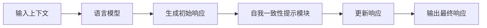

以下是《大语言模型原理与工程实践：自我一致性提示》的正文部分：

# 大语言模型原理与工程实践：自我一致性提示

## 1. 背景介绍

### 1.1 问题的由来

随着人工智能技术的快速发展，大型语言模型在自然语言处理、机器翻译、问答系统等领域展现出了巨大的潜力。然而,这些模型在生成响应时存在一个重大挑战:如何确保生成的内容与给定的上下文保持一致,避免出现矛盾或不合理的情况。

这种不一致性问题源于语言模型在生成过程中缺乏对上下文的充分理解和记忆。模型可能会忽略先前的上下文信息,或者生成与先前信息矛盾的内容,导致生成结果缺乏连贯性和逻辑性。

### 1.2 研究现状

为了解决这一问题,研究人员提出了多种方法,例如:

1. **基于注意力机制的上下文建模**:通过注意力机制捕捉上下文信息,加强模型对上下文的理解和记忆。
2. **基于记忆增强的模型**:引入外部记忆模块,显式地存储和更新上下文信息。
3. **基于规则的一致性约束**:设计一系列规则来约束生成的内容,确保其与上下文保持一致。

然而,这些方法要么效果有限,要么计算成本较高。因此,如何有效地解决大型语言模型的一致性问题仍然是一个具有挑战性的研究课题。

### 1.3 研究意义

提高大型语言模型的一致性对于多个领域具有重要意义:

1. **提升生成内容的质量**:一致性更好的响应能够提供更加流畅、连贯和合理的内容,提升用户体验。
2. **增强模型的可解释性和可信度**:一致性更好的模型更容易被人类理解和信任,有助于人工智能系统的透明度和可解释性。
3. **促进人工智能在关键领域的应用**:在诸如医疗、法律、金融等领域,一致性是至关重要的,提高一致性有助于人工智能技术在这些领域的应用和发展。

### 1.4 本文结构

本文将介绍一种基于自我一致性提示的新颖方法,旨在提高大型语言模型的一致性。文章首先阐述核心概念和算法原理,然后详细讲解数学模型和公式推导过程。接下来,我们将通过代码示例和实际应用场景,展示该方法在实践中的应用。最后,我们将总结该方法的优缺点、未来发展趋势和面临的挑战。

## 2. 核心概念与联系

自我一致性提示(Self-Consistency Prompting)是一种新颖的方法,旨在提高大型语言模型在生成响应时的一致性。其核心思想是:在生成过程中,不断提示模型关注先前生成的内容,并与之保持一致。

这种方法的基础是语言模型具有一定的记忆和推理能力。通过不断提示模型回顾和参考先前的上下文,可以增强模型对上下文的理解和记忆,从而生成更加一致的响应。

自我一致性提示方法可以与其他一致性增强技术(如注意力机制、记忆增强等)相结合,形成一种混合方法,进一步提高模型的一致性表现。

上图展示了自我一致性提示方法的基本流程:

1. 输入上下文信息
2. 语言模型生成初始响应
3. 自我一致性提示模块分析初始响应与上下文的一致性
4. 根据分析结果,更新响应以提高一致性
5. 输出最终的一致性响应

通过不断地提示和更新,该方法有望显著提高语言模型生成响应的一致性,从而提升生成内容的质量和可信度。

## 3. 核心算法原理与具体操作步骤

### 3.1 算法原理概述

自我一致性提示算法的核心原理可以概括为以下三个主要步骤:

1. **一致性评估**: 评估生成响应与输入上下文之间的一致性程度。
2. **一致性提示**: 根据一致性评估的结果,生成一致性提示,提醒模型关注先前上下文。
3. **响应更新**: 将一致性提示并入语言模型,重新生成更加一致的响应。

该算法通过不断地评估、提示和更新,逐步提高生成响应与上下文之间的一致性。

### 3.2 算法步骤详解

1. **一致性评估**

   该步骤的目标是量化生成响应与输入上下文之间的一致性程度。可以采用多种方法,例如:
   - 基于规则的评估:设计一系列规则来检查响应是否违反上下文约束。
   - 基于语义相似度的评估:计算响应与上下文的语义相似度,作为一致性的度量。
   - 基于人工标注的评估:由人工标注响应与上下文的一致性分数。

2. **一致性提示**

   根据一致性评估的结果,生成一致性提示。提示可以采用多种形式,例如:
   - 文本提示:生成一段文本,强调需要关注的上下文信息。
   - 标记提示:在输入序列中添加特殊标记,指示模型需要关注的部分。
   - 注意力掩码:生成一个注意力掩码,强化模型对特定上下文的关注。

3. **响应更新**

   将一致性提示并入语言模型,重新生成响应。具体的更新方式取决于模型的架构和训练方式,例如:
   - 对于基于Transformer的模型,可以将提示编码为额外的输入序列。
   - 对于基于RNN的模型,可以将提示编码为初始隐藏状态。
   - 对于基于retrieval的模型,可以将提示用于检索更加相关的上下文信息。

该算法可以进行多次迭代,不断评估、提示和更新,直到生成的响应达到满意的一致性水平。

### 3.3 算法优缺点

**优点**:

- 通用性强,可应用于不同类型的语言模型。
- 计算效率较高,无需对模型进行大量修改或重新训练。
- 可与其他一致性增强技术相结合,形成混合方法。

**缺点**:

- 算法性能在很大程度上依赖于一致性评估模块的质量。
- 需要手动设计一致性提示的形式和内容,缺乏自动化机制。
- 可能存在提示与模型架构不匹配的情况,影响性能。

### 3.4 算法应用领域

自我一致性提示算法可以应用于多个领域,改善大型语言模型在这些领域的一致性表现:

- 对话系统:确保对话机器人生成的响应与之前的对话上下文保持一致。
- 文本续写:在续写文本时,保持与原始文本的风格和主题的一致性。
- 问答系统:根据问题的上下文,生成与之相关且一致的答案。
- 文本摘要:生成与原文内容一致的高质量摘要。
- 机器翻译:确保翻译结果与源语言内容保持语义上的一致性。

## 4. 数学模型和公式详细讲解与举例说明

在自我一致性提示算法中,我们需要量化生成响应与输入上下文之间的一致性程度。这可以通过构建数学模型和公式来实现。本节将详细介绍一致性评估的数学模型,并给出公式推导过程和案例分析。

### 4.1 数学模型构建

假设我们有一个输入上下文序列 $X = (x_1, x_2, \dots, x_n)$,以及语言模型生成的响应序列 $Y = (y_1, y_2, \dots, y_m)$。我们的目标是量化 $Y$ 与 $X$ 之间的一致性程度,记为 $C(X, Y)$。

一种可能的方法是基于语义相似度。我们可以将 $X$ 和 $Y$ 分别映射到语义空间中的向量表示 $\vec{x}$ 和 $\vec{y}$,然后计算它们之间的相似度作为一致性度量。

具体来说,我们可以定义一致性度量 $C(X, Y)$ 如下:

$$C(X, Y) = \text{sim}(\vec{x}, \vec{y})$$

其中 $\text{sim}(\cdot, \cdot)$ 是一个相似度函数,可以选择余弦相似度、点积相似度或其他相似度度量。

为了获得 $\vec{x}$ 和 $\vec{y}$ 的向量表示,我们可以使用预训练的语言模型(如BERT、GPT等)对输入序列进行编码。假设编码函数为 $\text{encode}(\cdot)$,则:

$$\vec{x} = \text{encode}(X)$$
$$\vec{y} = \text{encode}(Y)$$

将上述公式代入一致性度量 $C(X, Y)$,我们得到:

$$C(X, Y) = \text{sim}(\text{encode}(X), \text{encode}(Y))$$

这个公式给出了一种计算生成响应与输入上下文一致性程度的方法。一致性度量值越高,表示响应与上下文越一致。

### 4.2 公式推导过程

我们将通过一个具体的例子,推导上述公式的过程。

假设我们使用余弦相似度作为相似度函数 $\text{sim}(\cdot, \cdot)$,其定义为:

$$\text{sim}(\vec{u}, \vec{v}) = \frac{\vec{u} \cdot \vec{v}}{||\vec{u}|| \cdot ||\vec{v}||}$$

其中 $\vec{u} \cdot \vec{v}$ 表示向量 $\vec{u}$ 和 $\vec{v}$ 的点积,而 $||\vec{u}||$ 和 $||\vec{v}||$ 分别表示它们的范数(L2范数)。

将余弦相似度代入一致性度量 $C(X, Y)$,我们得到:

$$\begin{aligned}
C(X, Y) &= \text{sim}(\text{encode}(X), \text{encode}(Y)) \\
        &= \frac{\text{encode}(X) \cdot \text{encode}(Y)}{||\text{encode}(X)|| \cdot ||\text{encode}(Y)||}
\end{aligned}$$

进一步展开,我们有:

$$\begin{aligned}
\text{encode}(X) &= [\vec{x}_1, \vec{x}_2, \dots, \vec{x}_n] \\
\text{encode}(Y) &= [\vec{y}_1, \vec{y}_2, \dots, \vec{y}_m]
\end{aligned}$$

其中 $\vec{x}_i$ 和 $\vec{y}_j$ 分别表示输入序列 $X$ 和响应序列 $Y$ 中第 $i$ 个和第 $j$ 个token的向量表示。

将这些向量表示代入点积和范数的计算公式,我们可以得到最终的一致性度量表达式。

### 4.3 案例分析与讲解

为了更好地理解一致性度量的计算过程,我们将通过一个具体的案例进行分析和讲解。

假设我们有以下输入上下文和生成响应:

**输入上下文 (X)**: "今天是个阳光明媚的日子,我打算去公园散步。"

**生成响应 (Y)**: "是的,去公园散步是个不错的主意。不过要记得带上防晒霜,因为阳光很强烈。"

我们将使用上一节介绍的方法,计算响应 $Y$ 与上下文 $X$ 之间的一致性度量 $C(X, Y)$。

首先,我们需要对输入序列进行编码,获得它们的向量表示:

$$\begin{aligned}
\text{encode}(X) &= [\vec{x}_1, \vec{x}_2, \dots, \vec{x}_9] \\
\text{encode}(Y) &= [\vec{y}_1, \vec{y}_2, \dots, \vec{y}_{13}]
\end{aligned}$$

其中每个 $\vec{x}_i$ 和 $\vec{y}_j$ 都是一个向量,表示相应token的语义表示。

接下来,我们计算向