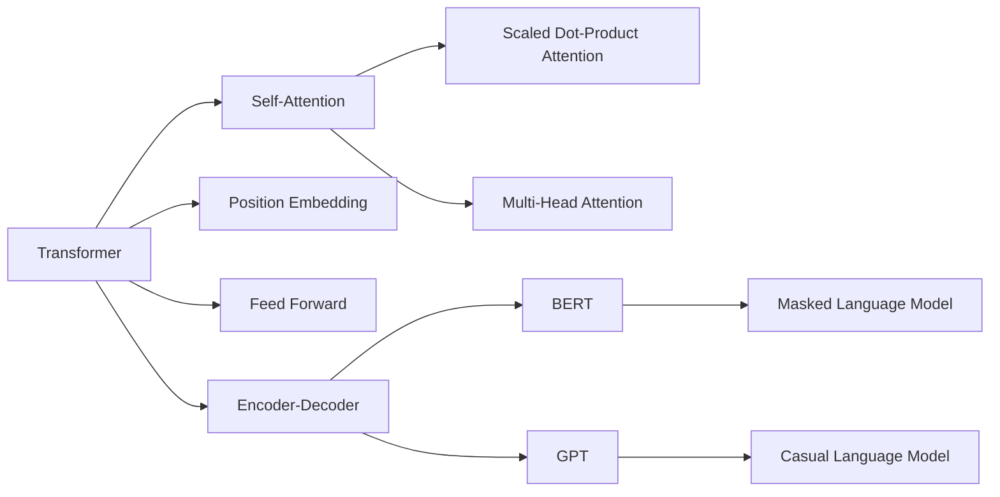

# 大语言模型原理基础与前沿 Transformer

## 1. 背景介绍
### 1.1 问题的由来
近年来,自然语言处理(NLP)领域取得了突飞猛进的发展,尤其是大规模预训练语言模型的出现,极大地推动了NLP技术的进步。从2018年谷歌提出的BERT模型,到2019年OpenAI发布的GPT-2模型,再到2020年微软和Nvidia联合推出的Megatron-LM,语言模型的规模和性能不断刷新着记录。这些大语言模型展现出了惊人的语言理解和生成能力,在机器翻译、问答系统、文本摘要等众多NLP任务上取得了state-of-the-art的表现。

### 1.2 研究现状
当前,大语言模型的研究主要集中在两个方面:模型架构的改进和训练数据的扩充。在模型架构方面,Transformer[1]的提出是一个里程碑式的工作。Transformer抛弃了此前主流的RNN/CNN等结构,完全依靠Attention机制来建模文本序列,大幅提升了并行计算效率。此后,各种基于Transformer的变体如BERT[2]、GPT[3]、XLNet[4]等相继问世,在模型规模、训练技巧等方面不断创新。在训练数据方面,研究者们通过爬取互联网数据构建了超大规模的无标注文本语料库,如OpenWebText[5]、CC-100[6]等,为训练高质量的语言模型提供了数据基础。

### 1.3 研究意义 
大语言模型具有广泛的应用前景。首先,它为NLP下游任务提供了强大的文本表示能力,通过在大规模语料上预训练得到的词向量和句向量可以显著提升下游任务的性能。其次,大语言模型具备一定的常识推理和语言生成能力,在智能问答、知识图谱构建等领域有着巨大的应用潜力。此外,大语言模型还为探索通用人工智能(AGI)提供了新的思路。当前的语言模型虽然还无法真正理解语言的内在语义,但它们已经展现出了初步的语言理解和逻辑推理能力,这为未来实现AGI奠定了重要基础。

### 1.4 本文结构
本文将围绕大语言模型的原理、架构、训练等核心问题展开深入探讨。第2章介绍大语言模型涉及的核心概念。第3章重点剖析Transformer的网络结构和Attention机制。第4章从数学角度推导Transformer的关键公式。第5章通过代码实例讲解如何实现并训练Transformer模型。第6章总结了大语言模型的典型应用场景。第7章梳理了相关的学习资源。第8章对大语言模型的未来发展趋势和面临的挑战进行了展望。

## 2. 核心概念与联系

在探讨大语言模型之前,我们有必要厘清其中涉及的几个核心概念:

- 语言模型:语言模型是一种对语言进行建模的方法,旨在学习单词序列的概率分布。形式化地,给定单词序列$w_1, w_2, ..., w_n$,语言模型的目标是估计条件概率$P(w_i|w_1, w_2, ..., w_{i-1})$。传统的语言模型如N-gram[7]主要基于单词的共现频率进行建模,而神经网络语言模型(NNLM)[8]则利用神经网络学习单词的分布式表示,大幅提升了建模能力。

- 预训练:预训练是指在大规模无标注语料上训练通用的语言表示模型,然后将其应用到下游的NLP任务中。预训练分为特定任务的预训练和跨任务的预训练。前者针对特定任务(如机器翻译)训练模型,而后者旨在学习通用的语言表示,可迁移到各种NLP任务。BERT等大语言模型主要采用跨任务预训练的范式。

- Transformer:Transformer[1]是一种基于Self-Attention的神经网络模型,最初提出用于机器翻译任务。不同于RNN按时间步顺序建模文本,Transformer引入位置编码(Position Embedding)表示单词的顺序信息,通过Self-Attention学习任意两个单词之间的依赖关系,从而实现了高效的并行计算。Transformer已成为当前大语言模型的主流架构。

- Self-Attention:Self-Attention[9]也称为内部注意力(Intra-Attention),是Transformer的核心组件。对于输入序列的每个位置,Self-Attention计算该位置与序列中所有位置的相关性,生成该位置的新表示。通过堆叠多层Self-Attention,Transformer能够建模长距离的语言依赖关系。Self-Attention的计算可以并行化,因此大大加速了模型训练。

- Masked Language Model:Masked Language Model(MLM)[2]是BERT的核心预训练任务,也是各类大语言模型的常用训练范式。MLM随机Mask掉输入文本中的一部分单词,然后训练模型根据上下文预测被Mask单词,从而学习到语言的上下文表示能力。与传统的从左到右的语言模型不同,MLM能够融合左右两侧的语境信息。

下图展示了Transformer与其他核心概念之间的关系:

可以看到,Transformer通过引入Self-Attention、位置编码等创新设计,构建了强大的语言建模能力。基于Transformer衍生出了BERT、GPT等大语言模型,它们分别采用了MLM和传统的从左到右语言模型作为预训练任务,在海量语料上学习通用语言表示,为NLP领域带来了革命性的变革。

## 3. 核心算法原理 & 具体操作步骤
### 3.1 算法原理概述
Transformer[1]模型的核心是Self-Attention机制和Feed Forward神经网络,通过堆叠多个Encoder和Decoder层构成完整的Transformer结构。下面我们对Transformer的算法原理进行概述:

- Embedding层:将离散的单词映射为连续的向量表示。包括单词embedding和位置embedding两部分,分别表示单词的语义信息和顺序信息。

- Encoder层:由多个Encoder堆叠而成,每个Encoder包含两个子层:Multi-Head Self-Attention和Position-wise Feed Forward。前者学习序列内部的依赖关系,后者对特征进行非线性变换。

- Decoder层:由多个Decoder堆叠而成,每个Decoder包含三个子层:Masked Multi-Head Self-Attention、Multi-Head Context-Attention和Position-wise Feed Forward。Masked Self-Attention对目标序列进行Self-Attention,但只能看到当前位置之前的信息。Context-Attention在目标端引入源端的Attention信息。

- Linear层和Softmax层:将Decoder输出的特征向量映射为单词的概率分布,用于生成最终的译文。

Transformer的核心创新在于采用Self-Attention代替RNN来对序列进行建模。Self-Attention通过计算序列中任意两个位置之间的相关性,直接学习长距离依赖,且可以高效并行计算。此外,Transformer还引入了Multi-Head Attention,将Attention拆分为多个子空间进行计算,增强了模型的表达能力。

### 3.2 算法步骤详解

下面我们对Transformer的算法步骤进行详细拆解:

**Encoder:**
1. Input Embedding:将输入序列$\mathbf{x}=(x_1,\ldots,x_n)$映射为向量序列$\mathbf{E_x}=(e_1,\ldots,e_n)$,其中$e_i$是第$i$个单词的embedding向量。

2. Positional Encoding:为每个单词的embedding添加位置编码向量,表示单词在序列中的位置信息。位置编码可以通过正余弦函数生成:

$$
\begin{aligned}
PE_{(pos,2i)} &= sin(pos / 10000^{2i/d_{model}}) \\
PE_{(pos,2i+1)} &= cos(pos / 10000^{2i/d_{model}})
\end{aligned}
$$

其中,$pos$表示单词位置,$i$表示维度,$d_{model}$为embedding维度。

3. Multi-Head Self-Attention:将embedding序列输入到Multi-Head Self-Attention中,计算序列内部的依赖关系。Multi-Head Attention将输入线性映射到$h$个子空间,在每个子空间分别进行Scaled Dot-Product Attention[1],然后将结果拼接并再次线性映射得到输出。公式如下:

$$
\begin{aligned}
MultiHead(\mathbf{Q},\mathbf{K},\mathbf{V}) &= Concat(head_1,\ldots,head_h)\mathbf{W}^O \\
head_i &= Attention(\mathbf{Q}\mathbf{W}_i^Q, \mathbf{K}\mathbf{W}_i^K, \mathbf{V}\mathbf{W}_i^V)
\end{aligned}
$$

其中,$\mathbf{Q},\mathbf{K},\mathbf{V}$分别表示query、key和value矩阵,$\mathbf{W}_i^Q, \mathbf{W}_i^K, \mathbf{W}_i^V$是第$i$个head的权重矩阵。

Scaled Dot-Product Attention的计算公式为:

$$
Attention(\mathbf{Q},\mathbf{K},\mathbf{V}) = softmax(\frac{\mathbf{Q}\mathbf{K}^T}{\sqrt{d_k}})\mathbf{V}
$$

直观地看,Attention矩阵$\mathbf{A}=softmax(\frac{\mathbf{Q}\mathbf{K}^T}{\sqrt{d_k}})$表示query与每个key之间的相关性,然后用Attention矩阵对value进行加权求和,得到query的新表示。

4. Feed Forward:Multi-Head Attention的输出经过一个两层的全连接前馈网络,对特征进行非线性变换。公式为:

$$
FFN(x)=max(0, x\mathbf{W}_1 + b_1)\mathbf{W}_2 + b_2
$$

5. Add & Norm:Multi-Head Attention和Feed Forward的输出都要经过残差连接(Residual Connection)和Layer Normalization[10]。公式为:

$$
\begin{aligned}
x &= LayerNorm(x + Sublayer(x)) \\
Sublayer(x) &= MultiHead(x) \text{ or } FFN(x)
\end{aligned}
$$

**Decoder:**
Decoder的结构与Encoder类似,也是由多层堆叠而成,每一层包含三个子层:
1. Masked Multi-Head Self-Attention:与Encoder的Self-Attention类似,但在计算Attention矩阵时,通过mask将未来的位置信息屏蔽掉,保证当前位置只能看到之前的信息。

2. Multi-Head Context-Attention:以Decoder的Self-Attention输出为query,Encoder的输出为key和value,计算目标端与源端的Attention。

3. Feed Forward:与Encoder的Feed Forward层相同。

Decoder的输出经过Linear层和Softmax层,得到最终的单词概率分布。

### 3.3 算法优缺点

Transformer相比传统的RNN/CNN等模型,主要有以下优点:
- 并行计算:Transformer抛弃了RNN的顺序结构,各个位置的计算可以完全并行,大大提高了训练和推理速度。
- 长距离依赖:通过Self-Attention,Transformer可以直接建模任意两个位置之间的依赖关系,更容易捕捉长距离的语言结构。
- 参数高效:Transformer不同层之间可以共享参数,显著减少了模型参数量。

但Transformer也存在一些局限性:
- 位置编码:Transformer需要显式地加入位置编码,而RNN天然能够建模序列的顺序信息。目前常用的正余弦位置编码在处理极长文本时可能出现周期性的问题。
- 全局Self-Attention:标准的Self-Attention需要计算序列中任意两个位置的关系,计算复杂度为平方级别。当序列长度较长时,内存消耗和计算时间会变得难以承受。需要引入一些稀疏化的Attention机制[11]。
- 先验知识:与LSTM等模型相比,Transformer更依赖数据驱动学习语言知识,而缺乏显式的先验结构。如何将先验知识引入Transformer仍是一个开放的问题。

### 3.4 算法应用领域
Transformer最初提出时主要应用于机器翻译任务,但由于