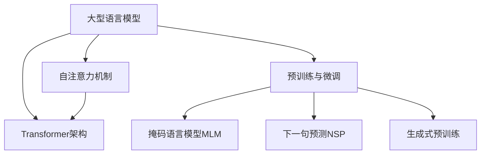

以下是根据您的要求撰写的技术博客文章《大语言模型原理基础与前沿 单位缩放》的正文部分：

# 大语言模型原理基础与前沿 单位缩放

## 1. 背景介绍

### 1.1 问题的由来

在过去的几年里,大型语言模型(Large Language Models, LLMs)在自然语言处理(NLP)领域取得了令人瞩目的进展。传统的NLP模型往往专注于特定任务,如机器翻译、文本摘要或问答系统等,而大型语言模型则旨在通过预训练学习通用的语言表示,从而在广泛的下游任务中发挥作用。

随着计算能力的不断提高和海量文本数据的积累,训练大规模语言模型成为可能。以GPT-3为代表的大型语言模型展现出了惊人的泛化能力,可以在看似无关的任务上表现出色,引发了学术界和工业界的广泛关注。然而,这些模型也面临着一些挑战,如对抗性样本、知识一致性、可解释性等问题,限制了它们在实际应用中的发挥。

### 1.2 研究现状

目前,大型语言模型的研究主要集中在以下几个方面:

1. **模型架构优化**:探索更高效的Transformer架构变体,如Reformer、Longformer等,以提高模型的计算效率和长期依赖建模能力。

2. **预训练策略创新**:开发新颖的预训练目标和数据策略,如ELECTRA、BART等,以获得更加通用和强大的语言表示。

3. **知识融入**:将外部知识库或结构化数据融入语言模型,提高模型的事实一致性和推理能力。

4. **可解释性增强**:设计可解释的注意力机制和输出解释模块,增强模型的可解释性和可信度。

5. **多模态建模**:将视觉、语音等多模态信息融入语言模型,实现更加通用的多模态理解和生成。

6. **模型压缩和加速**:通过量化、蒸馏、稀疏化等技术,压缩大型模型的计算和存储开销,提高其在资源受限环境中的应用能力。

7. **安全性和鲁棒性**:研究对抗性攻击和缓解偏见等问题,提高模型的安全性和鲁棒性。

### 1.3 研究意义

大型语言模型的研究对于推进自然语言处理技术具有重要意义:

1. **通用语言智能**:大型语言模型有望成为通用的语言智能模型,为各种下游任务提供强大的语言理解和生成能力,推动NLP技术的广泛应用。

2. **知识融合与推理**:通过融入外部知识和增强推理能力,语言模型可以更好地捕捉语义和上下文信息,为构建真正的"通用人工智能"(AGI)奠定基础。

3. **多模态交互**:将视觉、语音等多模态信息融入语言模型,有助于实现更自然、高效的人机交互方式,为智能助手、虚拟现实等应用提供支持。

4. **可解释性与可信度**:增强语言模型的可解释性和可信度,有助于提高人工智能系统的透明度和可控性,促进人工智能技术的负责任发展和社会接受度。

### 1.4 本文结构

本文将全面介绍大型语言模型的基础原理和前沿发展动态。首先阐述核心概念和关键技术,包括自注意力机制、Transformer架构、预训练策略等。接下来详细讲解核心算法原理和数学模型,并通过案例分析加深理解。然后介绍实际应用场景和代码实现细节。最后,探讨未来发展趋势和面临的挑战,并给出工具和资源推荐。

## 2. 核心概念与联系

大型语言模型的核心概念主要包括:

1. **自注意力机制(Self-Attention)**:自注意力机制是Transformer模型的核心组件,它通过计算输入序列中每个位置与其他位置的相关性,捕捉长距离依赖关系,从而更好地建模序列数据。

2. **Transformer架构**:Transformer是一种全新的序列到序列(Seq2Seq)模型架构,它完全基于自注意力机制,摒弃了传统的递归神经网络(RNN)和卷积神经网络(CNN)结构,在机器翻译等任务上取得了卓越表现。

3. **预训练与微调(Pre-training and Fine-tuning)**:预训练是指在大规模无监督文本数据上训练语言模型,学习通用的语言表示;微调则是在特定下游任务上继续训练预训练模型,使其适应目标任务。这种"预训练+微调"的范式是大型语言模型的关键训练策略。

4. **掩码语言模型(Masked Language Modeling, MLM)**:MLM是一种常用的预训练目标,它通过随机掩蔽输入序列中的部分词元,并训练模型预测被掩蔽的词元,从而学习上下文语义表示。

5. **下一句预测(Next Sentence Prediction, NSP)**:NSP是另一种常用的预训练目标,它训练模型判断两个句子是否相邻,以捕捉句子间的关系和语义一致性。

6. **生成式预训练(Generative Pre-training)**:生成式预训练策略(如GPT模型)直接训练模型生成下一个词元的概率分布,而不是预测被掩蔽的词元。这种策略更接近实际的语言生成任务。

这些核心概念相互关联、环环相扣,共同构建了大型语言模型的理论基础和技术框架。自注意力机制赋予了Transformer强大的长期依赖建模能力;预训练策略使模型在大规模数据上学习通用的语言表示;微调则使模型适应特定的下游任务。通过这些创新技术的有机结合,大型语言模型展现出了令人惊叹的泛化性能。

## 3. 核心算法原理 & 具体操作步骤

### 3.1 算法原理概述

大型语言模型的核心算法是**Transformer**,它完全基于**自注意力(Self-Attention)机制**,摒弃了传统的RNN和CNN结构。自注意力机制通过计算输入序列中每个位置与其他位置的相关性,捕捉长距离依赖关系,从而更好地建模序列数据。

Transformer的主要组件包括**编码器(Encoder)**和**解码器(Decoder)**,它们都由多个相同的层组成,每层包含**多头自注意力(Multi-Head Self-Attention)**和**前馈神经网络(Feed-Forward Neural Network)**两个子层。

在预训练阶段,Transformer以**自回归(Auto-Regressive)**的方式训练,即根据前面的上下文预测下一个词元。常用的预训练目标包括**掩码语言模型(MLM)**和**下一句预测(NSP)**等。

在微调阶段,根据不同的下游任务,对预训练模型进行进一步训练,使其适应目标任务的输入输出格式和目标函数。

### 3.2 算法步骤详解

以下是Transformer的自注意力机制和预训练算法的具体步骤:

**1. 自注意力机制**

对于输入序列 $X = (x_1, x_2, ..., x_n)$,自注意力机制的计算过程如下:

(1) 线性投影:将输入序列 $X$ 分别投影到查询(Query)、键(Key)和值(Value)空间,得到 $Q$、$K$、$V$。

$$Q = XW^Q, K = XW^K, V = XW^V$$

其中 $W^Q$、$W^K$、$W^V$ 为可学习的权重矩阵。

(2) 注意力计算:计算查询 $Q$ 与所有键 $K$ 的相似度,得到注意力分数矩阵 $A$。

$$A = \text{softmax}(\frac{QK^T}{\sqrt{d_k}})$$

其中 $d_k$ 为缩放因子,用于防止内积值过大导致梯度饱和。

(3) 加权求和:将注意力分数 $A$ 与值 $V$ 相乘,得到加权和作为自注意力的输出 $Z$。

$$Z = AV$$

(4) 残差连接和层归一化:将自注意力输出 $Z$ 与输入 $X$ 相加,再进行层归一化,得到最终输出 $X'$。

$$X' = \text{LayerNorm}(X + Z)$$

**2. 预训练算法**

以掩码语言模型(MLM)为例,预训练算法的步骤如下:

(1) 随机掩蔽:在输入序列中随机选择 15% 的词元进行掩蔽,其中 80% 用特殊标记 [MASK] 替换、10% 保持不变、10% 替换为随机词元。

(2) 前向计算:将掩蔽后的输入序列输入Transformer模型,计算每个掩蔽位置的词元概率分布。

(3) 损失计算:将预测的词元概率分布与真实词元的one-hot编码计算交叉熵损失。

(4) 梯度反传:根据损失对模型参数进行梯度更新,使预测的词元概率分布逼近真实分布。

通过上述自注意力机制和预训练算法,Transformer模型可以在大规模无监督文本数据上学习通用的语言表示,为下游任务的微调奠定基础。

### 3.3 算法优缺点

**优点:**

1. **并行计算**:自注意力机制完全基于矩阵运算,可以高效利用GPU并行计算能力,加速训练过程。

2. **长期依赖建模**:与RNN相比,自注意力机制可以直接捕捉输入序列中任意两个位置之间的依赖关系,更好地建模长期依赖。

3. **位置无关性**:Transformer不受序列长度限制,可以处理任意长度的输入,适用于各种序列数据。

4. **多任务泛化**:通过预训练和微调范式,大型语言模型展现出了强大的多任务泛化能力。

**缺点:**

1. **计算复杂度高**:自注意力机制需要计算输入序列中所有位置对的相似度,计算复杂度为 $O(n^2)$,对长序列而言计算代价较高。

2. **缺乏位置信息**:Transformer本身无法直接获取输入序列的位置信息,需要额外引入位置编码。

3. **预训练数据量需求大**:为了获得良好的泛化性能,大型语言模型需要在海量无监督数据上预训练,对计算资源和数据需求较高。

4. **可解释性较差**:自注意力机制的"黑盒"特性导致模型的决策过程缺乏透明度和可解释性。

### 3.4 算法应用领域

大型语言模型及其核心算法Transformer广泛应用于自然语言处理的各个领域,包括但不限于:

1. **机器翻译**:Transformer最初就是为机器翻译任务而设计,在多种语言对的翻译质量上超过了传统的序列到序列模型。

2. **文本生成**:利用Transformer的自回归生成能力,可以生成高质量的文本内容,如新闻报道、小说故事、代码注释等。

3. **文本摘要**:通过预训练和微调,Transformer可以学习文本摘要的映射关系,生成高质量的文本摘要。

4. **对话系统**:将Transformer应用于对话场景,可以构建具有上下文理解能力的对话代理,提供自然流畅的人机对话体验。

5. **关系抽取**:利用Transformer捕捉长期依赖的能力,可以更好地识别文本中的实体关系,提升关系抽取的性能。

6. **情感分析**:通过预训练获得通用的语义表示,Transformer可以更精准地捕捉文本中的情感倾向。

7. **问答系统**:将Transformer与知识库相结合,可以构建具有推理能力的问答系统,回答复杂的事实性和推理性问题。

8. **代码理解与生成**:将Transformer应用于源代码数