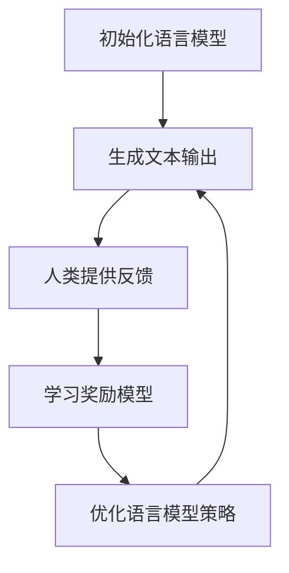

# 大语言模型原理基础与前沿 基于人类反馈的强化学习

## 1. 背景介绍

### 1.1 问题的由来

在过去的几年里,自然语言处理(NLP)领域取得了长足的进步,很大程度上归功于transformer模型和大规模语言模型(LLM)的出现。这些模型通过在海量文本数据上进行预训练,学习到了丰富的语言知识,在下游任务中表现出色。然而,现有的LLM存在一些固有缺陷,例如:

1. **知识的静态性**: 预训练后的LLM知识是静态的,无法动态更新和学习新知识。
2. **缺乏交互性**: LLM无法根据人类反馈进行持续学习和改进。
3. **缺乏因果推理能力**: LLM难以学习和推理复杂的因果关系。
4. **缺乏常识推理能力**: LLM在常识推理任务上表现欠佳。
5. **缺乏可解释性**: LLM的决策过程是一个黑箱,缺乏透明度和可解释性。

为了解决这些问题,研究人员提出了基于人类反馈的强化学习(Human Feedback Reinforcement Learning, HFRL)范式。HFRL旨在通过人机交互,利用人类的反馈信号来持续优化和强化语言模型,从而提高其性能和可解释性。

### 1.2 研究现状

目前,HFRL在NLP领域引起了广泛关注,成为一个热门研究方向。多家科技公司和研究机构都在积极探索HFRL技术,包括OpenAI、DeepMind、Google等。他们提出了多种HFRL算法和框架,例如:

- **InstructGPT**: OpenAI提出的基于人类反馈微调的LLM。
- **Constitutional AI**: OpenAI提出的通过宪法性约束来控制LLM行为的框架。
- **Reward Modeling**: DeepMind提出的基于人类偏好学习奖励模型的方法。
- **Cooperative AI**: Google提出的基于人机协作的LLM优化框架。

这些方法通过不同的技术路线,探索如何利用人类反馈来优化LLM的性能、可解释性和可控性。

### 1.3 研究意义

HFRL技术对于构建下一代智能系统具有重要意义:

1. **提高LLM性能**: 通过持续学习和优化,HFRL有望显著提高LLM在各种任务上的性能。
2. **增强LLM可解释性**: 引入人类反馈,有助于理解LLM的决策过程,提高其透明度和可解释性。
3. **增强LLM可控性**: HFRL为控制和约束LLM行为提供了新的途径,有助于构建更加安全和可靠的人工智能系统。
4. **推动人机协作**: HFRL促进人机协作,为人工智能系统提供持续学习和优化的能力,实现真正的人机协同。

### 1.4 本文结构

本文将全面介绍HFRL的基础理论、核心算法、实践应用和未来趋势。具体内容安排如下:

- 第2章介绍HFRL的核心概念和基本原理。
- 第3章详细阐述HFRL的核心算法原理和具体操作步骤。
- 第4章推导HFRL相关的数学模型和公式,并通过案例进行讲解。
- 第5章提供HFRL的代码实现示例,并对关键代码进行解读和分析。
- 第6章介绍HFRL在实际应用场景中的应用,并展望未来发展方向。
- 第7章推荐HFRL相关的学习资源、开发工具和研究论文。
- 第8章总结HFRL的研究成果,分析未来发展趋势和面临的挑战。
- 第9章列出HFRL常见问题及解答。

## 2. 核心概念与联系

在介绍HFRL的核心算法之前,我们先来了解一些基本概念和原理。

### 2.1 强化学习基础

强化学习(Reinforcement Learning, RL)是机器学习的一个重要分支,旨在让智能体(Agent)通过与环境(Environment)的交互,学习如何选择最优行为策略(Policy),以最大化累积奖励(Reward)。

强化学习系统通常包含以下四个核心要素:

1. **环境(Environment)**: 智能体所处的外部世界,智能体通过与环境交互来获取信息和反馈。
2. **智能体(Agent)**: 在环境中执行行为的主体,目标是学习最优策略以获得最大累积奖励。
3. **状态(State)**: 描述环境当前状况的信息集合。
4. **奖励(Reward)**: 环境对智能体行为的反馈信号,用于指导智能体优化策略。

强化学习算法的目标是找到一个最优策略$\pi^*$,使得在该策略下,智能体能获得最大的期望累积奖励:

$$\pi^* = \arg\max_\pi \mathbb{E}_\pi\left[\sum_{t=0}^\infty \gamma^t r_t\right]$$

其中,$\gamma$是折现因子,用于平衡即时奖励和长期奖励的权重。

### 2.2 人类反馈强化学习

人类反馈强化学习(Human Feedback Reinforcement Learning, HFRL)是将强化学习范式应用于语言模型优化的一种新颖方法。在HFRL中,人类扮演环境的角色,通过提供反馈信号(如文本评分、修改建议等)来指导语言模型(智能体)优化其策略。

具体来说,HFRL系统包含以下核心组成部分:

1. **语言模型(Agent)**: 即智能体,负责生成文本输出。
2. **人类反馈(Environment)**: 人类对语言模型输出的评价和反馈,作为环境的奖励信号。
3. **奖励模型(Reward Model)**: 根据人类反馈,学习一个奖励函数,用于评估语言模型输出的质量。
4. **策略优化(Policy Optimization)**: 根据奖励模型,优化语言模型的策略,使其能生成更高质量的文本输出。

通过不断的人机交互,HFRL系统持续优化语言模型,使其输出越来越符合人类的期望和偏好。

### 2.3 HFRL与其他方法的联系

HFRL与其他一些相关技术存在密切联系:

1. **监督学习**: HFRL可以看作是一种延迟监督学习(Delayed Supervised Learning)的形式,人类反馈相当于延迟的监督信号。
2. **主动学习(Active Learning)**: HFRL系统可以主动询问人类,获取高质量的反馈数据,这与主动学习的思想相似。
3. **在线学习(Online Learning)**: HFRL通过持续的人机交互,实现了语言模型的在线学习和优化。
4. **对抗训练(Adversarial Training)**: HFRL中的人类可以被视为一个"对手",通过提供具有挑战性的反馈来促进语言模型的优化。
5. **元学习(Meta Learning)**: HFRL系统需要学习如何高效利用人类反馈进行优化,这与元学习的目标一致。

综合利用这些技术,有望进一步提升HFRL系统的性能和鲁棒性。

## 3. 核心算法原理 & 具体操作步骤

### 3.1 算法原理概述

HFRL算法的核心思想是通过人类反馈来优化语言模型的策略,使其生成的文本输出越来越符合人类的期望。算法的基本流程如下:

1. 初始化一个语言模型(Agent)。
2. 让语言模型生成文本输出。
3. 人类(Environment)对文本输出提供反馈(奖励信号)。
4. 根据人类反馈,学习一个奖励模型(Reward Model)。
5. 使用强化学习算法(如策略梯度),根据奖励模型优化语言模型的策略。
6. 重复步骤2-5,直到语言模型的性能满足要求。

在这个过程中,关键是如何构建高质量的奖励模型,以及如何高效地优化语言模型的策略。下面我们将详细介绍一些常用的HFRL算法。

### 3.2 算法步骤详解

#### 3.2.1 初始化语言模型

HFRL算法通常以一个预训练的语言模型(如GPT、BERT等)作为初始Agent。这些模型已经在大规模语料库上进行了预训练,学习到了丰富的语言知识,为后续的优化奠定了基础。

#### 3.2.2 生成文本输出

语言模型根据给定的提示(Prompt)或上下文,生成一段文本输出。这个过程可以是自回归(Autoregressive)的,也可以是一次性生成(Non-Autoregressive)。

#### 3.2.3 人类提供反馈

人类会对语言模型的文本输出进行评价,提供反馈信号。反馈的形式可以是:

1. **评分(Rating)**: 对输出文本的质量打分,如1-5分等级制。
2. **修改(Edit)**: 直接修改输出文本中的错误部分。
3. **评论(Comment)**: 对输出文本提出文字评论和建议。
4. **比较(Comparison)**: 比较多个候选输出,选择最佳的一个。

获取高质量的人类反馈是HFRL算法的关键,因此需要精心设计反馈收集的方式和界面。

#### 3.2.4 学习奖励模型

根据收集到的人类反馈数据,我们需要学习一个奖励模型(Reward Model),用于评估语言模型输出的质量。奖励模型可以是:

1. **回归模型(Regression Model)**: 将反馈评分作为监督信号,学习一个回归模型来预测输出文本的分数。
2. **分类模型(Classification Model)**: 将反馈分类(如好/坏)作为监督信号,学习一个分类模型来判断输出文本的质量。
3. **基于规则(Rule-based)**: 根据一些手工定义的规则和启发式,设计奖励函数。
4. **基于偏好(Preference-based)**: 根据人类对多个候选输出的偏好,学习一个排序模型作为奖励函数。

奖励模型的质量直接影响到HFRL算法的性能,因此需要采用先进的机器学习技术来构建高质量的奖励模型。

#### 3.2.5 优化语言模型策略

有了奖励模型,我们就可以使用强化学习算法来优化语言模型的策略,使其生成的文本输出获得更高的奖励。常用的优化算法包括:

1. **策略梯度(Policy Gradient)**: 通过计算策略梯度,对语言模型的参数进行更新,提高期望奖励。
2. **Q-Learning**: 学习一个Q函数来评估(状态,行为)对的价值,并根据Q值优化策略。
3. **Actor-Critic**: 结合策略梯度和Q-Learning,使用Critic来估计价值函数,指导Actor的策略优化。
4. **进化策略(Evolutionary Strategies)**: 通过对策略参数的随机扰动,选择获得更高奖励的变体作为下一代。

在优化过程中,我们还需要考虑探索(Exploration)与利用(Exploitation)的平衡,以及如何处理奖励的延迟(Delayed Reward)和稀疏性(Sparse Reward)等问题。

#### 3.2.6 算法收敛与终止条件

HFRL算法是一个迭代优化的过程,需要设置合理的终止条件。常用的终止条件包括:

1. **最大迭代次数**: 预设一个最大迭代次数,达到后算法终止。
2. **收敛阈值**: 当语言模型的性能(如奖励值)在一定迭代次数内没有显著提高,则认为算法已收敛。
3. **人工评估**: 由人工对语言模型的输出进行评估,当满足预期要求时终止算法。

### 3.3 算法优缺点

HFRL算法相比传统的语言模型优化方法,具有以下优势:

1. **持续学习能力**: 通过人机交互,语言模型可以持续学习和优化,不断提高性能。
2. **增强可解释性