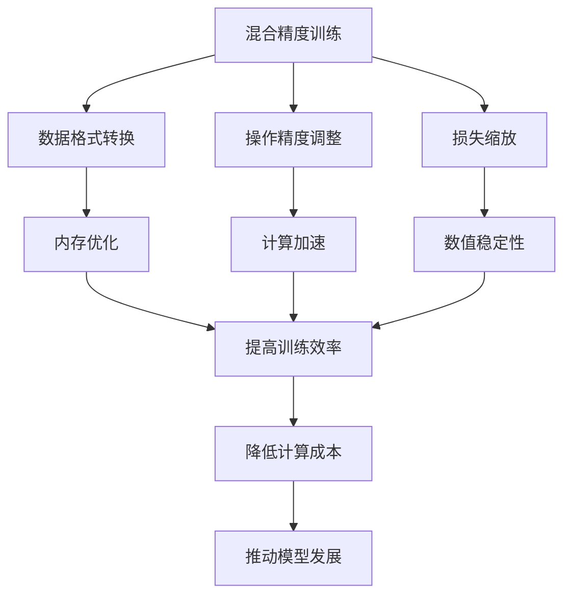

# 大语言模型原理基础与前沿 混合精度

## 1. 背景介绍

### 1.1 问题的由来

在过去几年中,大型语言模型(Large Language Models, LLMs)在自然语言处理(NLP)领域取得了令人瞩目的进展。这些模型通过在大规模语料库上进行预训练,学习了丰富的语言知识和上下文信息,展现出惊人的生成和理解能力。然而,训练这些庞大的模型需要消耗大量计算资源,导致了高昂的计算成本和碳排放。

为了在保持模型性能的同时降低计算开销,混合精度训练(Mixed Precision Training)成为了一种备受关注的技术。传统的深度学习模型通常使用32位浮点数(FP32)进行计算和存储,但实际上,许多操作并不需要如此高的精度。混合精度训练通过在合适的位置使用较低精度的数据表示(如16位浮点数FP16或更低),可以显著降低内存占用和计算量,从而加速训练过程并减少能源消耗。

### 1.2 研究现状

虽然混合精度训练在计算机视觉和科学计算领域已经得到广泛应用,但将其应用于大型语言模型训练仍然面临着诸多挑战。语言模型通常涉及大量的矩阵乘法和softmax等操作,这些操作对数值精度要求较高,直接降低精度可能会导致数值不稳定和性能下降。

目前,一些研究工作已经开始探索在大型语言模型训练中应用混合精度。例如,OpenAI在训练GPT-3模型时使用了混合精度技术,据报告可以将训练时间缩短50%。微软也在DeepSpeed库中集成了混合精度支持,用于训练大型模型。然而,现有工作大多集中在特定的模型架构或框架上,缺乏对混合精度在语言模型中的系统性研究和指导原则。

### 1.3 研究意义

混合精度训练技术在大型语言模型中的应用具有重要的理论和实践意义:

1. **降低计算成本**:通过减少内存占用和计算量,混合精度可以显著降低训练大型语言模型所需的硬件资源和能源消耗,从而降低成本并促进可持续发展。

2. **提高训练效率**:减少计算量意味着可以在相同硬件条件下加速训练过程,缩短模型迭代周期,加快研究进展。

3. **推动模型发展**:降低训练成本有助于研究人员探索更大更复杂的模型架构,推动语言模型的性能不断提高。

4. **理论指导**:系统研究混合精度在语言模型中的应用,可以为未来的模型设计和优化提供理论指导和最佳实践。

综上所述,深入探索混合精度在大型语言模型训练中的应用,对于降低计算成本、提高训练效率、推动模型发展以及建立理论指导具有重要意义。

### 1.4 本文结构

本文将系统地探讨混合精度在大型语言模型训练中的应用。我们将从介绍混合精度训练的基本概念和原理开始,然后重点分析在语言模型中应用混合精度时需要考虑的关键因素和挑战。接下来,我们将详细介绍一种通用的混合精度训练框架,包括数据格式转换、操作精度调整和损失缩放等核心组件。此外,我们还将提供具体的代码示例,展示如何在实践中应用混合精度训练。最后,我们将总结混合精度训练在语言模型中的最新研究进展,并探讨未来的发展趋势和挑战。

## 2. 核心概念与联系



混合精度训练(Mixed Precision Training)是一种在深度学习模型训练过程中同时使用多种数值精度的技术。其核心思想是在不影响模型精度的前提下,尽可能使用较低精度的数据格式(如FP16或更低)进行计算和存储,从而减少内存占用和计算量,提高训练效率和能源利用率。

混合精度训练通常包括以下三个关键组件:

1. **数据格式转换**:将模型参数和激活值从高精度(通常为FP32)转换为低精度格式(如FP16),以节省内存并加速计算。

2. **操作精度调整**:根据不同操作的数值稳定性要求,选择合适的精度进行计算。例如,对于数值敏感的操作(如softmax),可以使用较高精度(如FP32)进行计算,而对于其他操作则使用较低精度。

3. **损失缩放**:由于使用较低精度可能会导致数值下溢或上溢,因此需要对损失函数进行适当的缩放,以保持数值稳定性和收敛性。

这三个组件相互关联,共同实现了在保持模型精度的同时提高训练效率的目标。具体来说:

- 数据格式转换可以优化内存利用率,减少内存带宽需求。
- 操作精度调整可以加速计算密集型操作,如矩阵乘法和卷积运算。
- 损失缩放可以确保数值稳定性,防止梯度下溢或上溢,从而保证模型收敛。

通过上述优化,混合精度训练可以显著降低大型语言模型训练所需的计算资源和能源消耗,从而降低计算成本。同时,由于训练过程加速,也有助于推动模型架构的发展和迭代。因此,混合精度训练在大型语言模型领域具有重要的理论和实践意义。

## 3. 核心算法原理 & 具体操作步骤

### 3.1 算法原理概述

混合精度训练算法的核心思想是在深度学习模型的前向传播和反向传播过程中,根据不同操作的数值稳定性要求,动态调整计算和存储所使用的数据精度。具体来说,算法包括以下几个关键步骤:

1. **数据格式转换**:将模型参数和激活值从高精度(通常为FP32)转换为低精度格式(如FP16),以节省内存并加速计算。

2. **前向传播**:在前向传播过程中,对于数值敏感的操作(如softmax),使用较高精度(如FP32)进行计算,以保持数值稳定性。对于其他操作,则使用较低精度(如FP16)进行计算,以提高计算效率。

3. **损失计算**:由于使用较低精度可能会导致数值下溢或上溢,因此需要对损失函数进行适当的缩放,以保持数值稳定性和收敛性。常见的缩放方法包括动态损失缩放和静态损失缩放。

4. **反向传播**:在反向传播过程中,需要根据前向传播中使用的精度,动态调整梯度的精度。对于使用较高精度计算的操作,需要将梯度转换为较高精度;对于使用较低精度计算的操作,则可以使用较低精度进行梯度计算,以提高效率。

5. **参数更新**:最后,使用混合精度计算得到的梯度来更新模型参数,通常需要将梯度转换为FP32精度,以保持参数的数值精度和收敛性。

通过上述步骤,混合精度训练算法可以在保持模型精度的同时,显著降低内存占用和计算量,从而加速训练过程并减少能源消耗。

### 3.2 算法步骤详解

下面我们将详细解释混合精度训练算法的具体实现步骤:

1. **数据格式转换**

   在训练开始之前,需要将模型参数和输入数据从FP32格式转换为FP16格式。这一步骤可以通过张量核心库(如PyTorch或TensorFlow)提供的数据类型转换函数来实现。

   ```python
   import torch

   # 将模型参数转换为FP16
   model.half()

   # 将输入数据转换为FP16
   input_data = input_data.half()
   ```

2. **前向传播**

   在前向传播过程中,对于数值敏感的操作(如softmax),需要使用FP32精度进行计算,以保持数值稳定性。对于其他操作,则可以使用FP16精度进行计算,以提高效率。

   ```python
   # 将输入数据转换为FP32
   input_data = input_data.float()

   # 使用FP32进行softmax计算
   output = torch.softmax(model(input_data), dim=-1)

   # 将输出转换为FP16
   output = output.half()
   ```

3. **损失计算与缩放**

   由于使用较低精度可能会导致数值下溢或上溢,因此需要对损失函数进行适当的缩放,以保持数值稳定性和收敛性。常见的缩放方法包括动态损失缩放和静态损失缩放。

   动态损失缩放:

   ```python
   # 初始化缩放因子
   loss_scale = 2**16

   # 计算缩放后的损失
   scaled_loss = loss * loss_scale

   # 反向传播并更新参数
   scaled_loss.backward()
   optimizer.step()

   # 更新缩放因子
   ...
   ```

   静态损失缩放:

   ```python
   # 设置静态缩放因子
   loss_scale = 2**12

   # 计算缩放后的损失
   scaled_loss = loss * loss_scale

   # 反向传播并更新参数
   scaled_loss.backward()
   optimizer.step()
   ```

4. **反向传播**

   在反向传播过程中,需要根据前向传播中使用的精度,动态调整梯度的精度。对于使用FP32计算的操作,需要将梯度转换为FP32;对于使用FP16计算的操作,则可以使用FP16进行梯度计算,以提高效率。

   ```python
   # 将梯度转换为FP32
   for param in model.parameters():
       if param.grad is not None:
           param.grad = param.grad.float()

   # 更新参数
   optimizer.step()

   # 将参数转换为FP16
   model.half()
   ```

5. **参数更新**

   最后,使用混合精度计算得到的梯度来更新模型参数。通常需要将梯度转换为FP32精度,以保持参数的数值精度和收敛性。

   ```python
   # 将梯度转换为FP32
   for param in model.parameters():
       if param.grad is not None:
           param.grad = param.grad.float()

   # 更新参数
   optimizer.step()

   # 将参数转换为FP16
   model.half()
   ```

通过上述步骤,混合精度训练算法可以在保持模型精度的同时,显著降低内存占用和计算量,从而加速训练过程并减少能源消耗。

### 3.3 算法优缺点

混合精度训练算法在降低计算成本和提高训练效率方面具有显著优势,但也存在一些潜在的缺点和挑战。

**优点**:

1. **降低内存占用**:通过使用较低精度的数据格式(如FP16),可以显著减少模型参数和中间激活值所占用的内存空间,从而支持更大的模型或批量大小。

2. **加速计算**:在现代GPU和加速器上,使用较低精度(如FP16)进行计算通常可以获得更高的吞吐量和并行度,从而加速训练过程。

3. **节省能源**:由于计算量减少,混合精度训练可以显著降低能源消耗,有利于环境可持续发展。

4. **降低成本**:减少对昂贵的高端硬件(如GPU)的需求,从而降低了训练大型语言模型的整体成本。

**缺点和挑战**:

1. **数值不稳定性**:使用较低精度可能会导致数值下溢或上溢,影响模型收敛性和精度。需要通过损失缩放等技术来缓解这一问题。

2. **软件支持**:不同的深度学习框架和硬件平台对混合精度的支持程度不同,可能需要进行定制开发和优化。

3. **性能调优**:为了获得最