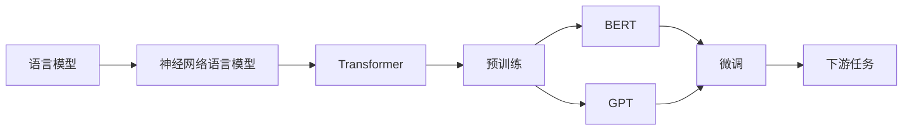

# 大语言模型原理基础与前沿评估

关键词：大语言模型、Transformer、BERT、GPT、预训练、微调、评估

## 1. 背景介绍 
### 1.1 问题的由来
近年来,随着深度学习技术的快速发展,自然语言处理(NLP)领域取得了突破性进展。其中,大语言模型(Large Language Model,LLM)作为NLP的核心技术之一,受到了学术界和工业界的广泛关注。大语言模型通过在海量文本数据上进行预训练,可以学习到丰富的语言知识和语义表示,进而在下游任务中取得优异表现。

### 1.2 研究现状  
当前,大语言模型的研究主要集中在模型结构、预训练方法、微调技术等方面。从ELMo、GPT到BERT等里程碑式的工作,大语言模型的性能不断刷新记录。同时,围绕大语言模型的评估方法也日益完善,从传统的词嵌入评估、句子相似度,到GLUE、SuperGLUE等大型评测基准,为模型效果的客观衡量提供了重要参考。

### 1.3 研究意义
大语言模型作为通用的语言理解基础设施,对自然语言处理乃至人工智能的发展具有重大意义。一方面,大语言模型为NLP下游任务提供了更好的语义表示,有望突破传统方法的瓶颈;另一方面,大语言模型蕴含的海量知识,为知识获取、问答系统等应用开辟了新的可能。系统梳理大语言模型的原理基础与前沿进展,对于推动NLP技术创新具有重要价值。

### 1.4 本文结构
本文将围绕大语言模型的原理基础与前沿进展展开论述。第2部分介绍大语言模型的核心概念;第3部分重点阐述Transformer结构和预训练方法;第4部分从数学角度对模型原理进行建模分析;第5部分给出典型模型的代码实现;第6部分讨论大语言模型的应用场景;第7部分推荐相关学习资源;第8部分对全文进行总结展望。

## 2. 核心概念与联系
大语言模型的核心概念包括:

- 语言模型:刻画文本序列生成概率的概率模型,是NLP的基础。  
- 神经网络语言模型:基于神经网络的语言模型,相比n-gram等传统模型更强大。
- 预训练:在大规模无标注语料上训练通用语言表示的范式。
- 微调:在特定任务数据上调整预训练模型参数,使其适应下游任务。
- Transformer:一种完全基于注意力机制的神经网络结构,是大语言模型的主流架构。
- BERT:基于双向Transformer的大规模预训练模型,在多个NLP任务上取得突破。 
- GPT:基于单向Transformer的生成式预训练模型,在文本生成任务上表现出色。

这些概念环环相扣,共同构成了大语言模型的理论和实践基础。下图展示了它们之间的逻辑联系:

## 3. 核心算法原理 & 具体操作步骤
### 3.1 算法原理概述
Transformer是大语言模型的核心算法,其基本原理可概括为:通过自注意力机制(Self-Attention)建模文本序列内部的长距离依赖关系,从而学习到更好的上下文语义表示。具体来说,Transformer编码器通过多头自注意力和前馈神经网络,逐层提取输入文本的高层次特征;解码器同样采用类似结构,并引入编码-解码注意力机制,生成目标文本序列。

### 3.2 算法步骤详解
Transformer的编码器和解码器都由若干相同的层堆叠而成,每一层包含两个子层:多头自注意力(Multi-head Self-attention)和前馈神经网络(Feed-Forward Network)。其中,多头自注意力的计算步骤如下:

1. 将输入文本序列$X$通过三个线性变换,分别得到查询矩阵$Q$、键矩阵$K$和值矩阵$V$:

$$
\begin{aligned}
Q &= XW^Q \\
K &= XW^K \\
V &= XW^V
\end{aligned}
$$

2. 计算查询矩阵和键矩阵的相似度得分,并进行缩放和 softmax 归一化:

$$
\text{Attention}(Q,K,V) = \text{softmax}(\frac{QK^T}{\sqrt{d_k}})V
$$

3. 将上述过程重复 $h$ 次,得到 $h$ 个注意力头,并将它们拼接起来:

$$
\text{MultiHead}(Q,K,V) = \text{Concat}(\text{head}_1,...,\text{head}_h)W^O
$$

其中,$\text{head}_i=\text{Attention}(QW_i^Q,KW_i^K,VW_i^V)$。

4. 将多头注意力的输出通过残差连接和层归一化,并经过前馈神经网络,得到最终的编码表示:

$$
\begin{aligned}
Z &= \text{LayerNorm}(X+\text{MultiHead}(Q,K,V)) \\
\text{Output} &= \text{LayerNorm}(Z+\text{FFN}(Z))
\end{aligned}
$$

解码器的计算过程与编码器类似,只是在自注意力子层之后多了一个编码-解码注意力子层,用于关联编码器的输出。

### 3.3 算法优缺点
Transformer相比RNN等序列模型,具有以下优点:
- 并行计算能力强,训练速度快。
- 通过自注意力机制直接建模长距离依赖,无需递归计算。
- 可以同时捕捉序列的全局和局部特征。

但Transformer也存在一些局限:
- 计算复杂度随序列长度平方增长,难以处理超长文本。
- 位置编码方式相对简单,位置信息建模能力有限。
- 解释性不强,注意力矩阵难以直观理解。

### 3.4 算法应用领域
得益于其强大的特征提取和语义建模能力,Transformer已成为大语言模型的主流架构,广泛应用于以下领域:

- 机器翻译:如 Google 的 Neural Machine Translation 系统
- 文本摘要:如 BertSum、PreSumm 等模型 
- 问答系统:如 XLNet 在 SQuAD2.0 上的表现
- 情感分析:如 RoBERTa 在 SST-2 数据集上的效果
- 命名实体识别:如 BERT 在 CoNLL-2003 任务上的精度
- 文本分类:如 XLNet 在 IMDB、Yelp 全文分类上的优异表现

此外,Transformer 还被用于语音识别、图像字幕、推荐系统等领域,展现出广阔的应用前景。

## 4. 数学模型和公式 & 详细讲解 & 举例说明
### 4.1 数学模型构建
大语言模型的数学原理可以用概率图模型来刻画。设输入文本序列为 $\mathbf{x}=(x_1,...,x_T)$,模型参数为 $\theta$,语言模型的目标是最大化如下似然函数:

$$
L(\theta)=\sum_{t=1}^T\log P(x_t|x_1,...,x_{t-1};\theta)
$$

其中,$P(x_t|x_1,...,x_{t-1};\theta)$表示在给定前 $t-1$ 个词的条件下,第 $t$ 个词 $x_t$ 的条件概率。传统的 n-gram 语言模型通过平滑方法估计这一概率,而神经网络语言模型则用神经网络拟合这一概率分布。

以 Transformer 为例,设编码器的输出为 $\mathbf{h}^{enc}$,解码器在 $t$ 时刻的隐状态为 $\mathbf{h}_t^{dec}$,则解码概率可表示为:

$$
P(x_t|\mathbf{x}_{<t},\mathbf{h}^{enc};\theta) = \text{softmax}(W\mathbf{h}_t^{dec}+b)
$$

其中,$W$和$b$为输出层的参数。将上式代入似然函数并最大化,即可得到 Transformer 语言模型的训练目标。

### 4.2 公式推导过程
以 Transformer 的编码器自注意力计算为例,详细推导其前向传播公式。首先,输入文本序列 $\mathbf{x}$ 经过词嵌入和位置编码,得到输入表示 $\mathbf{e}\in\mathbb{R}^{T\times d}$。然后,通过线性变换得到查询矩阵 $\mathbf{Q}$、键矩阵 $\mathbf{K}$ 和值矩阵 $\mathbf{V}$:

$$
\begin{aligned}
\mathbf{Q} &= \mathbf{e}\mathbf{W}^Q \\
\mathbf{K} &= \mathbf{e}\mathbf{W}^K \\ 
\mathbf{V} &= \mathbf{e}\mathbf{W}^V
\end{aligned}
$$

其中,$\mathbf{W}^Q,\mathbf{W}^K,\mathbf{W}^V\in\mathbb{R}^{d\times d_k}$为可学习的投影矩阵。接下来,计算自注意力权重矩阵 $\mathbf{A}$:

$$
\mathbf{A} = \text{softmax}(\frac{\mathbf{Q}\mathbf{K}^T}{\sqrt{d_k}})
$$

其中,缩放因子 $\sqrt{d_k}$ 用于控制点积结果的方差。最后,将注意力权重矩阵与值矩阵相乘,得到自注意力输出:

$$
\text{Attention}(\mathbf{Q},\mathbf{K},\mathbf{V}) = \mathbf{A}\mathbf{V}
$$

多头注意力的计算可以看作多个独立的自注意力并行,再将结果拼接:

$$
\begin{aligned}
\text{head}_i &= \text{Attention}(\mathbf{Q}\mathbf{W}_i^Q,\mathbf{K}\mathbf{W}_i^K,\mathbf{V}\mathbf{W}_i^V) \\
\text{MultiHead}(\mathbf{Q},\mathbf{K},\mathbf{V}) &= \text{Concat}(\text{head}_1,...,\text{head}_h)\mathbf{W}^O
\end{aligned}
$$

其中,$\mathbf{W}_i^Q,\mathbf{W}_i^K,\mathbf{W}_i^V\in\mathbb{R}^{d\times d_k},\mathbf{W}^O\in\mathbb{R}^{hd_k\times d}$。最终,多头注意力的输出经过残差连接和层归一化,再通过前馈网络,得到编码器的输出表示。

### 4.3 案例分析与讲解
下面以一个简单的例子直观展示 Transformer 编码器的自注意力计算过程。设输入序列为["I","like","playing","basketball"],词嵌入维度为4,位置编码后的输入表示为:

$$
\mathbf{e}=\begin{bmatrix}
0.1 & 0.2 & 0.3 & 0.4\\ 
0.5 & 0.6 & 0.7 & 0.8\\
0.9 & 1.0 & 1.1 & 1.2\\
1.3 & 1.4 & 1.5 & 1.6
\end{bmatrix}
$$

假设自注意力头数为2,投影矩阵参数如下:

$$
\mathbf{W}^Q_1=\begin{bmatrix}
1 & 0 \\ 0 & 1 \\ 2 & 0 \\ 0 & 2
\end{bmatrix},
\mathbf{W}^K_1=\begin{bmatrix}
1 & 1 \\ 1 & 1 \\ 0 & 2 \\ 2 & 0  
\end{bmatrix},
\mathbf{W}^V_1=\begin{bmatrix}
2 & 0 \\ 0 & 2 \\ 1 & 1 \\ 1 & 1
\end{bmatrix}
$$

$$
\mathbf{W}^Q_2=\begin{bmatrix}
0 & 1 \\ 1 & 0 \\ 2 & 0 \\ 0 & 2
\end{bmatrix},
\mathbf{