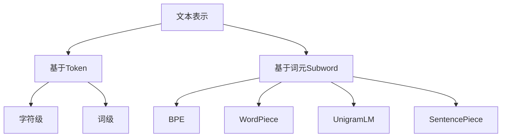

# 大语言模型原理基础与前沿 词元级检索

## 1. 背景介绍

### 1.1 问题的由来

在自然语言处理(NLP)领域,大型语言模型已经成为一个研究热点。随着数据和计算能力的不断增长,训练大规模语言模型成为可能。这些模型能够捕捉丰富的语言现象,并在许多下游任务中表现出色。然而,现有的大型语言模型通常将文本表示为一系列token(通常是字或词),这可能会导致一些问题。

首先,基于token的表示忽略了单词内部的结构信息,如词根、词缀等,这些信息对于理解单词语义是很有帮助的。其次,token粒度过粗可能会导致数据稀疏问题,特别是对于那些罕见的或新出现的单词。最后,基于token的表示通常需要一个固定的词表,这使得模型难以适应新的单词或领域。

为了解决这些问题,研究人员提出了词元(subword)级别的表示方法,如Byte对编码(BPE)、WordPiece等。这些方法将单词拆分为更小的词元单元,从而捕捉单词内部的结构信息,缓解数据稀疏问题,并具有更好的可扩展性。词元级表示已被证明在多个任务中比基于token的方法表现更好。

### 1.2 研究现状

目前,词元级表示已经被广泛应用于自然语言处理任务中。一些知名的预训练语言模型,如BERT、GPT-2等,都采用了词元级表示。此外,一些新的词元表示方法也被提出,如UnigramLM、SentencePiece等,试图进一步提高表示质量。

然而,现有的词元级表示方法仍然存在一些局限性。例如,它们通常是基于统计方法进行子词切分,缺乏语义信息;切分策略也可能不够合理,导致一些有意义的词被错误拆分。此外,现有方法大多是基于单语种语料训练的,跨语种的表示质量可能不够理想。

### 1.3 研究意义

发展高质量的词元级表示方法,对于构建更强大的语言模型至关重要。合理的词元切分不仅能捕捉单词内部结构,还能缓解数据稀疏问题,从而提高模型的泛化能力。此外,跨语种的词元表示也有助于解决多语种场景下的挑战。

本文将系统地介绍词元级表示的原理和最新进展,包括核心算法、数学模型、实现细节等,旨在为读者提供全面的理解。我们还将探讨词元级表示在实际应用中的案例,以及未来的发展方向和挑战。

### 1.4 本文结构

本文的结构安排如下:

- 第2部分介绍词元级表示的核心概念和与其他表示方法的联系;
- 第3部分详细阐述词元级表示的核心算法原理和具体操作步骤;
- 第4部分构建数学模型,推导公式,并通过案例分析进行讲解;
- 第5部分提供项目实践,包括代码实例和详细解释;
- 第6部分探讨词元级表示在实际应用中的场景;
- 第7部分推荐相关工具和学习资源;
- 第8部分总结研究成果,展望未来发展趋势和面临的挑战;
- 第9部分是附录,回答一些常见问题。

## 2. 核心概念与联系

词元(subword)级表示是一种将单词拆分为更小单元的方法,旨在捕捉单词内部的结构信息,缓解数据稀疏问题,并提高表示的可扩展性。它与基于token(字或词)的表示方法形成对比,后者将单词作为最小单元进行处理。



基于token的表示方法包括字符级和词级两种主要形式。字符级表示将每个字符视为一个token,能够很好地捕捉单词形态,但计算代价较高。词级表示则将每个单词视为一个token,计算效率更高,但可能遇到数据稀疏和无法处理新词的问题。

相比之下,词元级表示方法通过将单词拆分为多个子词元(subword)单元,能够在一定程度上结合两者的优点。常见的词元表示算法包括:

- **Byte对编码(BPE)**: 基于统计信息,反复将最频繁的连续字节对合并为新的词元,直到达到目标词表大小。
- **WordPiece**: 与BPE类似,但合并的是最可能出现的词片段,而不仅限于连续字节对。
- **UnigramLM**: 基于单元统计信息构建一个单元语言模型,将单词拆分为概率最高的子词序列。
- **SentencePiece**: 结合了BPE和UnigramLM的优点,能够更好地处理罕见词和新词。

这些算法能够自动从语料中学习合理的切分策略,生成高质量的词元表示。与基于token的方法相比,词元级表示通常能取得更好的性能表现。

## 3. 核心算法原理与具体操作步骤

在这一部分,我们将详细介绍词元级表示的核心算法原理和具体操作步骤,并分析它们的优缺点和适用场景。

### 3.1 算法原理概述

词元级表示算法的核心思想是:通过合理的切分策略,将单词拆分为多个有意义的子词单元(subword units),以捕捉单词内部的结构信息。具体来说,算法会从语料库中学习一个合适的词元词表(subword vocabulary),然后使用该词表对文本进行切分和编码。

不同的词元算法在切分策略和词表生成方式上有所不同,但都遵循以下基本步骤:

1. **初始化词表**: 通常以语言的字符集作为初始词表。
2. **统计词元统计信息**: 从语料库中统计不同词元序列的出现频率或概率等统计信息。
3. **合并词元**: 根据统计信息,确定应该合并哪些词元序列,形成新的词元。
4. **更新词表**: 将新形成的词元添加到词表中。
5. **重复步骤2-4**: 直到达到目标词表大小或满足其他停止条件。
6. **切分和编码**: 使用最终生成的词表对文本进行切分和编码。

不同算法在具体实现上会有所差异,我们将在后面对它们进行详细介绍。

### 3.2 算法步骤详解

#### 3.2.1 Byte对编码(BPE)算法

BPE算法最早被提出用于数据压缩,后来也被应用于NLP任务中的词元表示。它的核心思想是:反复将语料库中最频繁出现的连续字节对(byte pair)合并为新的词元,直到达到目标词表大小。算法步骤如下:

1. **初始化词表**为语言的字符集。
2. **计算字节对频率**:遍历语料库,统计所有连续字节对的出现频率。
3. **合并最频繁字节对**:选择频率最高的字节对(ab),用一个新的字节块(Z)替换语料库中所有出现的(ab)。在词表中添加新字节块Z。
4. **重复步骤2-3**:直到词表达到目标大小或满足其他停止条件。

例如,对于单词"low"和"newer",初始字节序列为:

```
l o w e r n e w
```

假设(ow)是最频繁的字节对,则将其合并为新字节块(Z):

```
l Z er n ew
```

接下来,如果(er)是新的最频繁字节对,则可将其合并为(X):

```
l Z X n ew
```

如此反复进行,最终可以得到较短的字节序列表示单词。

BPE算法的优点是无监督、简单高效;缺点是合并策略过于机械,可能会导致一些子词缺乏语义。

#### 3.2.2 WordPiece算法

WordPiece算法与BPE类似,也是基于统计信息对词元进行合并,但合并的对象不仅限于连续字节对,还包括任意长度的词片段(word piece)。算法步骤如下:

1. **初始化词表**为所有可能出现的字符以及一个特殊的结尾标记[END]。
2. **计算词片段分数**:对于每个长度在[1,最大长度]范围内的词片段,计算其在语料库中的出现频率得分。
3. **合并最高分词片段**:选择得分最高的词片段,将其添加到词表中。
4. **更新语料库**:用新添加的词元替换语料库中所有出现的该词片段。
5. **重复步骤2-4**:直到达到目标词表大小或满足其他停止条件。

例如,假设"low"、"er"和"new"都是当前词表中的条目,对于"lower"和"newer"这两个单词,WordPiece算法可能会先将"er"作为一个词元添加到词表中,因为它的得分很高;然后才会考虑添加"low"和"new"。

相比BPE,WordPiece算法的合并策略更加灵活,能够捕捉到一些有意义的较长词根或词缀。但它也可能遗漏一些低频但有意义的子词。

#### 3.2.3 UnigramLM算法

UnigramLM算法的思路是:先基于语料库构建一个字符级的统计语言模型,然后将单词拆分为该模型下概率最大的子词序列。具体步骤如下:

1. **构建字符级UnigramLM**:统计语料库中每个字符的出现频率,得到一个字符级的概率分布模型。
2. **对每个单词进行切分**:
    a. 对于每个单词,枚举所有可能的切分方式; 
    b. 根据UnigramLM计算每种切分的概率;
    c. 选择概率最大的切分作为最终结果。
3. **构建词元词表**:将所有切分出的子词收集并去重,作为最终的词元词表。

例如,对于单词"lower",假设字符级UnigramLM给出的概率分布为:

```
P(l)=0.2, P(o)=0.3, P(w)=0.1, P(e)=0.3, P(r)=0.1
```

那么单词"lower"的所有可能切分及对应概率为:

```
l ow er : 0.2 * 0.3 * 0.1 * 0.3 * 0.1 = 0.00018
low er : 0.3 * 0.1 * 0.3 * 0.1 = 0.00009
...
```

可以看出,"low"和"er"这种切分方式的概率最大,因此"lower"将被切分为两个词元。

UnigramLM算法的优点是切分更加合理,能够较好地处理罕见词和新词;缺点是计算开销较大,需要枚举所有切分可能。

#### 3.2.4 SentencePiece算法

SentencePiece算法是Google提出的一种新的词元表示方法,它结合了BPE和UnigramLM两种算法的优点。算法步骤如下:

1. **初始化词表**为所有可能出现的字符。
2. **构建字符级UnigramLM**:与UnigramLM算法类似,基于语料库构建字符级统计语言模型。
3. **计算候选词元分数**:对于所有可能的词元序列(包括单个字符),计算其在语料库中的出现频率得分,以及根据UnigramLM计算的概率得分,将两者结合作为该词元的综合分数。
4. **合并最高分词元**:选择综合分数最高的词元序列,将其添加到词表中。
5. **更新语料库**:用新添加的词元替换语料库中所有出现的该词元序列。
6. **重复步骤3-5**:直到达到目标词表大小或满足其他停止条件。

SentencePiece算法结合了BPE的高效性和UnigramLM的合理性,能够生成高质量的词元表示。它不仅能够很好地处理常见词,还能够较好地切分罕见词和新词。

### 3.3 算法优缺点