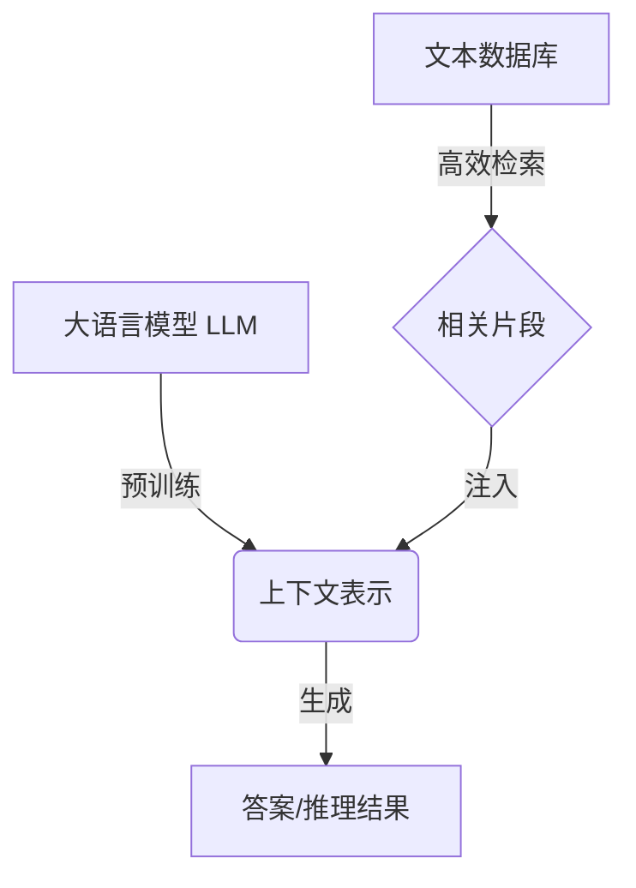

# 大语言模型原理基础与前沿 通过高效和精简检索进行问答和多跳推理

## 1. 背景介绍

### 1.1 问题的由来

在当今信息时代,海量的文本数据被不断产生和积累。如何有效地从这些庞大的文本数据中快速检索出相关信息,并基于检索结果进行问答和推理,成为了一个亟待解决的挑战。传统的信息检索方法往往基于关键词匹配,难以捕捉语义层面的相关性,且无法支持复杂的推理任务。

### 1.2 研究现状  

近年来,benefitting from the rapid development of deep learning and large-scale pretraining,大型语言模型(Large Language Models, LLMs)取得了令人瞩目的进展,展现出强大的自然语言理解和生成能力。一些基于 LLM 的检索增强模型(Retrieval-Augmented Language Models, RALMs)应运而生,旨在将 LLM 与高效的检索系统相结合,充分利用两者的优势。

RALMs 通过将文本数据库中的相关片段检索并注入到 LLM 中,使模型能够访问和利用更广泛的知识,从而提高问答和推理的准确性和全面性。然而,现有的 RALMs 在检索效率、知识利用和推理能力等方面仍存在一些局限性和挑战。

### 1.3 研究意义

设计高效、精简且具有强大推理能力的 RALM,对于充分发挥大型语言模型的潜力,并将其应用于实际的问答和推理任务中,具有重要的理论和实践意义。通过优化检索策略、知识融合方式和推理机制,可以极大提高 RALM 的性能,为各种复杂的自然语言处理任务提供强有力的支持。

### 1.4 本文结构

本文将全面探讨 RALM 在问答和多跳推理任务中的原理和前沿技术。我们将首先介绍 RALM 的核心概念和基本工作流程,然后深入探讨高效检索、知识融合和推理机制等关键技术,并结合数学模型、算法细节和代码实现进行详细阐述。最后,我们将分析 RALM 在实际应用场景中的使用,并展望其未来的发展趋势和挑战。

## 2. 核心概念与联系

大型语言模型(LLM)通过自监督预训练在大规模文本数据上学习上下文表示,获得了强大的自然语言理解和生成能力。然而,LLM 的知识仅限于预训练数据,无法涵盖所有领域的知识。

为了补充 LLM 的知识不足,检索增强语言模型(RALM)将高效的检索系统与 LLM 相结合。具体来说,RALM 首先从文本数据库中检索与当前任务相关的片段,然后将这些片段注入到 LLM 中,为模型提供额外的知识支持。通过融合来自检索结果的知识,RALM 能够产生更准确、更全面的答案或推理结果。

RALM 的关键在于高效检索相关片段、有效融合检索知识,以及基于融合知识进行推理的能力。接下来,我们将逐一探讨这些核心技术。

## 3. 核心算法原理 & 具体操作步骤

### 3.1 算法原理概述

RALM 的核心算法原理可以概括为以下三个主要步骤:

1. **高效检索**: 针对给定的查询(如问题或推理任务),从海量文本数据库中快速检索出最相关的片段。
2. **知识融合**: 将检索到的相关片段与查询以及 LLM 的先验知识进行融合,构建富含知识的上下文表示。
3. **推理生成**: 基于融合后的上下文表示,利用 LLM 的自然语言生成能力产生最终的答案或推理结果。

### 3.2 算法步骤详解

1. **高效检索**
   - 索引构建: 对文本数据库进行预处理,构建高效的向量索引(如基于近似最近邻搜索的索引)。
   - 相似性计算: 将查询和数据库中的文本片段编码为向量表示,计算查询向量与所有片段向量的相似性得分。
   - TopK 检索: 根据相似性得分,从索引中检索出与查询最相关的 Top K 个文本片段。

2. **知识融合**
   - 片段编码: 将检索到的 Top K 个文本片段和查询一起输入到 LLM 的编码器,获得它们的上下文表示向量。
   - 注意力融合: 通过注意力机制,动态地融合查询、片段和 LLM 的先验知识,构建富含知识的上下文表示。

3. **推理生成**
   - 条件生成: 将融合后的上下文表示作为条件,输入到 LLM 的解码器,生成最终的答案或推理序列。
   - 束搜索解码: 采用束搜索(Beam Search)等解码策略,生成多个候选答案/推理序列。
   - 重打分排序: 根据生成序列的概率和其他辅助信息(如长度惩罚),对候选答案/推理序列进行重新打分和排序。

### 3.3 算法优缺点

**优点**:
- 高效利用大规模文本数据库中的知识,补充 LLM 的知识不足。
- 通过注意力融合机制,灵活地整合查询、检索片段和 LLM 先验知识。
- 生成式模型,可自然地产生符合语义和语法的答案或推理序列。
- 支持开放式问答和多跳推理等复杂自然语言理解任务。

**缺点**:
- 检索效率受到数据库规模和索引质量的限制。
- 知识融合策略的有效性仍有提升空间。
- 生成式模型存在不确定性,需要重打分和后处理。
- 对长文本的处理能力有限,需要分块处理。

### 3.4 算法应用领域

RALM 算法可广泛应用于以下领域:

- 开放式问答系统
- 多跳推理任务(如阅读理解、常识推理等)
- 知识增强对话系统
- 智能助手和虚拟助理
- 知识图谱构建与推理
- 自动问答和解释生成

## 4. 数学模型和公式 & 详细讲解 & 举例说明

### 4.1 数学模型构建

为了形式化描述 RALM 的核心算法,我们构建了以下数学模型:

给定:
- 查询 $q$
- 文本数据库 $D = \{d_1, d_2, \dots, d_N\}$,包含 $N$ 个文本片段
- 大型语言模型 $M$,包括编码器 $E$ 和解码器 $G$

目标是生成与查询 $q$ 相关的最佳答案/推理序列 $y^*$:

$$y^* = \arg\max_{y} P(y|q, D; M)$$

其中, $P(y|q, D; M)$ 是在给定查询 $q$、数据库 $D$ 和模型 $M$ 的条件下,生成序列 $y$ 的条件概率。

为了高效计算该条件概率,我们将其分解为以下三个主要步骤:

1. **高效检索**

通过相似性函数 $\text{sim}(\cdot, \cdot)$,从数据库 $D$ 中检索出与查询 $q$ 最相关的 Top K 个片段:

$$\mathcal{R}_K(q, D) = \text{TopK}_{d \in D} \text{sim}(q, d)$$

2. **知识融合**

将查询 $q$ 和检索片段 $\mathcal{R}_K(q, D)$ 输入到编码器 $E$,获得融合后的上下文表示 $c$:

$$c = E(q, \mathcal{R}_K(q, D))$$

3. **推理生成**

将上下文表示 $c$ 输入到解码器 $G$,生成最终的答案/推理序列 $y$:

$$y = G(c)$$

在实际实现中,我们通常采用自注意力机制和Transformer架构来构建编码器 $E$ 和解码器 $G$,并使用近似最近邻搜索等技术来加速检索过程。

### 4.2 公式推导过程

我们将推导 RALM 模型中知识融合步骤的核心公式,说明如何将查询、检索片段和模型先验知识融合到统一的上下文表示中。

假设查询 $q$ 的向量表示为 $\mathbf{q}$,检索到的 Top K 个片段的向量表示为 $\{\mathbf{d}_1, \mathbf{d}_2, \dots, \mathbf{d}_K\}$,模型的先验知识表示为 $\mathbf{p}$。

我们首先计算查询向量 $\mathbf{q}$ 与每个片段向量 $\mathbf{d}_i$ 的相似性得分:

$$s_i = \text{sim}(\mathbf{q}, \mathbf{d}_i) = \frac{\mathbf{q}^\top \mathbf{d}_i}{\|\mathbf{q}\| \|\mathbf{d}_i\|}$$

然后,通过 Softmax 函数将相似性得分转换为注意力权重:

$$\alpha_i = \frac{\exp(s_i)}{\sum_{j=1}^K \exp(s_j)}$$

接下来,我们将查询向量 $\mathbf{q}$、片段向量 $\{\mathbf{d}_1, \dots, \mathbf{d}_K\}$ 和先验知识向量 $\mathbf{p}$ 进行加权求和,得到融合后的上下文表示向量 $\mathbf{c}$:

$$\mathbf{c} = \alpha_q \mathbf{q} + \sum_{i=1}^K \alpha_i \mathbf{d}_i + \alpha_p \mathbf{p}$$

其中, $\alpha_q$、$\alpha_p$ 分别是查询和先验知识的权重系数,可通过学习得到。

最终,我们将上下文表示向量 $\mathbf{c}$ 输入到解码器,生成最终的答案或推理序列。

### 4.3 案例分析与讲解

为了更好地理解 RALM 的工作原理,我们将通过一个具体案例进行分析和讲解。

**案例背景**:
假设我们需要构建一个开放式问答系统,能够回答涉及多个知识领域的复杂问题。我们拥有一个包含百科全书、新闻报道和技术手册等多源异构文本的大型数据库。

**问题示例**:
"什么是量子计算机?它是如何工作的?与传统计算机相比,量子计算机有哪些优势和局限性?"

**算法流程**:

1. **高效检索**
   - 系统将问题 "什么是量子计算机?它是如何工作的?与传统计算机相比,量子计算机有哪些优势和局限性?" 编码为向量表示 $\mathbf{q}$。
   - 在文本数据库中搜索与 $\mathbf{q}$ 最相似的片段,检索出 Top K 个相关片段,如:
     - 来自百科全书的"量子计算机"条目
     - 一篇介绍量子计算原理的科普文章
     - 一份量子算法研究报告的摘要
     - ...

2. **知识融合**
   - 将问题向量 $\mathbf{q}$ 和检索片段向量 $\{\mathbf{d}_1, \dots, \mathbf{d}_K\}$ 输入到编码器,计算注意力权重 $\{\alpha_1, \dots, \alpha_K\}$。
   - 根据注意力权重,将问题、片段和模型先验知识融合为统一的上下文表示向量 $\mathbf{c}$。

3. **推理生成**
   - 将上下文表示 $\mathbf{c}$ 输入到解码器,生成回答问题的序列,如:
     "量子计算机是一种利用量子力学原理进行计算的全新计算paradigm。它通过操纵量子比特(qubit)的量子态,能够同时处理多个可能的计算状态,从而在某些问题上展现出远超传统计算机的计算能力......"

通过这个案例,