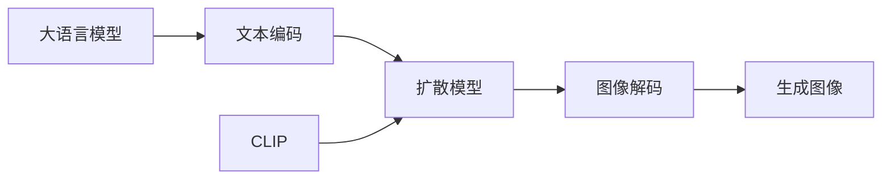

# 大语言模型原理基础与前沿 锁定图像调优

关键词：大语言模型、扩散模型、CLIP、图像调优、Textual Inversion、DreamBooth、LoRA

## 1. 背景介绍
### 1.1 问题的由来
随着人工智能技术的快速发展,大语言模型(LLM)在自然语言处理领域取得了巨大的突破。然而,如何将强大的语言理解能力与图像生成结合,实现高质量的文本到图像生成,仍然是一个巨大的挑战。近年来,以 DALL-E、Stable Diffusion、Midjourney 为代表的文图生成模型展现了令人惊叹的效果,掀起了一股 AI 绘画的热潮。这些模型大多基于扩散模型(Diffusion Model)和 CLIP 对比学习,通过海量的图文对进行训练,建立起语义与视觉的桥梁。然而,由于训练数据的限制,这类通用模型往往难以生成高度个性化、细节丰富的图像。因此,如何在通用扩散模型的基础上,实现高效的个性化微调,成为了当前的研究热点。

### 1.2 研究现状 
目前,主流的扩散模型个性化微调方法可分为以下三类:

1. **Textual Inversion**:通过学习一个文本嵌入向量,将特定概念映射到潜在空间,实现快速个性化。代表工作有 [An Image is Worth One Word](https://arxiv.org/abs/2208.01618)。

2. **DreamBooth**:引入一个预训练的分类器,在扩散模型的潜在空间中构建个性化先验,通过微调实现个性化生成。代表工作有 [DreamBooth: Fine Tuning Text-to-Image Diffusion Models for Subject-Driven Generation](https://arxiv.org/abs/2208.12242)。

3. **LoRA**:通过给扩散模型的注意力层添加低秩自适应层,实现参数高效微调。代表工作有 [LoRA: Low-Rank Adaptation of Large Language Models](https://arxiv.org/abs/2106.09685)。

尽管上述方法在个性化图像生成上取得了一定的进展,但如何在保证生成质量和效率的同时,最大限度地利用预训练模型的知识,仍有待进一步探索。

### 1.3 研究意义
个性化的文图生成模型在创意设计、游戏、电影、广告等诸多领域具有广阔的应用前景。通过对扩散模型进行高效微调,用户可以使用自然语言快速创作出符合特定需求的图像,大大提高生产力。同时,个性化模型的训练过程也为理解大语言模型和扩散模型的工作机制提供了新的视角。研究高效的个性化微调方法,不仅能够促进 AI 辅助内容创作的发展,也将推动认知科学和人工智能的理论创新。

### 1.4 本文结构
本文将围绕大语言模型个性化微调这一主题,重点介绍基于扩散模型的图像生成技术。第2部分将阐述大语言模型、扩散模型、CLIP 等核心概念及其内在联系。第3部分将详细讲解 Textual Inversion、DreamBooth、LoRA 等主流微调算法的原理和具体步骤。第4部分将建立个性化微调的数学模型,推导相关公式,并给出案例分析。第5部分将通过代码实例,演示如何利用开源框架实现个性化微调。第6部分将展望个性化文图生成模型的实际应用场景和未来发展方向。第7部分将推荐相关学习资源、开发工具和文献。最后,第8部分将总结全文,并对未来的研究趋势和挑战进行展望。

## 2. 核心概念与联系
在探讨个性化微调算法之前,我们有必要对几个核心概念进行梳理:

1. **大语言模型(LLM)**:以 Transformer 为基础架构,在大规模语料上进行预训练,具备强大的语言理解和生成能力。代表模型有 GPT-3、PaLM、BERT 等。

2. **文本到图像生成(T2I)**:利用深度学习模型,将文本描述转化为与之语义相关的图像。主流方法包括 GAN、扩散模型等。

3. **扩散模型(Diffusion Model)**:一种基于马尔可夫链的生成模型,通过迭代地向数据分布添加噪声和去噪,逐步生成高质量的图像。代表模型有 DDPM、DDIM、Latent Diffusion 等。

4. **CLIP**:一种基于对比学习的多模态预训练模型,通过最大化图像和文本特征之间的余弦相似度,建立起视觉-语言的对齐。CLIP 常作为扩散模型的评价器,指导图像生成过程。

大语言模型为扩散模型提供了强大的语义理解能力,使其能够根据文本描述生成匹配的图像。而 CLIP 进一步增强了扩散模型的语言引导能力,使生成结果更加符合人类意图。个性化微调则在此基础上,通过引入特定风格的少量图片,快速适应新的图像领域,实现定制化生成。

下图展示了大语言模型、扩散模型、CLIP 在文图生成中的关系:

## 3. 核心算法原理 & 具体操作步骤
### 3.1 算法原理概述
个性化微调的核心思想是在保留预训练扩散模型的通用知识的同时,利用少量目标领域数据对其进行自适应。根据参数更新的粒度,可分为以下三种主流范式:

1. **Textual Inversion**:只训练一个与目标对象相关的文本嵌入向量,将其注入预训练的文本编码器,实现快速个性化。

2. **DreamBooth**:在潜在空间中构建目标对象的先验分布,通过微调扩散模型的解码器,使其能够生成符合先验的图像。

3. **LoRA**:在扩散模型的注意力层中插入低秩自适应层,通过微调这些附加参数,在不破坏原有知识的情况下,实现参数高效的个性化。

### 3.2 算法步骤详解
下面,我们以 Textual Inversion 为例,详细讲解其训练步骤:

1. 准备目标对象的少量图片(通常 3-5 张),并为其指定一个独特的文本标签,如 "a photo of *"。

2. 随机初始化一个与目标对象相关的文本嵌入向量 $v*$,将其添加到预训练文本编码器的嵌入矩阵中。

3. 将目标图片通过 CLIP 图像编码器,得到对应的图像特征 $f_i$。

4. 将文本标签通过文本编码器(包含新学习的 $v*$)编码,得到文本特征 $g_i$。

5. 计算图像特征和文本特征的余弦相似度损失:

$$L_\text{CLIP} = 1 - \frac{1}{N}\sum_{i=1}^N \frac{f_i \cdot g_i}{\lVert f_i \rVert \lVert g_i \rVert}$$

6. 计算重构损失。将目标图片 $x_i$ 通过扩散模型的正向过程加噪,得到 $\tilde{x}_i$,再通过反向过程重构,得到 $\hat{x}_i$。重构损失为:

$$L_\text{rec} = \frac{1}{N}\sum_{i=1}^N \lVert x_i - \hat{x}_i \rVert^2$$

7. 联合优化上述两个损失,更新文本嵌入向量 $v*$:

$$L = L_\text{CLIP} + \lambda L_\text{rec}$$

8. 重复步骤 3-7,直到收敛。

经过训练,文本嵌入向量 $v*$ 就学习到了目标对象的视觉语义表征,将其与预定义的文本标签一起输入扩散模型,即可实现个性化的图像生成。

### 3.3 算法优缺点
Textual Inversion 的优点在于:
- 参数开销小,只需训练一个文本嵌入向量
- 训练速度快,通常只需几分钟即可收敛
- 泛化能力强,学习到的概念可以自由组合

但其也存在一些局限性:
- 生成多样性有限,难以捕捉目标对象的细节
- 需要精心设计文本标签,对人工成本要求较高
- 容易受预训练模型知识的干扰,出现语义漂移

相比之下,DreamBooth 和 LoRA 通过微调更多的模型参数,在生成质量和多样性上有所提升,但训练成本也相应增加。

### 3.4 算法应用领域
个性化微调技术可应用于以下领域:

- **艺术创作**:根据用户提供的少量图片,生成特定风格的艺术作品,如油画、水彩画、插画等。

- **游戏开发**:根据概念图快速生成游戏角色、场景、道具等素材,提高开发效率。

- **电影特效**:根据演员照片生成数字替身,实现虚拟形象的个性化定制。

- **时尚设计**:根据设计师的手稿,自动生成服装、配饰等产品图,辅助设计流程。

- **广告营销**:根据产品形象,定制个性化的广告图片和视频,提升品牌识别度。

## 4. 数学模型和公式 & 详细讲解 & 举例说明
### 4.1 数学模型构建
我们以扩散模型为例,介绍其数学原理。扩散模型通过迭代地向数据分布添加高斯噪声,构建一个马尔可夫链:

$$q(x_t|x_{t-1}) = \mathcal{N}(x_t; \sqrt{1-\beta_t} x_{t-1}, \beta_t \mathbf{I})$$

其中 $\beta_t$ 为噪声强度,通常设置为从 0 到 1 逐渐增大的值。重复 $T$ 步后,数据分布被完全破坏,转化为标准高斯分布。

扩散模型的目标是学习一个逆向过程,从高斯噪声恢复出原始数据:

$$p_\theta(x_{t-1}|x_t) = \mathcal{N}(x_{t-1}; \mu_\theta(x_t, t), \sigma_\theta(x_t, t)^2\mathbf{I})$$

其中 $\mu_\theta$ 和 $\sigma_\theta$ 为神经网络参数化的均值和方差。训练时,最小化正向过程和逆向过程的变分下界:

$$L_\text{VLB} = \mathbb{E}_{q(x_{0:T})} \left[ -\log \frac{p_\theta(x_{0:T})}{q(x_{1:T}|x_0)} \right]$$

### 4.2 公式推导过程
为了得到 $L_\text{VLB}$ 的具体形式,我们首先利用贝叶斯公式展开 $\log p_\theta(x_{0:T})$:

$$\begin{aligned}
\log p_\theta(x_{0:T}) &= \log p_\theta(x_T) + \sum_{t=1}^T \log p_\theta(x_{t-1}|x_t) \\
&= \log p_\theta(x_T) + \sum_{t=1}^T \log \mathcal{N}(x_{t-1}; \mu_\theta(x_t, t), \sigma_\theta(x_t, t)^2\mathbf{I})
\end{aligned}$$

再利用高斯分布的概率密度函数,得到:

$$\begin{aligned}
L_\text{VLB} &= \mathbb{E}_{q(x_{0:T})} \left[ -\log p_\theta(x_T) - \sum_{t=1}^T \log \mathcal{N}(x_{t-1}; \mu_\theta(x_t, t), \sigma_\theta(x_t, t)^2\mathbf{I}) + \log q(x_{1:T}|x_0) \right] \\
&= \mathbb{E}_{q(x_{0:T})} \left[ \frac{1}{2} \lVert x_T \rVert^2 + \sum_{t=1}^T \left( \frac{1}{2\sigma_\theta(x_t, t)^2} \lVert x_{t-1} - \mu_\theta(x_t, t) \rVert