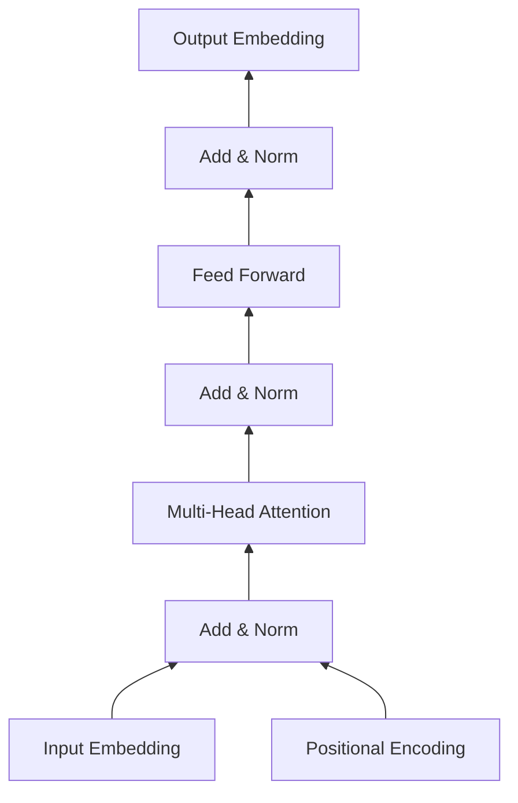

# 大语言模型应用指南：Transformer层

## 1. 背景介绍
### 1.1 问题的由来
近年来，随着深度学习的迅猛发展，自然语言处理(NLP)领域取得了巨大的突破。从早期的词袋模型、N-gram语言模型，到后来的RNN、LSTM等序列模型，再到如今风靡一时的Transformer模型，NLP技术正在飞速进步。其中，Transformer模型以其并行计算能力强、长程依赖捕捉能力强等优势脱颖而出，成为了当前NLP领域的主流模型。

然而，尽管Transformer在学术界和工业界都取得了巨大成功，但对于很多初学者和从业者来说，要真正理解并掌握Transformer的内部原理和实现细节并非易事。Transformer内部结构复杂，涉及大量的矩阵计算、注意力机制等数学知识，对新手的学习曲线较为陡峭。同时，由于Transformer应用领域广泛，不同场景下的模型架构、训练方法也各不相同，进一步加大了学习和应用的难度。

### 1.2 研究现状
目前，学术界对Transformer的研究可谓如火如荼。自从2017年Google首次提出Transformer模型以来，大量的研究工作都集中在如何改进和扩展Transformer架构，提高其性能和泛化能力。比如引入层归一化、残差连接等技巧增强模型的训练稳定性；使用相对位置编码替代绝对位置编码以提升灵活性；在Transformer基础上叠加CNN、RNN等其他结构形成更强大的混合模型等等。这些研究极大地推动了Transformer的发展，使其在机器翻译、阅读理解、文本摘要、对话系统等多个NLP任务上取得了SOTA的表现。

工业界对Transformer的应用也早已开始。Google、微软、Facebook、OpenAI等巨头纷纷推出了基于Transformer的大规模预训练语言模型，如BERT、GPT、XLNet等，并取得了惊人的效果。这些模型在下游任务上实现了零样本（zero-shot）或少样本（few-shot）学习，大大降低了任务适配的成本。同时，Transformer在搜索、广告、推荐等工业场景中也得到了广泛应用，为企业创造了巨大的商业价值。

### 1.3 研究意义
尽管Transformer取得了巨大成功，但其内部的工作原理对很多人来说仍是个黑盒。深入理解Transformer的内部结构和工作机制，对于进一步改进模型性能、设计更高效的架构、开发更智能的应用都具有重要意义。

首先，洞悉Transformer层的计算过程，有助于我们理解其捕捉长程依赖、实现并行计算的内在机理，从而可以更好地把控模型行为，避免一些常见的错误。其次，了解Transformer不同组件的功能和作用，如注意力层、前馈层等，可以帮助我们针对性地调整模型配置，设计出更高效、更轻量级的网络结构。再次，掌握Transformer在不同任务中的适配和优化方法，如何选取恰当的预训练模型，如何微调模型参数等，可以帮助我们快速构建起高质量的应用系统。

因此，本文希望通过对Transformer层的系统梳理和深入剖析，帮助读者全面把握其内部原理，提升Transformer相关理论知识和实践技能。同时，本文也将介绍一些Transformer的典型应用场景和案例，让读者学以致用，真正将Transformer大模型落地。

### 1.4 本文结构
本文将从以下几个方面展开论述：

第2部分，介绍Transformer的核心概念，如自注意力机制、位置编码、残差连接等，帮助读者理清其内部组件间的逻辑关系。

第3部分，详细讲解Transformer的核心算法原理，包括自注意力计算、前馈网络等，并给出详细的操作步骤，方便读者深入理解模型的前向传播过程。

第4部分，系统阐述Transformer涉及的关键数学知识，如矩阵乘法、Softmax归一化等，并辅以公式推导和案例分析，让读者夯实必要的数学基础。

第5部分，通过代码实例，演示如何从零开始实现一个Transformer模型，并解读其关键代码，帮助读者掌握Transformer的工程实践要点。

第6部分，梳理Transformer在机器翻译、文本生成、语义匹配等场景下的典型应用，展望其未来的发展方向。

第7部分，推荐一些Transformer相关的学习资源、开发工具和前沿论文，方便读者进一步研究学习。

第8部分，总结全文的核心内容，分析Transformer未来的机遇与挑战，并对下一步研究方向提出展望。

## 2. 核心概念与联系
Transformer模型的核心是自注意力机制（Self-Attention）。传统的序列模型如RNN通过迭代的方式逐步建模输入序列，难以实现高效的并行计算。而自注意力通过计算序列中任意两个位置之间的相关性，一步到位捕捉序列的全局依赖，且计算过程可以高度并行。

自注意力的计算分为三步：

1. 根据输入序列生成查询矩阵（Query）、键矩阵（Key）和值矩阵（Value）。
2. 计算Query和Key的相似度，得到注意力分布。
3. 将注意力分布施加到Value上，得到新的表示。

通过堆叠多个自注意力层，Transformer可以建模输入序列的多层次、多角度的语义信息。

除了自注意力，Transformer还引入了以下关键机制：

- 位置编码（Position Encoding）：由于自注意力对位置信息并不敏感，Transformer需要显式地将位置信息编码到输入表示中，常见的有正余弦位置编码、可学习位置编码等。

- 残差连接（Residual Connection）：在每一个子层（自注意力、前馈网络）之后，Transformer都会添加一个残差连接，即将子层输出与输入相加。这有助于缓解深层网络的优化难题。

- 层归一化（Layer Normalization）：在每一个子层之后，Transformer还会对残差相加的结果做层归一化操作，将输出缩放到零均值、单位方差。这可以加速模型收敛，提升训练稳定性。

- 多头注意力（Multi-head Attention）：将输入进行多次线性变换，并行计算多个注意力分布，然后再合并。这种机制增强了模型的表达能力，能够从不同子空间捕捉序列的多样化特征。

- 前馈网络（Feed-forward Network）：在每个自注意力层之后，Transformer还会接一个前馈网络层，由两个线性变换和一个ReLU激活函数组成。前馈层可以增加模型的非线性，提升拟合能力。

下图展示了Transformer层的整体架构，及各组件之间的联系：

## 3. 核心算法原理 & 具体操作步骤
### 3.1 算法原理概述
Transformer的核心是自注意力层和前馈网络层，两者交替堆叠形成了完整的Transformer结构。下面我们对这两个关键组件的算法原理进行概述。

**自注意力层**：

自注意力用于计算序列中任意两个位置之间的依赖关系。具体来说，它将每个位置的输入向量映射为一个查询向量（Query）、一个键向量（Key）和一个值向量（Value），然后通过查询向量和所有键向量的点积来计算注意力分布，最后根据注意力分布对所有值向量进行加权求和，得到该位置的输出向量。

自注意力的计算公式如下：

$$
Attention(Q,K,V) = softmax(\frac{QK^T}{\sqrt{d_k}})V
$$

其中，$Q$、$K$、$V$ 分别为查询矩阵、键矩阵和值矩阵，$d_k$ 为键向量的维度，$softmax$ 为归一化函数，用于将点积结果转化为注意力分布。

自注意力是一种全局的计算机制，每个位置都能与其他所有位置建立联系，从而有效捕捉长距离依赖。同时，自注意力是一种非递归的计算过程，所有位置的计算可以并行进行，大大提高了计算效率。

**前馈网络层**：

前馈网络层是一种标准的全连接网络，由两个线性变换和一个非线性激活函数（通常为ReLU）组成。其作用是对自注意力层的输出进行非线性变换，提取高层次的特征表示。

前馈网络的计算公式如下：

$$
FFN(x) = max(0, xW_1 + b_1)W_2 + b_2
$$

其中，$x$ 为输入向量，$W_1$、$W_2$ 为权重矩阵，$b_1$、$b_2$ 为偏置向量，$max(0,*)$ 为ReLU激活函数。

通过堆叠多个自注意力层和前馈网络层，Transformer可以建模输入序列的深层语义信息，实现端到端的特征学习。同时，由于每一层都引入了残差连接和层归一化，使得整个网络的训练更加稳定，梯度回传更加顺畅。

### 3.2 算法步骤详解
下面我们对Transformer的前向计算过程进行详细的步骤分解：

**输入表示**：

1. 将输入序列的每个token映射为一个密集向量（Embedding）。
2. 根据token的位置信息，生成位置编码向量（Positional Encoding）。
3. 将Embedding和Positional Encoding按位相加，得到最终的输入表示。

**自注意力层**：

1. 将输入表示乘以三个不同的权重矩阵，生成Query矩阵 $Q$、Key矩阵 $K$ 和Value矩阵 $V$。
2. 计算 $Q$ 与 $K$ 的点积，并除以 $\sqrt{d_k}$ 进行缩放（$d_k$ 为Key向量的维度）。
3. 对缩放后的点积结果应用Softmax函数，得到注意力分布。
4. 将注意力分布与 $V$ 矩阵相乘，得到自注意力层的输出。
5. 对自注意力层的输出进行线性变换，并施加残差连接和层归一化。

**前馈网络层**：

1. 将自注意力层的输出通过两个全连接层（线性变换+ReLU激活）进行非线性变换。
2. 对前馈网络层的输出施加残差连接和层归一化。

**输出表示**：

1. 将最后一个前馈网络层的输出通过线性变换，映射到输出空间。
2. 根据任务的不同（如分类、生成等），对输出表示应用不同的损失函数进行优化。

以上就是Transformer前向计算的主要步骤。通过这些步骤的有机结合，Transformer实现了对输入序列的深度建模和特征提取。在实际应用中，我们通常会堆叠N个这样的Transformer层，构成一个完整的Transformer模型。

### 3.3 算法优缺点
Transformer相比传统的序列模型，具有以下优点：

1. 并行计算能力强。由于抛弃了RNN那种递归的计算方式，Transformer中的自注意力计算可以高度并行，大大提升了训练和推理速度。
2. 长程依赖捕捉能力强。自注意力机制可以一步到位地计算序列中任意两个位置之间的关联度，直接建模长距离依赖，无需依赖中间状态的传递。
3. 特征提取能力强。通过堆叠多个自注意力层和前馈网络层，Transformer可以自动学习到输入序列的多层次、多角度的语义表示，实现端到端的特征提取。
4. 泛化能力强。基于Transformer训练的语言模型在下游任务上表现出了惊人的few-shot和zero-shot能力，可以在少量或零训练数据的情况下快速适应新任务。

当然，Transformer也存在一些局限性：

1. 计算复杂度高。自注意力机制要计算序列中任意两个位置的关联度，其时