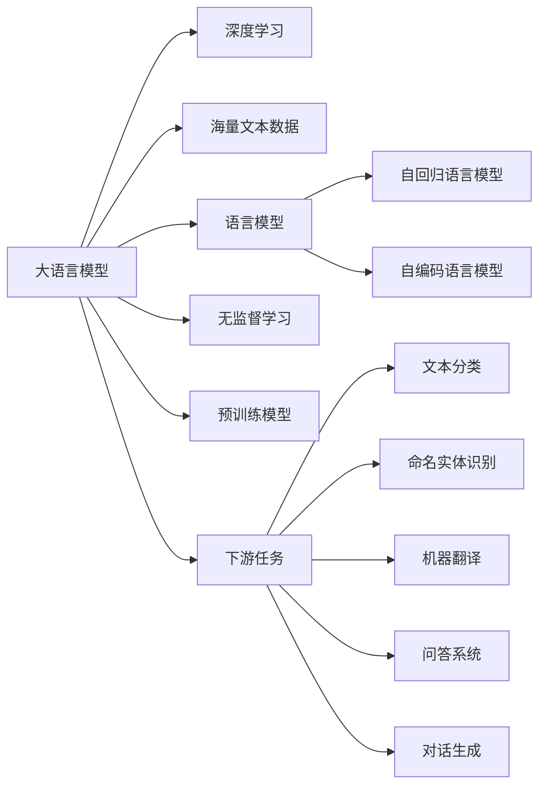

# 大语言模型应用指南：大语言模型的局限性

## 1. 背景介绍
### 1.1 问题的由来
近年来，随着深度学习技术的飞速发展，大语言模型(Large Language Models, LLMs)在自然语言处理(Natural Language Processing, NLP)领域取得了令人瞩目的成就。从GPT-3到ChatGPT，大语言模型展现出了惊人的语言理解和生成能力，引发了学术界和工业界的广泛关注。然而，在大语言模型的应用过程中，人们也逐渐意识到了其存在的一些局限性，这些局限性在一定程度上制约了大语言模型的进一步发展和应用。

### 1.2 研究现状
目前，学术界对大语言模型的局限性已经展开了广泛的研究和讨论。一些研究者指出，大语言模型在推理、常识理解、因果关系把握等方面存在不足[1]。另一些研究者则关注到了大语言模型在公平性、隐私保护、安全性等伦理问题上的局限[2]。同时，工业界也在积极探索如何克服大语言模型的局限性，以期将其更好地应用于实际场景中[3]。

### 1.3 研究意义
深入研究大语言模型的局限性，对于推动大语言模型的进一步发展和完善具有重要意义。一方面，明确大语言模型存在的问题，有助于研究者更有针对性地展开后续研究，探索解决方案；另一方面，了解大语言模型的局限所在，也有助于开发者和使用者更加清醒地认识大语言模型的能力边界，在实际应用中避免过度依赖和误用，从而更加合理、有效地发挥大语言模型的价值。

### 1.4 本文结构 
本文将围绕大语言模型的局限性展开深入探讨。首先，我们将介绍大语言模型的核心概念及其与相关概念的联系；然后，重点阐述大语言模型在推理、常识理解、因果关系把握等方面的局限性，并给出具体算法原理和案例分析；接着，讨论大语言模型在伦理层面上所面临的挑战；最后，总结大语言模型的局限性给其未来发展带来的启示和思考。

## 2. 核心概念与联系

大语言模型是以深度学习为基础，在海量文本数据上训练得到的语言模型。其核心思想是通过学习文本数据中词语之间的关联规律，从而建立起对自然语言的理解和生成能力。大语言模型与传统的语言模型相比，具有参数规模更大、语言表征能力更强的特点。

大语言模型的训练通常采用无监督学习的方式，即不需要人工标注数据，而是让模型自主学习文本数据中蕴含的语言知识。常见的训练范式包括自回归语言模型(Auto-regressive Language Model)和自编码语言模型(Autoencoding Language Model)等。

在应用方面，大语言模型可以支持多种自然语言处理任务，如文本分类、命名实体识别、机器翻译、问答系统、对话生成等。同时，大语言模型还可以作为预训练模型，为下游任务提供良好的初始化参数，从而提升任务性能。

下图展示了大语言模型的核心概念及其与相关概念之间的联系：

## 3. 核心算法原理 & 具体操作步骤
### 3.1 算法原理概述
大语言模型的核心算法主要包括Transformer[4]和GPT(Generative Pre-trained Transformer)[5]等。其中，Transformer是一种基于自注意力机制(Self-Attention)的神经网络结构，可以有效捕捉文本序列中的长距离依赖关系；GPT则在Transformer的基础上引入了自回归语言模型的训练范式，使得模型可以更好地建模文本生成过程。

### 3.2 算法步骤详解
以GPT为例，其训练过程可以分为以下几个步骤：

1. 文本预处理：将原始文本数据进行清洗、分词、编码等预处理操作，转化为模型可以接受的输入格式。
2. 构建模型：根据Transformer结构，搭建GPT模型的网络架构，包括Embedding层、多头自注意力层、前馈神经网络层等。
3. 定义损失函数：采用交叉熵损失函数，衡量模型在每个位置上的预测结果与真实标签之间的差异。
4. 模型训练：使用大规模文本数据对模型进行训练，通过不断调整模型参数，最小化损失函数，使模型学习到语言的潜在规律。
5. 模型评估：在验证集或测试集上评估模型的性能，如perplexity、BLEU等指标，以验证模型的语言建模能力。
6. 模型应用：将训练好的GPT模型应用于下游任务，如文本生成、对话生成等，或作为预训练模型，为其他任务提供参数初始化。

### 3.3 算法优缺点
GPT算法的优点在于：
- 通过自回归语言模型的训练范式，可以有效建模文本生成过程，生成的文本流畅、连贯。
- 基于Transformer结构，可以捕捉文本序列中的长距离依赖关系，具有强大的语言表征能力。
- 可以在大规模无标注数据上进行预训练，再应用于下游任务，提升任务性能。

但GPT算法也存在一些缺点：
- 模型参数量巨大，训练和推理成本高，对计算资源要求较高。
- 在推理、常识理解等方面存在局限性，难以真正理解语言的深层语义。
- 生成的文本可能存在语法错误、逻辑不一致等问题，需要进一步改进。

### 3.4 算法应用领域
GPT等大语言模型在许多自然语言处理任务中得到了广泛应用，如：
- 文本生成：如新闻写作、诗歌创作、文案生成等。
- 对话生成：如智能客服、聊天机器人等。
- 语言翻译：将GPT作为预训练模型，应用于机器翻译任务。
- 文本摘要：利用GPT生成文本摘要，提取文章核心内容。
- 问答系统：基于GPT构建问答系统，回答用户提出的问题。

## 4. 数学模型和公式 & 详细讲解 & 举例说明
### 4.1 数学模型构建
大语言模型的数学模型可以用概率图模型来表示。假设文本序列为$X=(x_1,x_2,...,x_T)$，其中$x_t$表示第$t$个位置的词，大语言模型的目标是建模文本序列的联合概率分布$P(X)$。根据概率论的链式法则，可以将联合概率分解为一系列条件概率的乘积：

$$
P(X)=\prod_{t=1}^T P(x_t|x_1,x_2,...,x_{t-1})
$$

其中，$P(x_t|x_1,x_2,...,x_{t-1})$表示在给定前$t-1$个词的条件下，第$t$个位置出现词$x_t$的条件概率。大语言模型的任务就是学习这个条件概率分布。

### 4.2 公式推导过程
在Transformer结构中，大语言模型通过自注意力机制来建模文本序列中的依赖关系。具体来说，对于第$t$个位置的词$x_t$，模型首先将其映射为一个词嵌入向量$e_t$：

$$
e_t=Embedding(x_t)
$$

然后，通过自注意力机制，计算$e_t$与文本序列中其他位置向量的相似度，得到一个注意力分布$\alpha_t$：

$$
\alpha_t=Softmax(\frac{Q_tK^T}{\sqrt{d_k}})
$$

其中，$Q_t$是$e_t$的线性变换，$K$是文本序列中所有位置向量的线性变换，$d_k$是向量维度的缩放因子。

根据注意力分布$\alpha_t$，可以计算$e_t$的上下文表示$c_t$：

$$
c_t=\sum_{i=1}^T \alpha_{t,i}V_i
$$

其中，$V$是文本序列中所有位置向量的线性变换。

最后，将$e_t$和$c_t$拼接起来，经过前馈神经网络，得到第$t$个位置的输出表示$h_t$：

$$
h_t=FeedForward([e_t;c_t])
$$

通过Softmax层，可以将$h_t$转化为第$t$个位置的条件概率分布：

$$
P(x_t|x_1,x_2,...,x_{t-1})=Softmax(h_tW+b)
$$

其中，$W$和$b$是Softmax层的参数。

### 4.3 案例分析与讲解
下面以一个简单的例子来说明大语言模型的工作原理。假设我们有一个文本序列"I love natural language processing"，其中每个词对应的下标为：

$$
\begin{aligned}
I&:x_1 \\
love&:x_2 \\
natural&:x_3 \\ 
language&:x_4 \\
processing&:x_5
\end{aligned}
$$

大语言模型的目标是建模该文本序列的联合概率分布：

$$
P(X)=P(x_1)P(x_2|x_1)P(x_3|x_1,x_2)P(x_4|x_1,x_2,x_3)P(x_5|x_1,x_2,x_3,x_4)
$$

具体来说，对于第3个位置的词"natural"，模型首先将其映射为词嵌入向量$e_3$，然后通过自注意力机制，计算$e_3$与其他位置向量的相似度，得到注意力分布$\alpha_3$：

$$
\alpha_3=Softmax(\frac{Q_3K^T}{\sqrt{d_k}})
$$

根据注意力分布$\alpha_3$，计算$e_3$的上下文表示$c_3$：

$$
c_3=\alpha_{3,1}V_1+\alpha_{3,2}V_2+\alpha_{3,3}V_3+\alpha_{3,4}V_4+\alpha_{3,5}V_5
$$

将$e_3$和$c_3$拼接起来，经过前馈神经网络，得到第3个位置的输出表示$h_3$：

$$
h_3=FeedForward([e_3;c_3])
$$

最后，通过Softmax层，将$h_3$转化为第3个位置的条件概率分布：

$$
P(x_3|x_1,x_2)=Softmax(h_3W+b)
$$

模型通过最大化该条件概率，来学习文本序列的潜在规律。

### 4.4 常见问题解答
问：大语言模型的参数量为什么如此巨大？
答：大语言模型之所以参数量巨大，主要有两个原因：一是模型结构复杂，如Transformer中的多头自注意力机制和前馈神经网络，需要大量参数来刻画文本序列的复杂依赖关系；二是训练数据规模庞大，为了充分学习语言的潜在规律，需要在海量文本数据上进行训练，这就需要更大的模型容量。

问：大语言模型的训练需要多长时间？
答：大语言模型的训练时间通常较长，从几天到几个月不等，具体取决于模型的规模、训练数据的大小以及可用的计算资源。例如，GPT-3的训练据称耗时数月，使用了数千个GPU。为了加速训练过程，研究者通常会采用分布式训练、混合精度训练等优化技术。

问：如何评估大语言模型的性能？
答：评估大语言模型的性能通常采用两类指标：语言建模指标和下游任务指标。语言建模指标主要衡量模型在建模文本序列概率分布方面的能力，常用的指标包括perplexity、bits-per-character(BPC)等；下游任务指标则衡量模型在特定