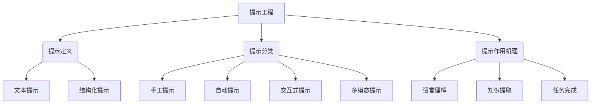

# 大语言模型应用指南：提示工程

## 1. 背景介绍

### 1.1 问题的由来

随着人工智能技术的不断进步,大型语言模型(Large Language Models, LLMs)已经成为自然语言处理领域的关键突破。这些模型通过在海量文本数据上进行预训练,学习了丰富的语言知识和上下文信息,展现出令人惊叹的语言生成和理解能力。然而,直接将这些模型应用于实际任务并不是一件容易的事情。

传统的机器学习方法通常需要为每个特定任务准备大量的标注数据,并进行复杂的特征工程。而大型语言模型则采用了一种全新的范式,即通过提示(Prompt)的方式直接与模型进行交互,指导模型生成所需的输出。这种提示工程(Prompt Engineering)的思路极大地降低了应用人工智能模型的门槛,使得非专业人员也能够快速利用这些强大的语言模型来解决实际问题。

然而,如何设计高质量的提示并非一件trivial的事情。提示的表达方式、上下文信息的提供、任务描述的清晰度等,都会对模型的输出产生重大影响。因此,探索提示工程的最佳实践,成为了充分发挥大型语言模型潜力的关键所在。

### 1.2 研究现状

提示工程作为一个全新的研究领域,目前仍处于快速发展的阶段。学术界和工业界都在积极探索提示工程的各种方法和技巧,以期获得更好的模型输出质量。

目前,提示工程主要分为以下几种范式:

1. **手工提示(Manual Prompting)**: 由人工设计和调整提示内容,是最直接和常见的方式。
2. **自动提示(Automatic Prompting)**: 通过机器学习算法自动生成或优化提示,减轻人工工作量。
3. **交互式提示(Interactive Prompting)**: 在人机交互过程中不断优化提示,实现闭环反馈。
4. **多模态提示(Multimodal Prompting)**: 除了文本提示,还可以利用图像、视频等多模态信息辅助提示。

此外,还有一些特殊的提示工程技术,如:

- 链式思维提示(Chain-of-Thought Prompting)
- 反事实提示(Counterfactual Prompting) 
- 自回归提示(Autoregressive Prompting)
- 元提示(Meta Prompting)

虽然提示工程取得了一定的研究进展,但仍存在诸多挑战,如提示的可解释性、一致性、可靠性等,都有待进一步探索和改进。

### 1.3 研究意义

提示工程作为大型语言模型应用的关键技术,对于充分发挥这些模型的强大能力至关重要。通过优化提示的设计,我们可以极大提升模型输出的质量和效率,为各种实际应用场景带来巨大价值。

例如,在智能助手、客服机器人、内容创作等领域,优秀的提示工程可以让模型生成更加人性化、符合语境的响应,提升用户体验。在决策支持、分析预测等领域,高质量的提示有助于模型输出更加准确、可靠的结果,为决策提供有力依据。

此外,提示工程还可以促进人工智能技术的民主化和普及。通过降低应用人工智能模型的门槛,使得更多的个人和小型团队都能够享受到先进技术的红利,激发出更多创新应用,造福社会发展。

因此,深入研究提示工程,探索其最佳实践和方法论,对于充分释放大型语言模型的潜能,推动人工智能技术的落地应用,都具有重要的理论意义和现实意义。

### 1.4 本文结构

本文将全面介绍提示工程的核心概念、算法原理、数学模型、实际应用等内容,并对未来发展趋势和挑战进行展望和探讨。

具体来说,第2章将阐述提示工程的核心概念,包括提示的定义、分类、作用机理等,帮助读者建立对这一领域的整体认知。第3章将深入解析提示工程的核心算法原理,包括手工提示、自动提示、交互式提示等不同范式的具体操作步骤和实现方法。

第4章将介绍提示工程中常用的数学模型和公式,如语言模型、序列到序列模型、注意力机制等,并结合具体案例进行详细讲解。第5章将呈现一个实际的提示工程项目实践,包括开发环境搭建、代码实现、运行结果展示等,帮助读者更好地掌握实战技能。

第6章将探讨提示工程在不同领域的实际应用场景,如智能助手、内容创作、决策支持等,并对未来的应用前景进行展望。第7章将为读者推荐一些有用的学习资源、开发工具、相关论文等,帮助进一步深入学习和研究。

最后,第8章将总结提示工程的研究成果、未来发展趋势和面临的挑战,并对该领域的未来研究方向进行展望。

## 2. 核心概念与联系

提示工程(Prompt Engineering)是一种新兴的人工智能技术范式,旨在通过设计高质量的提示(Prompt)来指导大型语言模型生成所需的输出。提示可以被定义为一段自然语言文本,用于向语言模型描述特定的任务或目标,并期望模型根据提示生成相应的响应或输出。

根据提示的表现形式,可以将其分为文本提示(Text Prompts)和结构化提示(Structured Prompts)两大类。文本提示是最直接的提示方式,即使用自然语言文本来描述任务要求。而结构化提示则是在文本提示的基础上,引入一些特定的格式或模板,以更加清晰和规范的方式表达提示信息。

提示工程的核心目标是设计高质量的提示,以最大限度地发挥语言模型的潜能。一个好的提示应该能够清晰地描述任务要求,提供足够的上下文信息,并且易于模型理解和响应。根据提示的生成方式,可以将提示工程分为以下几种范式:

1. **手工提示(Manual Prompting)**: 由人工专家手动设计和调整提示内容,是最直接和常见的方式。这种方式需要人工投入大量的经验和努力,但可以充分利用人类的语言理解和创造力,生成高质量的提示。

2. **自动提示(Automatic Prompting)**: 通过机器学习算法自动生成或优化提示,减轻人工工作量。常见的方法包括基于规则的生成、基于模板的生成、通过微调语言模型等。自动提示可以快速生成大量的提示,但质量往往不如手工提示。

3. **交互式提示(Interactive Prompting)**: 在人机交互过程中不断优化提示,实现闭环反馈。用户可以根据模型的响应,逐步调整和完善提示内容,直到获得满意的输出。这种方式需要更多的人工参与,但可以充分利用人机协作的优势。

4. **多模态提示(Multimodal Prompting)**: 除了文本提示,还可以利用图像、视频、音频等多模态信息辅助提示。多模态提示可以为语言模型提供更丰富的上下文信息,有助于提高模型的理解能力和输出质量。

提示工程的作用机理主要体现在以下三个方面:

1. **语言理解(Language Understanding)**: 通过提示,语言模型可以更好地理解任务要求和上下文信息,从而生成更加符合预期的输出。

2. **知识提取(Knowledge Extraction)**: 提示可以激活语言模型中存储的相关知识,使模型能够根据提示内容提取和利用所需的知识。

3. **任务完成(Task Completion)**: 高质量的提示可以更清晰地指导语言模型完成特定的任务,如问答、总结、创作等,从而获得更好的任务完成效果。

总的来说,提示工程是一种将人类的语言理解能力和创造力与语言模型的强大计算能力相结合的技术范式。通过优化提示的设计,我们可以更好地利用语言模型的潜能,为各种实际应用场景带来巨大价值。

## 3. 核心算法原理 & 具体操作步骤

### 3.1 算法原理概述

提示工程的核心算法原理可以概括为以下三个关键步骤:

1. **提示构建(Prompt Construction)**: 根据特定的任务需求和上下文信息,构建初始的提示内容。这一步骤可以通过手工设计、自动生成或交互式优化等方式实现。

2. **语言模型推理(Language Model Inference)**: 将构建好的提示输入到预训练的大型语言模型中,利用模型的语言理解和生成能力,推理出相应的输出结果。

3. **输出后处理(Output Post-processing)**: 对语言模型生成的初始输出进行必要的后处理,如过滤、重排、修正等,以获得最终的高质量输出。

在这个过程中,提示的质量对于最终输出的效果至关重要。一个好的提示应该能够清晰地描述任务要求,提供足够的上下文信息,并且易于语言模型理解和响应。因此,提示工程的核心挑战在于如何设计和优化高质量的提示。

不同的提示工程范式采用了不同的算法和策略来实现上述三个步骤。下面将分别介绍手工提示、自动提示、交互式提示和多模态提示的具体操作步骤。

### 3.2 算法步骤详解

#### 3.2.1 手工提示(Manual Prompting)

手工提示是最直接和常见的提示工程方式,由人工专家手动设计和调整提示内容。其具体操作步骤如下:

1. **任务分析**: 首先需要对待解决的任务进行深入分析,明确任务目标、输入输出要求、上下文信息等。

2. **提示设计**: 根据任务分析的结果,人工设计初始的提示内容。提示应该清晰地描述任务要求,提供必要的上下文信息,并且易于语言模型理解和响应。

3. **语言模型推理**: 将设计好的提示输入到预训练的语言模型中,获取模型生成的初始输出。

4. **输出评估**: 由人工专家评估模型输出的质量,判断是否满足任务要求。

5. **提示优化**: 如果模型输出不理想,则根据评估结果调整和优化提示内容,重复步骤3和4,直到获得满意的输出。

6. **输出后处理(可选)**: 对最终输出进行必要的后处理,如过滤、重排、修正等,以提高输出质量。

手工提示的优点在于可以充分利用人类的语言理解和创造力,生成高质量的提示。但缺点是工作量大、效率低下,难以快速应对大量的任务需求。

#### 3.2.2 自动提示(Automatic Prompting)

为了减轻人工工作量,研究人员提出了自动提示的方法,通过机器学习算法自动生成或优化提示。自动提示的具体操作步骤如下:

1. **数据准备**: 收集和准备一定量的任务示例数据,包括任务描述、提示内容和期望输出等。

2. **提示生成模型训练**: 使用示例数据训练一个提示生成模型,该模型的目标是根据任务描述自动生成对应的提示内容。

3. **任务描述输入**: 将新的任务描述输入到提示生成模型中。

4. **提示自动生成**: 提示生成模型根据任务描述自动生成初始的提示内容。

5. **语言模型推理**: 将自动生成的提示输入到预训练的语言模型中,获取模型生成的初始输出。

6. **输出评估(可选)**: 如果有标准答案或评估