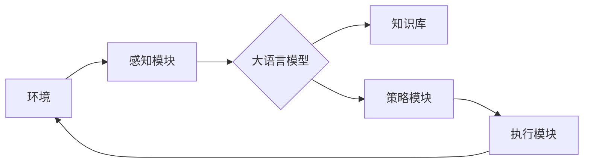

# 大语言模型应用指南：自主Agent系统

关键词：大语言模型、自主Agent、人工智能、强化学习、知识图谱、多模态交互

## 1. 背景介绍

### 1.1 问题的由来

随着人工智能技术的快速发展，大语言模型(Large Language Models, LLMs)在自然语言处理领域取得了突破性进展。LLMs 能够理解和生成接近人类水平的自然语言，为构建智能对话系统、知识问答系统等应用奠定了基础。然而，如何利用 LLMs 的语言理解和生成能力，构建具有自主决策和执行能力的智能 Agent 系统，仍然是一个亟待探索的问题。

### 1.2 研究现状

目前，业界已经出现了一些利用 LLMs 构建自主 Agent 的尝试，如 Anthropic 公司的 Claude[^1]、OpenAI 的 GPT-4[^2] 等。这些系统展示了 LLMs 在对话、问答、任务规划等方面的强大能力。但是，现有的自主 Agent 系统在知识表示、推理决策、多模态交互等方面仍存在局限性，难以胜任复杂的现实世界任务。

### 1.3 研究意义

研究利用大语言模型构建自主 Agent 系统，对于推动人工智能在实际应用中的落地具有重要意义。一方面，自主 Agent 可以作为人类的智能助手，在信息检索、问题解答、任务规划等方面提供高效的辅助；另一方面，自主 Agent 的研究有助于探索人工智能在认知、推理、决策等方面的边界，为未来的通用人工智能(Artificial General Intelligence, AGI)发展提供思路。

### 1.4 本文结构

本文将围绕利用大语言模型构建自主 Agent 系统这一主题，从以下几个方面展开论述：

- 第2部分介绍自主 Agent 系统的核心概念及其与大语言模型的关系；
- 第3部分阐述自主 Agent 的核心算法原理和具体实现步骤；  
- 第4部分建立自主 Agent 系统的数学模型，并给出详细的公式推导过程；
- 第5部分通过代码实例，展示如何利用大语言模型实现自主 Agent 系统；
- 第6部分分析自主 Agent 的实际应用场景及未来应用前景；
- 第7部分推荐相关的学习资源、开发工具和研究文献；
- 第8部分总结全文，展望自主 Agent 未来的发展趋势和面临的挑战。

## 2. 核心概念与联系

自主 Agent 是一种能够感知环境、进行推理决策并采取行动的人工智能系统[^3]。与传统的规则系统不同，自主 Agent 具有一定的自主性和适应性，能够根据环境的变化动态调整自身的策略。大语言模型为构建自主 Agent 提供了重要的基础能力，包括：

- **语言理解**：LLMs 能够理解自然语言的语义，对文本进行分类、情感分析、关系抽取等，为 Agent 感知环境提供语义理解能力。
- **知识表示**：LLMs 学习了大量的世界知识，能够将知识编码为语义向量空间中的分布式表示，为 Agent 的知识存储和检索提供支持。
- **语言生成**：LLMs 能够根据上下文生成连贯、流畅的自然语言文本，使得 Agent 能够与人进行自然的对话交互。
- **少样本学习**：LLMs 具有较强的泛化能力，能够通过少量样本快速适应新的任务，使得 Agent 具备一定的学习能力。

下图展示了自主 Agent 系统的核心组件及其与大语言模型的关系：

如图所示，自主 Agent 通过感知模块获取环境信息，利用大语言模型对信息进行语义理解，并将知识存储到知识库中。策略模块根据语言模型和知识库进行推理决策，生成执行计划。执行模块负责与环境交互，完成任务目标。大语言模型在这一过程中起到了核心的支撑作用。

## 3. 核心算法原理 & 具体操作步骤

### 3.1 算法原理概述

自主 Agent 系统的核心算法包括基于语言模型的知识表示、基于强化学习的策略优化以及基于规划的任务分解等。

基于语言模型的知识表示利用 LLMs 学习到的语义向量空间，将结构化和非结构化知识统一编码为分布式表示，便于 Agent 进行知识的存储、检索和推理[^4]。具体地，可以将知识库中的实体、关系等映射为语言模型的输入文本，通过 LLMs 的编码器获得相应的语义向量表示。

基于强化学习的策略优化使得 Agent 能够通过与环境的交互，不断优化自身的决策策略[^5]。将 Agent 的决策过程建模为马尔可夫决策过程(Markov Decision Process, MDP)，通过价值函数或策略梯度等方法，使 Agent 学习到最优的状态-动作值函数或策略函数，从而做出最优决策。

基于规划的任务分解允许 Agent 将复杂任务分解为多个子任务，通过迭代求解来完成目标[^6]。常见的任务规划算法包括 STRIPS、HTN 等。Agent 可以利用语言模型对任务描述进行语义解析，提取关键信息，构建任务层次结构，并使用启发式搜索算法进行求解。

### 3.2 算法步骤详解

下面以基于语言模型的知识表示和基于强化学习的策略优化为例，详细介绍自主 Agent 系统的算法实现步骤。

**基于语言模型的知识表示**

1. 构建知识库，收集结构化(如知识图谱)和非结构化(如文档、网页)的知识来源。
2. 对非结构化知识进行预处理，提取实体、关系等信息，融入结构化知识库。
3. 将知识库中的三元组(实体、关系、实体)等转化为自然语言描述，作为语言模型的输入。
4. 利用预训练的语言模型(如 BERT、GPT 等)对输入文本进行编码，获得实体和关系的语义向量表示。
5. 将语义向量存储为知识库的附加属性，用于后续的知识检索和推理。

**基于强化学习的策略优化**

1. 定义 Agent 的状态空间、动作空间和奖励函数，将 Agent 的决策问题建模为 MDP。
2. 初始化 Agent 的策略网络(如 DQN、A3C 等)，输入为状态，输出为动作的概率分布或价值函数。
3. 与环境进行交互，根据当前策略选择动作，获得下一状态和奖励，存储为经验样本。
4. 使用经验回放(Experience Replay)机制，从经验池中随机采样一批样本，计算 TD 误差或策略梯度。
5. 根据 TD 误差或策略梯度，使用优化算法(如 SGD、Adam)更新策略网络的参数，优化策略。
6. 重复步骤 3-5，直到策略网络收敛或达到预设的训练轮数。
7. 在测试阶段，使用训练好的策略网络进行决策，选择价值最高或概率最大的动作。

### 3.3 算法优缺点

基于语言模型的知识表示的优点在于能够将异构知识统一表示，具有较好的泛化性和语义理解能力。但其缺点在于对知识的推理能力有限，难以处理复杂的逻辑关系。

基于强化学习的策略优化的优点在于能够通过试错学习，不断优化 Agent 的决策策略，具有很强的适应性。但其缺点在于样本效率较低，难以处理高维状态空间，且容易陷入局部最优。

### 3.4 算法应用领域

基于语言模型的知识表示可以应用于智能问答、知识图谱构建、语义搜索等领域，帮助 Agent 理解和组织海量知识。

基于强化学习的策略优化可以应用于自动驾驶、智能游戏 AI、推荐系统等领域，使 Agent 能够在复杂环境中学习最优策略。

## 4. 数学模型和公式 & 详细讲解 & 举例说明

### 4.1 数学模型构建

自主 Agent 系统可以使用马尔可夫决策过程(MDP)进行建模，形式化定义如下[^7]：

一个 MDP 由一个六元组 $<S,A,P,R,\gamma,H>$ 组成，其中：

- $S$ 是有限的状态集合，$s\in S$ 表示 Agent 所处的状态。
- $A$ 是有限的动作集合，$a\in A$ 表示 Agent 可执行的动作。
- $P$ 是状态转移概率函数，$P(s'|s,a)$ 表示在状态 $s$ 下执行动作 $a$ 后转移到状态 $s'$ 的概率。 
- $R$ 是奖励函数，$R(s,a)$ 表示在状态 $s$ 下执行动作 $a$ 获得的即时奖励。
- $\gamma$ 是折扣因子，$\gamma \in [0,1]$ 表示未来奖励的衰减程度。
- $H$ 是 MDP 的时域长度，可以是有限的或无限的。

Agent 的目标是学习一个策略 $\pi: S \rightarrow A$，使得在策略 $\pi$ 下获得的期望累积奖励最大化：

$$
\pi^* = \arg\max_{\pi} \mathbb{E}\left[ \sum_{t=0}^{H-1} \gamma^t R(s_t,\pi(s_t)) \right]
$$

其中，$\pi^*$ 表示最优策略，$s_t$ 表示第 $t$ 步的状态。

### 4.2 公式推导过程

为了求解最优策略 $\pi^*$，可以引入价值函数 $V^{\pi}(s)$ 和动作-价值函数 $Q^{\pi}(s,a)$：

$$
V^{\pi}(s) = \mathbb{E}\left[ \sum_{t=0}^{H-1} \gamma^t R(s_t,\pi(s_t)) | s_0=s \right]
$$

$$
Q^{\pi}(s,a) = \mathbb{E}\left[ \sum_{t=0}^{H-1} \gamma^t R(s_t,\pi(s_t)) | s_0=s, a_0=a \right]
$$

其中，$V^{\pi}(s)$ 表示在状态 $s$ 下遵循策略 $\pi$ 的期望累积奖励，$Q^{\pi}(s,a)$ 表示在状态 $s$ 下执行动作 $a$ 并遵循策略 $\pi$ 的期望累积奖励。

根据 Bellman 最优性原理，最优价值函数 $V^*(s)$ 和最优动作-价值函数 $Q^*(s,a)$ 满足以下关系：

$$
V^*(s) = \max_{a \in A} Q^*(s,a)
$$

$$
Q^*(s,a) = R(s,a) + \gamma \sum_{s' \in S} P(s'|s,a) V^*(s')
$$

因此，最优策略 $\pi^*$ 可以通过最优动作-价值函数 $Q^*(s,a)$ 来确定：

$$
\pi^*(s) = \arg\max_{a \in A} Q^*(s,a)
$$

即在每个状态 $s$ 下选择具有最大 $Q$ 值的动作作为最优动作。

### 4.3 案例分析与讲解

下面以一个简单的自主 Agent 系统为例，说明如何应用 MDP 模型进行建模和求解。

考虑一个智能客服 Agent，它需要根据用户的问题选择合适的回答。状态空间 $S$ 包括用户问题的类型(如账户、订单、物流等)，动作空间 $A$ 包括不同的回答模板(如查询账户余额、查询订单状态、查询物流信息等)。

假设当前用户问题的类型为"账户"，Agent 选择了"查询账户余额"的回答模板，用户对回答的满意度为0.8(即即时奖励为0.8)。根据历史数据，用户在得到账户余