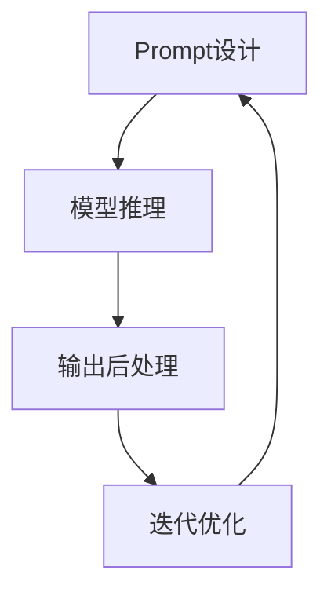

# 大语言模型的In-Context学习原理与代码实例讲解

## 1. 背景介绍

### 1.1 问题的由来

随着人工智能技术的不断发展,大型语言模型在自然语言处理领域取得了令人瞩目的成就。传统的机器学习方法通常需要大量标注数据进行监督式训练,而大型语言模型则可以通过自监督学习方式在海量未标注文本数据上进行预训练,获取通用的语言表示能力。然而,这些预训练的语言模型在特定任务上的表现往往不尽如人意,需要进行大量的数据标注和模型微调,这种"预训练+微调"的范式存在一些局限性。

### 1.2 研究现状

近年来,In-Context Learning(ICL)作为一种新兴的学习范式,为解决上述问题提供了新的思路。ICL的核心思想是利用少量任务示例(Prompts),将任务信息直接编码到输入中,使语言模型能够在上下文环境中"学会"新任务,而无需进行传统意义上的微调。这种方法避免了复杂的模型微调过程,大大提高了模型适应新任务的效率。

### 1.3 研究意义

ICL的出现为大型语言模型的应用开辟了新的可能性。通过设计合理的Prompts,语言模型可以快速适应各种下游任务,如文本生成、问答系统、代码生成等,极大地扩展了语言模型的应用场景。此外,ICL还为探索语言模型的泛化能力、学习机制等基础问题提供了新的视角。因此,深入研究ICL的原理和方法,对于充分发挥语言模型的潜能,推动人工智能技术的发展具有重要意义。

### 1.4 本文结构

本文将全面介绍大语言模型的In-Context Learning原理和实践。首先阐述ICL的核心概念和与传统学习范式的联系;接着详细解析ICL的核心算法原理和数学模型;然后通过代码实例,讲解ICL在实际项目中的应用;最后探讨ICL在不同场景下的应用前景,分析其面临的挑战,并对未来发展趋势进行展望。

## 2. 核心概念与联系

In-Context Learning(ICL)是一种新兴的学习范式,它利用少量任务示例(Prompts)将任务信息直接编码到输入中,使语言模型能够在上下文环境中"学会"新任务,而无需进行传统意义上的微调。ICL的核心思想是利用语言模型在预训练过程中获取的泛化能力,通过精心设计的Prompts,引导模型生成与任务相关的输出。

ICL与传统的"预训练+微调"范式有着密切的联系。在"预训练+微调"范式中,语言模型首先在大规模未标注数据上进行自监督预训练,获取通用的语言表示能力;然后在特定任务的标注数据上进行模型微调,使模型适应该任务。而ICL则避免了复杂的微调过程,通过设计合理的Prompts,直接利用预训练模型的泛化能力来完成新任务。

ICL的出现为语言模型的应用开辟了新的可能性。通过设计合理的Prompts,语言模型可以快速适应各种下游任务,如文本生成、问答系统、代码生成等,极大地扩展了语言模型的应用场景。此外,ICL还为探索语言模型的泛化能力、学习机制等基础问题提供了新的视角。

## 3. 核心算法原理与具体操作步骤

### 3.1 算法原理概述

In-Context Learning算法的核心思想是利用语言模型在预训练过程中获取的泛化能力,通过精心设计的Prompts,引导模型生成与任务相关的输出。具体来说,ICL算法主要包括以下几个步骤:

1. **Prompt设计**: 根据目标任务,设计合理的Prompts,将任务信息编码到输入中。Prompts可以是一些任务示例,也可以是一些指令性的语句。
2. **模型推理**: 将设计好的Prompts输入到预训练的语言模型中,模型根据输入的上下文环境,生成与任务相关的输出。
3. **输出后处理**: 对模型生成的输出进行必要的后处理,例如去除不相关的内容、格式化等。
4. **迭代优化**: 根据模型输出的质量,对Prompts进行迭代优化,以获得更好的结果。

ICL算法的关键在于Prompt的设计。一个好的Prompt不仅能够准确地传达任务信息,还能够有效地引导模型生成正确的输出。Prompt设计需要综合考虑任务的特点、语言模型的性能等多方面因素,是一个需要不断探索和优化的过程。

### 3.2 算法步骤详解

1. **Prompt设计**

Prompt设计是ICL算法的核心步骤,直接决定了模型输出的质量。一个好的Prompt应该满足以下几个原则:

- **任务相关性**: Prompt应该能够准确地传达目标任务的信息,使模型明确任务的要求。
- **上下文一致性**: Prompt应该与模型预训练的语料库保持一致,避免出现过于生僻或不自然的表达。
- **简洁明了**: Prompt应该尽量简洁明了,避免过于冗长或复杂,以免引入噪声信息。
- **多样性**: 为了提高模型的泛化能力,可以设计多种不同形式的Prompt,包括任务示例、指令性语句等。

Prompt设计通常需要反复试验和优化,可以借助人工标注、自动评估等方法评估Prompt的质量,并根据评估结果进行迭代优化。

2. **模型推理**

将设计好的Prompt输入到预训练的语言模型中,模型根据输入的上下文环境,生成与任务相关的输出。模型推理的过程可以概括为:

- 输入编码: 将Prompt转换为模型可以理解的向量表示。
- 上下文建模: 模型基于输入的向量表示,捕捉输入的语义信息和上下文环境。
- 输出生成: 模型根据捕捉到的上下文信息,生成与任务相关的输出序列。

不同的语言模型在具体的推理过程上可能有所不同,但总的思路是相似的。

3. **输出后处理**

模型生成的原始输出可能包含一些噪声信息或不符合要求的内容,因此需要进行必要的后处理,以获得更加清晰、准确的结果。常见的后处理操作包括:

- 去除无关内容: 删除模型输出中与任务无关的内容。
- 格式化处理: 对输出进行格式化,使其符合特定的格式要求。
- 错误修正: 对模型输出中的错误进行手动或自动修正。

后处理的具体操作取决于任务的特点和输出的质量,需要根据实际情况进行调整和优化。

4. **迭代优化**

根据模型输出的质量,对Prompt进行迭代优化,以获得更好的结果。迭代优化的过程包括:

- 输出评估: 对模型输出进行评估,可以采用人工评估或自动评估的方式。
- Prompt调整: 根据评估结果,对Prompt进行调整和优化,例如修改任务示例、调整指令语句等。
- 重新推理: 将优化后的Prompt输入模型,重新进行推理和输出生成。

迭代优化是一个持续的过程,需要不断地评估和优化Prompt,以获得满意的结果。

### 3.3 算法优缺点

**优点**:

1. **高效便捷**: ICL算法避免了复杂的模型微调过程,只需要设计合理的Prompts,就可以快速适应新任务,大大提高了模型适应新任务的效率。
2. **灵活多样**: ICL算法可以通过设计不同形式的Prompts,应用于多种不同的任务场景,如文本生成、问答系统、代码生成等,扩展了语言模型的应用范围。
3. **无需大量标注数据**: 与传统的监督式学习方法相比,ICL算法只需要少量的任务示例,无需大量的标注数据,降低了数据准备的成本。
4. **可解释性强**: ICL算法通过设计合理的Prompts,可以更好地解释模型的行为,提高了模型的可解释性。

**缺点**:

1. **Prompt设计困难**: 设计高质量的Prompts是一个具有挑战性的任务,需要综合考虑多方面因素,并进行大量的试验和优化。
2. **泛化能力有限**: ICL算法依赖于语言模型在预训练过程中获取的泛化能力,对于一些全新的任务,模型可能难以很好地泛化。
3. **缺乏理论支持**: 目前对于ICL算法的理论基础还缺乏深入的研究,难以对其性能和局限性进行准确的预测和分析。
4. **输出质量不稳定**: 由于ICL算法的输出质量高度依赖于Prompt的设计,不同的Prompt可能会导致输出质量的差异较大,缺乏稳定性。

### 3.4 算法应用领域

由于其高效便捷、灵活多样的特点,ICL算法可以应用于多种不同的任务场景,包括但不限于:

1. **文本生成**: 通过设计合理的Prompts,可以引导语言模型生成特定主题或风格的文本,如新闻报道、小说、广告语等。
2. **问答系统**: 将问题作为Prompt输入语言模型,模型可以根据上下文环境生成相应的答案,实现问答功能。
3. **代码生成**: 将代码需求或示例作为Prompt,语言模型可以生成相应的代码,为程序员提供辅助编码的功能。
4. **文本摘要**: 将原文作为Prompt,语言模型可以生成对应的文本摘要,实现自动摘要功能。
5. **机器翻译**: 将源语言文本作为Prompt,语言模型可以生成目标语言的翻译结果,实现机器翻译功能。
6. **数据增强**: 通过设计不同的Prompts,可以生成多样化的数据样本,为训练数据集提供增强。

除了上述场景外,ICL算法还可以应用于其他需要利用语言模型生成文本的任务中,展现出广阔的应用前景。

## 4. 数学模型和公式详细讲解与举例说明

### 4.1 数学模型构建

为了更好地理解和分析In-Context Learning算法的原理,我们可以构建一个简化的数学模型。假设我们有一个预训练的语言模型 $M$,它的目标是根据给定的上下文 $C$ 生成与任务相关的输出序列 $Y$。我们可以将这个过程表示为:

$$P(Y|C) = M(C)$$

其中,$ P(Y|C) $表示在给定上下文 $C$ 的条件下,输出序列 $Y$ 的概率分布。$M(C)$ 表示语言模型 $M$ 对上下文 $C$ 的建模和推理过程。

在 In-Context Learning 算法中,我们将任务信息编码到输入的上下文 $C$ 中,即:

$$C = [P, X]$$

其中,$ P $表示设计的 Prompt,$ X $表示任务的输入数据。语言模型的目标是根据包含 Prompt 和输入数据的上下文 $C$,生成与任务相关的输出序列 $Y$,即:

$$P(Y|P, X) = M([P, X])$$

通过合理设计 Prompt $P$,我们可以引导语言模型 $M$ 生成与任务相关的输出序列 $Y$,从而实现 In-Context Learning 的目标。

### 4.2 公式推导过程

在上述数学模型的基础上,我们可以进一步推导出 In-Context Learning 算法的一些性质和特点。

首先,我们可以将语言模型 $M$ 看作是一个条件概率模型,它根据给定的上下文 $C$ 预测输出序列 $Y$ 的概率分布:

$$P(Y|C) = \prod_{t=1}^{T} P(y_t|y_{<t}, C)$$

其中,$ T $表示输出序列的长度,$ y_t $表示第