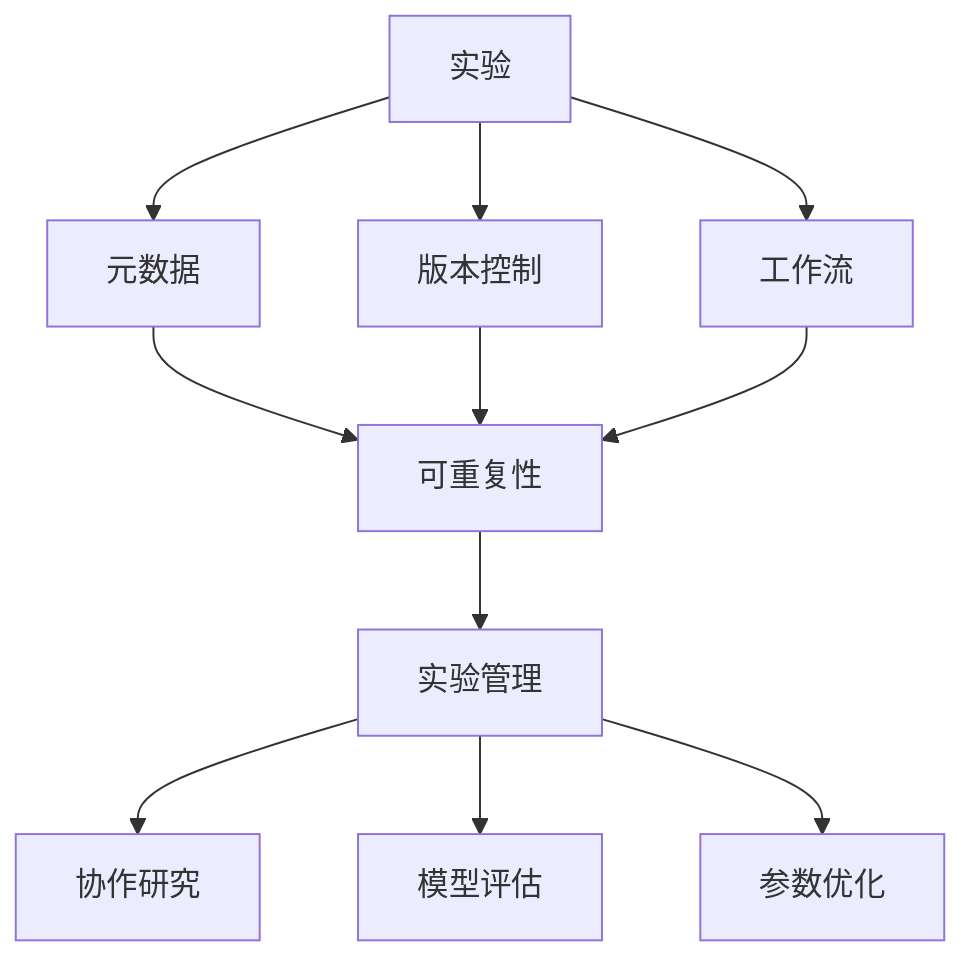
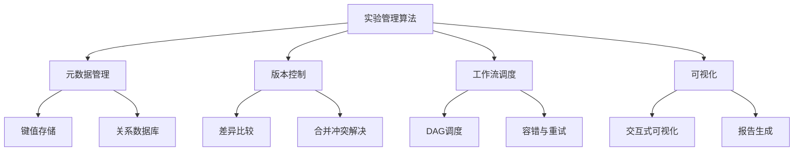

# 实验跟踪与实验管理原理与代码实战案例讲解

## 1. 背景介绍

### 1.1 问题的由来

在数据密集型领域中，如机器学习、科学计算和软件开发等,实验是不可或缺的一个环节。通过实验,我们可以验证假设、评估模型性能、优化参数等。然而,随着实验规模和复杂度的增加,有效地管理和跟踪实验变得越来越具有挑战性。

传统的实验管理方式通常依赖于手动记录实验细节、保存中间结果和最终模型等,这种方式不仅耗时耗力,而且容易出现人为错误。此外,由于缺乏统一的实验管理框架,实验过程中产生的大量数据和元数据难以被有效地组织和共享,从而阻碍了协作研究和可重复性。

### 1.2 研究现状

为了解决上述问题,近年来出现了一些实验跟踪和管理工具,如MLFlow、DVC、Sacred等。这些工具旨在自动化实验过程的跟踪、版本控制、可视化和部署等方面。然而,现有工具存在一些局限性,例如:

- 功能单一,难以满足不同领域的需求
- 缺乏对实验全生命周期的端到端支持
- 集成和扩展性较差
- 缺乏对分布式实验的支持

因此,设计一种通用、可扩展、高效的实验管理框架仍然是一个亟待解决的问题。

### 1.3 研究意义

实验跟踪和管理对于提高研究效率、确保实验可重复性、促进协作研究等方面具有重要意义:

- 提高效率:自动化实验过程,减少手动操作,节省时间和精力。
- 确保可重复性:详细记录实验过程,方便复现结果。
- 促进协作:统一的实验管理框架,方便团队内外的协作。
- 加速迭代:快速评估实验结果,优化参数和模型。
- 版本控制:跟踪代码、数据、模型等的变化,方便回溯和比较。
- 可视化:直观展示实验过程和结果,方便分析和决策。

### 1.4 本文结构

本文将从理论和实践两个层面,系统地介绍实验跟踪与管理的原理和方法。理论部分将阐述核心概念、算法原理和数学模型;实践部分将通过代码示例和案例分析,详细讲解实现细节和应用场景。最后,我们将总结研究成果、展望未来发展趋势和挑战。

## 2. 核心概念与联系

实验跟踪与管理涉及多个核心概念,包括实验、元数据、版本控制、工作流、可重复性等,这些概念相互关联、相辅相成。

- **实验**:指在特定条件下进行的观察、测试或试验,以验证假设、评估模型性能等。实验通常包括输入数据、代码、参数、环境配置等多个要素。
- **元数据**:描述实验各个要素的相关信息,如数据来源、代码版本、参数设置、环境变量等,是实现可重复性的关键。
- **版本控制**:跟踪代码、数据、模型等要素的变化,方便回溯和比较不同版本。
- **工作流**:定义实验的执行流程,包括数据预处理、模型训练、评估、部署等多个阶段。
- **可重复性**:确保实验在相同条件下能够获得相同的结果,是科学研究的基本要求。
- **实验管理**:统一管理实验全生命周期,包括设计、执行、跟踪、版本控制、可视化、共享等多个环节。
- **协作研究**:基于统一的实验管理框架,促进团队内外的协作研究。
- **模型评估**:根据实验结果评估模型性能,如准确率、损失函数等指标。
- **参数优化**:根据模型评估结果,优化模型参数,提高模型性能。

## 3. 核心算法原理 & 具体操作步骤

### 3.1 算法原理概述

实现高效的实验跟踪与管理需要综合运用多种算法和技术,包括元数据管理、版本控制、工作流调度、可视化等。

- **元数据管理**:高效存储和查询实验元数据,常用的方法包括键值存储(如Redis)和关系数据库。
- **版本控制**:跟踪代码、数据、模型等要素的变化,主要算法包括差异比较、合并冲突解决等。
- **工作流调度**:根据实验工作流的依赖关系,自动调度各个阶段的执行,常用的算法有DAG调度、容错与重试等。
- **可视化**:直观展示实验过程和结果,包括交互式可视化(如Web界面)和自动报告生成等。

### 3.2 算法步骤详解

下面以元数据管理为例,详细阐述核心算法的具体操作步骤:

1. **确定元数据模型**:根据实验需求,设计合理的元数据模型,包括实验、运行、参数、指标、工件等实体及其关系。
2. **选择存储方案**:根据元数据量级和查询模式,选择合适的存储方案,如键值存储或关系数据库。
3. **实现CRUD接口**:实现元数据的创建(Create)、读取(Read)、更新(Update)、删除(Delete)等基本操作接口。
4. **设计查询语言**:设计灵活且高效的查询语言,支持基于实体属性、时间范围、标签等多维条件的查询。
5. **优化查询性能**:采用索引、缓存、分片等策略,优化元数据查询的性能和吞吐量。
6. **实现版本控制**:为元数据实现版本控制功能,支持回溯历史、比较差异等操作。
7. **集成可视化**:将元数据与可视化模块集成,支持交互式浏览和分析元数据。

### 3.3 算法优缺点

上述算法具有以下优缺点:

**优点**:

- 通用性强,可适用于不同领域的实验管理需求。
- 模块化设计,各个模块相对独立,易于扩展和集成。
- 支持分布式和大规模实验,具有良好的水平扩展能力。

**缺点**:

- 实现复杂,需要综合运用多种算法和技术。
- 存在一定的性能和存储开销,需要进行优化。
- 缺乏统一的标准和规范,不同系统之间的互操作性较差。

### 3.4 算法应用领域

实验跟踪与管理算法可广泛应用于以下领域:

- **机器学习**:管理模型训练实验,跟踪超参数、指标变化,版本控制数据和模型等。
- **科学计算**:管理模拟实验,记录输入参数、中间结果、最终输出等。
- **软件开发**:管理持续集成和部署过程,跟踪代码、构建、测试等变化。
- **实验室研究**:管理实验室各类实验,记录实验条件、步骤、观测结果等。
- **临床试验**:管理临床试验过程,确保试验可重复性和数据完整性。

## 4. 数学模型和公式 & 详细讲解 & 举例说明

### 4.1 数学模型构建

为了量化实验管理的效率和质量,我们可以构建如下数学模型:

设有 $N$ 个实验 $\{E_1, E_2, \cdots, E_N\}$,每个实验 $E_i$ 包含 $M_i$ 个要素 $\{e_{i1}, e_{i2}, \cdots, e_{iM_i}\}$,如代码、数据、参数等。

定义实验管理质量指标 $Q$:

$$Q = \frac{1}{N}\sum_{i=1}^N \left(w_r \cdot R(E_i) + w_p \cdot P(E_i) + w_s \cdot S(E_i)\right)$$

其中:

- $R(E_i)$ 表示实验 $E_i$ 的可重复性得分,取值范围 $[0, 1]$,值越大表示可重复性越好。
- $P(E_i)$ 表示实验 $E_i$ 的版本控制质量得分,取值范围 $[0, 1]$,值越大表示版本控制质量越好。
- $S(E_i)$ 表示实验 $E_i$ 的可共享性得分,取值范围 $[0, 1]$,值越大表示可共享性越好。
- $w_r$、$w_p$、$w_s$ 分别为可重复性、版本控制、可共享性的权重,且 $w_r + w_p + w_s = 1$。

定义实验管理效率指标 $E$:

$$E = \frac{1}{N}\sum_{i=1}^N \left(\frac{T_m}{T_i}\right)$$

其中:

- $T_i$ 表示在没有实验管理系统的情况下,完成实验 $E_i$ 所需的时间。
- $T_m$ 表示在使用实验管理系统的情况下,完成实验 $E_i$ 所需的时间。

上述模型旨在综合考虑实验管理的质量和效率两个维度,可根据具体需求调整各项指标的权重。

### 4.2 公式推导过程

下面将详细推导上述数学模型中的公式:

1. **可重复性得分 $R(E_i)$**:

可重复性是指在相同条件下,实验能够获得相同的结果。我们可以定义:

$$R(E_i) = \frac{1}{M_i}\sum_{j=1}^{M_i} r(e_{ij})$$

其中 $r(e_{ij})$ 表示实验要素 $e_{ij}$ 的可重复性得分,取值范围 $[0, 1]$。对于代码、数据等可版本控制的要素,其可重复性得分可由版本控制系统计算获得;对于参数、环境变量等无法直接版本控制的要素,可根据其元数据的完整性进行评估。

2. **版本控制质量得分 $P(E_i)$**:

版本控制质量反映了实验要素变更的跟踪程度。我们可以定义:

$$P(E_i) = \frac{1}{M_i}\sum_{j=1}^{M_i} p(e_{ij})$$

其中 $p(e_{ij})$ 表示实验要素 $e_{ij}$ 的版本控制质量得分,取值范围 $[0, 1]$。对于代码、数据等可版本控制的要素,其版本控制质量得分可由版本控制系统计算获得,例如根据提交频率、差异量、合并冲突等因素综合评估;对于无法直接版本控制的要素,其版本控制质量得分可根据元数据的变更情况进行评估。

3. **可共享性得分 $S(E_i)$**:

可共享性反映了实验结果和过程对外的开放程度。我们可以定义:

$$S(E_i) = \frac{1}{M_i}\sum_{j=1}^{M_i} s(e_{ij})$$

其中 $s(e_{ij})$ 表示实验要素 $e_{ij}$ 的可共享性得分,取值范围 $[0, 1]$。对于代码、数据等可共享的要素,其可共享性得分可根据共享范围(如公开、私有等)、共享方式(如Git、HTTP等)进行评估;对于不可共享的要素,其可共享性得分为0。

综上所述,实验管理质量指标 $Q$ 是可重复性、版本控制质量和可共享性的加权平均,权重可根据具体需求进行调整。