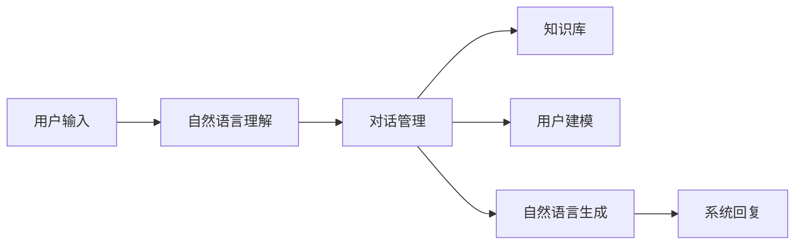

# 对话系统(Chatbots) - 原理与代码实例讲解

关键词：对话系统、Chatbots、自然语言处理、深度学习、Transformer、BERT、对话管理、对话生成

## 1. 背景介绍
### 1.1 问题的由来
随着人工智能技术的飞速发展,对话系统(Chatbots)作为人机交互的重要形式,在各行各业得到了广泛应用。传统的人机交互方式如键盘输入、鼠标点击等已经无法满足人们日益增长的需求。人们希望能够通过自然语言与计算机进行交流,获取所需的信息和服务。对话系统应运而生,其目标是使计算机能够理解人类的自然语言,并根据上下文进行合理的回复,从而实现人机之间的无障碍沟通。

### 1.2 研究现状
对话系统经过了几十年的发展,从早期基于规则和模板的系统,发展到基于检索的系统,再到如今基于深度学习的端到端对话系统。深度学习的兴起,尤其是Transformer[1]、BERT[2]等预训练语言模型的出现,极大地推动了对话系统的进步。微软小冰、苹果Siri、Google Assistant等知名对话系统均采用了先进的深度学习技术。学术界和工业界也涌现出许多优秀的对话系统如DialoGPT[3]、Meena[4]、BlenderBot[5]等。

### 1.3 研究意义
对话系统作为人工智能落地的重要场景,在智能客服、智能教育、智能家居、医疗健康等领域发挥着越来越重要的作用。研究对话系统有助于提升人机交互体验,提高工作和生活效率。同时对话系统融合了自然语言处理、知识图谱、推荐系统等多个人工智能分支,是人工智能领域的前沿和热点。深入研究对话系统的原理和实现,对于推动人工智能的发展具有重要意义。

### 1.4 本文结构
本文将全面介绍对话系统的原理和实现。第2部分介绍对话系统的核心概念。第3部分重点讲解对话系统的核心算法。第4部分介绍对话系统常用的数学模型和公式。第5部分给出详细的代码实例。第6部分分析对话系统的实际应用场景。第7部分推荐对话系统的学习资源。第8部分对全文进行总结并展望对话系统的未来。第9部分列出常见问题解答。

## 2. 核心概念与联系
对话系统涉及到的核心概念包括:

1. 自然语言理解(Natural Language Understanding, NLU):计算机理解人类自然语言的过程,将用户输入转化为结构化的语义表示。主要任务包括意图识别、槽位填充、命名实体识别等。

2. 对话管理(Dialogue Management, DM):根据当前对话状态和用户意图,决策系统的下一步行为,控制对话流程。常见的对话管理方式有有限状态机、框架式、计划式等。

3. 自然语言生成(Natural Language Generation, NLG):将系统要表达的信息转化为自然语言文本。传统的NLG通过模板填充等方式实现,现在主要采用端到端的生成式模型。

4. 知识库(Knowledge Base):存储对话系统所需的结构化知识,为对话生成提供信息支持。知识库可以是领域内的知识图谱,也可以是开放域的知识库如维基百科。

5. 用户建模(User Modeling):对用户的个人属性、对话历史、兴趣爱好等建模,实现个性化对话。常用的用户建模方法有协同过滤、基于内容的推荐等。

这些概念之间紧密联系,共同构成了对话系统的整体架构:

## 3. 核心算法原理 & 具体操作步骤
### 3.1 算法原理概述
对话系统的核心算法主要包括自然语言理解、对话管理和自然语言生成三大部分。

自然语言理解常用的算法有:
- 基于规则的方法:如正则表达式、关键词匹配等
- 传统的机器学习方法:如支持向量机(SVM)、条件随机场(CRF)等
- 深度学习方法:如循环神经网络(RNN)、卷积神经网络(CNN)、注意力机制(Attention)、Transformer等

对话管理的算法主要有:
- 有限状态机:将对话流程抽象为状态的转移
- 框架式对话管理:通过填充框架的槽位来获取用户意图
- 基于规划的对话管理:将对话看作一个规划问题,通过规划算法来决策
- 深度强化学习:将对话管理建模为马尔可夫决策过程,通过强化学习来优化策略

自然语言生成的算法包括:
- 基于模板的方法:将预先定义好的模板进行填充
- 基于检索的方法:从候选回复中检索最合适的
- 基于生成的方法:端到端地生成回复,主要采用编码器-解码器(Seq2Seq)框架和Transformer

### 3.2 算法步骤详解
以基于Transformer的端到端对话生成算法为例,详细步骤如下:

1. 将对话历史和当前用户输入进行编码,转化为向量表示。编码器采用Transformer的自注意力机制,可以捕捉输入序列的全局依赖。

2. 将编码后的向量输入解码器,解码器同样基于Transformer,通过自注意力和编码-解码注意力机制,在生成每个词时都能够关注到输入序列的相关信息。

3. 解码器采用beam search策略,每次解码选择概率最大的k个候选词,直到生成完整的回复为止。

4. 在训练过程中,采用teacher forcing方式,将上一时刻的真实词作为下一时刻的输入,而在预测时采用上一时刻预测的词作为下一时刻的输入。

5. 损失函数采用交叉熵损失,优化器采用Adam,并使用learning rate warmup和衰减策略。

6. 在预训练语言模型如BERT、GPT的基础上进行fine-tuning,引入海量对话数据进行训练,提高模型的泛化能力。

### 3.3 算法优缺点
基于Transformer的端到端对话生成算法具有以下优点:
- 相比传统的pipeline方法,端到端的生成方式使得模型能够自动学习输入到输出的映射,减少了人工特征工程
- Transformer的自注意力机制能够捕捉长距离依赖,生成更加流畅和连贯的回复
- 预训练语言模型的引入提高了模型的泛化能力,缓解了数据稀疏的问题

但它也存在一些缺点:
- 生成的回复偶尔会出现不连贯、重复、泛泛而谈等问题
- 难以加入外部知识,回复的知识性和可控性不足
- 预训练语言模型参数量巨大,训练和推理成本高

### 3.4 算法应用领域
基于Transformer的端到端对话生成算法已经在各大公司的对话系统产品中得到应用,如微软小冰、Google Meena等。在开放域对话、任务型对话、知识问答等场景都取得了不错的效果。一些研究机构如OpenAI、DeepMind也在该方向进行了大量探索。未来随着算力的进一步提升和训练数据的扩充,端到端的对话生成模型有望得到更广泛应用。

## 4. 数学模型和公式 & 详细讲解 & 举例说明
### 4.1 数学模型构建
对话生成可以建模为条件语言模型,即给定对话历史$C$,生成当前回复$R$的概率:
$$P(R|C) = \prod_{i=1}^n P(r_i|r_1,...,r_{i-1},C)$$
其中$r_i$表示回复$R$的第$i$个词,$n$为回复的长度。

为了建模$P(r_i|r_1,...,r_{i-1},C)$,Transformer引入了自注意力机制和位置编码。

自注意力用于捕捉序列内和序列间的依赖关系。对于序列的每个位置$i$,自注意力通过查询向量$q_i$、键向量$k_i$和值向量$v_i$来计算注意力权重:
$$\alpha_{ij} = \frac{\exp(q_i \cdot k_j)}{\sum_{l=1}^n \exp(q_i \cdot k_l)}$$

其中$\alpha_{ij}$表示位置$i$到位置$j$的注意力权重。

值向量$v_i$与注意力权重$\alpha_{ij}$加权求和,得到位置$i$的上下文表示$c_i$:

$$c_i = \sum_{j=1}^n \alpha_{ij} v_j$$

位置编码用于引入词的位置信息。Transformer采用正余弦函数来构造位置编码向量$p_i$:

$$p_{i,2j} = \sin(i/10000^{2j/d})$$
$$p_{i,2j+1} = \cos(i/10000^{2j/d})$$

其中$i$为位置索引,$j$为维度索引,$d$为词向量维度。

### 4.2 公式推导过程
Transformer的编码器和解码器都由多个相同的层堆叠而成,每一层包括两个子层:多头自注意力层和前馈神经网络层。

多头自注意力将自注意力计算多次,然后拼接:

$$\text{MultiHead}(Q,K,V) = \text{Concat}(\text{head}_1,...,\text{head}_h)W^O$$

$$\text{head}_i = \text{Attention}(QW_i^Q, KW_i^K, VW_i^V)$$

其中$Q$、$K$、$V$分别为查询矩阵、键矩阵和值矩阵,$W_i^Q$、$W_i^K$、$W_i^V$、$W^O$为可学习的参数矩阵。

前馈神经网络对多头自注意力的输出进行非线性变换:

$$\text{FFN}(x) = \max(0, xW_1 + b_1)W_2 + b_2$$

其中$W_1$、$W_2$、$b_1$、$b_2$为可学习的参数。

在编码器的顶层,将各个位置的输出向量拼接,作为整个输入序列的表示。在解码器中,自注意力的计算只能看到当前位置之前的信息,以确保预测的因果性。此外,解码器还引入了编码-解码注意力层,用于关注编码器的输出。

### 4.3 案例分析与讲解
下面以一个简单的例子来说明Transformer的计算过程。

假设编码器的输入为["How","are","you","?"],解码器的输入为["I","am"]。

首先对输入词进行嵌入,然后加上位置编码,得到输入表示$X$。

然后通过自注意力层计算上下文表示$C$:

$$C = \text{MultiHead}(X,X,X)$$

再通过前馈神经网络层:

$$H = \text{FFN}(C)$$

最后将各个位置的输出向量拼接得到编码器的输出表示$H_e$。

解码器的计算与编码器类似,不同之处在于:
1. 自注意力层只能看到当前位置之前的信息
2. 引入了编码-解码注意力层,以$H_e$为键和值,以解码器的自注意力输出为查询,计算注意力:
$$C_d = \text{MultiHead}(C,H_e,H_e)$$
3. 解码器的输出向量$H_d$用于预测下一个词的概率分布:
$$P(r_i|r_1,...,r_{i-1},C) = \text{softmax}(H_dW+b)$$
其中$W$和$b$为可学习的参数。

假设当前解码器预测的词为"fine",则下一步解码器的输入为["I","am","fine"]。重复上述过程直到生成<EOS>符号。

### 4.4 常见问题解答
**Q:** Transformer相比RNN/LSTM有什么优势?

**A:** Transformer通过自注意力机制实现了并行计算,提高了训练和推理效率。此外自注意力可以捕捉长距离依赖,一定程度上缓解了RNN/LSTM的