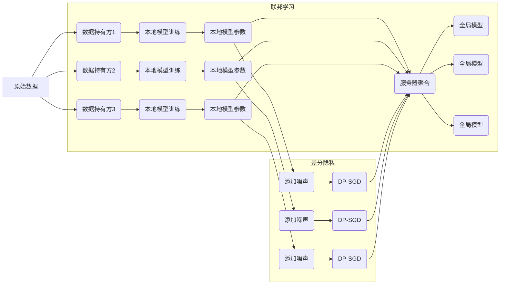

# 差分隐私与联邦学习安全原理与代码实战案例讲解

关键词：差分隐私、联邦学习、隐私保护、数据安全、机器学习

## 1. 背景介绍
### 1.1 问题的由来
随着大数据时代的到来,海量数据的收集和分析已成为各行各业的常态。然而,在数据带来巨大价值的同时,数据隐私和安全问题也日益突出。传统的数据分析方法很容易导致隐私泄露,给个人和企业带来巨大风险。如何在充分利用数据的同时,又能保护数据隐私,成为亟待解决的难题。

### 1.2 研究现状
近年来,学术界和工业界都在积极探索数据隐私保护技术。其中,差分隐私(Differential Privacy)和联邦学习(Federated Learning)成为两大热门方向。差分隐私通过在数据中加入随机噪声,使得攻击者无法判断某个个体是否在数据集中,从而保护个体隐私。联邦学习则允许多方在不共享原始数据的情况下,协同训练机器学习模型,避免了数据集中存储的隐私风险。

### 1.3 研究意义
差分隐私和联邦学习有望成为解决数据隐私困境的有力武器。深入研究二者的原理和实现,对于推动隐私保护技术发展、促进数据开放共享具有重要意义。同时,这两种技术与人工智能、大数据等前沿领域紧密相关,研究成果也将为相关领域带来新的思路和动力。

### 1.4 本文结构
本文将从以下几个方面对差分隐私和联邦学习进行深入探讨:
- 第2部分介绍差分隐私和联邦学习的核心概念与二者之间的联系
- 第3部分重点讲解差分隐私和联邦学习的核心算法原理和具体操作步骤
- 第4部分从数学角度对相关模型和公式进行推导和举例说明
- 第5部分给出差分隐私和联邦学习的代码实例,并进行详细解释
- 第6部分分析差分隐私和联邦学习的实际应用场景
- 第7部分推荐相关学习资源、开发工具和研究论文
- 第8部分总结全文,并展望差分隐私和联邦学习技术的发展趋势与面临的挑战
- 第9部分列举常见问题并给出解答

## 2. 核心概念与联系
差分隐私和联邦学习是两种不同的隐私保护技术,但它们有一些共同点:
- 目的都是保护数据隐私,防止敏感信息泄露
- 都需要在数据使用和隐私保护之间寻求平衡
- 理论基础都涉及到密码学、博弈论、分布式计算等

差分隐私的核心思想是:对数据集的查询结果施加随机扰动,使得攻击者无法判断某个个体是否在数据集中。形式化地,差分隐私要求一个算法对两个相邻数据集(只相差一条记录)的输出分布相近。差分隐私有两个关键参数:隐私预算 $\epsilon$ 和随机化算法 $\mathcal{M}$。其中 $\epsilon$ 控制隐私保护的强度,$\epsilon$ 越小,隐私保护越强,但数据可用性下降。

联邦学习的核心思想是:在不共享原始数据的前提下,多方协同训练机器学习模型。具体来说,联邦学习分为三个步骤:
1. 各参与方在本地用自己的数据训练模型
2. 各方上传模型参数(不是原始数据)到服务器,服务器汇总平均得到全局模型
3. 各方下载全局模型,用本地数据进行微调

这个过程可以迭代多轮,直到模型收敛。可见,联邦学习避免了原始数据的共享,只传输模型参数,从而大大降低了隐私泄露风险。

差分隐私和联邦学习可以结合起来使用,形成更强的隐私保护方案。例如,在联邦学习中,可以对本地模型参数施加差分隐私噪声,再上传到服务器。这样即使服务器是不诚实的,也难以从噪声化的模型参数中推测出原始数据的信息。

下图展示了差分隐私和联邦学习的关键技术要素和典型工作流程:

## 3. 核心算法原理 & 具体操作步骤
### 3.1 算法原理概述
差分隐私的核心是 Laplace 机制和指数机制。Laplace 机制适用于数值型查询,对查询结果添加 Laplace 噪声。指数机制适用于非数值型查询,按照指数分布随机采样查询结果。二者都能提供 $\epsilon$-差分隐私保护。

联邦学习的核心是分布式随机梯度下降(FedSGD)算法。各参与方用本地数据计算梯度,上传到服务器;服务器将收到的梯度求平均,得到全局梯度,再用它更新全局模型参数;各参与方从服务器拉取最新的全局模型,进行下一轮迭代。

### 3.2 算法步骤详解
Laplace 机制的步骤如下:
1. 设置隐私预算 $\epsilon$,敏感度 $\Delta f$
2. 根据 $\epsilon$ 和 $\Delta f$ 计算噪声参数 $\lambda = \Delta f / \epsilon$
3. 对原始查询结果 $f(x)$ 添加 Laplace($\lambda$) 噪声,得到 $\hat{f}(x) = f(x) + Lap(\lambda)$
4. 返回带噪声的查询结果 $\hat{f}(x)$

指数机制的步骤如下:
1. 设置隐私预算 $\epsilon$,效用函数 $u(x,r)$
2. 对每个可能的输出 $r \in \mathcal{R}$,根据 $u(x,r)$ 和 $\epsilon$ 计算权重 $w_r = \exp(\epsilon \cdot u(x,r) / 2\Delta u)$
3. 根据权重 $w_r$ 对 $r$ 进行随机采样,得到输出结果 $\hat{r}$
4. 返回随机采样的结果 $\hat{r}$

FedSGD 的步骤如下:
1. 服务器初始化全局模型参数 $w_0$,发送给所有客户端
2. for round t = 1, 2, ... do:
   1. 服务器从 $K$ 个客户端中随机选择 $C$ 个,下发当前全局模型 $w_{t-1}$
   2. 每个选中的客户端 $k$ 在本地数据 $\mathcal{D}_k$ 上计算梯度 $g_{t}^{k} = \nabla f(w_{t-1};\mathcal{D}_k)$
   3. 客户端将本地梯度 $g_{t}^{k}$ 上传给服务器
   4. 服务器对收到的梯度取平均,更新全局模型参数:$w_t = w_{t-1} - \eta \cdot \frac{1}{C} \sum_{k} g_{t}^{k}$
3. 服务器向所有客户端广播最终的全局模型 $w_T$

其中 $\eta$ 是学习率,$T$ 是总的通信轮数。

### 3.3 算法优缺点
差分隐私的优点是:
- 具有严格的隐私保护理论保证
- 攻击者掌握任意背景知识也无法突破隐私保护
- 适用于多种数据分析任务,包括数值查询、机器学习等

差分隐私的缺点是:
- 引入噪声不可避免地损失了数据可用性和模型性能
- 对复杂查询,噪声累积会导致结果失真严重
- 隐私预算 $\epsilon$ 的设置需要在可用性和隐私性之间权衡

联邦学习的优点是:
- 在数据隐私得到保护的同时,仍能训练高质量的机器学习模型
- 模型可以从多个数据源学习,避免了单一数据源的偏差
- 为数据孤岛问题提供了一种可行的解决方案

联邦学习的缺点是:
- 对参与方的诚实性有一定要求,恶意参与方可能会破坏模型
- 通信开销大,模型收敛速度慢
- 对异构数据分布、非独立同分布(non-IID)数据的学习效果有待提高

### 3.4 算法应用领域
差分隐私已在多个领域得到应用,包括:
- 统计数据发布:对人口普查、医疗健康等敏感数据进行差分隐私发布
- 机器学习:开发满足差分隐私的分类、聚类、深度学习算法
- 数据挖掘:频繁模式挖掘、社交网络分析等
- 位置隐私保护:对地理位置数据进行差分隐私扰动,防止用户轨迹泄露

联邦学习的典型应用包括:
- 智能手机:苹果、谷歌等公司利用用户设备上的数据训练语音助手、输入法等模型
- 金融反欺诈:多家银行联合训练风控模型,识别可疑交易
- 医疗健康:医院、制药公司合作开发辅助诊断、药物发现模型
- 工业互联网:设备制造商、平台方利用多源工业数据优化产品性能

## 4. 数学模型和公式 & 详细讲解 & 举例说明
### 4.1 数学模型构建
差分隐私定义了两个相邻数据集之间的距离:
$$ d(D,D') = \begin{cases} 
1, & \text{if } D \text{ and } D' \text{ differ by at most one record} \\
0, & \text{otherwise}
\end{cases} $$

一个随机算法 $\mathcal{M}$ 满足 $\epsilon$-差分隐私,当且仅当对任意两个相邻数据集 $D,D'$,以及算法的任意输出 $S$:
$$ \Pr[\mathcal{M}(D) \in S] \leq e^{\epsilon} \cdot \Pr[\mathcal{M}(D') \in S] $$

其中 $\epsilon$ 是隐私预算,控制隐私保护强度。$\epsilon$ 越小,隐私保护越强,但输出结果的可用性下降。

对于数值查询 $f$,其全局敏感度定义为:
$$ \Delta f = \max_{D,D'} |f(D)-f(D')| $$

即 $f$ 在任意两个相邻数据集上的最大变化量。

Laplace 机制通过在 $f$ 的真实输出上添加 $Lap(\Delta f/\epsilon)$ 噪声实现差分隐私:
$$ \hat{f}(D) = f(D) + Lap(\Delta f/\epsilon) $$

其中 $Lap(b)$ 表示尺度参数为 $b$ 的 Laplace 分布,其概率密度函数为:
$$ Lap(x|b) = \frac{1}{2b} \exp(-\frac{|x|}{b}) $$

指数机制定义了一个效用函数 $u(D,r)$,度量输出 $r$ 在数据集 $D$ 上的效用。指数机制以如下概率分布输出 $r$:
$$ \Pr[\mathcal{M}(D) = r] \propto \exp(\frac{\epsilon \cdot u(D,r)}{2 \Delta u}) $$

其中 $\Delta u$ 是效