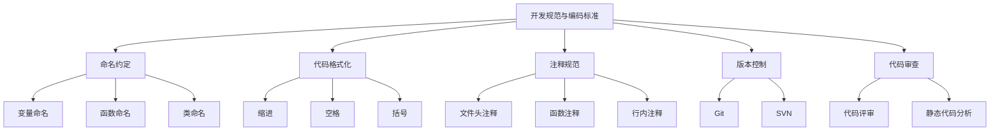

# 开发规范与编码标准原理与代码实战案例讲解

## 1. 背景介绍

### 1.1 问题的由来

在软件开发过程中，代码质量和可维护性是非常重要的因素。随着项目规模和复杂度的增加,代码的可读性、一致性和可维护性变得越来越具有挑战性。缺乏统一的编码标准和规范会导致代码混乱、难以协作、bug难以追踪和修复,从而降低开发效率,增加维护成本。因此,制定并遵循适当的开发规范和编码标准对于确保代码质量、提高团队协作效率和降低维护成本至关重要。

### 1.2 研究现状

目前,许多公司和开源社区都制定了自己的编码规范和最佳实践,如Google的Java Style Guide、PEP 8 (Python代码风格指南)、Airbnb的JavaScript Style Guide等。这些规范旨在提供一致的代码风格和命名约定,以提高代码的可读性和可维护性。然而,这些规范往往侧重于特定的编程语言或框架,缺乏通用性和系统性。

### 1.3 研究意义

制定统一的开发规范和编码标准对于提高软件质量、加强团队协作和降低维护成本具有重要意义。通过遵循规范,代码将更加一致、可读性更强,从而降低了理解和维护代码的难度。此外,规范还有助于提高代码的可重用性和可扩展性,促进了最佳实践的共享和传播。

### 1.4 本文结构

本文将全面介绍开发规范与编码标准的原理和实践。首先,我们将探讨核心概念和原则,包括命名约定、代码格式化、注释规范等。接下来,我们将深入探讨核心算法原理和具体操作步骤,并通过数学模型和公式进行详细说明。然后,我们将提供实际的代码示例和解释,并讨论在不同应用场景中的实践。最后,我们将总结未来发展趋势和挑战,并提供相关工具和资源推荐。

## 2. 核心概念与联系

开发规范和编码标准涵盖了多个核心概念,包括命名约定、代码格式化、注释规范、版本控制、代码审查等。这些概念相互关联,共同构建了一个完整的规范体系。



这些核心概念相互关联,共同构建了一个完整的规范体系。例如,命名约定确保了代码中的标识符具有一致性和可读性,而代码格式化则确保了代码的视觉一致性和美观性。注释规范则提供了对代码功能和用途的解释,方便了代码的理解和维护。版本控制和代码审查则确保了代码的质量和可追溯性。

## 3. 核心算法原理 & 具体操作步骤

### 3.1 算法原理概述

在开发规范和编码标准中,核心算法原理包括命名约定、代码格式化和注释规范等。这些算法旨在确保代码的一致性、可读性和可维护性。

命名约定算法通过定义变量、函数、类等标识符的命名规则,使代码更加一致和易于理解。常见的命名约定包括驼峰命名法、下划线命名法等。

代码格式化算法则通过规范化代码的缩进、空格、括号等格式,使代码具有良好的视觉一致性和美观性。

注释规范算法则规定了如何编写文件头注释、函数注释和行内注释,以提供对代码功能和用途的解释,方便代码的理解和维护。

### 3.2 算法步骤详解

以下是核心算法的具体操作步骤:

#### 命名约定算法步骤:

1. 确定命名约定类型(如驼峰命名法、下划线命名法等)。
2. 定义变量、函数、类等标识符的命名规则。
3. 遍历代码中的所有标识符。
4. 对于每个标识符,检查其是否符合命名规则。
5. 如果不符合规则,则进行重命名或报告错误。

#### 代码格式化算法步骤:

1. 确定代码格式化规则(如缩进、空格、括号等)。
2. 遍历代码中的每一行。
3. 对于每一行,检查其是否符合格式化规则。
4. 如果不符合规则,则进行格式化或报告错误。

#### 注释规范算法步骤:

1. 确定注释规范(如文件头注释、函数注释、行内注释等)。
2. 遍历代码中的每个文件、函数和代码行。
3. 对于每个文件、函数和代码行,检查其是否包含所需的注释。
4. 如果缺少注释,则添加注释或报告错误。

### 3.3 算法优缺点

命名约定、代码格式化和注释规范算法具有以下优点:

- 提高代码的一致性和可读性。
- 降低代码维护成本。
- 促进团队协作和代码共享。
- 提高代码质量和可靠性。

但是,这些算法也存在一些缺点:

- 可能会增加开发时间和工作量。
- 需要团队成员严格遵守规范。
- 对于遗留代码或第三方代码,可能需要进行大量重构。

### 3.4 算法应用领域

命名约定、代码格式化和注释规范算法可以应用于各种编程语言和框架,如Java、Python、JavaScript、C++等。它们在各种软件开发项目中都发挥着重要作用,包括:

- 企业级应用程序开发
- Web应用程序开发
- 移动应用程序开发
- 游戏开发
- 嵌入式系统开发
- 开源项目开发

## 4. 数学模型和公式 & 详细讲解 & 举例说明

### 4.1 数学模型构建

在开发规范和编码标准中,我们可以使用数学模型来量化代码质量和规范遵循程度。我们定义以下指标:

- 命名一致性指数 (Naming Consistency Index, NCI)
- 代码格式化指数 (Code Formatting Index, CFI)
- 注释完整性指数 (Comment Completeness Index, CCI)

这些指标的取值范围为 [0, 1],其中 0 表示完全不符合规范,1 表示完全符合规范。

我们可以将这些指标组合成一个综合指数,称为规范遵循指数 (Compliance Index, CI):

$$CI = \alpha \times NCI + \beta \times CFI + \gamma \times CCI$$

其中 $\alpha$、$\beta$ 和 $\gamma$ 是权重系数,表示每个指标对总体规范遵循程度的重要性。

### 4.2 公式推导过程

我们将详细推导每个指标的计算公式。

#### 命名一致性指数 (NCI)

设 $N$ 为代码中标识符的总数,而 $N_c$ 为符合命名约定的标识符数量,则:

$$NCI = \frac{N_c}{N}$$

#### 代码格式化指数 (CFI)

设 $L$ 为代码的总行数,而 $L_f$ 为格式化正确的行数,则:

$$CFI = \frac{L_f}{L}$$

#### 注释完整性指数 (CCI)

设 $F$ 为文件总数,而 $F_c$ 为包含完整文件头注释的文件数量。设 $M$ 为函数总数,而 $M_c$ 为包含函数注释的函数数量。设 $C$ 为代码行总数,而 $C_c$ 为包含行内注释的代码行数量。则:

$$CCI = \frac{\lambda_1 F_c + \lambda_2 M_c + \lambda_3 C_c}{\lambda_1 F + \lambda_2 M + \lambda_3 C}$$

其中 $\lambda_1$、$\lambda_2$ 和 $\lambda_3$ 是权重系数,表示不同类型注释的重要性。

### 4.3 案例分析与讲解

让我们以一个简单的 Python 代码示例来说明这些指标的计算:

```python
# This is a sample Python code

# Define a function to calculate the factorial of a number
def factorial(n):
    """
    Calculate the factorial of a given number.

    Args:
        n (int): The number to calculate the factorial for.

    Returns:
        int: The factorial of the given number.
    """
    result = 1
    for i in range(1, n+1):
        result *= i
    return result

# Test the function
number = 5
fact = factorial(number)
print(f"The factorial of {number} is {fact}")
```

在这个示例中:

- 总标识符数量 $N = 5$ (包括 `factorial`、`n`、`result`、`i` 和 `number`)
- 符合命名约定的标识符数量 $N_c = 5$
- 因此,命名一致性指数 $NCI = 5/5 = 1$

- 总行数 $L = 16$
- 格式化正确的行数 $L_f = 16$
- 因此,代码格式化指数 $CFI = 16/16 = 1$

- 文件总数 $F = 1$
- 包含完整文件头注释的文件数量 $F_c = 1$
- 函数总数 $M = 1$
- 包含函数注释的函数数量 $M_c = 1$
- 代码行总数 $C = 10$
- 包含行内注释的代码行数量 $C_c = 1$

假设权重系数 $\lambda_1 = \lambda_2 = \lambda_3 = 1/3$,则:

$$CCI = \frac{1/3 \times 1 + 1/3 \times 1 + 1/3 \times 1/10}{1} = 0.7$$

最后,假设权重系数 $\alpha = \beta = \gamma = 1/3$,则:

$$CI = \frac{1}{3} \times 1 + \frac{1}{3} \times 1 + \frac{1}{3} \times 0.7 = 0.9$$

这表明该代码示例在遵循开发规范和编码标准方面得分为 0.9,符合较高的标准。

### 4.4 常见问题解答

**Q: 为什么需要定义这些指标?**

A: 这些指标可以量化代码质量和规范遵循程度,有助于识别需要改进的领域,并跟踪代码质量的变化。它们还可以用于自动化代码质量检查和持续集成流程。

**Q: 如何确定权重系数?**

A: 权重系数的确定取决于具体项目的需求和优先级。通常,团队可以根据经验和讨论来确定合适的权重。在某些情况下,可以使用机器学习技术来优化权重系数。

**Q: 这些指标是否适用于所有编程语言?**

A: 虽然本文中的示例使用了 Python,但这些指标的概念是通用的,可以应用于大多数编程语言。不同语言可能需要调整具体的规则和权重系数。

## 5. 项目实践:代码实例和详细解释说明

### 5.1 开发环境搭建

为了实现开发规范和编码标准的自动化检查,我们需要设置以下开发环境:

1. **编程语言**: 本示例使用 Python 作为编程语言。
2. **依赖项**: 安装以下 Python 包:
   - `pylint`: 用于静态代码分析和检查编码标准。
   - `autopep8`: 用于自动格式化 Python 代码。
   - `pydocstyle`: 用于检查 Python 代码的文档字符串(docstring)。

可以使用 `pip` 来安装这些包:

```bash
pip install pylint autopep8 pydocstyle
```

3. **集成开发环境 (IDE)**: 推荐使用支持代码检查和格式化的 IDE,如 PyCharm 或 Visual Studio Code。

### 5.2 源代码详细实现

我们将实现一个 Python 脚本 `code_checker.py`,用于检查代码是否符合开发规范和编码标准。该脚本将执行以下操作:

1. 遍历指定