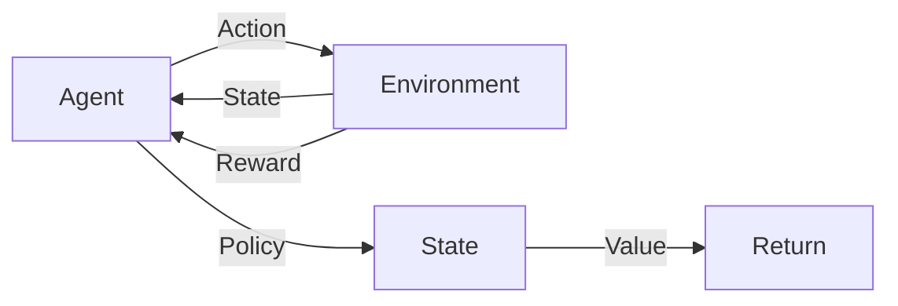

# 强化学习 (Reinforcement Learning) 原理与代码实例讲解

关键词：强化学习、马尔可夫决策过程、Q-Learning、深度强化学习、OpenAI Gym

## 1. 背景介绍 
### 1.1 问题的由来
在人工智能领域,我们希望开发出能够自主学习和决策的智能体。传统的监督学习和非监督学习方法在很多场景下难以实现所需的智能行为。强化学习作为一种全新的机器学习范式,为解决这一问题提供了崭新的思路。
### 1.2 研究现状
近年来,强化学习取得了突破性进展。从AlphaGo击败世界围棋冠军,到OpenAI Five战胜Dota 2职业队伍,强化学习展现了其强大的智能决策能力。越来越多的研究者投身于强化学习的理论研究和应用探索。
### 1.3 研究意义 
强化学习具有广阔的应用前景,在自动驾驶、智能控制、金融投资、推荐系统等领域有望取得革命性突破。深入研究强化学习的原理和方法,对于人工智能的发展具有重要意义。
### 1.4 本文结构
本文将系统阐述强化学习的核心概念和理论基础,详细讲解主流强化学习算法的原理和实现,并通过代码实例演示强化学习的实际应用。同时,本文也会介绍强化学习的前沿进展和未来挑战。

## 2. 核心概念与联系
强化学习的核心概念包括:
- 智能体(Agent):可以感知环境状态并作出行动决策的主体。
- 环境(Environment):智能体所处的交互环境,给予智能体观察值和奖励信号。
- 状态(State):环境在某一时刻的表征。
- 行动(Action):智能体施加于环境的控制。 
- 策略(Policy):将状态映射到行动的决策函数。
- 奖励(Reward):环境对智能体行动的即时反馈。
- 回报(Return):衡量一个状态的长期价值,通常基于累积奖励计算。
- 价值函数(Value Function):估计状态(状态-行动对)的期望回报。

强化学习可以看作连续的马尔可夫决策过程(MDP),目标是学习最优策略以最大化累积奖励。下图展示了强化学习中各核心概念之间的关系:



## 3. 核心算法原理 & 具体操作步骤
### 3.1 算法原理概述
强化学习有多种经典算法,代表性的有:
- 动态规划(Dynamic Programming):基于MDP的完全知识,通过价值迭代或策略迭代求解最优策略。
- 蒙特卡洛方法(Monte Carlo Methods):通过采样完整路径的累积回报更新价值函数。
- 时序差分学习(Temporal Difference Learning):基于当前奖励和下一状态价值估计即时更新价值函数,代表算法有Sarsa和Q-Learning。
- 策略梯度(Policy Gradient):直接面向策略优化,基于梯度上升调整策略参数以提升期望回报。
- 演员-评论家(Actor-Critic):结合价值函数(Critic)和策略函数(Actor),同时学习和优化两个函数。

近年来,深度强化学习(Deep Reinforcement Learning)成为研究热点。通过深度神经网络逼近价值函数、策略函数,可以处理大规模复杂状态空间,实现端到端学习。代表算法有DQN、DDPG、A3C、PPO等。

### 3.2 算法步骤详解
以Q-Learning为例,详细讲解其算法步骤:
1. 初始化Q表格Q(s,a),对于所有状态-行动对,令Q(s,a)=0。
2. 重复循环每一轮episode:
    1. 初始化起始状态s
    2. 重复循环每一步step:
        1. 以$\epsilon$-贪婪策略选择行动a: 以$\epsilon$概率随机选择,否则选择Q(s,a)最大的a
        2. 执行行动a,观察奖励r和下一状态s'
        3. 更新Q值:
            $Q(s,a) \leftarrow Q(s,a) + \alpha [r + \gamma \max_{a'}Q(s',a') - Q(s,a)]$
        4. 更新状态$s \leftarrow s'$
    3. 直到s为终止状态
3. 返回学到的策略$\pi(s)=\arg\max_a Q(s,a)$

其中,$\alpha$是学习率,$\gamma$是折扣因子。Q-Learning是一种异策略离线学习算法,通过不断更新Q表格逼近最优行动价值函数$Q^*(s,a)$。

### 3.3 算法优缺点
Q-Learning的优点是:
- 简单易实现,通过Q表格就可以存储和更新价值函数。
- 异策略学习,可以基于行动价值函数学习最优策略。
- 收敛性有理论保证,Q值能收敛到最优行动价值函数$Q^*$。

但Q-Learning也存在局限性:
- 基于表格存储,难以处理大规模状态和行动空间。
- 探索与利用的平衡需要精心设计。
- 对于连续状态空间,需要进行离散化,存在近似误差。

### 3.4 算法应用领域
Q-Learning在众多领域得到应用,例如:
- 智能体寻路:如机器人路径规划。
- 游戏智能体:如五子棋、吃豆人等棋类/游戏AI设计。
- 资源调度:如电梯调度、工厂生产调度。
- 推荐系统:将推荐看作序贯决策过程,应用强化学习优化用户长期收益。

## 4. 数学模型和公式 & 详细讲解 & 举例说明
### 4.1 数学模型构建
马尔可夫决策过程(MDP)为强化学习提供了标准数学模型。一个MDP由以下元素组成:
- 状态空间$\mathcal{S}$
- 行动空间$\mathcal{A}$
- 转移概率$\mathcal{P}_{ss'}^a=P(S_{t+1}=s'|S_t=s,A_t=a)$
- 奖励函数$\mathcal{R}_s^a=\mathbb{E}[R_{t+1}|S_t=s,A_t=a]$
- 折扣因子$\gamma \in [0,1]$

MDP的目标是寻找最优策略$\pi^*(s)$,使得期望累积回报最大化:

$$\pi^* = \arg\max_{\pi} \mathbb{E}[\sum_{t=0}^{\infty} \gamma^t R_{t+1}|\pi]$$

为实现这一目标,需要引入价值函数的概念。状态价值函数$V^{\pi}(s)$表示从状态s开始,遵循策略$\pi$的期望回报:

$$V^{\pi}(s)=\mathbb{E}[\sum_{k=0}^{\infty}\gamma^k R_{t+k+1}|S_t=s,\pi]$$

而行动价值函数$Q^{\pi}(s,a)$表示在状态s下选择行动a,遵循策略$\pi$的期望回报:

$$Q^{\pi}(s,a)=\mathbb{E}[\sum_{k=0}^{\infty}\gamma^k R_{t+k+1}|S_t=s,A_t=a,\pi]$$

最优价值函数$V^*(s)$和$Q^*(s,a)$满足贝尔曼最优方程:

$$V^*(s) = \max_a Q^*(s,a)$$

$$Q^*(s,a) = \mathcal{R}_s^a + \gamma \sum_{s' \in \mathcal{S}} \mathcal{P}_{ss'}^a V^*(s')$$

求解最优价值函数即可得到最优策略:

$$\pi^*(s) = \arg\max_a Q^*(s,a)$$

### 4.2 公式推导过程
以Q-Learning为例,推导其价值函数更新公式。Q-Learning基于时序差分学习,使用TD目标值和TD误差更新Q值:

$$\begin{aligned}
Q(S_t,A_t) & \leftarrow Q(S_t,A_t) + \alpha [R_{t+1} + \gamma \max_a Q(S_{t+1},a) - Q(S_t,A_t)]\\
& = Q(S_t,A_t) + \alpha [目标值 - Q(S_t,A_t)]
\end{aligned}$$

其中,$R_{t+1} + \gamma \max_a Q(S_{t+1},a)$被称为TD目标,是基于即时奖励和下一状态价值估计的目标值。而$\alpha$是学习率,控制每次更新的步长。

为什么Q-Learning能收敛到最优行动价值函数$Q^*$?我们可以将Q学习看作随机逼近过程,价值函数更新类似于如下形式:

$$Q(s,a) \leftarrow (1-\alpha)Q(s,a) + \alpha [r + \gamma \max_{a'} Q(s',a')]$$

当采样足够多次,依概率收敛到期望更新:

$$\mathbb{E}[Q(s,a)] \leftarrow \mathbb{E}[r + \gamma \max_{a'} Q(s',a')]$$

而该期望恰好对应贝尔曼最优方程的形式,因此Q值能收敛到$Q^*$。

### 4.3 案例分析与讲解
考虑一个简单的迷宫寻路问题,如下图所示:

```
+---+---+---+
| S |   |   |
+---+---+---+
|   | # |   |
+---+---+---+
|   |   | G |
+---+---+---+
```

其中,S表示起点,G表示终点,#表示障碍。智能体的目标是学习一个策略,能够从起点出发快速到达终点。

我们可以将这个问题建模为马尔可夫决策过程:
- 状态空间$\mathcal{S}$:所有非障碍的网格位置。
- 行动空间$\mathcal{A}$:上、下、左、右四个移动方向。
- 转移概率$\mathcal{P}_{ss'}^a$:在状态s下执行行动a,转移到状态s'的概率。这里为确定性转移。
- 奖励函数$\mathcal{R}_s^a$:除终点外,每个状态的即时奖励为-1,鼓励智能体尽快到达终点。
- 折扣因子$\gamma$:设为0.9,表示更看重短期奖励。

应用Q-Learning算法,我们可以得到最优行动价值函数$Q^*$如下:

```
+-------+-------+-------+
|   0   |  -1   |  -2   |
+-------+-------+-------+
|  -1   |   #   |  -2   |
+-------+-------+-------+
|  -2   |  -3   |   0   |
+-------+-------+-------+
```

最优策略$\pi^*$为:

```
+-------+-------+-------+
|   →   |   ↑   |   ←   |
+-------+-------+-------+
|   ↑   |   #   |   ↓   |
+-------+-------+-------+
|   ↑   |   →   |   ●   |
+-------+-------+-------+
```

可以看出,Q-Learning学到了一个最短路径策略,能够指导智能体快速到达目标位置。

### 4.4 常见问题解答
1. Q-Learning能否处理随机转移的环境?
   
答:可以,Q-Learning基于采样更新,能够从经验数据中学习随机转移下的最优策略。只是收敛速度可能会慢一些。

2. 如何设置Q-Learning算法中的超参数?

答:一般来说,学习率$\alpha$可以从0.1开始调节,并随训练进行衰减。$\epsilon$-贪婪策略中的$\epsilon$控制探索与利用的平衡,可以初始设置较大的值如0.5,然后逐渐减小。折扣因子$\gamma$根据任务设置,一般取0.9到0.99。超参数调节需要一定的经验和反复尝试。

3. Q-Learning能应用于连续状态空间吗?

答:Q-Learning基于Q表格,难以直接应用于连续状态空间。一种常见做法是将连续状态离散化到有限个区间。另一种方法是使用函数逼近,用神经网络等模型拟合Q函数,即DQN算法。

## 5. 项目实践:代码实例和详细解释说明
接下来,我们通过一个简单的编程实例,演示如何使用Python实现Q-Learning算法。完整代码如下:

```python
import