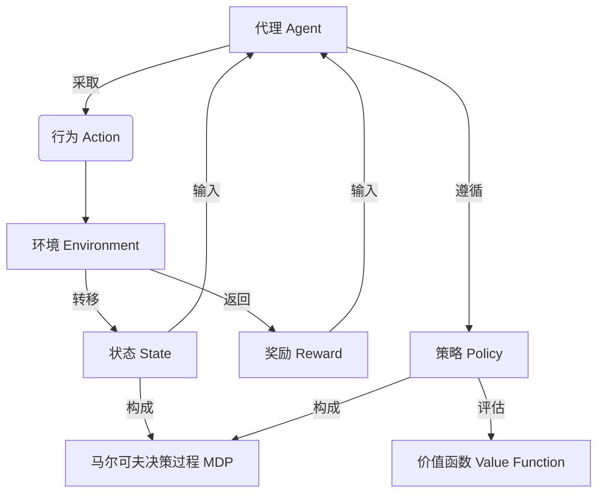

# 强化学习(Reinforcement Learning)原理与代码实战案例讲解

## 1. 背景介绍

### 1.1 问题的由来

在人工智能领域中,机器学习是一个非常重要和活跃的研究方向。传统的机器学习算法主要包括监督学习和无监督学习两大类,但它们都存在一些局限性。监督学习需要大量标注好的训练数据,而无监督学习则无法直接优化目标函数。因此,强化学习(Reinforcement Learning)作为第三种主要的机器学习范式应运而生。

强化学习的思想源于心理学中的行为主义理论,它试图通过对环境的交互来学习并优化一个代理的行为策略,从而达到最大化预期累积奖励的目标。与监督学习和无监督学习不同,强化学习没有提供完整的训练数据集,代理必须通过不断尝试和学习来发现哪些行为可以获得更好的奖励。

### 1.2 研究现状

近年来,强化学习在多个领域取得了突破性的进展,尤其是在游戏领域。2016年,谷歌的AlphaGo战胜了世界顶尖的人类职业围棋选手,掀起了强化学习的热潮。2019年,OpenAI的人工智能系统在对抗性视频游戏任务中超越了人类水平。此外,强化学习也在机器人控制、自动驾驶、自然语言处理等领域展现出巨大的潜力。

然而,强化学习仍然面临诸多挑战,如样本复杂度高、探索与利用权衡、奖励函数设计等,这些问题都阻碍了强化学习在更多实际应用场景中的广泛部署。

### 1.3 研究意义

强化学习的核心思想是通过与环境的互动来学习,这种学习范式更贴近人类和生物的学习方式。研究强化学习不仅可以推动人工智能技术的发展,也有助于我们更好地理解人类大脑的学习机制。

此外,强化学习在解决序列决策问题方面具有天然的优势,可以为诸多领域提供全新的解决方案,如智能交通系统、智能制造、金融投资决策等。因此,深入研究强化学习的原理和方法对于推动人工智能技术的发展和应用都具有重要意义。

### 1.4 本文结构

本文将全面介绍强化学习的核心概念、算法原理、数学模型以及实战案例。内容安排如下:

- 第2部分阐述强化学习的核心概念,包括马尔可夫决策过程、策略迭代、价值迭代等,并分析它们之间的联系。
- 第3部分详细讲解强化学习的核心算法原理和具体操作步骤,包括动态规划、蒙特卡罗方法、时序差分学习等。
- 第4部分构建强化学习的数学模型,推导相关公式,并通过案例分析加深理解。
- 第5部分提供强化学习的代码实战案例,包括环境搭建、算法实现、代码解读和运行结果展示。
- 第6部分探讨强化学习在实际应用场景中的应用,并展望未来的发展方向。
- 第7部分推荐一些强化学习的学习资源、开发工具和相关论文。
- 第8部分总结研究成果,分析未来发展趋势和面临的挑战。
- 第9部分是附录,回答一些常见问题。

## 2. 核心概念与联系

强化学习是一种基于奖惩机制的学习范式,它由以下几个核心概念构成:

1. **代理(Agent)**: 指能够感知环境并根据感知做出行为的决策实体。代理的目标是通过与环境的交互来学习一个最优策略,从而最大化预期的累积奖励。

2. **环境(Environment)**: 代理所处的外部世界,它接收代理的行为并返回新的观测结果和奖励信号。环境的状态可能是完全可观测的,也可能是部分可观测的。

3. **状态(State)**: 描述环境在特定时间点的条件或信息的集合,是代理进行决策的基础。

4. **行为(Action)**: 代理在当前状态下可以采取的操作,会导致环境状态的转移。

5. **奖励(Reward)**: 环境给予代理的反馈信号,表示代理上一个行为的效果好坏。代理的目标是最大化预期的累积奖励。

6. **策略(Policy)**: 定义了代理在每个状态下应该采取何种行为的规则或映射函数。

7. **价值函数(Value Function)**: 评估一个状态或状态-行为对在遵循某策略时的预期累积奖励,是评估策略好坏的关键指标。

8. **马尔可夫决策过程(Markov Decision Process, MDP)**: 强化学习问题的数学框架,假设未来状态只取决于当前状态和行为,而与过去历史无关。

这些概念之间的关系如下所示:

代理与环境进行交互,代理根据当前状态采取行为,环境则转移到新状态并返回奖励。代理的目标是学习一个最优策略,使得在遵循该策略时获得的预期累积奖励最大化。价值函数用于评估策略的好坏,而马尔可夫决策过程则为强化学习问题提供了数学框架。

## 3. 核心算法原理 & 具体操作步骤

### 3.1 算法原理概述

强化学习算法可以分为三大类:基于动态规划的算法、基于蒙特卡罗方法的算法和基于时序差分学习的算法。

1. **基于动态规划的算法**

动态规划算法需要完全了解马尔可夫决策过程的模型,即状态转移概率和奖励函数。它通过价值迭代或策略迭代的方式,求解最优价值函数或最优策略。典型算法有价值迭代、策略迭代和修改策略迭代等。

2. **基于蒙特卡罗方法的算法**

蒙特卡罗方法通过采样的方式学习价值函数,而不需要了解马尔可夫决策过程的模型。它通过大量模拟交互并平均累积奖励来估计价值函数。典型算法有常见的蒙特卡罗控制算法。

3. **基于时序差分学习的算法**

时序差分学习结合了动态规划和蒙特卡罗方法的思想,通过估计价值函数与实际奖励之间的时序差分来更新价值函数。它不需要完整的环境模型,也不需要等待一个完整的序列结束。典型算法有Sarsa、Q-Learning和深度Q网络(DQN)等。

### 3.2 算法步骤详解

以下将详细介绍两种经典的强化学习算法:价值迭代算法(基于动态规划)和Q-Learning算法(基于时序差分学习)。

#### 3.2.1 价值迭代算法

价值迭代算法的目标是找到最优价值函数 $V^*(s)$,其步骤如下:

1. 初始化价值函数 $V(s)$,对所有状态 $s$ 赋予任意值。
2. 重复以下步骤直到收敛:
    - 对每个状态 $s$,计算新的价值函数:
    $$V(s) \leftarrow \max_{a} \mathbb{E}[R_{t+1} + \gamma V(S_{t+1}) | S_t=s, A_t=a]$$
    其中 $R_{t+1}$ 是立即奖励, $\gamma$ 是折扣因子, $S_{t+1}$ 是下一状态。
3. 得到的 $V(s)$ 即为最优价值函数 $V^*(s)$。

根据最优价值函数,可以推导出最优策略 $\pi^*(s)$:

$$\pi^*(s) = \arg\max_{a} \mathbb{E}[R_{t+1} + \gamma V^*(S_{t+1}) | S_t=s, A_t=a]$$

#### 3.2.2 Q-Learning算法

Q-Learning算法的目标是直接学习最优行为价值函数 $Q^*(s, a)$,其步骤如下:

1. 初始化Q函数 $Q(s, a)$,对所有状态-行为对 $(s, a)$ 赋予任意值。
2. 对每个状态-行为对 $(s, a)$,重复以下步骤直到收敛:
    - 采取行为 $a$,观测奖励 $r$ 和下一状态 $s'$
    - 计算新的Q值:
    $$Q(s, a) \leftarrow Q(s, a) + \alpha[r + \gamma \max_{a'} Q(s', a') - Q(s, a)]$$
    其中 $\alpha$ 是学习率, $\gamma$ 是折扣因子。
3. 得到的 $Q(s, a)$ 即为最优行为价值函数 $Q^*(s, a)$。

根据最优行为价值函数,可以推导出最优策略 $\pi^*(s)$:

$$\pi^*(s) = \arg\max_{a} Q^*(s, a)$$

### 3.3 算法优缺点

1. **价值迭代算法**
    - 优点:
        - 收敛性理论较为完善,可以证明在有限状态马尔可夫决策过程中一定收敛到最优价值函数。
        - 算法简单,易于理解和实现。
    - 缺点:
        - 需要完整的环境模型,即状态转移概率和奖励函数。
        - 在状态空间很大时,计算代价昂贵。
        - 无法处理连续状态和行为空间的问题。

2. **Q-Learning算法**
    - 优点:
        - 不需要事先知道环境模型,可以通过在线交互来学习。
        - 可以直接学习最优策略,无需先计算价值函数。
        - 可以处理离散或连续的状态和行为空间。
    - 缺点:
        - 收敛性理论较弱,只能保证在满足某些条件下收敛。
        - 需要大量的交互数据来保证收敛,样本复杂度高。
        - 存在过度估计问题,需要采取措施(如Double Q-Learning)来缓解。

### 3.4 算法应用领域

强化学习算法已经在诸多领域展现出巨大的潜力和应用前景:

- **游戏领域**: 如国际象棋、围棋、视频游戏等,强化学习可以训练出超越人类水平的AI代理。
- **机器人控制**: 通过与环境交互,可以学习到有效的机器人控制策略。
- **自动驾驶**: 强化学习可以训练出安全且高效的自动驾驶系统。
- **自然语言处理**: 可以应用于对话系统、机器翻译等任务。
- **金融投资**: 通过学习最优投资策略来实现资产配置。
- **智能制造**: 优化生产流程,提高生产效率。
- **推荐系统**: 根据用户行为学习个性化推荐策略。

总的来说,凡是涉及序列决策问题的领域,都可以尝试应用强化学习算法来寻求最优解决方案。

## 4. 数学模型和公式 & 详细讲解 & 举例说明

### 4.1 数学模型构建

强化学习问题可以用马尔可夫决策过程(Markov Decision Process, MDP)来建模。一个MDP可以用一个5元组 $\langle \mathcal{S}, \mathcal{A}, \mathcal{P}, \mathcal{R}, \gamma \rangle$ 来表示:

- $\mathcal{S}$ 是有限的状态集合
- $\mathcal{A}$ 是有限的行为集合
- $\mathcal{P}$ 是状态转移概率函数,定义为 $\mathcal{P}_{ss'}^a = \mathbb{P}(S_{t+1}=s'|S_t=s, A_t=a)$
- $\mathcal{R}$ 是奖励函数,定义为 $\mathcal{R}_s^a = \mathbb{E}[R_{t+1}|S_t=s, A_t=a]