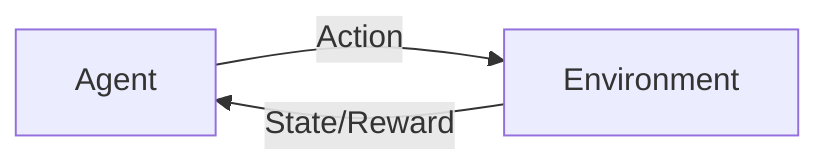

# 强化学习Reinforcement Learning与传统机器学习方法对比

关键词：强化学习、监督学习、无监督学习、马尔可夫决策过程、Q-Learning、DQN、策略梯度

## 1. 背景介绍 
### 1.1 问题的由来
随着人工智能技术的飞速发展,机器学习已经成为了当前最热门的研究领域之一。传统的机器学习方法主要包括监督学习(Supervised Learning)和无监督学习(Unsupervised Learning)两大类。而近年来,另一种被称为强化学习(Reinforcement Learning,RL)的机器学习范式受到了越来越多研究者的关注。

### 1.2 研究现状
强化学习作为一种全新的机器学习范式,已经在许多领域取得了瞩目的成果,尤其是在智能控制、自动驾驶、游戏AI等方面表现突出。例如DeepMind公司开发的AlphaGo系统,就是利用强化学习算法击败了世界顶尖的围棋高手。这些成功案例充分证明了强化学习的巨大潜力。

### 1.3 研究意义
尽管强化学习取得了令人振奋的进展,但与传统的监督学习、无监督学习相比,它在理论基础、算法设计等方面还存在诸多差异和不足。系统地比较强化学习与传统机器学习方法的异同,有助于我们更好地理解强化学习的内在机理,洞察其优势与局限性,从而为进一步的研究指明方向。

### 1.4 本文结构
本文将从以下几个方面对强化学习与传统机器学习方法进行对比分析：
- 首先介绍强化学习的核心概念,并阐述其与监督学习、无监督学习的本质联系。
- 然后重点剖析几种经典的强化学习算法,如Q-Learning、DQN、策略梯度等,说明其基本原理和操作步骤。  
- 接着从数学模型的角度对强化学习的理论基础进行探讨,并给出详细的公式推导和案例分析。
- 进一步通过代码实例来演示如何使用主流的深度学习框架来实现强化学习算法。
- 讨论强化学习在智能系统中的典型应用场景,展望其未来的发展前景。
- 最后总结全文,指出当前强化学习面临的挑战,并对未来的研究方向提出展望。

## 2. 核心概念与联系
强化学习的核心思想是:智能体(Agent)通过与环境(Environment)的交互,学习一种最优的决策策略(Policy),使得长期累积奖励(Reward)最大化。这个过程可以用下图来表示:



具体而言,强化学习有以下几个关键概念:
- 状态(State):表示智能体所处的环境状况。
- 动作(Action):表示智能体根据当前状态所采取的行为决策。
- 奖励(Reward):表示智能体执行某个动作后,环境给予的即时反馈。
- 策略(Policy):表示智能体的行为决策函数,即给定状态时应该采取何种动作。
- 价值函数(Value Function):表示状态或者状态-动作对的长期期望累积奖励。

从机器学习的角度看,监督学习需要使用标注数据训练模型,输入和输出变量之间存在确定的映射关系。无监督学习则是在没有标签的数据中寻找隐含的模式和结构。而强化学习则是通过不断地试错和环境交互来学习最优策略,并没有预先给定的标注数据。

尽管三种学习范式有所不同,但它们在某些方面也存在内在联系。例如,强化学习中的价值函数近似,实际上可以看作一种监督学习问题,即用神经网络来拟合最优价值函数。再如,深度强化学习中经常用到的自编码器(Autoencoder),本质上是一种无监督表征学习方法。

## 3. 核心算法原理 & 具体操作步骤
### 3.1 算法原理概述
强化学习有多种经典算法,它们的基本原理可以概括为:
- 基于价值(Value-based):通过学习价值函数来得到最优策略,代表算法有Q-Learning、DQN等。
- 基于策略(Policy-based):直接学习最优策略函数,代表算法有策略梯度(Policy Gradient)、Actor-Critic等。
- 基于模型(Model-based):通过学习环境的转移动力学模型来进行规划和决策,代表算法有Dyna、AlphaZero等。

下面我们重点介绍几种最常用的强化学习算法。

### 3.2 算法步骤详解
#### 3.2.1 Q-Learning
Q-Learning是一种经典的无模型、异策略的时序差分学习算法,其核心是学习动作-价值函数(Q-function)。算法的主要步骤如下:

1. 初始化Q(s,a)表格
2. 重复:
   - 根据当前状态s,用ε-贪婪策略选择动作a
   - 执行动作a,观察奖励r和下一状态s'
   - 更新Q值:
$$ Q(s,a) \leftarrow Q(s,a)+\alpha [r+\gamma \max_{a'} Q(s',a')-Q(s,a)] $$
   - s ← s'
3. 直到收敛

其中,α是学习率,γ是折扣因子。Q-Learning的收敛性可以得到理论保证。

#### 3.2.2 DQN
DQN(Deep Q-Network)算法是将深度神经网络与Q-Learning相结合的一种强化学习算法。与普通的Q-Learning使用Q表不同,DQN使用深度神经网络来近似Q函数。算法的主要步骤如下:

1. 初始化经验回放池D,参数化的Q网络Q(s,a;θ)
2. 重复:
   - 根据ε-贪婪策略选择动作a
   - 执行动作a,观察奖励r和下一状态s'
   - 将(s,a,r,s')存储到经验回放池D中
   - 从D中随机采样一个批次的转移样本(s,a,r,s')
   - 计算Q学习目标:
$$ y=\begin{cases} r & \text{if episode terminates at }s'\\ r+\gamma \max_{a'} Q(s',a';\theta^-) & \text{otherwise} \end{cases} $$
   - 最小化均方误差损失:
$$ L(\theta)=\mathbb{E}_{(s,a,r,s')\sim D}[(y-Q(s,a;\theta))^2] $$
   - 每隔C步,将目标网络参数θ^-更新为当前网络参数θ
3. 直到收敛

DQN在Q-Learning的基础上引入了两个重要的改进:经验回放(Experience Replay)和目标网络(Target Network),前者提高了样本利用效率,后者提高了学习稳定性。

#### 3.2.3 策略梯度 
策略梯度(Policy Gradient)是一类直接优化策略函数的强化学习算法。不同于Q-Learning等基于价值的方法,策略梯度直接将策略函数参数化,然后沿着梯度方向进行更新。算法的主要步骤如下:

1. 初始化策略网络π(a|s;θ)
2. 重复:
   - 用策略π与环境交互,收集一条完整的轨迹τ=(s0,a0,r1,...,sT−1,aT−1,rT)
   - 对于轨迹中的每一个时间步t:
     - 计算折扣累积奖励:
$$ R_t=\sum_{k=0}^{T-t-1} \gamma^k r_{t+k+1} $$
     - 计算策略梯度:
$$ \nabla_\theta J(\theta)=\nabla_\theta \log \pi(a_t|s_t;\theta) R_t $$
   - 更新策略网络参数:
$$ \theta \leftarrow \theta+\alpha \nabla_\theta J(\theta) $$
3. 直到收敛

策略梯度虽然实现简单,但通常需要大量的样本才能获得准确的梯度估计,因此实际应用中常常需要引入一些方差减少技术,如基线(Baseline)、重要性采样(Importance Sampling)等。

### 3.3 算法优缺点
- Q-Learning的优点是简单易实现,且有扎实的理论基础。但其缺点是难以处理连续状态和动作空间,且在高维空间中容易陷入维度灾难。

- DQN通过引入深度神经网络,一定程度上克服了Q-Learning的不足。但DQN对于超参数较为敏感,且不适合连续动作空间的问题。

- 策略梯度的优点是可以直接处理连续动作空间,且通过引入函数逼近,可以更好地扩展到大规模问题。但其缺点是通常需要大量的样本,且不易利用离线数据。

### 3.4 算法应用领域  
- Q-Learning和DQN在离散控制任务上应用广泛,如Atari游戏、棋类游戏等。

- 策略梯度在连续控制任务上表现出色,如机器人控制、自动驾驶等。

- 模型学习在规划和推理任务上大有可为,如AlphaGo的蒙特卡洛树搜索。

## 4. 数学模型和公式 & 详细讲解 & 举例说明
### 4.1 数学模型构建
强化学习的数学模型通常基于马尔可夫决策过程(Markov Decision Process,MDP)。一个MDP可以用一个五元组(S,A,P,R,γ)来描述:
- 状态空间S:所有可能的环境状态的集合。
- 动作空间A:所有可能的动作的集合。
- 转移概率P:状态转移的条件概率分布,P(s'|s,a)表示在状态s下执行动作a后转移到状态s'的概率。
- 奖励函数R:在状态s下执行动作a后获得的即时奖励。
- 折扣因子γ:用于平衡即时奖励和长期奖励,γ∈[0,1]。

MDP的目标是寻找一个最优策略π:S→A,使得长期累积奖励最大化:

$$ \pi^*=\arg\max_\pi \mathbb{E}\left[\sum_{t=0}^\infty \gamma^t r_t | \pi \right] $$

其中,r_t表示在时刻t获得的即时奖励。

### 4.2 公式推导过程
接下来我们详细推导Q-Learning算法的更新公式。首先定义状态-动作值函数(Q-function):

$$ Q^\pi(s,a)=\mathbb{E}\left[\sum_{k=0}^\infty \gamma^k r_{t+k+1} | s_t=s,a_t=a,\pi \right] $$

它表示在状态s下执行动作a,并继续遵循策略π的情况下,长期累积奖励的期望值。

对于最优策略π^*,其Q函数满足贝尔曼最优方程:

$$ Q^*(s,a)=\mathbb{E}_{s'\sim P(\cdot|s,a)}[r+\gamma \max_{a'} Q^*(s',a')] $$

利用贝尔曼最优方程,我们可以得到Q-Learning的更新规则:

$$ Q(s,a) \leftarrow Q(s,a)+\alpha [r+\gamma \max_{a'} Q(s',a')-Q(s,a)] $$

直观地理解,Q-Learning的更新过程就是不断地利用新的经验(s,a,r,s')来校正旧的估计值Q(s,a),使其不断逼近真实值Q^*(s,a)。

### 4.3 案例分析与讲解
下面我们用一个简单的例子来说明Q-Learning算法的执行过程。考虑一个格子世界环境,如下图所示:

```
+---+---+---+
| S |   |   |
+---+---+---+
|   |   | G |
+---+---+---+
```

其中,S表示起始状态,G表示目标状态。智能体在每个格子中有4个可选动作:上、下、左、右。每走一步奖励为-1,到达目标状态奖励为0且结束episode。

我们使用Q-Learning算法来训练智能体走到目标状态。初始化Q值为0,设置学习率α=0.1,折扣因子γ=0.9,并使用ε-贪婪策略(ε=0.1)进行探索。

假设一个episode的状态-动作序列如下:

```
(0,0)→右→(0,1)→下→(1,1)→右→(1,2)