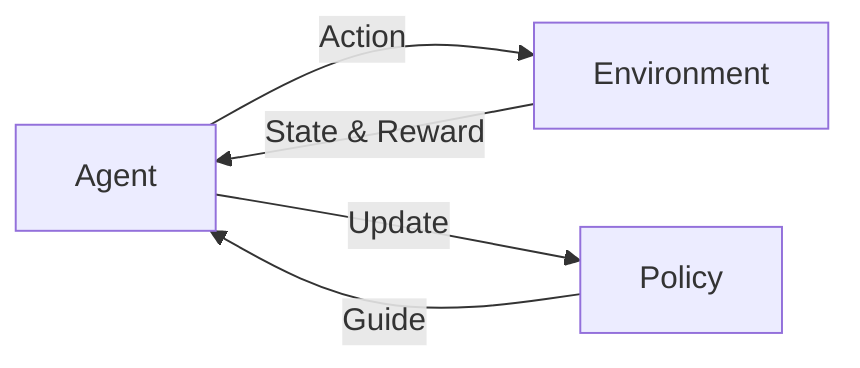

# 强化学习Reinforcement Learning与机器人的互动学习机制

关键词：强化学习、机器人、互动学习、Q-Learning、策略梯度、模仿学习、深度强化学习

## 1. 背景介绍
### 1.1  问题的由来
随着人工智能技术的快速发展,机器人正在逐步走进人们的生活。然而,传统的机器人控制方法大多依赖于预先设定好的规则和模型,缺乏灵活性和适应性。如何让机器人能够像人类一样,通过与环境的互动来不断学习和提升自己的能力,成为了一个亟待解决的问题。
### 1.2  研究现状
近年来,强化学习作为一种从环境反馈中学习最优决策的方法,在机器人领域得到了广泛关注。不少研究者将强化学习应用于机器人控制,取得了可喜的成果。例如,DeepMind的研究人员让机器人通过强化学习掌握了行走[1]、抓取[2]等技能。OpenAI的研究人员则展示了机器人利用强化学习玩魔方[3]、做家务[4]的惊人能力。这些研究表明,强化学习有望突破机器人发展的瓶颈,实现更加智能化的控制。
### 1.3  研究意义  
将强化学习与机器人结合,对于推动机器人的智能化发展具有重要意义:

(1)增强机器人的学习能力。通过强化学习,机器人可以不断从环境反馈中总结经验,提升决策水平,表现出接近甚至超越人类的学习能力。

(2)提高机器人的环境适应性。强化学习使机器人能够根据环境的变化动态调整策略,具备更强的鲁棒性,从而适应不同的工作场景。

(3)扩展机器人的应用范围。借助强化学习,机器人将在工业、服务、医疗等领域得到更广泛应用,为人类生活带来更多便利。

### 1.4  本文结构
本文将重点探讨强化学习在机器人领域的研究进展和应用前景。第2部分介绍强化学习的核心概念;第3部分阐述几种主要的强化学习算法原理;第4部分建立机器人互动学习的数学模型;第5部分通过项目案例演示强化学习的代码实现;第6部分讨论强化学习在机器人领域的应用场景;第7部分推荐相关的学习资源;第8部分对全文进行总结并展望未来。

## 2. 核心概念与联系
强化学习的核心思想是:智能体(Agent)通过与环境(Environment)的连续互动,根据环境反馈的奖励(Reward)不断改进自身的决策,最终学习到最优策略(Optimal Policy)。在此过程中,智能体、环境、奖励、策略是四个最关键的概念。它们之间的关系如下图所示:

智能体感知环境状态(State),并根据当前策略选择动作(Action)施加于环境。环境对动作做出反馈,向智能体返回新的状态和奖励。智能体根据反馈更新策略,以期获得更多的累积奖励。这个循环往复的过程,使得智能体的策略不断优化,最终趋于最优。

将强化学习应用于机器人控制时,机器人扮演智能体的角色,通过传感器感知环境状态(如关节角度、物体位置等),并根据当前策略控制执行器(如电机、气动元件等)对环境施加动作。环境对动作做出反馈(如到达目标位置、完成任务等),机器人据此计算奖励值(如移动距离、耗时多少等),并更新自身的控制策略。通过这种"感知-决策-执行-反馈"的循环互动,机器人逐步掌握在不同环境下的最优控制策略,表现出智能学习的能力。

## 3. 核心算法原理 & 具体操作步骤
### 3.1 算法原理概述
强化学习有多种不同的算法,代表性的有:Q-Learning、策略梯度(Policy Gradient)、演员-评论家(Actor-Critic)等。它们的基本原理是利用值函数(Value Function)或策略函数(Policy Function)来评估和改进策略。

Q-Learning通过值函数来评估动作的长期价值,并据此选择最优动作。其核心是贝尔曼方程(Bellman Equation):

$$
Q(s,a) = r + \gamma \max_{a'}Q(s',a')
$$

$Q(s,a)$表示在状态$s$下选择动作$a$的长期价值,$r$是立即奖励,$\gamma$是折扣因子,$\max_{a'}Q(s',a')$是下一状态$s'$下的最大Q值。Q-Learning的目标是学习一个最优的Q函数,使得在每个状态下选择Q值最大的动作,就能获得最大的累积奖励。

策略梯度则直接对策略函数进行优化。它引入一个参数化的策略函数$\pi_\theta(a|s)$,表示在状态$s$下选择动作$a$的概率。然后通过梯度上升法来最大化期望奖励:

$$
\theta \leftarrow \theta + \alpha \nabla_\theta J(\theta) \\
\nabla_\theta J(\theta) = \mathbb{E}_{\pi_\theta}[\nabla_\theta \log \pi_\theta(a|s) Q^{\pi_\theta}(s,a)]
$$

其中$\alpha$是学习率,$J(\theta)$是期望奖励,$\nabla_\theta \log \pi_\theta(a|s)$是策略梯度,$Q^{\pi_\theta}(s,a)$是在策略$\pi_\theta$下状态-动作对的值函数。策略梯度的目标是找到一个最优的策略参数$\theta^*$,使得智能体遵循该策略能获得最大的期望奖励。

演员-评论家结合了值函数和策略梯度,引入两个函数:演员(Actor)$\pi_\theta(a|s)$负责生成动作,评论家(Critic)$Q^w(s,a)$负责评估动作。两者相互配合,交替更新,共同优化策略:

$$
\delta = r + \gamma Q^w(s',a') - Q^w(s,a) \\
\theta \leftarrow \theta + \alpha \nabla_\theta \log \pi_\theta(a|s) \delta \\
w \leftarrow w + \beta \delta \nabla_w Q^w(s,a)
$$

其中$\delta$是时间差分(TD)误差,$\alpha$和$\beta$是学习率。演员根据评论家的打分调整策略,评论家根据新策略的表现更新价值评估。两者博弈下去,最终收敛到最优策略。

### 3.2 算法步骤详解
以Q-Learning为例,其具体算法步骤如下:

(1) 随机初始化Q表$Q(s,a)$

(2) 重复循环,直到收敛:

- 初始化状态$s$
- 重复循环,直到回合结束:
  - 基于$\epsilon-greedy$策略选择动作$a$
  - 执行动作$a$,观察奖励$r$和新状态$s'$
  - 更新Q表:
  $$Q(s,a) \leftarrow Q(s,a) + \alpha [r + \gamma \max_{a'} Q(s',a') - Q(s,a)]$$
  - $s \leftarrow s'$

(3) 返回最终的Q表

其中,$\epsilon-greedy$是一种平衡探索和利用的动作选择策略。每次以$\epsilon$的概率随机选择动作,以$1-\epsilon$的概率选择Q值最大的动作。这样可以在探索新动作的同时,充分利用已有的经验。

$\alpha \in [0,1]$是学习率,控制Q值更新的幅度。$\gamma \in [0,1]$是折扣因子,控制未来奖励的重要程度。

### 3.3 算法优缺点
Q-Learning的优点是:
- 简单易实现,适合离散状态和动作空间
- 能够收敛到最优策略,有理论保证
- 通过值函数实现策略提取,无需显式策略参数化

Q-Learning的缺点是:  
- 难以处理连续状态和动作空间
- 容易过拟合,泛化能力差
- 探索效率低,难以应对稀疏奖励

相比之下,策略梯度和演员-评论家更适合连续控制问题,具有更好的探索能力和稳定性。尤其是近年来兴起的深度强化学习,通过引入深度神经网络作为值函数或策略函数的近似,大大提升了强化学习处理高维观测和动作的能力,使得强化学习在机器人控制领域大放异彩。

### 3.4 算法应用领域
强化学习在机器人领域已有广泛应用,例如:
- 机器人运动控制:如步行、跑跑、跳跃等
- 机器人操作控制:如抓取、装配、搬运等 
- 机器人导航与路径规划:如自主探索、避障等
- 机器人感知与决策:如目标识别、行为决策等

这些应用大多涉及连续状态和动作空间,需要处理高维传感器输入,因此主要采用深度强化学习的方法,如DDPG[5]、PPO[6]、SAC[7]等。同时,还常常与计算机视觉、自然语言处理等技术结合,赋予机器人更强大的感知和认知能力。

## 4. 数学模型和公式 & 详细讲解 & 举例说明
### 4.1 数学模型构建
我们可以用马尔可夫决策过程(Markov Decision Process, MDP)来建模机器人的互动学习过程。一个MDP由六元组$(S,A,P,R,\gamma,\rho_0)$构成:

- $S$是有限的状态集合
- $A$是有限的动作集合
- $P:S \times A \times S \to [0,1]$是状态转移概率函数,表示在状态$s$下执行动作$a$后转移到状态$s'$的概率
- $R:S \times A \to \mathbb{R}$是奖励函数,表示在状态$s$下执行动作$a$后获得的即时奖励
- $\gamma \in [0,1]$是折扣因子,表示未来奖励的折算系数
- $\rho_0:S \to [0,1]$是初始状态分布

MDP的目标是寻找一个最优策略$\pi^*:S \to A$,使得从任意初始状态$s_0$出发,遵循该策略选择动作,能够获得最大的期望累积奖励:

$$
\pi^* = \arg\max_{\pi} \mathbb{E}_{\pi}[\sum_{t=0}^{\infty} \gamma^t r_t]
$$

其中,$r_t$是在时刻$t$获得的奖励。

在机器人互动学习中,状态$s$通常由机器人的关节角度、速度等构成,动作$a$通常是施加在关节上的力矩或位置控制指令。奖励$r$可以根据任务目标设计,如到达指定位置、完成指定动作等。

### 4.2 公式推导过程
为了求解MDP,我们引入值函数$V^\pi(s)$和$Q^\pi(s,a)$,分别表示在策略$\pi$下状态$s$和状态-动作对$(s,a)$的期望累积奖励:

$$
V^\pi(s) = \mathbb{E}_{\pi}[\sum_{t=0}^{\infty} \gamma^t r_t | s_0 = s] \\
Q^\pi(s,a) = \mathbb{E}_{\pi}[\sum_{t=0}^{\infty} \gamma^t r_t | s_0 = s, a_0 = a]
$$

根据贝尔曼方程,值函数满足以下递推关系:

$$
V^\pi(s) = \sum_{a} \pi(a|s) \sum_{s'} P(s'|s,a) [R(s,a) + \gamma V^\pi(s')] \\
Q^\pi(s,a) = \sum_{s'} P(s'|s,a) [R(s,a) + \gamma \sum_{a'} \pi(a'|s') Q^\pi(s',a')]
$$

最优值函数$V^*(s)$和$Q^*(s,a)$满足贝尔曼最优方程:

$$
V^*(s) = \max_{a} \sum_{s'} P(s'|s,a) [R(s,a) + \gamma V^*(s')] \\
Q^*(s,a) = \sum_{s'} P(s'|s,a) [R(s,a) + \gamma \max_{