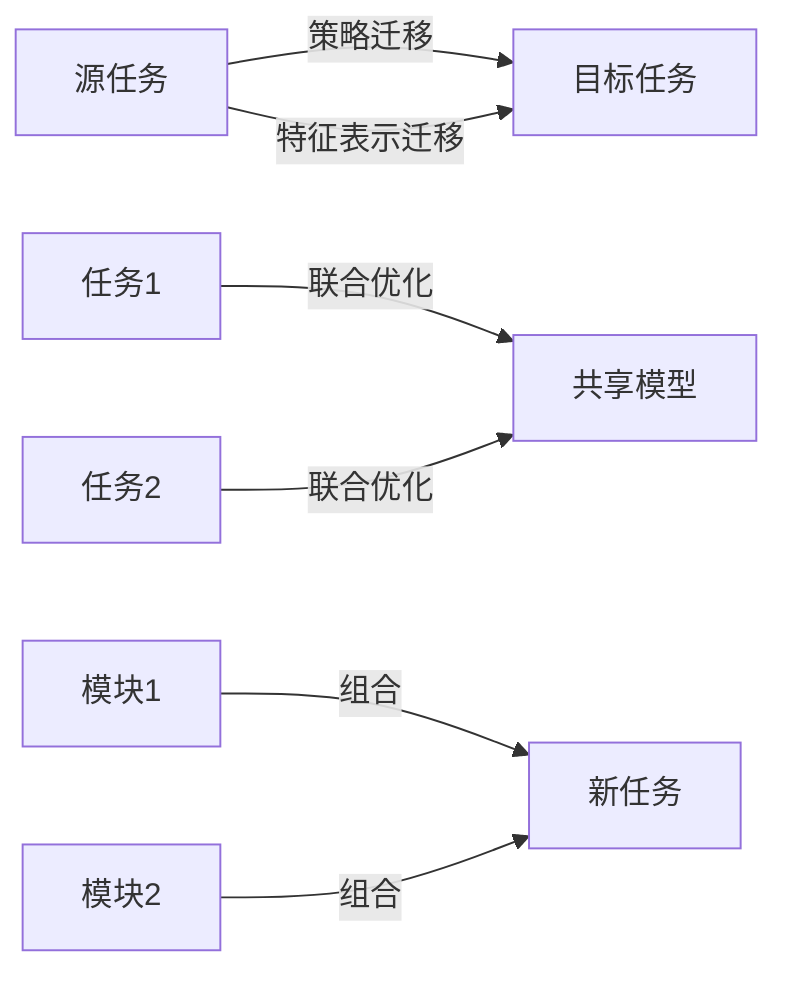

# 强化学习Reinforcement Learning中的迁移学习与多任务学习

关键词：强化学习、迁移学习、多任务学习、深度学习、策略迁移、知识迁移、领域适应

## 1. 背景介绍

### 1.1 问题的由来

强化学习(Reinforcement Learning, RL)作为人工智能的一个重要分支,在近年来取得了令人瞩目的成就。从AlphaGo战胜世界围棋冠军到自动驾驶汽车的突破性进展,RL展现出了广阔的应用前景。然而,传统的RL方法在实际应用中仍然面临着诸多挑战,其中最为突出的是训练样本效率低下和泛化能力不足的问题。

现实世界中,大多数任务都是复杂多变的,需要智能体(agent)具备快速学习和适应不同环境的能力。传统RL算法通常需要在特定任务上进行大量的训练才能达到较好的性能,而当面临新的任务时,之前学习到的知识很难被充分利用,导致学习效率低下。此外,对于存在多个子任务的复杂问题,单一策略难以兼顾不同子任务的需求。因此,如何提高RL的样本效率和泛化能力,实现知识在不同但相关任务间的迁移和复用,成为了亟待解决的关键问题。

### 1.2 研究现状

为了应对上述挑战,迁移学习(Transfer Learning, TL)和多任务学习(Multi-task Learning, MTL)被引入到强化学习中。迁移学习旨在利用已有知识加速新任务的学习过程,通过在不同但相关的任务之间迁移和复用知识,提高样本效率和泛化能力。多任务学习则致力于同时学习多个相关任务,通过共享不同任务间的知识,实现对多个任务的联合优化。

近年来,国内外学者在强化学习的迁移学习和多任务学习方面开展了广泛的研究。一些代表性的工作包括:

- Policy Reuse: 策略复用是一种常见的迁移学习方法,通过迁移源任务学到的策略来指导目标任务的学习。Fernández等人提出了Policy Reuse Q-learning算法,利用源任务的Q值来初始化目标任务的Q表。

- Reward Shaping: 奖赏塑形是利用源任务的奖赏函数来引导目标任务学习的方法。Brys等人提出了基于迁移学习的奖赏塑形方法,通过对源任务的奖赏函数进行变换,加速目标任务的学习。

- Multi-task Policy Gradient: 多任务策略梯度方法同时学习多个任务的策略,通过共享不同任务间的特征表示来提升泛化性能。Teh等人提出了基于策略梯度的多任务学习框架,实现了对多个相关任务的联合优化。

- Modularization: 模块化是将复杂任务分解为多个子任务,通过组合不同的模块来解决新任务的方法。Devin等人提出了一种模块化的深度强化学习框架,通过组合不同的感知、策略和值函数模块,实现了跨任务知识的复用。

尽管上述工作在一定程度上缓解了传统RL方法的局限性,但如何在更广泛的任务领域实现高效的知识迁移和多任务学习,仍然是一个亟待探索的研究课题。

### 1.3 研究意义

将迁移学习和多任务学习引入强化学习,对于提升RL的实用性和泛化能力具有重要意义:

1. 提高样本效率:通过迁移已有知识指导新任务的学习,可以显著减少目标任务所需的训练样本数量,加速学习进程。

2. 增强泛化能力:利用多任务学习实现跨任务知识的共享,有助于学习到更加通用的特征表示和策略,提升模型的泛化性能。

3. 解决复杂任务:将复杂任务分解为多个简单子任务,通过模块化组合的方式解决新问题,可以应对现实世界中的复杂任务。

4. 促进智能体的持续学习:通过不断积累和迁移知识,实现智能体在多个任务上的持续学习和进化,是构建通用人工智能的重要途径。

因此,深入研究强化学习中的迁移学习和多任务学习,对于推动RL技术的发展和应用具有重要的理论和实践意义。

### 1.4 本文结构

本文将围绕强化学习中的迁移学习和多任务学习展开深入探讨,内容组织如下:

第2部分介绍了迁移学习和多任务学习的核心概念与联系。第3部分重点阐述了几种典型的迁移学习和多任务学习算法的基本原理和实现步骤。第4部分给出了相关数学模型和公式的详细推导与案例分析。第5部分通过具体的代码实例,演示了如何利用迁移学习和多任务学习算法解决实际问题。第6部分讨论了相关技术在智能系统中的应用场景。第7部分推荐了一些学习资源和开发工具。第8部分对全文进行了总结,并对未来的研究方向和挑战进行了展望。

## 2. 核心概念与联系

迁移学习和多任务学习是两个密切相关但又有所区别的概念。它们的核心思想是利用不同任务之间的相关性,通过知识的迁移和共享来提高学习效率和性能。

迁移学习的目标是利用已有知识加速新任务的学习。给定一个源任务域 $\mathcal{D}_S$ 和一个目标任务域 $\mathcal{D}_T$,迁移学习旨在利用从 $\mathcal{D}_S$ 学到的知识来改善 $\mathcal{D}_T$ 上的学习性能。根据源任务域和目标任务域之间的相似程度,迁移学习可以分为以下三种类型:

1. 归纳迁移学习:源任务域和目标任务域的特征空间相同,但任务不同。即 $\mathcal{X}_S=\mathcal{X}_T$, $\mathcal{Y}_S \neq \mathcal{Y}_T$。

2. 直推迁移学习:源任务域和目标任务域的特征空间不同,但任务相同。即 $\mathcal{X}_S \neq \mathcal{X}_T$, $\mathcal{Y}_S = \mathcal{Y}_T$。

3. 无监督迁移学习:源任务域和目标任务域的特征空间和任务都不同。即 $\mathcal{X}_S \neq \mathcal{X}_T$, $\mathcal{Y}_S \neq \mathcal{Y}_T$。

多任务学习的目标是通过同时学习多个相关任务,利用任务之间的相关性来提高模型的泛化性能。给定 $T$ 个任务 $\{\mathcal{T}_1,\mathcal{T}_2,\cdots,\mathcal{T}_T\}$,多任务学习旨在通过共享不同任务间的知识,学习一个联合模型 $f_\theta(\cdot)$ 来最小化所有任务的联合损失函数:

$$
\min_{\theta} \sum_{t=1}^{T} \mathcal{L}_t(f_\theta(\mathcal{X}_t), \mathcal{Y}_t)
$$

其中 $\mathcal{L}_t$ 表示第 $t$ 个任务的损失函数,$\mathcal{X}_t$ 和 $\mathcal{Y}_t$ 分别表示第 $t$ 个任务的输入和输出。通过共享不同任务间的特征表示或参数,多任务学习可以显著提升模型的泛化能力。

迁移学习和多任务学习在强化学习中的应用主要体现在以下几个方面:

1. 策略迁移:将源任务学到的策略迁移到目标任务,通过行为克隆或策略重用等方式加速目标任务的学习。

2. 特征表示迁移:将源任务学到的特征表示迁移到目标任务,作为目标任务的特征提取器或初始化参数,减少目标任务的探索。

3. 联合优化多个任务:通过共享不同任务间的特征表示或策略网络,实现对多个任务的联合优化,提升模型的泛化性能。

4. 模块化组合:将复杂任务分解为多个子任务,通过组合不同的模块化策略来解决新任务,实现跨任务知识的复用。

下图展示了迁移学习和多任务学习在强化学习中的典型应用范式:

通过引入迁移学习和多任务学习,强化学习的样本效率和泛化能力可以得到显著提升,为解决复杂任务和实现持续学习奠定了基础。

## 3. 核心算法原理 & 具体操作步骤

本节将重点介绍几种典型的强化学习迁移学习和多任务学习算法的基本原理和实现步骤,包括策略复用、奖赏塑形、多任务策略梯度和模块化学习等。

### 3.1 算法原理概述

#### 3.1.1 策略复用

策略复用(Policy Reuse)是一种常见的迁移学习方法,其核心思想是将源任务学到的策略迁移到目标任务,通过行为克隆或初始化等方式加速目标任务的学习。给定源任务的最优策略 $\pi_S^*$,策略复用的目标是在目标任务 $\mathcal{M}_T$ 中学习一个新的策略 $\pi_T$,使其尽可能接近 $\pi_S^*$。

策略复用的优势在于可以显著减少目标任务的探索,加速学习进程。但其局限性在于要求源任务和目标任务的状态空间和动作空间需要高度相似,否则直接迁移策略可能导致负迁移。

#### 3.1.2 奖赏塑形

奖赏塑形(Reward Shaping)是另一种常用的迁移学习方法,其核心思想是利用源任务的奖赏函数来引导目标任务的学习。给定源任务的奖赏函数 $R_S$,奖赏塑形旨在对目标任务的奖赏函数 $R_T$ 进行变换,得到一个新的奖赏函数 $\hat{R}_T$:

$$
\hat{R}_T(s,a,s') = R_T(s,a,s') + F(s,a,s')
$$

其中 $F(s,a,s')$ 是一个塑形函数,用于引入源任务的先验知识。常见的塑形函数包括基于势能的塑形函数和基于启发式规则的塑形函数等。

奖赏塑形可以有效引导智能体的探索行为,加速学习进程。但其局限性在于需要仔细设计塑形函数,否则可能引入误导信息,导致次优策略。

#### 3.1.3 多任务策略梯度

多任务策略梯度(Multi-task Policy Gradient)是一种常用的多任务强化学习方法,其核心思想是通过共享不同任务间的策略网络参数,实现对多个任务的联合优化。给定 $T$ 个任务 $\{\mathcal{T}_1,\mathcal{T}_2,\cdots,\mathcal{T}_T\}$,多任务策略梯度旨在学习一个联合策略 $\pi_\theta(\cdot)$,使其能够最大化所有任务的期望累积奖赏:

$$
J(\theta) = \sum_{t=1}^{T} \mathbb{E}_{\tau \sim p_{\theta}(\tau)}[R(\tau)]
$$

其中 $\tau$ 表示一条轨迹,$p_{\theta}(\tau)$ 表示基于策略 $\pi_\theta$ 生成轨迹 $\tau$ 的概率。通过梯度上升优化联合目标函数 $J(\theta)$,可以得到一个通用的策略,实现对多个任务的联合优化。

多任务策略梯度可以显著提升模型的泛化性能,但其局限性在于需要精心设计共享的策略网络结构,以平衡不同任务间的相关性和差异性。

#### 3.1.4 模块化学习

模块