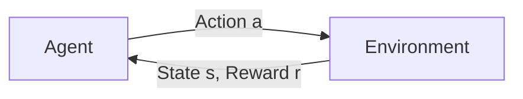

# 强化学习Reinforcement Learning在医疗健康领域的应用探索

关键词：强化学习、医疗健康、智能诊断、辅助治疗、药物研发、个性化医疗

## 1. 背景介绍
### 1.1 问题的由来
随着人工智能技术的飞速发展,强化学习作为一种重要的机器学习范式,在众多领域展现出了广阔的应用前景。医疗健康作为与人类生命健康息息相关的重要领域,一直是人工智能技术应用的重点方向之一。将强化学习引入医疗健康领域,有望在辅助诊断、治疗决策、药物研发等方面取得突破性进展,推动智慧医疗的发展。

### 1.2 研究现状
目前,强化学习在医疗健康领域的研究与应用已经取得了一定的进展。一些研究者利用强化学习算法实现了辅助诊断系统,通过对患者症状、体征等数据的分析,协助医生进行疾病诊断。另一些研究则探索利用强化学习优化治疗方案,根据患者的个体差异制定个性化治疗策略。此外,强化学习在药物研发、医疗资源调度等方面也展现出了应用潜力。

### 1.3 研究意义 
将强化学习应用于医疗健康领域,有望在以下几个方面产生重要意义:

1. 提高诊断准确率:利用强化学习算法分析海量医疗数据,可以辅助医生进行更加精准的诊断,降低误诊率。

2. 优化治疗方案:通过强化学习算法不断试错与学习,可以探索出更加有效的治疗方案,提高治疗效果。

3. 加速药物研发:应用强化学习进行药物分子筛选和优化,有望缩短新药研发周期,降低研发成本。

4. 实现个性化医疗:基于强化学习对患者个体差异建模,可以制定个性化的诊疗方案,提供精准医疗服务。

5. 提升医疗资源利用效率:利用强化学习优化医疗资源调度,可以缓解医疗资源紧张问题,提高医疗服务水平。

### 1.4 本文结构
本文将围绕强化学习在医疗健康领域的应用展开探讨。第2部分介绍强化学习的核心概念与医疗健康领域的联系;第3部分重点阐述强化学习的核心算法原理与具体操作步骤;第4部分给出相关的数学模型与公式推导;第5部分通过代码实例演示强化学习在医疗场景中的应用;第6部分总结强化学习在医疗健康领域的实际应用场景;第7部分推荐相关的学习资源与开发工具;第8部分对强化学习在医疗健康领域的未来发展趋势与面临的挑战进行展望;第9部分以附录形式解答一些常见问题。

## 2. 核心概念与联系
强化学习是一种重要的机器学习范式,它通过智能体(Agent)与环境的交互,不断试错学习,以获得最大化的累积奖励。与监督学习和无监督学习不同,强化学习并不依赖于大量标注数据,而是通过智能体自主探索和决策来优化策略。

在医疗健康领域,可以将医生诊断、治疗过程看作一个"序贯决策"问题。医生(智能体)根据患者(环境)的症状、体征等状态特征,选择检查、开药等诊疗行为(动作),并根据诊疗效果(奖励)不断调整优化诊疗策略(策略)。这与强化学习的问题建模非常契合。通过应用强化学习理论与算法,可以辅助医生进行更加精准的诊断和有效的治疗决策。

此外,在药物研发领域,新药从分子筛选到临床试验需要耗费大量的时间和成本。将候选药物分子看作"状态",对其进行修饰和优化看作"动作",药效和毒性评估结果看作"奖励",药物分子优化问题就转化为一个强化学习问题。通过强化学习算法自动探索分子空间,可以加速先导化合物的发现和优化。

总之,强化学习与医疗健康领域有着天然的联系。将二者进行融合,有望在智能诊断、辅助治疗、药物研发等方面取得突破,推动智慧医疗的发展。

## 3. 核心算法原理 & 具体操作步骤
### 3.1 算法原理概述
强化学习的核心是马尔可夫决策过程(Markov Decision Process, MDP)。MDP由状态空间、动作空间、转移概率和奖励函数组成,描述了智能体与环境交互的动态过程。智能体根据当前状态采取动作,环境根据动作给予奖励并转移到下一个状态。智能体的目标是学习一个最优策略,使得在整个MDP过程中获得的累积奖励最大化。

常见的强化学习算法包括值函数方法(如Q-learning)和策略梯度方法(如REINFORCE)。值函数方法通过学习状态-动作值函数,评估在某状态下采取某动作的长期收益,进而选择最优动作。策略梯度方法则直接对策略函数进行参数化,通过梯度上升等优化算法直接学习最优策略。近年来,深度强化学习算法(如DQN、DDPG等)将深度神经网络引入强化学习,极大地提升了强化学习算法在复杂环境中的决策能力。

### 3.2 算法步骤详解
以Q-learning算法为例,详细说明强化学习算法的具体步骤:

1. 初始化Q表格Q(s,a),用于存储每个状态-动作对的价值估计,初始值可随机初始化。

2. 智能体根据某种策略(如ε-greedy)选择动作a,与环境交互,观察到奖励r和下一状态s'。

3. 根据观察到的信息更新Q表格:

$$Q(s,a) \leftarrow Q(s,a)+\alpha [r+\gamma \max _{a'} Q(s',a')-Q(s,a)]$$

其中α为学习率,γ为折扣因子。这个更新公式本质上是时间差分(TD)学习,即利用估计值的差分来更新估计。

4. 重复步骤2-3,直到Q表格收敛或达到预设的训练轮数。

5. 在测试阶段,智能体根据学习到的Q表格选择具有最大Q值的动作,实现最优决策。

对于基于值函数的深度强化学习算法(如DQN),主要思路是用深度神经网络拟合Q函数,将状态作为网络输入,输出各个动作的Q值。网络参数通过最小化TD误差进行端到端训练,并引入经验回放(Experience Replay)机制,缓解数据相关性问题。

### 3.3 算法优缺点
Q-learning算法的优点在于:
1. 简单易实现,适合入门学习;
2. 能够收敛到最优策略,有理论保证;
3. 通过离线学习Q表格,可实现快速决策。

但Q-learning也存在一些局限性:
1. 难以处理连续状态和动作空间;
2. 在状态和动作空间很大时,Q表格存储开销大;
3. 探索效率较低,容易陷入局部最优。

深度强化学习通过引入深度神经网络,一定程度上克服了这些局限。深度神经网络强大的函数拟合能力,使得DQN等算法能够直接从原始的高维状态(如图像)中学习特征,处理连续状态空间。但深度强化学习算法的训练通常需要大量的样本数据和计算资源,调参也比较困难,这些问题仍有待进一步研究。

### 3.4 算法应用领域
强化学习算法已在多个领域取得了成功应用,如:

1. 游戏:DeepMind的DQN在Atari游戏中达到了超人表现;AlphaGo系列算法击败了顶尖围棋选手。

2. 机器人控制:强化学习可用于训练机器人完成抓取、行走等任务。

3. 自然语言处理:强化学习用于对话系统、文本生成等任务。

4. 推荐系统:强化学习可建模用户长期利益,改进推荐效果。

5. 智能交通:强化学习用于交通信号控制、自动驾驶决策等。

6. 医疗健康:前文提到,强化学习可用于智能诊断、治疗优化等。

可以看出,强化学习在序贯决策问题上有广泛的应用前景。随着算法的不断发展和计算能力的提升,强化学习有望在更多领域发挥重要作用。

## 4. 数学模型和公式 & 详细讲解 & 举例说明
### 4.1 数学模型构建
马尔可夫决策过程(MDP)是强化学习的基础数学模型。一个MDP由四元组$<S,A,P,R>$构成:

- 状态空间$S$:智能体可能处于的所有状态的集合。
- 动作空间$A$:智能体在每个状态下可以采取的所有动作的集合。
- 转移概率$P(s'|s,a)$:在状态$s$下采取动作$a$后转移到状态$s'$的概率。
- 奖励函数$R(s,a)$:在状态$s$下采取动作$a$后获得的即时奖励。

在MDP中,智能体与环境的交互可以用下图表示:

智能体根据策略函数$\pi(a|s)$选择动作,策略函数给出在状态$s$下选择动作$a$的概率。环境根据状态转移概率给出下一个状态,并根据奖励函数给出即时奖励。

智能体的目标是最大化长期累积奖励(回报):

$$G_t=R_{t+1}+\gamma R_{t+2}+\gamma^2 R_{t+3}+\cdots=\sum_{k=0}^{\infty }\gamma^k R_{t+k+1}$$

其中$\gamma \in [0,1]$为折扣因子,用于平衡即时奖励和长期奖励。

为了评估某状态或状态-动作对的长期收益,引入价值函数:

- 状态价值函数$V^{\pi}(s)$:在状态$s$下遵循策略$\pi$的期望回报。
- 动作价值函数$Q^{\pi}(s,a)$:在状态$s$下采取动作$a$,然后遵循策略$\pi$的期望回报。

最优价值函数$V^*(s)$和$Q^*(s,a)$分别表示在状态$s$下采取最优策略的期望回报,以及在状态$s$下采取动作$a$然后遵循最优策略的期望回报。

### 4.2 公式推导过程
以Q-learning算法为例,推导其核心更新公式。

Q-learning是一种异策略(off-policy)的时序差分学习算法,直接学习最优动作价值函数$Q^*(s,a)$。根据Bellman最优方程,最优Q函数满足:

$$Q^*(s,a)=R(s,a)+\gamma \sum_{s'\in S}P(s'|s,a)\max_{a'}Q^*(s',a')$$

即最优动作价值等于即时奖励加上下一状态的最大Q值的折扣。

Q-learning算法使用如下的迭代更新公式来逼近最优Q函数:

$$Q(s_t,a_t) \leftarrow Q(s_t,a_t)+\alpha [r_{t+1}+\gamma \max _{a} Q(s_{t+1},a)-Q(s_t,a_t)]$$

其中$\alpha \in (0,1]$为学习率。这个更新公式可以这样理解:

- $r_{t+1}+\gamma \max _{a} Q(s_{t+1},a)$是基于即时奖励和下一状态估计的Q值,可以看作Q函数的目标值(target)。
- $Q(s_t,a_t)$是当前状态-动作对的Q值估计,可以看作Q函数的预测值(prediction)。
- 目标值和预测值的差$\delta_t=r_{t+1}+\gamma \max _{a} Q(s_{t+1},a)-Q(s_t,a_t)$称为时间差分(TD)误差。
- Q-learning使用TD误差对Q函数进行梯度更新,