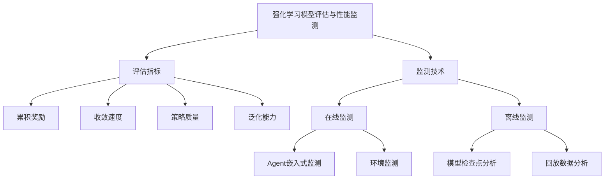

# 强化学习Reinforcement Learning模型评估与性能监测技术

## 1. 背景介绍

### 1.1 问题的由来

随着人工智能技术的快速发展,强化学习(Reinforcement Learning, RL)作为机器学习的一个重要分支,已经广泛应用于各种复杂决策问题领域。强化学习系统通过与环境交互来学习最优策略,旨在最大化预期的累积奖励。然而,由于强化学习模型的复杂性和不确定性,评估和监测其性能变得至关重要。

传统的监控方法通常依赖于人工检查和分析,这种方式效率低下且容易出错。因此,需要开发自动化的评估和监测技术,以确保强化学习模型的可靠性、稳定性和高性能。

### 1.2 研究现状

近年来,研究人员已经提出了一些评估强化学习模型性能的方法,包括:

- **基于模拟的评估**: 在模拟环境中测试强化学习模型,并收集各种指标数据,如累积奖励、收敛速度等。
- **基于理论的评估**: 利用强化学习理论,如马尔可夫决策过程(MDP)和值函数近似等,对模型进行理论分析和证明。
- **基于实例的评估**: 在真实环境中部署强化学习模型,并收集实际运行数据进行评估。

然而,这些方法存在一些局限性,如缺乏统一的评估标准、难以捕捉模型的动态行为等。因此,需要开发更加全面和自动化的评估和监测技术。

### 1.3 研究意义

开发强化学习模型评估和性能监测技术具有重要意义:

1. **提高模型可靠性**: 通过持续评估和监测,可以及时发现模型的缺陷和异常行为,从而提高模型的可靠性和稳定性。
2. **优化模型性能**: 评估和监测技术可以帮助识别模型的瓶颈和优化空间,指导模型的改进和优化。
3. **促进模型部署**: 可靠的评估和监测技术为强化学习模型的实际部署提供了保障,降低了风险。
4. **推动理论发展**: 评估和监测技术的研究可以深化对强化学习理论和方法的理解,促进理论的发展。

### 1.4 本文结构

本文将全面介绍强化学习模型评估和性能监测的相关技术。文章首先阐述核心概念和原理,然后详细讲解核心算法和数学模型,并通过实例和代码示例进行说明。接下来,探讨实际应用场景和未来发展趋势,最后总结挑战和研究展望。

## 2. 核心概念与联系

强化学习模型评估与性能监测技术包括两个核心部分:评估指标和监测技术。

1. **评估指标**:用于衡量强化学习模型性能的各种指标,包括:
   - 累积奖励:模型在一定时间内获得的总奖励,反映了模型的整体性能。
   - 收敛速度:模型达到稳定状态所需的时间或步数,反映了模型的学习效率。
   - 策略质量:模型生成的策略与最优策略的偏差,反映了模型的决策质量。
   - 泛化能力:模型在新环境或状态下的表现,反映了模型的适应性和鲁棒性。

2. **监测技术**:用于持续跟踪和分析强化学习模型的运行状态,包括:
   - 在线监测:在模型运行过程中实时收集和分析数据,如Agent嵌入式监测和环境监测。
   - 离线监测:基于模型检查点和回放数据进行离线分析,如模型检查点分析和回放数据分析。

这些概念相互关联,共同构建了强化学习模型评估和性能监测的整体框架。通过合理选择和应用评估指标和监测技术,可以全面了解模型的性能表现,及时发现问题并进行优化。

## 3. 核心算法原理 & 具体操作步骤

### 3.1 算法原理概述

强化学习模型评估和性能监测算法的核心原理是基于模型的交互数据和运行状态,计算各种评估指标,并持续跟踪和分析这些指标的变化趋势。算法通常包括以下几个关键步骤:

1. **数据收集**: 从强化学习模型的运行过程中收集相关数据,如状态、动作、奖励等。
2. **指标计算**: 根据收集的数据,计算评估指标的当前值,如累积奖励、收敛速度等。
3. **异常检测**: 分析评估指标的变化趋势,识别异常模式或偏离预期的行为。
4. **性能优化**: 根据检测到的异常或性能瓶颈,对模型进行调整和优化。
5. **持续监测**: 持续收集新的数据,重复上述步骤,实现模型性能的持续评估和监测。

### 3.2 算法步骤详解

以下是强化学习模型评估和性能监测算法的详细步骤:

1. **初始化**:
   - 确定要评估的强化学习模型和环境。
   - 选择合适的评估指标集合,如累积奖励、收敛速度等。
   - 设置监测方式,如在线监测或离线监测。

2. **数据收集**:
   - 如果是在线监测,则在模型运行过程中实时收集数据。
   - 如果是离线监测,则从模型检查点或回放数据中获取数据。
   - 收集的数据包括状态、动作、奖励、模型参数等。

3. **指标计算**:
   - 对于每个选定的评估指标,根据收集的数据计算其当前值。
   - 例如,计算累积奖励的当前值、策略质量的当前值等。

4. **异常检测**:
   - 分析每个评估指标的变化趋势,如是否出现异常波动或偏离预期的行为。
   - 可以使用统计技术、机器学习模型或基于规则的方法进行异常检测。

5. **性能优化**:
   - 如果检测到异常或性能瓶颈,则对模型进行相应的调整和优化。
   - 优化方法可以包括调整超参数、改进reward函数、增强探索策略等。

6. **持续监测**:
   - 如果是在线监测,则在下一个时间步骤继续收集新的数据,重复步骤3-5。
   - 如果是离线监测,则在获取新的模型检查点或回放数据时,重复步骤2-5。

7. **结果输出**:
   - 将评估结果和监测数据以可视化或报告的形式输出,以供分析和决策。
   - 可以包括指标变化趋势图、异常报告、优化建议等。

### 3.3 算法优缺点

**优点**:

- 自动化:算法可以自动化地评估和监测强化学习模型,减少人工干预。
- 全面性:通过多种评估指标和监测技术,可以全面了解模型的性能表现。
- 持续性:算法可以持续跟踪模型的运行状态,及时发现问题并进行优化。
- 可解释性:算法输出的结果和数据可以帮助理解模型的行为和决策过程。

**缺点**:

- 计算开销:对于大型模型和复杂环境,算法可能需要大量计算资源。
- 参数调优:算法的性能依赖于正确设置评估指标、异常检测阈值等参数。
- 噪声影响:算法可能受到环境噪声和随机性的影响,导致误判。
- 泛化能力:算法可能难以很好地泛化到新的模型或环境。

### 3.4 算法应用领域

强化学习模型评估和性能监测算法可以应用于各种领域,包括但不限于:

- 机器人控制:评估和监测机器人强化学习模型的性能,确保机器人的安全和可靠性。
- 自动驾驶:评估和监测自动驾驶系统中的强化学习模型,提高决策的准确性和稳定性。
- 游戏AI:评估和监测游戏AI中的强化学习模型,优化游戏体验和AI智能水平。
- 资源调度:评估和监测用于资源调度的强化学习模型,提高资源利用效率。
- 金融交易:评估和监测用于金融交易的强化学习模型,降低风险和提高收益。
- 网络优化:评估和监测用于网络优化的强化学习模型,提高网络性能和可靠性。

## 4. 数学模型和公式 & 详细讲解 & 举例说明

### 4.1 数学模型构建

强化学习模型评估和性能监测技术通常基于马尔可夫决策过程(Markov Decision Process, MDP)的数学框架。MDP可以形式化描述强化学习问题,包括状态、动作、奖励和转移概率等要素。

MDP可以表示为一个元组 $\mathcal{M} = \langle \mathcal{S}, \mathcal{A}, \mathcal{P}, \mathcal{R}, \gamma \rangle$,其中:

- $\mathcal{S}$ 是状态空间的集合
- $\mathcal{A}$ 是动作空间的集合
- $\mathcal{P}$ 是状态转移概率函数,定义为 $\mathcal{P}_{ss'}^a = \mathcal{P}(s'|s,a)$,表示在状态 $s$ 下执行动作 $a$ 后转移到状态 $s'$ 的概率
- $\mathcal{R}$ 是奖励函数,定义为 $\mathcal{R}_s^a = \mathbb{E}[r|s,a]$,表示在状态 $s$ 下执行动作 $a$ 后获得的期望奖励
- $\gamma \in [0, 1]$ 是折现因子,用于权衡即时奖励和未来奖励的重要性

强化学习模型的目标是找到一个最优策略 $\pi^*$,使得在该策略下的期望累积折现奖励最大化:

$$
\pi^* = \arg\max_\pi \mathbb{E}_\pi \left[ \sum_{t=0}^\infty \gamma^t r_t \right]
$$

其中 $r_t$ 是在时间步 $t$ 获得的奖励。

基于 MDP 框架,我们可以定义各种评估指标和监测技术,如累积奖励、收敛速度、策略质量等,并开发相应的算法来计算和分析这些指标。

### 4.2 公式推导过程

以累积奖励作为例子,我们可以推导出其计算公式。累积奖励是强化学习模型在一个episodes中获得的总奖励,反映了模型的整体性能。

设 $r_t$ 表示在时间步 $t$ 获得的奖励,则累积奖励 $G_t$ 可以定义为:

$$
G_t = \sum_{k=t}^{T} \gamma^{k-t} r_k
$$

其中 $T$ 是episodes的终止时间步,折现因子 $\gamma$ 用于权衡即时奖励和未来奖励的重要性。

对于无限长度的episodes,累积奖励可以表示为:

$$
G_t = \sum_{k=t}^\infty \gamma^{k-t} r_k
$$

为了方便计算,我们可以引入值函数 $V^\pi(s)$,表示在策略 $\pi$ 下从状态 $s$ 开始的期望累积奖励:

$$
V^\pi(s) = \mathbb{E}_\pi \left[ G_t | s_t = s \right] = \mathbb{E}_\pi \left[ \sum_{k=t}^\infty \gamma^{k-t} r_k | s_t = s \right]
$$

值函数满足贝尔曼方程:

$$
V^\pi(s) = \mathbb{E}_\pi \left[ r_t + \gamma V^\pi(s_{t+1}) | s_t = s \right]
$$

基于贝尔曼方程,我们可以通过